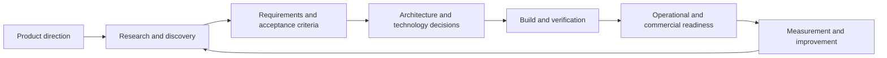
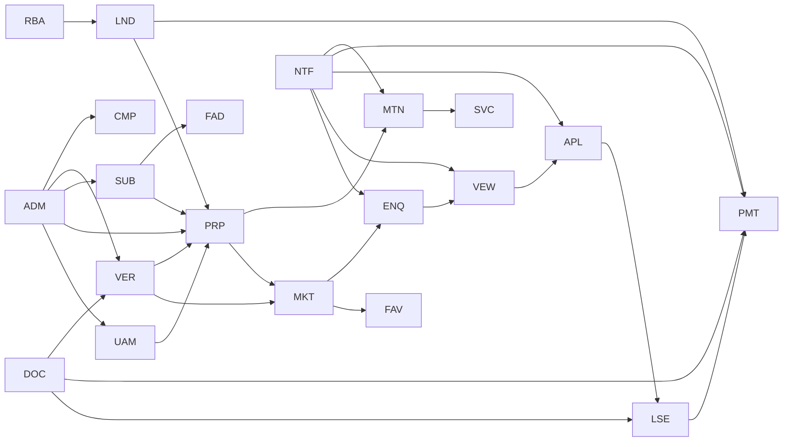

# PRMS Vision and Business

## Purpose

This document consolidates the strategic, governance, market, and commercial baseline of the **Property Rental Marketplace System (PRMS)** into a single controlled baseline. It defines why PRMS exists, who owns its direction, which outcomes matter, what is in and out of scope, how decisions, assumptions, risks, and terminology are governed, and how the product will be packaged, priced, licensed, and financed.

PRMS is a Zimbabwe-first, modular platform that combines a direct property rental marketplace with a property management ERP. It removes the traditional letting-agent middleman (and its commission) from the rental journey: property owners list and manage their own properties directly, tenants search, enquire, view, apply, and pay rent free of charge, and the platform is funded by affordable owner subscriptions and optional paid services.

This document supersedes the individual Category 01 (product strategy and governance) and Category 02 (market and commercial) files it consolidates. It is the single reference for the vision, business model, module portfolio, and governance baseline covered in those categories.

## 1. Product Vision

### 1.1 Vision statement

PRMS is intended to become a Zimbabwe-first, modular platform that combines a direct property rental marketplace with a property management ERP, bringing the property owner, the prospective tenant, applications, viewings, leases, rent, maintenance, verification, subscriptions, documents, and management information into one coherent product.

An owner should be able to begin with an affordable subscription covering a small portfolio, list properties directly, and expand into an integrated management suite without replacing the platform, recreating core records, or losing operational history. Larger landlords and professional property-management firms should be able to adopt the same product as an integrated suite with shared controls and consolidated visibility. Tenants search, enquire, view, apply, and manage their rentals free of charge.

The long-term direction is a trusted property platform that reflects Zimbabwean operating conditions, beginning with Harare residences and expanding to Bulawayo, Mutare, and Gweru, then commercial property, while preserving the ability to localise and expand into other regional markets when evidence supports expansion.

### 1.2 Intended customers and users

| Customer group | Intended value |
|---|---|
| Small and owner-managed landlords | Affordable entry through selected modules and reduced letting and administration effort. |
| Growing landlords with several properties | Connected listing, enquiry, viewing, application, lease, payment, and maintenance operations. |
| Professional landlords and property-management firms | Standardised portfolio controls, shared services, consolidated reporting, and verified trust. |
| Tenants and prospective tenants | Direct property discovery and application without agent commissions. |

Expected user groups include property owners, landlords, portfolio managers, owner administrators, platform administrators, prospective tenants, applicants, tenants, authorised payers or guarantors, service providers and contractors, verification reviewers, and authorised support personnel.

### 1.3 Product outcomes

PRMS should enable customers to:

1. Manage the property lifecycle from draft listing through verification, publication, reservation, occupation, maintenance, and release.
2. Let tenants search published properties, filter, save favourites, enquire, request viewings, apply, sign leases, pay rent, and raise maintenance requests without agent fees.
3. Maintain reliable property, tenant, lease, payment, maintenance, document, and communication records.
4. Operate subscriptions, featured listings, verification, and premium owner services at the level justified by the approved plans.
5. Communicate through coordinated email, Short Message Service (SMS), WhatsApp, and in-application channels.
6. Deliver self-service marketplace and landlord-dashboard experiences.
7. Gain timely operational and management information without manually reconciling disconnected records.
8. Add properties, modules, city coverage, and services without replacing the product foundation or duplicating shared organisation and identity data.

No numerical benefit is claimed in this baseline. Measurable targets belong to the Goals and Success Metrics section below.

### 1.4 Product principles

| ID | Principle | Direction for later decisions |
|---|---|---|
| VP-001 | Property-letting domain first | Capabilities must reflect actual property-letting language, workflows, exceptions, and controls rather than imitate a generic Enterprise Resource Planning system. |
| VP-002 | Modular affordability | Owners must be able to subscribe affordably without funding unrelated capabilities, while tenants remain free users. |
| VP-003 | Standalone value and suite coherence | Every sellable module must define standalone behaviour and must integrate consistently when used with the wider suite. |
| VP-004 | Shared foundation, controlled entitlements | Identity, organisations, verification evidence, security, configuration, audit, files, licensing, and integration foundations should be shared while owner-module access is enforced by server-side entitlements. |
| VP-005 | One authoritative record | Each important business record must have a defined owner so modules do not create conflicting versions of properties, listings, tenants, applications, leases, payments, or maintenance requests. |
| VP-006 | Accessible and resilient operation | Experiences should be usable on relevant devices and should account for the connectivity conditions proven during research. |
| VP-007 | Security, privacy, and accountability by design | Permissions, segregation of duties, auditability, data protection, recovery, and safe integration must be requirements rather than later additions. |
| VP-008 | Zimbabwe first, region ready | The initial product must fit Zimbabwean language, currency, regulation, market, and operating conditions while localisation boundaries preserve future expansion options. |
| VP-009 | Evidence before scale | MVP scope, pricing, architecture, infrastructure, and regional expansion must be based on validated requirements and measurable evidence. |

## 2. Product Charter

### 2.1 Product mandate

PRMS is authorised as a Zimbabwe-first modular product initiative. It may develop shared-platform capabilities and separately licensable property-letting business modules, provided each lifecycle gate is satisfied and no unsupported market, regulatory, financial, technical, or operational claim is presented as fact.

The mandate covers product discovery and documentation immediately. Software development is authorised only after Gate 4 confirms build readiness against approved requirements, architecture, security, data, delivery, resourcing, and quality baselines.

### 2.2 Authority and sponsorship

| Role | Authority |
|---|---|
| Product Sponsor | Establishes or overrides strategic direction, may change the delegation, authorises external commitments requiring human authority, and accepts investment exposure. |
| Delegated Product Owner | Owns product direction and backlog; approves ordinary product decisions, documents, priorities, modules, requirements, and lifecycle gates under Documentation Governance. |
| Documentation Steward | Maintains document controls, identifiers, catalogue integrity, versioning, traceability, and quality checks. |
| Specialist reviewer | Provides authoritative review within legal, regulatory, security, privacy, finance, accounting, leasing, architecture, engineering, quality, or operations expertise. |

### 2.3 Product objectives

1. Validate important operational, rental, commercial, verification, financial, communication, and compliance problems experienced by target property owners and tenants.
2. Define a modular product in which separately purchasable capabilities provide standalone value and integrate coherently through shared foundations.
3. Identify and deliver a narrow, valuable MVP before expanding into the full approved module portfolio.
4. Establish secure, traceable, accessible, supportable, and recoverable product foundations suitable for the approved deployment modes.
5. Produce evidence that the product can create customer value and operate as a sustainable in-house commercial product.
6. Preserve localisation and architecture boundaries that permit later regional, city, and property-sector expansion without treating expansion as an initial commitment.

### 2.4 Authorised scope

**Included:**

- All 13 documentation categories and their registered recurring families.
- Zimbabwe-focused market, competitor, user, domain, and regulatory research, beginning with Harare residential lets.
- Shared-platform definition and the approved working portfolio of 20 business modules.
- Product, UX, data, security, privacy, compliance, architecture, delivery, quality, operations, customer, and measurement documentation.
- Prototypes, technical spikes, provider evaluations, and controlled pilots needed to resolve documented questions.
- Backend, web, and later mobile software when the applicable build and release gates are approved.
- Managed, dedicated, or on-premise deployment evaluation without promising a mode before approval.
- Commercial packaging, licensing, onboarding, support, and lifecycle planning.

**Excluded unless separately authorised:**

- Treating one prospective customer as the sole requirements authority.
- Implementing all modules in the first release.
- Entering a country, city, or property sector without market, localisation, legal, operational, and commercial readiness evidence.
- Signing customer, provider, employment, financial, or legal commitments without an authorised human signatory.
- Presenting unreviewed legal templates as commercially ready agreements.
- Production deployment before Gate 5 release approval.
- Customer-specific forks that bypass product strategy, security, quality, or maintainability controls.

### 2.5 Deliverables and lifecycle gates

| Stage or gate | Required deliverable outcome | Approval authority |
|---|---|---|
| Stage 0 | Approved governance, catalogue, style, contribution rules, templates, validation, and repository baseline. | Product Owner; completed 2026-08-24. |
| Gate 1 | Product, market, commercial, domain, regulatory, process, module-boundary, assumption, and risk foundations reconciled. | Delegated Product Owner with required specialist evidence. |
| Gate 2 | Approved MVP, shared platform, module packs, requirements, UX direction, data and security requirements, and traceability baseline. | Delegated Product Owner with domain, UX, security, and data review. |
| Gate 3 | Approved architecture, technology, tenancy, deployment, integration, data, security, privacy, performance, and operability baseline. | Delegated Product Owner with technical and specialist review. |
| Gate 4 | Approved delivery, engineering, quality, environments, release controls, resourcing assumptions, and build-readiness evidence. | Delegated Product Owner with engineering and quality review. |
| Gate 5 | Tested deployment, recovery, security, support, legal readiness, training, onboarding, and release evidence. | Delegated Product Owner plus required human or specialist authorities. |
| Stage 6 | Active KPI, analytics, feedback, discovery, experiment, review, and improvement processes. | Delegated Product Owner. |

No gate approval creates evidence for a later gate.

### 2.6 Working model

Documents are completed in dependency order. Approved documents are versioned and cannot be changed silently. Assumptions remain visible until evidence confirms, replaces, or rejects them.

### 2.7 Completion and termination criteria

The initiative remains active while the Product Sponsor maintains the mandate and the Delegated Product Owner can demonstrate proportionate progress or learning.

A pause, pivot, or termination review is required when:

- evidence materially rejects the target problem, segment, willingness to pay, or feasible product response;
- required compliance, provider, technology, staffing, or operating constraints make the product commercially or technically infeasible;
- projected lifecycle cost cannot be supported by an approved commercial model;
- unresolved safety, security, privacy, financial, or legal exposure exceeds accepted risk; or
- the Product Sponsor withdraws the mandate.

## 3. Product Strategy

### 3.1 Strategic objective

Establish PRMS as a trusted direct-listing marketplace and property management platform that a Zimbabwean property owner can adopt incrementally and expand without changing products. The strategy is to win trust through verified listings, a coherent list-to-maintain rental outcome, reliable operational control, affordable owner subscriptions, and free tenant access rather than by attempting to launch all 20 business modules simultaneously.

### 3.2 Strategic choices

| ID | Choice | Strategic consequence |
|---|---|---|
| STR-001 | Build for the property-letting marketplace and management domain rather than position PRMS as a generic Enterprise Resource Planning product. | Discovery, terminology, workflows, data ownership, and reporting begin with property letting and portfolio operations. |
| STR-002 | Enter Zimbabwe first, starting with Harare residential lets, and design localisation boundaries for expansion to Bulawayo, Mutare, Gweru, and commercial property. | Zimbabwean evidence governs initial requirements; regional and commercial capabilities are not built speculatively. |
| STR-003 | Use a shared platform plus server-enforced business-module entitlements, with owners paying and tenants free. | Owners may adopt selected modules while identities, organisations, properties, configuration, audit, and integrations remain coherent. |
| STR-004 | Require every sellable module to provide standalone value and a defined suite-integration contract. | Module Definition Packs must identify required foundations, optional dependencies, owned data, failure behaviour, licensing, and acceptance criteria. |
| STR-005 | Sequence delivery around complete customer outcomes rather than feature lists. | The first release must complete a useful end-to-end rental journey and may use only a subset of the approved portfolio. |
| STR-006 | Prefer configuration over customer-specific forks. | Properties, listings, lease terms, workflows, notifications, documents, and policies should be configurable within controlled boundaries. |
| STR-007 | Use official, provider-neutral integration contracts. | Payment, messaging, SMS, email, WhatsApp, mapping, and verification providers connect through adapters and may be replaced without changing domain ownership. |
| STR-008 | Begin with a modular monolith and extract services only when measured scale or isolation needs justify the cost. | Domain boundaries are enforced in code and data contracts without the initial operational burden of microservices. |
| STR-009 | Deliver a responsive web application first and introduce native mobile capability only for validated device, background, or extended-offline needs. | Product discovery determines whether native applications are justified. |
| STR-010 | Treat security, privacy, auditability, accessibility, recoverability, and operability as product requirements. | These qualities must be traceable and tested rather than postponed until launch. |

### 3.3 Value pillars

| Pillar | Customer outcome | Product response |
|---|---|---|
| Tenant first | Tenants, not agents, drive the search and application experience. | Free marketplace (MKT) with search, filters, favourites, saved searches, and no agent commission. |
| Trusted marketplace | Confident that a listing and its owner are real. | Property and Owner Verification (VER) with Verified Property and Verified Owner badges. |
| Portfolio management | Clear allocation of properties, viewings, applications, leases, rent, and maintenance. | Availability states, viewing slots, application tracking, rent schedules, and landlord dashboards (LND). |
| Modular affordability | Owners start with necessary capabilities and expand as value is proven. | Transparent dependencies, module entitlements, subscription tiers, upgrades, and standalone acceptance criteria. |
| Management control | Reliable visibility into portfolio income, occupancy, arrears, and maintenance. | Audit-ready transactions, reports, alerts, reconciliations, and role-based dashboards (RBA). |
| Accessible engagement | Convenient interactions for owners and tenants. | Responsive web experiences plus coordinated SMS, email, WhatsApp, and in-application communication. |
| Trusted operation | Appropriate protection, accountability, continuity, and regulatory evidence. | Security, privacy, audit, backup, recovery, retention, and compliance controls. |

### 3.4 Build, buy, and partner approach

| Capability | Default approach | Decision test |
|---|---|---|
| Property-letting marketplace and management workflows | Build | Core differentiation and authoritative domain ownership. |
| Authentication, storage, queues, observability, and commodity infrastructure | Adopt established components | Security, support, portability, lifecycle cost, and integration fit. |
| SMS, email, WhatsApp, payment, and mapping networks | Integrate through official providers | Zimbabwean availability, commercial terms, reliability, compliance, and replaceability. |
| Lease templates, verification standards, and regulated interpretations | Obtain specialist input | Accuracy, authority, update cadence, liability, and evidence. |
| Analytics visualisation | Build operational views; evaluate embedded or external analytics tools for advanced analysis | Data governance, customer experience, licensing, and total cost. |

## 4. Problem Statement

### 4.1 Core problem statement

The working hypothesis is that some Zimbabwean property owners and tenants lack an affordable, direct, and coherent way to manage the information, decisions, resources, transactions, and communications required to let and occupy property while also operating a sustainable rental business. Traditional agents add commission and are not always replaceable today without losing the services they bundle.

Where letting processes are manual, fragmented, duplicated, or weakly integrated, owners may struggle to know the current state of a listing, applicant, viewing, lease, payment, or maintenance request. Tenants may receive inconsistent information, face trust concerns about whether a listing is real, or have limited visibility into their own applications and rent obligations. A full enterprise suite may be unaffordable or unnecessarily broad, while isolated listing websites preserve fragmentation and do not manage the rental after the listing converts.

Every sentence above is a product hypothesis pending market and domain research evidence.

### 4.2 Problem hypotheses

| ID | Problem hypothesis | Primarily affected roles | Evidence required |
|---|---|---|---|
| PRB-001 | Listing, verification, enquiry, application, viewing, lease, payment, and maintenance information may not form one traceable letting record. | Owners, landlords, tenants, applicants, administrators, finance roles. | Current-state walkthroughs, record samples, hand-off analysis, error and rework examples. |
| PRB-002 | Coordinating viewing availability, property readiness, applicant follow-up, maintenance, and move-in dates may create avoidable conflicts, idle periods, or last-minute changes. | Owners, portfolio managers, tenants, property managers, maintenance roles. | Scheduling observation, conflict logs, utilisation data, cancellation reasons, and role interviews. |
| PRB-003 | Property details, photographs, location, rent, deposit, amenity, and availability data may be recorded inconsistently or be difficult to verify. | Owners, tenants, platform administrators, verification roles. | Listing samples, verification rules, exception cases, reports, and audit expectations. |
| PRB-004 | Rent charges, deposits, receipts, balances, refunds, adjustments, and accounting records may require duplicate capture or manual reconciliation. | Tenants, cashiers, finance roles, owners, property managers. | Transaction walkthroughs, reconciliation steps, corrections, ageing, and reporting evidence. |
| PRB-005 | Maintenance and contractor information may be separated from the operational activity that creates cost or risk. | Tenants, owners, property managers, contractors, finance roles. | Process maps, source records, approval paths, exceptions, and dependency analysis. |
| PRB-006 | SMS, email, WhatsApp, and in-person communication may be inconsistent, difficult to audit, or disconnected from the business event that required it. | Tenants, applicants, owners, administrators, support roles. | Message journeys, consent practices, delivery outcomes, response handling, and cost evidence. |
| PRB-007 | Owners and platform administrators may lack timely, reliable, role-appropriate information across portfolios and listings. | Owners, portfolio managers, platform administrators, finance roles. | Decision diaries, existing reports, reconciliation effort, stale-data examples, and portfolio comparisons. |
| PRB-008 | Existing product choices may force smaller owners to choose between isolated listing sites, costly agents, or a full suite whose cost or complexity exceeds their needs. | Owners and buyers. | Competitor packaging, total-cost comparison, buyer interviews, lost-deal reasons, and willingness-to-pay research. |
| PRB-009 | Tenants and applicants may have limited self-service or mobile-friendly access to search, favourites, applications, viewings, rent, documents, and communication. | Tenants and applicants. | Task observation, device and connectivity evidence, support enquiries, and usability research. |
| PRB-010 | Verification evidence, complaint records, dispute handling, permissions, approvals, document versions, and change history may be incomplete or expensive to assemble. | Owners, tenants, administrators, compliance roles, auditors. | Regulatory research, dispute scenarios, document samples, incident examples, and control walkthroughs. |

### 4.3 Desired outcome without prescribing the solution

A target customer should be able to establish reliable answers to authorised questions such as:

- Which properties are available, verified, affordable, and suitable for this tenant?
- Who is the applicant, what have they applied for, and what happens next?
- Which viewing slots are available and what is the outcome?
- What was quoted, deposited, paid, adjusted, refunded, allocated, and reconciled?
- What is the current state of a lease, rent obligation, maintenance request, or dispute?
- What communication was required, authorised, delivered, failed, answered, or escalated?
- Which listing, module, user, provider, or workflow created an exception and who owns the next action?
- What evidence demonstrates verification, compliance, accountability, security, and recoverability?

### 4.4 Root-cause hypotheses

| ID | Root-cause hypothesis | Validation method |
|---|---|---|
| RC-001 | Information is captured in separate paper, spreadsheet, messaging, listing, accounting, or point systems without stable shared identifiers. | Artefact inventory and end-to-end record tracing. |
| RC-002 | Processes depend on individual memory or informal communication rather than visible states, rules, responsibilities, and exceptions. | Observation, role interviews, and exception reconstruction. |
| RC-003 | Available products do not match local workflow, pricing, channel, connectivity, integration, trust, or support needs. | Competitor trials, buyer research, and lost-option analysis. |
| RC-004 | Data ownership and responsibility are unclear across roles and functions. | Domain modelling, responsibility mapping, and reconciliation analysis. |
| RC-005 | Trust in direct listing is constrained by fear of fake properties, fake owners, and limited recourse. | Verification concept tests, complaint data, dispute walkthroughs, and tenant research. |
| RC-006 | Technology adoption is constrained by cost, implementation effort, digital confidence, infrastructure, or perceived risk. | Buyer, user, implementation, and total-cost research. |

## 5. Goals and Success Metrics

### 5.1 Product goals

| ID | Goal | Success interpretation | Decision horizon |
|---|---|---|---|
| G-001 | Validate a material Zimbabwean letting problem and reachable buying segment. | Evidence shows problem intensity, affected roles, current alternatives, buying authority, and willingness to pay sufficient to justify continued investment. | Gate 1. |
| G-002 | Deliver a coherent first rental outcome. | Authorised users can complete the approved MVP journey with traceable records and acceptance criteria across the required modules. | Gates 2 to 5. |
| G-003 | Make modular adoption understandable and valuable. | Owners can identify, buy, activate, use, and expand supported packages without hidden dependencies or duplicated shared data. | Gate 2 onward. |
| G-004 | Build a trusted marketplace. | Verification and complaint processes give owners and tenants confidence in the accuracy of listings and the identity of counterparties. | Pilot and operation. |
| G-005 | Provide trusted and usable experiences. | Relevant users can complete critical tasks accessibly and reliably while security, privacy, audit, and recovery controls meet approved requirements. | Gate 2 onward. |
| G-006 | Establish sustainable product economics. | Approved owner revenue and expansion scenarios can cover provider, infrastructure, implementation, support, compliance, and product-lifecycle costs at accepted risk. | Gate 1 onward. |
| G-007 | Create an evidence-driven improvement loop. | Product decisions trace to research, analytics, feedback, experiments, incidents, and post-launch review rather than feature requests alone. | Stage 6. |

### 5.2 North-star direction

The candidate north-star concept is **verified rental outcome progress**: verified properties whose listings progress through the authorised stages — published, enquired, viewed, applied, leased, and first rent collected — within the relevant time window, with required verification evidence and no unresolved blocking exception. The exact event set, denominator, time window, exclusions, and target cannot be approved until the MVP workflow and domain rules are baselined at Gate 2.

The north star must not reward misleading listings, coerced application decisions, inflated occupancy, suppressed maintenance, improper financial pressure, or manipulation of verification status.

### 5.3 Discovery success measures

| ID | Measure | Definition | Baseline and target status | Owner |
|---|---|---|---|---|
| M-DIS-001 | Problem evidence coverage | Material problem hypotheses with direct evidence from all required role and segment groups divided by material hypotheses selected for Gate 1. | Baseline begins at zero when the research register is activated. | Research Owner |
| M-DIS-002 | Contradictory-evidence coverage | Material hypotheses for which disconfirming cases or alternative explanations were actively sought and recorded divided by material hypotheses reviewed. | Target must be complete coverage for every Gate 1 decision. | Research Owner |
| M-DIS-003 | Decision-evidence traceability | Gate decision inputs linked to retrievable evidence, an approved product decision, or a labelled assumption divided by all material inputs. | Target is complete traceability for approval. | Documentation Steward |
| M-DIS-004 | High-impact assumption disposition | High-impact assumptions confirmed, rejected, narrowed, or formally accepted with a future validation trigger divided by high-impact assumptions due at the gate. | Target is complete disposition at each gate. | Product Owner |
| M-DIS-005 | Research representation | Required role-and-segment cells with sufficient valid participation divided by cells defined in the approved research sample. | Numerical threshold set by the research plan. | Research Owner |

### 5.4 Customer and user value measures

| ID | Measure | Formula or method | Target-setting trigger | Owner |
|---|---|---|---|---|
| M-VAL-001 | Time to first operational value | Elapsed time from an agreed customer-start event to the first successfully completed value event for the purchased package. | Define events and baseline during onboarding design and pilot. | Product Owner |
| M-VAL-002 | Critical-task success rate | Valid critical tasks completed without unauthorised assistance or critical error divided by valid critical-task attempts. | Set per role and workflow after usability baseline. | UX Owner |
| M-VAL-003 | Listing completeness | Published listings meeting the approved completeness rule divided by published listings in scope. | Define required fields and exceptions at Gate 2. | Property Owner |
| M-VAL-004 | Viewing conflict rate | Confirmed viewings with a preventable conflict divided by confirmed viewings. | Baseline from current-state research or pilot. | Scheduling Owner |
| M-VAL-005 | Verification completion rate | Listings or owners completing the approved verification evidence steps divided by those due in the period. | Define evidence rules at Gate 2. | Verification Owner |
| M-VAL-006 | Reconciliation exception rate | Transactions requiring unresolved manual reconciliation divided by transactions due for reconciliation. | Baseline during finance process validation. | Finance Owner |
| M-VAL-007 | Communication outcome rate | Communications achieving the approved channel-specific outcome divided by valid communications sent, segmented by purpose and channel. | Define outcomes at Gate 2. | Communications Owner |
| M-VAL-008 | Self-service completion rate | Eligible owner or tenant tasks completed through authorised self-service divided by eligible initiated tasks. | Baseline during pilot. | Product Owner |

### 5.5 Adoption and commercial measures

| ID | Measure | Formula or method | Target-setting trigger | Owner |
|---|---|---|---|---|
| M-COM-001 | Qualified conversion rate | New owners meeting the approved qualification and activation criteria divided by qualified opportunities in the cohort. | Define after sales process approval. | Commercial Owner |
| M-COM-002 | Owner activation rate | Contracted or authorised owners reaching package activation criteria within the window divided by owners starting onboarding. | Define activation criteria before pilot. | Customer Success Owner |
| M-COM-003 | Gross revenue retention | Recurring revenue retained from the opening owner cohort, excluding expansion, divided by opening recurring revenue. | Define in the Financial Model before commercial launch. | Finance Owner |
| M-COM-004 | Net revenue retention | Retained recurring revenue plus expansion less contraction and churn for the opening cohort divided by opening recurring revenue. | Define in the Financial Model before commercial launch. | Finance Owner |
| M-COM-005 | Module expansion rate | Eligible active owners adding at least one paid module or premium service in the window divided by eligible active owners. | Baseline after packages and upgrade paths are active. | Product Owner |
| M-COM-006 | Contribution margin by package | Package revenue less directly attributable provider, infrastructure, implementation, and support costs under the approved accounting rule. | Formula and target approved in the Financial Model. | Finance Owner |
| M-COM-007 | Customer acquisition payback | Approved acquisition cost divided by average periodic contribution from the acquired cohort. | Approve before scaled sales investment. | Commercial Owner |

### 5.6 Product quality and trust measures

| ID | Measure | Formula or method | Target-setting trigger | Owner |
|---|---|---|---|---|
| M-QLT-001 | Critical workflow availability | Valid time that the workflow meets the approved service condition divided by scheduled service time. | Service-Level Objectives before Gate 5. | Operations Owner |
| M-QLT-002 | Successful request latency | Approved percentile latency for named user and integration operations under a defined load profile. | Performance budgets at Gate 3. | Architecture Owner |
| M-QLT-003 | Escaped defect rate | Confirmed production defects by severity and release, normalised by an approved denominator. | Defect process and first release baseline. | Quality Owner |
| M-QLT-004 | Support demand | Valid support cases by category and severity per active customer, user, or transaction denominator. | Support model and pilot baseline. | Support Owner |
| M-QLT-005 | Security control effectiveness | Approved security controls operating with valid evidence divided by controls due for the review period. | Security baseline at Gates 3 and 5. | Security Owner |
| M-QLT-006 | Recovery objective achievement | Exercised recovery scenarios meeting approved recovery point and time objectives divided by exercised scenarios. | Recovery objectives before Gate 5. | Operations Owner |
| M-QLT-007 | Accessibility conformance | Applicable critical screens and journeys passing the approved accessibility checks divided by those reviewed. | Accessibility requirements at Gate 2. | UX and Quality Owners |
| M-QLT-008 | Audit completeness | Auditable events with required actor, tenant context, action, subject, result, time, source, and integrity evidence divided by events sampled. | Audit specification at Gate 3. | Security Owner |

Numerical targets require an identified baseline, evidence source, owner, time window, and approved rationale; no target is invented before a defensible baseline exists.

## 6. Scope and Out-of-Scope Statement

### 6.1 Scope levels

| Level | Meaning | Approval document |
|---|---|---|
| Product portfolio | Capabilities PRMS may research, define, package, and sequence over its lifecycle. | This statement, Product Vision, and Module Catalogue. |
| Product edition or package | Modules, limits, services, and dependencies offered commercially together. | Pricing and Packaging Strategy and Product Edition Matrix. |
| MVP | Smallest approved product outcome to build and validate first. | Minimum Viable Product Definition and Release Scope. |
| Release | Exact approved requirements, fixes, migrations, documentation, and deployment changes in a version. | Release Scope Document and Release Management records. |

Approval at one level does not approve the levels beneath it.

### 6.2 In-scope product foundation

The shared platform may include:

- organisation, portfolio, property, and operating-unit foundations;
- identity, authentication, roles, permissions, segregation of duties, and privileged access;
- licensing, module entitlements, editions, limits, trials, upgrades, and deactivation controls;
- configuration, terminology, localisation, currency, timezones, calendars, numbering, and feature policy;
- files, document metadata, templates, imports, exports, notifications, tasks, and audit history;
- API, webhook, event, provider-adapter, idempotency, and integration foundations;
- data classification, retention, backup, recovery, observability, support, and operational controls; and
- common user experience, accessibility, search, navigation, help, and error-handling patterns.

Shared capabilities are not optional business modules when they are required for secure and coherent operation. Their commercial cost allocation remains a packaging decision.

### 6.3 In-scope customer and user contexts

- Zimbabwean small, owner-managed, growing, and professional landlord segments as research groups, beginning with Harare residential lets and expanding to Bulawayo, Mutare, and Gweru in a later phase.
- Commercial property (offices, shops, warehouses, land) only where market and domain evidence demonstrates suitable overlap in a later phase.
- Owners, landlords, portfolio managers, buyers, administrators, platform administrators, prospective tenants, applicants, tenants, authorised payers or guarantors, service providers and contractors, verification reviewers, and authorised technical roles.
- Responsive browser experiences for approved roles and tasks.
- Native mobile applications only when approved offline, background, notification, camera, or device-integration requirements justify them.
- English as the authoritative initial documentation language, with Zimbabwean localisation and later language support defined by approved requirements.

### 6.4 In-scope communication and integration boundary

- SMS, email, WhatsApp, and in-application communication as listed channels; push notifications may be introduced when requirements and application channels are approved.
- Official provider interfaces for messaging and notification providers; WhatsApp is a channel only, not a conversational-automation platform.
- Provider-neutral interfaces for payments, messaging, mapping, verification, identity, accounting exchange, and other approved services.
- Import and export for approved data formats, migrations, customer control, and regulatory needs.
- APIs, webhooks, events, batch exchange, and file exchange where contracts, security, retry, audit, and failure behaviour are approved.

### 6.5 In-scope deployment evaluation

PRMS may evaluate managed Software as a Service, dedicated customer hosting, customer-controlled on-premise deployment, and phased or hybrid arrangements. Commercial support for a mode is not approved until architecture, security, update, monitoring, backup, recovery, support, cost, and service responsibilities are proven.

### 6.6 Explicitly out of scope

Unless an approved change expands the product boundary, PRMS will not provide:

- government land, property registration, title, or urban-council core systems;
- authority to issue a title deed, change of ownership, statutory permit, licence, or legal determination on behalf of a regulator;
- physical property valuation, expert inspection, insurance underwriting, lending, credit decisions, or legal advice;
- manufacture or firmware development of devices or other hardware;
- unauthorised surveillance, covert tenant or owner tracking, or unofficial platform automation;
- a general-purpose Enterprise Resource Planning or general-purpose customer relationship product for unrelated industries;
- tenant fees, undisclosed commissions, or advertising and data monetisation of user information;
- customer-specific source-code forks that bypass the approved product and configuration model;
- guaranteed integration with every bank, mobile-money service, messaging provider, mapping vendor, government body, or accounting product;
- automatic decisions whose safety, fairness, legal authority, explanation, and appeal requirements have not been approved;
- production use of prototypes, mock data, unreviewed legal templates, unexercised runbooks, or unverified listings;
- regional market claims or legal compliance outside jurisdictions that have completed a readiness assessment; or
- simultaneous delivery of the complete portfolio in the first release.

### 6.7 Boundary rules for modules

Every sellable module must:

1. Depend only on declared shared capabilities and approved module interfaces.
2. Provide a defined useful outcome when sold in an approved standalone package.
3. Identify business records it owns and shared records it consumes.
4. Enforce licensing and permissions on the server.
5. Define behaviour when optional modules or providers are absent, disabled, slow, or unavailable.
6. Avoid duplicating authoritative data merely to simulate independence.
7. Preserve audit, export, retention, security, and upgrade obligations.
8. Include standalone, integrated, entitlement, failure, reporting, and security acceptance criteria.

### 6.8 MVP boundary

MVP scope is deliberately not fixed at portfolio level. Gate 2 must select a coherent rental outcome using Gate 1 evidence and document: target owners and tenants; included shared capabilities and business modules; the complete start and end state of the customer outcome; mandatory integrations and deployment mode; data migration and onboarding boundary; functional and non-functional requirements; acceptance, success, guardrail, and stop criteria; excluded modules and future compatibility; and delivery, operational, support, and commercial assumptions.

### 6.9 Scope-change control

A proposed material change must include the change requested, the supporting evidence, fit with vision and strategy, impact across requirements/UX/data/privacy/security/architecture/integrations/cost/schedule/testing/operations/support/documentation, alternatives considered, and a recorded decision with approver, date, rationale, conditions, affected versions, and review trigger. No salesperson, developer, prospective customer, provider, or prototype may expand approved scope informally.

## 7. Business Model

### 7.1 Business model summary

PRMS monetises by replacing the traditional letting-agent middleman, not by charging tenants. Owners pay an affordable subscription for listing and management; optional paid services add the value formerly wrapped inside agent packages and commissions. Tenants use the platform free of charge. No tenant fee and no hidden or undisclosed commission applies.

Revenue concentrates on owner-paid subscriptions, featured and promoted listings, and optional premium services. The retained economic case is that owners can substitute an affordable subscription for the cost of an agent, but that comparison depends on the still-unvalidated hypothesis that agents typically charge about 10 percent of rent.

### 7.2 Business model structure

| Component | Decision |
|---|---|
| Customer segments | Landlords and owner-operators (paid); renters and administrators (free or derived value). |
| Value propositions | Direct listing and management without an agent; verified trust; structured contact, viewing, application, and rent flows. |
| Channels | Self-service onboarding supported by guided verification and service. |
| Customer relationships | Self-service plus support; verification and premium services as managed contacts. |
| Revenue streams | Owner subscriptions; featured and promoted listings; optional premium services. |
| Key resources | Platform, verification operations, listing and rent data, brand and trust. |
| Key activities | Marketplace operations, verification, payments, retention, reporting, support. |
| Key partners | Speculative beyond payment providers and data sources; partnership claims require feasibility evidence. |
| Cost structure | Research, product, operations, verification, support, hosting, payments, compliance, and sales. |
| Viability | Sustained value must exceed the cost of service; viability is not yet evidenced. |

### 7.3 Value capture: three user types

#### 7.3.1 Property owners / landlords (paid)

Owners pay a recurring subscription for listing and management entitlement, and pay separately for optional services. The Free tier exists to create value discoverability: an owner can list a single property without charge, see the value of verified enquiry and management flow, then convert to a paid plan.

#### 7.3.2 Tenants (free)

Tenants use PRMS free of charge. There is no tenant fee and no undisclosed commission; renter value creation builds listing and enquiry volume. Tenants may search, contact, view, apply, live, and pay with no platform fee. These rules hold until pricing research decides otherwise; any exception must itself be an approved pricing decision.

#### 7.3.3 Platform administration

The platform operator and its administrators govern the marketplace: managing users, verifying owners and properties, moderating listings, running subscriptions and payments, handling complaints and disputes, and operating reports and analytics. Administration income comes from the owner-side revenue streams; administration never charges tenants.

### 7.4 Subscription plans

| Tier | Commercial function | Listing capacity | Status |
|---|---|---|---|
| Free | Discoverability: one property, basic listing, no charge | 1 property | Price verified (US$0); limits pending approval |
| Basic | Entry subscription: core listing and enquiry flow | Up to 5 properties | Under research |
| Professional | Growth: management depth across units | Up to 20 properties | Under research |
| Business | Scale: advanced management, priority support review | Higher or unlimited capacity | Under research |

The Free tier exists to create value discoverability and is the discovery-to-entry conversion target. Tenants are never billed a platform fee regardless of tier.

### 7.5 Optional paid services

Owners may buy optional services as separate line items where approved by pricing and delivery rules:

| Service | Commercial function | Current status |
|---|---|---|
| Featured listing and top-of-search promotion | Increased visibility | Optional paid service; price pending |
| Verified Owner badge | Trust signal | Optional paid service; verification rules owned by the Verification module |
| Verified Property badge | Trust signal | Optional paid service; verification rules owned by the Verification module |
| Property verification pack | Formal listing validation | Optional paid service; price pending |
| Professional photography | Listing presentation | Optional paid service; price pending |
| Tenant screening | Owner risk reduction | Optional paid service; price pending |
| Digital lease generation | Lease creation convenience | Optional paid service; price pending |
| Online rent collection facilitation | Payment convenience | Optional paid service; provider-agnostic; price pending |
| SMS notifications | Owner convenience | Optional paid service; price pending |
| Property management tools and coaching | Owner management depth | Optional paid service; price pending |

No optional service price is approved until pricing research and a Pricing Owner decision.

### 7.6 Pricing anchors

| Anchor | Indicative anchor | Status |
|---|---|---|
| Value anchor | An affordable owner subscription | Directional; validation required |
| Tenant entry | Free rental use | Approved as a commercial principle, subject to pricing research |
| Commission anchor | Replacing an agent commission of about 10 percent of rent | Unvalidated hypothesis; not to be cited as a proven saving |

### 7.7 Anti-fee rules

PRMS does not charge tenants to search, contact, view, apply, live, or pay. PRMS does not apply undisclosed or hidden commissions. Tenant fees, undisclosed commissions, and advertising or data monetisation are not allowed revenue sources. The model must avoid unpredictable bills, double charging for unavoidable dependencies, and pricing that makes small packages uneconomic to support.

### 7.8 Revenue-model hypotheses

Category 02 commercial research must evaluate combinations of:

- owner subscription tiers (Free, Basic, Professional, Business) by listing and property capacity;
- per-property, per-user, per-listing, or capacity-based limits;
- featured listing and top-of-search placement fees;
- verification pack, tenant screening, and premium-service fees;
- implementation, configuration, migration, and training fees;
- dedicated-hosting or on-premise premiums;
- support and maintenance tiers;
- usage-based communication, storage, or integration charges; and
- partner or reseller arrangements.

### 7.9 Feedback loops and business sustainability

| Loop | Mechanism |
|---|---|
| Marketplace flywheel | More verified listings and tenant activity increase owner value and conversion. |
| Trust flywheel | More verified owners and settled disputes raise platform trust and renter confidence. |
| Renewal loop | Clear terms, aligned plans, and value evidence reduce churn (validation required). |
| Retention risk | Churn and vacant-camping must be measured, not assumed. |

### 7.10 Future revenue and development candidates

| Candidate | Type | Current posture |
|---|---|---|
| Maintenance contractor marketplace | Optional service or service-provider revenue | Tracked in Service Provider management; not yet monetised |
| Professional photography | Optional paid service | Approved as optional |
| Tenant screening services | Optional paid service | Approved as optional |
| Digital lease generation | Optional paid service | Approved as optional |
| Online rent collection facilitation | Optional paid service | Approved as optional, provider-agnostic |
| SMS and channel notifications | Optional paid service | Approved as optional |

Any candidate moving to paid revenue requires its own pricing decision and a revision of this baseline.

## 8. Target Market, Customers, and Personas

### 8.1 Market research summary

Authoritative public evidence confirms that Zimbabwe has a large and youthful population, widespread mobile and internet usage, a heavily used mobile-money ecosystem, and an economy dominated numerically by micro and informal establishments. These conditions support continued investigation of a mobile-friendly, payment-aware, trust-sensitive direct property rental marketplace.

Key verified facts:

| ID | Fact | Source |
|---|---|---|
| VF-MKT-001 | ZIMSTAT records Zimbabwe's April 2022 census population as 15,178,957; people aged 10 to 35 constituted 46 percent of the population. | [ZIMSTAT population census portal](https://zimstat.co.zw/population-census/) |
| VF-MKT-002 | POTRAZ reported 12,827,031 active internet or data subscriptions in Q2 2025 and internet penetration of 81.83 percent. | [POTRAZ Q2 2025 report](https://www.potraz.gov.zw/wp-content/uploads/2025/09/2025-2nd-Quarter-Abridged-Sector-Performance-report-HM-final-ed.pdf) |
| VF-MKT-003 | The Reserve Bank of Zimbabwe reported 265,659,874 electronic transactions in Q2 2026; mobile money represented 89.09 percent of reported volume. | [RBZ National Payment Systems Q2 2026 report](https://www.rbz.co.zw/documents/nps/quarterly/2026/NPSD_SECOND_QUARTER_REPORT_ACTIVITY_JUNE_2026.pdf) |
| VF-MKT-004 | ZIMSTAT's preliminary Economic Census reported 204,798 operational establishments, of which 76.1 percent were informal and 87.9 percent micro. | [ZIMSTAT Economic Census](https://zimstat.co.zw/economic-census/) |
| VF-MKT-005 | No official public census of active letting agents, landlords, rental listings, or the national rental housing stock was located in this desk-research pass. | Desk research |

The evidence does not establish market size, product-market fit, pricing, beachhead selection, or a build decision. Subscription and payment-account counts may include multiple subscriptions per person and must not be treated as unique users. No Total Addressable Market, Serviceable Addressable Market, or Serviceable Obtainable Market value is approved.

### 8.2 Target market segmentation

**Market definition (ELG-MKT-001):** The eligible market is Zimbabwean landlords, owner-operators, tenants, and adjacent property roles currently meeting rental needs through letting agents, classifieds and social media, listing websites, or direct self-management, and reachable through addressable, cost-effective channels.

**Expansion (ELG-MKT-002):** Phase 1 eligible market is landlords of residential rental property in Harare; phase 2 adds Bulawayo, Mutare, and Gweru; phase 3 adds the commercial segment.

#### 8.2.1 Owner segment structure

| Structure level | Description | Distinctive priority | Working beachhead hypothesis |
|---|---|---|---|
| Owner-managed single-property landlord | One residential property, largely owner-managed | Time, trust, and simplicity | Entry point for basic listing and enquiry flow |
| Growing portfolio landlord | Two to nine residential units, expanding | Coordination across units, tenants, rent, and maintenance | Working beachhead for management depth |
| Professional multi-property operator | Ten or more units, often dedicated management | Dashboard, reporting, payments, maintenance, and controls | Growth path rather than primary entry |
| Enterprise and institutional | Large or corporate portfolio, structured governance | Lease, compliance, audit, and portfolio reporting | Distinct commercial segment, phase 3 |

#### 8.2.2 Tenant (renter) segment structure

| Segment | Description | Primary job |
|---|---|---|
| Searching renter | Actively looking for a home to rent | Find, compare, verify, contact, view, and apply |
| Applying renter | Selected by an owner to progress an application | Submit documents, track application, agree terms |
| Occupying and paying tenant | In a tenancy paying rent under an agreement | Pay rent, report maintenance, keep records |
| Moving and replacement tenant | Ending a tenancy or relocating | Renew, exit, deposit handover, and reference handling |

A renter does not pay a platform fee. Tenant segmentation informs free-access product, channel, and trust work only.

#### 8.2.3 Geographic structure

| Geographic segment | Priority | Cities | Commercial-product posture |
|---|---|---|---|
| GBZ-01 Harare | Phase 1 | Harare | Anchor market; start local research |
| GBZ-02 Common urban | Phase 2 | Bulawayo, Mutare, Gweru | Broadened sampling from research |
| GBZ-03 Other urban and semi-urban Zimbabwe | Keep warm | Remaining urban centres | Consider after phase 2 evidence |
| GBZ-04 Commercial phase 3 | Track as adjacent | Business districts and industrial areas | Deferred to the distinct commercial segment |

Country-wide claims are prohibited until evidence covers the relevant regions.

### 8.3 Ideal customer profiles

ICPs describe the firmographic and behavioural characteristics of landlords most likely to buy and renew. They remain hypotheses until validated.

#### 8.3.1 ICP-O1 — Owner-managed single-property landlord

| Attribute | Detail |
|---|---|
| Segment | Owner-managed single-property landlord (one residential property) |
| Job to be done | List one property to trusted tenants, handle inquiries directly, and keep simple property records |
| Validated need? | No; research required |
| Key symptoms | One vacant property; ad-hoc social-media or classified listings; manual enquiry handling; no structured records |
| Desired outcome | A listed, verifiable property with controlled inquiry and simple records, at an affordable price |
| Entry path | Self-service Basic onboarding supported by verification guidance |
| Churn risk if unmet | Returns to social-media or agent-dependent listing |

#### 8.3.2 ICP-O2 — Growing portfolio landlord

| Attribute | Detail |
|---|---|
| Segment | Growing portfolio landlord (two to nine residential units) |
| Job to be done | Manage several properties, tenants, leases, rent, and maintenance from one place |
| Validated need? | No; research required |
| Key symptoms | Spreadsheet or notebook management; missed rent; scattered maintenance; no single view |
| Desired outcome | One dashboard per property and tenant with rent, payments, maintenance, and reporting |
| Typical first step | Free tier then Professional or Business package |
| Entry path | Guided onboarding with record import support |
| Churn risk if unmet | Stays in spreadsheets or hires management help |

### 8.4 Buyer and user personas

Personas translate the ICPs into representative goals, pains, and decision contexts for research guidance. They are hypotheses, do not fabricate names, ages, or income, and never replace actual user evidence.

| Persona | Role | Primary pains | Desired gains | Evidence status |
|---|---|---|---|---|
| Owner-managed single-property landlord | Decides to list and manage one property directly | Vacancy handling, enquiry noise, trust in applicants, unstructured records, agent cost | One verified listing, controlled enquiries, simple status and records, affordable price | Hypothetical |
| Growing portfolio owner | Manages several properties with spreadsheets or notebooks | Scattered records, missed or late rent, uncoordinated maintenance, no single dashboard | One view of properties, rent, payments, maintenance, and reports | Hypothetical |
| Professional operator (future) | Runs a professional portfolio of ten or more units | Reporting, controls, compliance, audit, portfolio scale | Dashboard, documents, payments, verifiable history | Hypothetical |
| Renter | Searches, compares, verifies, contacts, views, applies, pays, and occupies | Finding verified listings, arranging viewings, tracking applications, paying rent without agent friction | Free search, verified listings, structured applications, clear payment records | Hypothetical |
| Authorised payer | Settles a subscription or coordinates rent collection | Knowing the amount, due date, method; receiving a correct record | Clear scheduled amounts, receipts, history | Hypothetical |
| Administrator | Completes verification, onboarding, listing, or support tasks for an owner | Tedious manual operations, inconsistent records | Guided, verifiable, repeatable task completion | Hypothetical |

Persona principles: interview consent and data protection apply before any participant work; buyer-payer separation must be reflected in how prices and settlement steps are communicated; tenant free access must stay explicit in every renter-facing design discussion; real participant information supersedes hypothetical personas.

### 8.5 Value proposition

**Core definition:** PRMS is a direct property rental marketplace and management platform: owners list and manage their own properties with verified trust signals, tenants search, contact, view, and apply for free, and both sides transact without the traditional letting-agent fee, supported by affordable owner subscriptions and verified, transparent services.

| Segment | Proposition |
|---|---|
| Owner | List and manage your own properties directly, reach tenants without an agent, and pay an affordable subscription instead of a traditional commission; verify your listings to build trust |
| Renter | Search and compare verified properties for free, contact and apply directly, and pay your rent with clear records |
| Platform | Be the trusted direct marketplace and management layer that removes the agent, not merely another listing board |

**Trust statement:** Verified Property and Verified Owner badges are the trust foundation of a direct marketplace that must replace agent-facilitated trust. Verification must be earned through defined administrative checks, not claimed loosely.

**Strategic positioning:** PRMS positions as the managed marketplace for Zimbabwe: a verified, direct property rental marketplace with owner management depth that replaces the traditional letting-agent middleman and the manual record-keeping that usually replaces it.

### 8.6 Competitor analysis

| Alternative | Who chooses it | Decision | Substitutes for | Core reason to beat it |
|---|---|---|---|---|
| Traditional letting agent | Landlord delegating listing, viewings, applications, lease, and collection | Fees for service, usually a share of rent | Enquiries, viewings, applications, agreements, rent collection | It is the fee and control point the proposition targets |
| Classifieds and social media | Landlord or tenant posting or messaging directly | Free or low-cost posting | Listing, exposure, contact initiation | Weak verification, effort, and scatter |
| Property-listing website | Landlord or agent paying to publish a listing | Listing fee or subscription | Discovery and inquiries | Must hold its verified bilateral flow, on platform |
| Self-management with spreadsheets and records | Landlord managing one or several properties directly | Time and existing tools | Scheduling, records, rent and maintenance tracking | Must reduce real workload for the same or better outcome |

**Commission hypothesis (CH-COMP-001):** A Zimbabwean landlord using a letting agent commonly pays the equivalent of about 10 percent of rent in commission. This is a working assumption to be validated per segment and city, not a verified fact. No competing platform was named in this analysis because claims about named operators and their fees could not be verified.

| Competitive question | Owner | Required by |
|---|---|---|
| What commission and service does a letting agent actually charge and deliver for the target segments and cities? | Research Owner | Gate 1 |
| What does a landlord pay and gain today across agents, classifieds, listing sites, and self-management? | Research Owner | Segmentation, value proposition, financial model |
| Which alternative does each segment leave, and what unblocks the move? | Commercial Owner | Gate 1 |
| What is the defensible economic value of PRMS versus each alternative? | Commercial Owner | Financial Model |
| How do tenants verify and trust an owner or listing today? | Research and Trust Owner | Gate 2 |

## 9. Pricing and Packaging

### 9.1 Pricing principles

| Principle | Statement |
|---|---|
| Tenant access | Tenants search, contact, view, apply, live, and pay with no platform fee |
| Transparency | No hidden charges; every optional service is a separately disclosed line item |
| Value anchoring | Prices anchor to the owner's defensible value replaced, validated by research |
| Simplicity | Tiers differ by meaningful capacity and feature boundaries owners can grasp |
| Growth path | A clear path from Free to Basic to Professional to Business reduces churn |
| Commission honesty | The 10 percent agent-commission comparison is hypothesis-only until proven |

### 9.2 Packaging strategy

Packaging arranges tiers into an understandable ladder: Free (one property) → Basic (five) → Professional (twenty) → Business (higher or unlimited). The Edition Matrix holds the exact capability mapping; the ladder rationale is that each tier serves a recognisable owner need:

| Tier | Commercial function | Likely segment |
|---|---|---|
| Free | Discoverability: one property, basic listing, no charge | Owner-managed single-property landlord (discovery) |
| Basic | Entry subscription: up to five properties, core listing and enquiry flow | Owner-managed single-property landlord |
| Professional | Growth: up to twenty properties, management depth | Growing portfolio owner |
| Business | Scale: higher or unlimited capacity, advanced management, priority support review | Professional operator |

Optional services remain separate line items: Featured listing, top-of-search promotion, Verified Owner badge, Verified Property badge, property verification pack, professional photography, tenant screening, digital lease generation, online rent collection facilitation, SMS notifications, and property-management tooling.

### 9.3 Pricing research and gates

| Gate | Price research trigger | Pricing decision required |
|---|---|---|
| Pre-Gate 1 | Willingness-to-pay research across segments | Draft price schedule |
| Gate 1 | Commercial and market evidence | Approved price schedule framework |
| Gate 2 | Product definition and rollout design | Confirmed unit prices and go-to-market price pack |
| Gate 3 | Launch build | Launch price pack and offer controls |

### 9.4 Price waiver rules

| Type | Rules | Decision owner |
|---|---|---|
| Default price | Applies unless a published offer says otherwise | Pricing Owner |
| Discount | Published offer controlled by Sales and Marketing; requires recording | Sales and Marketing |
| Controlled vend | Priced by procurement and finance controls; not owner pricing | Procurement and Finance |
| Free | Only the Free tier (US$0) and tenant free access; exempt from later price changes | Pricing Owner |

### 9.5 Protection rules

- No tenant fee is ever set through tier pricing.
- No hidden charge or undisclosed commission is permitted.
- Any optional service price must be a separately disclosed line item.
- Prices are anchored in validated value, not in the unvalidated commission hypothesis.
- Only the approved price schedule may be quoted; unapproved prices or discounts escaping to the market are corrected and recorded.

## 10. Product Editions

### 10.1 Edition principles

1. Owner tiers govern listing capacity and management capability; tenant access is free across all editions.
2. An owner tier change is an edition change requiring the edition pipeline and the entitlement rules.
3. Edition work proceeds by naming the target edition and the rules the build must meet.
4. The matrix records every edition change in its change log; silent entitlement drift is prohibited.

### 10.2 Edition-to-tier mapping

| Edition | Tier | Core function | Capability posture |
|---|---|---|---|
| Standalone | Free | Discoverability | One property listing, basic search presence, and entry verification signals |
| Standalone | Basic | Entry subscription | Up to five properties, core listing and enquiry flow |
| Professional | Professional | Growth | Up to twenty properties, management depth |
| Enterprise | Business | Scale | Higher or unlimited property capacity, advanced management |

### 10.3 Module-level entitlement posture by tier

| Module | Free | Basic | Professional | Business |
|---|---|---|---|---|
| UAM User and Account Management | Full | Full | Full | Full |
| PRP Property Management | 1 property | 5 properties | 20 properties | Higher or unlimited |
| MKT Property Marketplace | Full (listing visibility) | Full | Full | Full |
| FAV Favourites and Saved Searches | Per user, included | Per user, included | Per user, included | Per user, included |
| ENQ Enquiries and Communication | Included | Included | Included | Included |
| VEW Viewing Management | Included | Included | Included | Included |
| APL Rental Applications | Included | Included | Included | Included |
| VER Property and Owner Verification | Basic verified signals | Core badge capability | Badges and verification packs | Badges, packs, and prioritised verification |
| SUB Subscription Management | Free tier managed | Basic plan and renewal | Professional plan and renewal | Business plan and renewal |
| FAD Featured and Advertising Management | Not included | Optional paid service | Optional paid service | Included capacity review |
| LSE Lease and Agreement Management | Future | Future | Included in management depth | Included |
| PMT Rent and Payment Management | Future | Future | Included | Included |
| MTN Maintenance Management | Future | Future | Included | Included |
| SVC Service Provider Management | Future | Future | Consumes maintenance jobs | Consumes maintenance jobs |
| NTF Notification Management | In-app and core channels | In-app and core channels | In-app, core, and SMS | In-app, core, SMS, and channel options |
| LND Landlord Dashboard | Basic single-property view | Basic single-property view | Portfolio dashboard | Advanced portfolio dashboard |
| RBA Reports and Analytics | Basic | Basic | Owner reporting | Advanced owner and portfolio reporting |
| ADM Administration | Platform-owned | Platform-owned | Platform-owned | Platform-owned |
| CMP Complaints, Reports and Disputes | Full user access | Full user access | Full user access | Full user access |
| DOC Document Management | Future | Future | Included | Included |

Rows marked Future are not delivered by the stated tier until the module reaches the roadmap; the matrix governs intent, not delivered dates.

## 11. Module Catalogue

### 11.1 Purpose

The catalogue is the single index of the twenty PRMS modules for contracting, commercial, roadmap, and edition planning. Each module has a stable code, a name, a purpose, and a release posture. Module codes are stable identifiers used across documentation, roadmap, and edition work. The shared platform ("sp") is not a business module; it supports identity, organisation, role, permission, audit, configuration, files, entitlements, verification evidence, and integration capabilities used by multiple modules.

### 11.2 The twenty PRMS modules

| Code | Module | Purpose | MVP-1 |
|---|---|---|---|
| UAM | User and Account Management | Accounts, profiles, roles and permissions, authentication, and verification of all users (owners, tenants, administrators). | Included |
| PRP | Property Management | Create, edit, and manage properties; categories, details, amenities, photos and videos, location, price, deposit, status, documents, and history. | Included |
| MKT | Property Marketplace | Public search and listing experience: filters, sorting, detail pages, galleries, maps, and verified badges. | Included |
| FAV | Favourites and Saved Searches | Saved properties, saved searches, and notifications for new matches. | Included |
| ENQ | Enquiries and Communication | Tenant-to-owner enquiries, messaging, viewing requests, notification handling, and communication history. | Included |
| VEW | Viewing Management | Create, schedule, reschedule, confirm, and record viewings with reminders and history. | Included |
| APL | Rental Applications | Submit, review, shortlist, accept, and reject applications with status tracking for tenants and owners. | Included |
| LSE | Lease and Agreement Management | Draft agreements from templates, set parties, property, rent, deposit, dates, and terms; store documents; renew and terminate. | Future release |
| PMT | Rent and Payment Management | Rent schedules, invoices, payments, receipts, balances, outstanding amounts, deposits, and payment history. | Future release |
| MTN | Maintenance Management | Report, assign, track, and close maintenance requests with status flow and cost records. | Future release |
| SVC | Service Provider Management | Contractor profiles, services, assigned jobs, job history, costs, and ratings. | Future release |
| SUB | Subscription Management | Plans, subscriptions, billing, expiry, renewals, upgrades and downgrades, and history. | Included |
| FAD | Featured and Advertising Management | Featured listings and top-of-search promotion with start, term, placement, and price. | Future release |
| VER | Property and Owner Verification | Verify owners, properties, and listings with supporting documents and visible badges. | Included |
| NTF | Notification Management | In-app, email, SMS, and WhatsApp-integrated notifications across enquiry, application, viewing, rent, lease, maintenance, subscription, and match events. | Future release |
| LND | Landlord Dashboard | Aggregated view of properties, availability, applications, enquiries, rent due, income, performance, occupancy, and expiries. | Future release |
| RBA | Reports and Analytics | Landlord and platform reporting: income, occupancy, listings, applications, maintenance spend, and market movements. | Future release |
| ADM | Administration | Platform administration: users, listings, verification, subscriptions, payments, complaints, moderation, locations, categories, amenities, configuration, and audit logs. | Included |
| CMP | Complaints, Reports and Disputes | Report fake or misleading listings, misconduct, and disputes; record investigation and resolution. | Future release |
| DOC | Document Management | Central repository for leases, property documents, receipts, payment and verification documents, and maintenance records. | Future release |

### 11.3 MVP-1 definition

MVP-1 (the first production release) is the shared platform (sp) plus UAM, PRP, MKT, FAV, ENQ, VEW, APL, VER, SUB, and ADM. It is selected to prove the core direct-marketplace loop: an owner lists and verifies a property, a tenant searches and saves it, they enquire, arrange a viewing, and apply. Subscription and administration are included because owners must pay and the platform must be governed from day one.

Later release tranches add lease, payment, maintenance, service-provider, promotion, notification, dashboard, reporting, dispute, and document modules against roadmap evidence.

### 11.4 Module interaction map

The map depicts intended usage, not technical dependency.

## 12. Module Dependency Matrix

### 12.1 Dependency taxonomy

| Code | Meaning | Rule |
|---|---|---|
| SP | Standalone capability | No dependency on other modules |
| REF | Relies on another module | Depends on another module with other options by default |
| HARD | Hard dependency | Requires the referenced module to function |
| ONE | One-of dependency | Requires any one of a listed set |
| OPT | Optional dependency | Uses a facility only when that facility exists |
| EXT | External dependency | Depends on external provision (for example, a payment provider or notification channel) |
| SERV | Service dependency | Uses a shared platform service such as documents or notifications |
| DATA | Data dependency | Relies on data held or produced by another module |

### 12.2 Dependency relationships

| Module | Dependency | Type | Posture |
|---|---|---|---|
| UAM User and Account Management | None | SP | Core identity foundation |
| PRP Property Management | None | SP | Owner listing core |
| MKT Property Marketplace | PRP | HARD | Reads verified listings from Property Management |
| FAV Favourites and Saved Searches | MKT, PRP | HARD | Add-on over listing and search data |
| ENQ Enquiries and Communication | None | SP | Direct messaging core |
| VEW Viewing Management | MKT, PRP, UAM | HARD | Package component: viewings depend on listings, properties, and users |
| APL Rental Applications | VEW, PRP | HARD | Package component: applications follow viewings and listings |
| LSE Lease and Agreement Management | DOC | HARD | Standalone orchestration over the document service |
| PMT Rent and Payment Management | DOC, EXT | SERV | Requires documents and external payment provision review |
| MTN Maintenance Management | PRP, LSE | HARD | Package component: maintenance refers to properties and tenancies |
| SVC Service Provider Management | MTN | ONE | Add-on to maintenance: consumes only when maintenance exists |
| SUB Subscription Management | None | SP | Platform revenue core |
| FAD Featured and Advertising Management | MKT, SUB | HARD | Add-on over marketplace and subscription state |
| VER Property and Owner Verification | UAM, PRP | HARD | Standalone trust differentiator producing badges and flags |
| NTF Notification Management | SERV | SERV | Cross-suite channel service used by many modules |
| LND Landlord Dashboard | PRP, PMT | SERV | Cross-suite presentation over property and payment data |
| RBA Reports and Analytics | LND, PRP, PMT, SUB | REF | Cross-suite reporting over dashboard and module data |
| ADM Administration | UAM | HARD | Shared platform governance capability |
| CMP Complaints, Reports and Disputes | ADM, VER | HARD | Standalone trust handling over administration and verification state |
| DOC Document Management | None | SERV | Cross-suite enabler for leases, payments, and verification documents |

### 12.3 Dependency summary

The most consequential chains are the **listing chain** (Property Management → Marketplace → Enquiries) and the **tenancy chain** (Enquiries → Viewings → Applications → Leases → Payments).

Reading the principal lifecycle: an owner registers (UAM), creates and verifies a property (PRP, VER), it is searched (MKT), a renter requests a viewing (VEW), applies (APL), signs a lease (LSE), and rent begins (PMT). Subscription (SUB) governs entitlements, documents (DOC) store agreements and receipts, notifications (NTF) carry events, and administration (ADM) governs the platform.

Key dependency implications:

- **PRP** has the highest downstream surface (MKT, FAV, VEW, APL, MTN, VER, FAD, ADM, LND); treat PRP changes with care and require architecture review.
- **UAM**, **PRP**, **ENQ**, **SUB**, **DOC** are standalone or shared cores; changes to them affect everything downstream.
- **NTF**, **LND**, **RBA**, **DOC**, **ADM**, **SUB** are cross-suite shared-platform services with a consistent base unless the Edition Matrix grants breadth.
- A module may be eliminated only if every dependent capability is removed concurrently; no module is currently being eliminated.
- One-of and optional dependencies define entitlement edges; edition work must check this matrix before changing access.
- Recommended MVP-1 sequencing: UAM, PRP and VER first, then MKT, then FAV, ENQ, VEW, APL, then SUB and ADM alongside.

### 12.4 Inter-module service expectations

| From | To | Expectation |
|---|---|---|
| MKT | PRP | Fresh, verified listing data |
| VEW | MKT, PRP, UAM | A valid listing, property, and involved users |
| LSE | DOC | Storable and retrievable agreement documents |
| PMT | DOC | Receipts and payment documents stored |
| PMT | EXT | A payment provider reviewed and approved |
| MTN | PRP, LSE | A property and tenancy context for the request |
| SVC | MTN | Job assignment only when maintenance exists |
| NTF | SERV | A channel service delivering notifications |
| LND, RBA | PRP, PMT, SUB | Correct, safe property, payment, and plan data |
| CMP | ADM, VER | Administration state and verification flags |
| DOC | LSE, PMT, VER | Document storage and retrieval service |

## 13. Licensing and Entitlement

### 13.1 Concept

An owner's subscription or free tier confers an entitlement to use defined PRMS capability up to a limit. Entitlement is the boundary of what the owner may do and what the platform commits to deliver. It is not a claim of legal title in PRMS software; legal terms belong to the contract.

Entitlement sources: the Product Edition Matrix (module-level posture by tier); the plan and feature entitlement table approved by roadmap and pricing decisions; and this policy's enforcement, change, and tenant-free rules.

### 13.2 Tier and capacity entitlement

| Tier | Property capacity | Entitlement posture |
|---|---|---|
| Free | 1 | Basic listing, search presence, and core enquiry flow; optional services excluded unless separately bought |
| Basic | Up to 5 | Core listing and enquiry flow; optional paid services available |
| Professional | Up to 20 | Management depth including roadmap modules when released; optional paid services available |
| Business | Higher or unlimited | Advanced management; capacity subject to lifecycle and guardrail rules |

Capacity is an entitlement statement and a control point, not a marketing promise. An owner at capacity must upgrade or reduce listings to acquire new entitlement.

### 13.3 Enforcement and control

- Entitlement is enforced at the account and listing level so an owner cannot exceed capacity or access a plan feature not granted.
- When an owner reaches property capacity, new listings are blocked or the owner is prompted to upgrade; the exact behaviour is an open question for MVP-1.
- Guest and unverified access is permitted for marketplace search; entitlement boundaries apply to owners and their accounts.
- Plan enforcement follows the change rules; silent downgrade of a paid owner is prohibited.
- Where plan records, capacity, and verified owner state diverge, the entitlement controller enforces the strictest consistent boundary and a support ticket is raised.

### 13.4 Free tenant access

- Tenants are entitled to search, view listings, contact owners, arrange viewings, apply, and occupy without any platform fee.
- No entry tier and no optional service may convert a tenant entitlement into a charge.
- Any future change to renter charging is a pricing decision and a change to this policy and the Business Model.

### 13.5 Entitlement change rules

1. An entitlement change requires a recorded decision by the Product and Pricing Owners where monetised.
2. Capacity, optional-service, and module posture changes update the Product Edition Matrix and this policy's change log.
3. Price changes require a Pricing Owner decision and update the Pricing records.
4. Downgrades take effect at a defined boundary (for example, renewal); retroactive downgrade is prohibited without an approved change.

### 13.6 Billing and data governance

Billing follows the approved price schedule and the entitlement record. Invoices must match the tier, capacity, and optional services of the entitlement record; discrepancies go to support before any enforcement action. Entitlement does not grant data access beyond the owner's own estate or the user's own account. Sharing an owner's listing or renter data requires consent under the data governance rules. Tenant chat and payment data are protected and cannot be cross-sold.

## 14. Upgrade and Expansion Policy

### 14.1 Principles

1. Moves are earned by evidence, not speculation.
2. A move must be sanctioned by tier-enabling or geo-and-audience evidence before it is treated as true.
3. Expansion is not proliferation without controls; each new city and each new capability is a measured step.
4. Tenants remain free across all tiers and all cities.
5. Commercial and product gates stay separate; a tier change and a geo expansion are different decisions.

### 14.2 Tier upgrade and downgrade rules

| Rule | Statement |
|---|---|
| Upgrade triggers | Owner proves need through validated purchasing, renewal, listed property count, or approved commercial evidence |
| Upgrade control | An upgrade may not be granted by unproven narrative; it must follow tier rules and pricing approvals |
| Capacity based | Basic to Professional to Business moves follow capacity and capability rules in the Licensing and Entitlement Policy |
| Downgrade rule | Downgrades take effect at a defined boundary (renewal or plan change); retroactive downgrade is prohibited without an approved change |
| Pricing linkage | Tier prices come only from the approved price schedule; no unpublished price applies |
| Free tier | Free to Basic is the discovery-to-entry move and the main conversion target |

**What governs an upgrade:** validated willingness to pay and renewal evidence (product gate); a pricing decision for the tier (pricing gate); and capacity and entitlement availability (entitlement gate).

**Frog-in-pot restrictions:** no bait-and-switch (an owner may not be moved to an unpublished-priced tier without the tier being priced); no retrospective charges after a downgrade or tier change.

### 14.3 Expansion rules and gate evidence

| Expansion step | Gate | Evidence required | Owner |
|---|---|---|---|
| Phase 1 entry | Approved base | Harare anchor, MVP-1 set, approved pricing framework | Product Lead |
| Phase 2 cities | Commercial and product evidence | Validated demand, operational readiness, local research coverage | Commercial and Product Owners |
| Phase 3 commercial | Product decision | Confirmed commercial segment, distinct package work, evidence of viability | Product Owner |
| Additional Zimbabwe cities | Evidence-based | Standard rules or approved existing-market rules | Commercial Owner |

No city precedent claims or unproven rollout assumptions are permitted. Evidence of one city does not justify claims across all Zimbabwe.

### 14.4 Guard-rail checklist

1. Approved product decision exists for the tier, city, or commercial move.
2. Where monetised, a Pricing Owner decision sets the price.
3. The capability that makes the tier or city viable is released or scheduled.
4. Operations, support, and payment readiness is evidenced.
5. Market evidence supports the move without over-claiming country-wide coverage.
6. The change is recorded in the change log and affected documents.

## 15. Financial Model

### 15.1 Purpose and status

The PRMS Financial Model is a specification of how the business will be evaluated financially, not a set of achieved numbers. Its inputs are largely unknown: no price has been set beyond Free at US$0, no cost baseline has been validated, and no viability is claimed. It will be approved as a decision only after viability is demonstrated through pricing research, cost discovery, and pilot data.

### 15.2 Revenue structure

| Revenue line | Basis | Inputs required |
|---|---|---|
| Owner subscriptions | Free, Basic, Professional, Business tiers | Tier prices, conversion, renewal, and churn |
| Featured and promoted listings | Optional paid placements | Placement price, uptake, term, and renewal |
| Optional premium services | Verification, photography, screening, digital lease, online rent collection, and SMS services | Per-service price and uptake |
| Tenant-side charges | None | Not monetised; tenants are always free |

No undisclosed commission and no tenant fee is permitted in any revenue line.

### 15.3 Cost structure and input register

| Cost area | Inputs required |
|---|---|
| Research and product | Team and tooling costs |
| Operations | Effort per verification and moderation event |
| Support | Volumes and unit costs |
| Payments | Provider fees and failure costs |
| Hosting and infrastructure | Architecture cost evidence |
| Compliance and legal | Advice and filing costs |
| Sales and marketing | CAC and channel costs |

The input register records each figure as verified, assumption, or unknown; no line is complete without a status.

### 15.4 Unit economics parts

- Owner acquisition cost for each tier and channel.
- Gross margin per subscription and per optional service.
- Conversion from Free to Basic, and renewal rates.
- Churn risk and lifetime value per tier.
- Marketplace liquidity: active listings against active tenant demand.

### 15.5 Viability gate and key metrics

Viability requires sustained value collected (subscriptions plus verified optional services) to exceed the platform's cost of service over a defined period, with approved unit-economics evidence. Until then, no viability claim is made.

| Metric | Definition and use |
|---|---|
| Owner conversion | Free to paid conversion rate; the core growth lever |
| Renewal rate | Paid owners renewing; retention quality |
| Churn | Paid owners leaving; the retention risk |
| Gross margin | Per-tier and per-service margin; unit viability |
| CAC | Owner acquisition cost per tier and channel |
| Listings to demand | Active listings against active tenant demand; liquidity |
| ARPU | Monthly revenue per paying owner; tier mix measure |
| Compliance to model | Revenue and cost booked against the approved structure |

### 15.6 Financial evaluation requirements

The Financial Model must include: base, conservative, and adverse scenarios; owner acquisition, activation, retention, expansion, and churn assumptions with free-tenant growth considered separately; average selling price and package mix by target segment; gross and contribution margin treatment including provider pass-through costs; development and operating cash requirements by stage; implementation and support capacity constraints; break-even logic and time horizon without disguising uncertainty; currency, inflation, tax, payment-collection, and bad-debt assumptions; sensitivity to slower sales, higher support cost, provider-price changes, delayed delivery, and reduced retention; and explicit source, owner, confidence level, and validation plan for every material input.

## 16. Sales and Product Capability

### 16.1 Status truth

| ID | Statement |
|---|---|
| ST-001 | PRMS has not yet been built or launched. It is in design and research. Until a production release is approved, PRMS must be described as a platform being developed, not as a live service. |
| ST-002 | The only verified price facts are the Free tier at US$0 and free tenant access. All other tier and optional-service prices are pending pricing research and approval. |
| ST-003 | All marketing and onboarding materials must be reviewed against the capability sheet and approved strategy documents before external use. Unverified engineering claims are not market claims. |

### 16.2 Permitted statements

- "PRMS is a platform being developed to connect property owners and tenants directly, with verified listings and affordable owner plans."
- "Tenants will use the platform free of charge."
- "The owner plans are Free (one property), Basic (up to five), Professional (up to twenty), and Business (higher or unlimited capacity)."
- "PRMS aims to reduce owners' reliance on traditional letting-agent fees through an affordable subscription with optional paid services."
- "Verified Property and Verified Owner badges are planned to help build trust in listings."
- "The platform is planned to launch first in Harare, then expand to additional Zimbabwean cities subject to evidence."

### 16.3 Prohibited statements

- "PRMS is a live, launched, or production platform."
- "PRMS replaces your letting agent today."
- "PRMS saves you about 10 percent of your rent compared with agents." (the commission hypothesis is unvalidated)
- "You will definitely get tenants" or "PRMS guarantees occupancy."
- Any stated price other than the Free tier at US$0 and free tenant access.
- Any claim that lease, payment, maintenance, or reporting modules are live.
- Any claim of current user counts, listings, or market share.
- Any claim that PRMS has replaced agents or is certified, verified as a business, or financially modelled to viability.

### 16.4 Launch readiness

The launch readiness gate requires: an approved price schedule, MVP-1 capability, operations and support readiness, and an approved rollback boundary. Until then, all statements stay within the permitted set. The sheet is refreshed at every gate.

## 17. Roadmap

### 17.1 Roadmap rules

1. Outcomes and evidence govern progression, not elapsed time or document count alone.
2. A later horizon cannot begin merely because earlier work was written; its entry evidence must be approved.
3. The 20-module portfolio is not a first-release commitment.
4. Every sellable module requires an approved definition pack and supported package combination.
5. Calendar forecasts will be added only after scope, capacity, dependencies, and estimation confidence are approved.
6. Research, security, legal, quality, migration, operations, support, and recovery work are roadmap work, not external tasks hidden from product planning.
7. Changes require impact analysis and a recorded Product Owner decision.

### 17.2 Roadmap horizons

| Horizon | Intended outcome | Entry evidence | Exit evidence |
|---|---|---|---|
| H0 — Product foundation | Establish controlled product direction and validate the market and domain problem. | Approved Stage 0 controls and product mandate. | Gate 1 approval of foundation baselines. |
| H1 — Product definition | Define and validate the smallest coherent rental product outcome. | Gate 1 approval. | Gate 2 approval of MVP, shared platform, module packs, requirements, UX, data and security requirements, and traceability. |
| H2 — Build readiness | Select and prove architecture and prepare a controlled delivery system. | Gate 2 approval. | Gate 4 approval following architecture Gate 3. |
| H3 — First operational release | Build, verify, deploy, support, and learn from a controlled Harare residential pilot or release. | Gate 4 build authorisation. | Gate 5 tested release approval plus measured pilot evidence. |
| H4 — Operational depth and expansion | Strengthen the rental journey, portfolio management, lease, rent, maintenance, and selected module expansion, including later Zimbabwean cities. | Stable H3 product, measured demand, capacity, and acceptable service health. | Approved outcome and commercial evidence for each expansion wave. |
| H5 — Ecosystem and commercial depth | Add featured and premium services, verification depth, analytics, partnerships, and the commercial property sector where justified. | Proven module platform, package economics, specialist readiness, and customer demand. | Sustainable module adoption, supportability, security, and lifecycle economics. |
| H6 — Regional readiness | Evaluate and enter additional jurisdictions through localisation and partner evidence. | Zimbabwean product-market and operating evidence plus strategic approval. | Jurisdiction-specific readiness. |

### 17.3 Current position

Gate 3 was approved with implementation and evidence conditions on 2026-08-25 through DEC-032. The approved outcome is `PRMS-MVP-1`: shared platform (sp) plus UAM, PRP, MKT, FAV, ENQ, VEW, APL, VER, SUB, and ADM. Coding remains prohibited until Gate 4; Gate 4 was reviewed as NO-GO on 2026-08-26 (DEC-033). The remaining module definition packs define controlled portfolio options, not first-release commitments.

### 17.4 H4 candidate outcome waves

| Wave | Outcome | Candidate modules or depth |
|---|---|---|
| H4-A | Stronger letting and leasing | Lease and Agreement Management (LSE); richer lease terms, renewals, terminations, and digital documents. |
| H4-B | Rent and portfolio control | Rent and Payment Management (PMT); deposits, invoices, receipts, arrears, and owner income reports. |
| H4-C | Safer and more efficient property operations | Maintenance Management (MTN); Service Provider and Contractor Management (SVC); inspection, media, and documents. |
| H4-D | Multi-city operating control | Landlord Dashboard (LND), Reports and Analytics (RBA), Notification Management (NTF), and Complaints (CMP). |

### 17.5 H5 candidate outcome waves

| Wave | Outcome | Candidate modules or depth |
|---|---|---|
| H5-A | Premium visibility | Featured and Advertising Management (FAD); featured listings, top-of-search, premium placements, and campaign evidence. |
| H5-B | Trust services | Richer Property and Owner Verification (VER) services, tenant screening, and verification packs. |
| H5-C | Document and dispute control | Document Management (DOC) depth and Complaints, Reports and Disputes (CMP) escalation. |
| H5-D | Commercial property | Offices, shops, warehouses, and land listings with the lease types and verification evidence those sectors require. |
| H5-E | Connected operations | Provider marketplace or partner patterns, and advanced API, webhook, event, import, and export controls. |

### 17.6 Prioritisation method

| Criterion | Question |
|---|---|
| Problem evidence | How frequent, severe, risky, and underserved is the validated problem? |
| Customer value | What measurable outcome improves and for whom? |
| Strategic fit | Does it strengthen the rental journey, modular model, or defensible domain capability? |
| Reach and segment fit | Which target owners and tenants benefit? |
| Commercial evidence | Is there willingness to pay and a sustainable package? |
| Dependency readiness | Are shared capabilities, data, modules, providers, and specialists ready? |
| Risk reduction | Does it reduce material legal, security, financial, operational, or technical risk? |
| Effort and lifecycle cost | What are build, migration, infrastructure, support, compliance, and upgrade costs? |
| Learning value | Which important uncertainty will the work resolve? |

## 18. Stakeholders

### 18.1 Internal governance and delivery stakeholders

| ID | Stakeholder | Interest and accountability | Influence | Impact |
|---|---|---|---|---|
| STK-001 | Product Sponsor | Strategic mandate, investment exposure, override authority, and external commitments requiring human authority. | High | High |
| STK-002 | Delegated Product Owner | Product direction, prioritisation, document approval, value, module boundaries, and lifecycle gates. | High | High |
| STK-003 | Documentation Steward | Catalogue, governance, identity, versioning, traceability, validation, and approval evidence. | Medium | High |
| STK-004 | Commercial and Finance Owners | Market model, pricing, packages, unit economics, revenue recognition, cost, collections, and investment evidence. | High | High |
| STK-005 | Research and UX Owners | Research ethics, sample, observation, synthesis, accessibility, service design, and usability evidence. | High | High |
| STK-006 | Domain and Compliance Owners | Property-letting rules, terminology, processes, obligations, documents, controls, and regulatory evidence. | High | High |
| STK-007 | Architecture, Data, and Integration Owners | Technology, boundaries, tenancy, deployment, data ownership, APIs, events, providers, scale, and lifecycle cost. | High | High |
| STK-008 | Security and Privacy Owners | Threats, access, data protection, consent, audit, vulnerability, incident, continuity, and assurance. | High | High |
| STK-009 | Engineering Lead and teams | Feasibility, implementation, maintainability, developer experience, estimation, and technical evidence. | High | High |
| STK-010 | Quality Lead and testers | Test strategy, acceptance evidence, defect risk, compatibility, accessibility, performance, security, and release recommendation. | High | High |
| STK-011 | Operations, Support, and Customer Success | Deployment, monitoring, recovery, incidents, support, onboarding, adoption, service levels, and customer feedback. | High | High |
| STK-012 | Sales, Marketing, and Partnerships | Positioning, acquisition, demonstrations, proposals, partner channels, capability claims, and buyer feedback. | Medium | High |

### 18.2 Customer, buyer, and user stakeholders

| ID | Stakeholder | Primary interests and decisions | Influence | Impact |
|---|---|---|---|---|
| STK-101 | Property owner or landlord (buyer) | Value, price, package, control, risk, implementation, support, and return on investment. | High | High |
| STK-102 | Portfolio, general, or property manager | Operational control, exceptions, staff, properties, letting outcomes, portfolio performance, and reporting. | High | High |
| STK-103 | Owner administrator or listing clerk | Listing entry, verification documents, enquiries, viewings, applications, payments, communication, and daily exceptions. | Medium | High |
| STK-104 | Tenant or prospective tenant | Clear search, verified listings, enquiry, viewing, application, lease, rent, maintenance, communication, privacy, accessibility, and support. | Low individually | High |
| STK-105 | Applicant | Application status, requests for information, viewing scheduling, shortlisting, decision, and communication. | Medium | High |
| STK-106 | Authorised payer, guarantor, or employer | Payment, visibility, communication, consent or responsibility where applicable, and dispute resolution. | Medium | Medium to High |
| STK-107 | Verification or moderation reviewer | Listing accuracy, evidence review, owner identity, badge decisions, exceptions, and evidence. | Medium | High |
| STK-108 | Finance, cashier, or accounting user | Rent charges, receipts, allocations, refunds, deposits, debtors, reconciliation, accounting, controls, and audit. | High | High |
| STK-109 | Maintenance coordinator or contractor | Maintenance requests, approvals, job assignment, cost, completion, ratings, and documents. | Medium | High |
| STK-110 | Compliance, audit, or records user | Obligations, permissions, evidence, document versions, audit history, retention, and investigations. | High | High |
| STK-111 | Customer system administrator | Users, roles, configuration, integrations, data, support, updates, and local operations. | High | High |

### 18.3 External authority and specialist stakeholders

| ID | Stakeholder | Interest and authority | Influence | Impact |
|---|---|---|---|---|
| STK-201 | Zimbabwean land, property, housing, and urban-council authorities | Applicable letting, registration, housing, building, document, or reporting rules. | High | High |
| STK-202 | Data-protection and privacy authorities or specialists | Personal-data processing, rights, security, cross-border transfer, breach, direct marketing, and accountability. | High | High |
| STK-203 | Tax, estates, rental-income, and accounting authorities or specialists | Rental income, tax obligations, financial reporting, invoicing, retention, and statutory change. | High | High |
| STK-204 | Legal counsel | Contracts, privacy instruments, terms, lease templates, intellectual property, liability, consumer protection, and regulatory interpretation. | High | High |
| STK-205 | Accessibility and inclusive-design participants or specialists | Usability for people with disabilities, assistive technology, literacy, language, device, and situational constraints. | Medium | High |
| STK-206 | Independent security assessors or auditors | Threat, vulnerability, penetration, control, and assurance evidence. | High | High |

### 18.4 Provider and ecosystem stakeholders

| ID | Stakeholder | Interest and dependency | Influence | Impact |
|---|---|---|---|---|
| STK-301 | Payment providers, banks, and mobile-money operators | Payment initiation, confirmation, settlement, refunds, disputes, fees, uptime, and compliance. | High | High |
| STK-302 | SMS and email providers | Sender approval, delivery, status, consent support, price, throughput, and retention. | High | Medium to High |
| STK-303 | WhatsApp solution providers | Policy, messaging templates, webhooks, delivery, conversation pricing, and support. | High | High |
| STK-304 | Verification, identity, and mapping service providers | Identity-check evidence, document authenticity indicators, map and location services, uptime, retention, support, and data rights. | High | High |
| STK-305 | Hosting, connectivity, storage, and infrastructure providers | Availability, location, security, backup, cost, support, and exit. | High | High |
| STK-306 | Analytics, support, accounting, or other integration providers | API capability, licensing, data processing, reliability, lifecycle, and replacement. | Medium to High | Medium to High |
| STK-307 | Implementation, reseller, training, or support partners | Delivery quality, commercial rights, customer relationship, certification, data access, and escalation. | Medium | High |

### 18.5 Engagement requirements

| Stakeholder condition | Minimum engagement control |
|---|---|
| High influence and high impact | Direct involvement in relevant decisions, documented concerns, and decision feedback. |
| Low influence and high impact | Deliberate representation, accessible participation, and protection against proxy assumptions. |
| Authority or specialist | Current primary sources and qualified review; opinion is not treated as legal fact. |
| Provider dependency | Contract, technical, privacy, security, cost, failure, support, and exit evaluation. |
| Research participant | Informed participation, minimum necessary personal data, secure records, and documented limitations. |
| Conflicting interests | Record the conflict, affected evidence, mitigation, and decision treatment. |

The register is role-based until named engagement is authorised; personal contact details and research data must not be stored in product documentation.

## 19. Roles and Responsibilities

### 19.1 RACI convention

| Code | Meaning |
|---|---|
| A | Accountable for the decision or outcome; one role is accountable unless a documented exception is approved. |
| R | Responsible for performing the work and producing evidence. |
| C | Consulted before the decision or completion. |
| I | Informed of the result. |
| — | No routine participation. |

Accountability does not grant authority to sign contracts, spend funds, access restricted data, deploy production changes, or provide regulated advice unless that authority is separately assigned.

### 19.2 Role definitions

| Code | Role | Core responsibility |
|---|---|---|
| PS | Product Sponsor | Strategic mandate, human override, investment exposure, binding external commitments, and appointment of authorised human signatories. |
| PO | Delegated Product Owner | Product value, priorities, requirements, module boundaries, document approvals, and lifecycle gates under delegated authority. |
| DS | Documentation Steward | Catalogue, governance, templates, identifiers, versions, traceability, validation, and approval records. |
| CO | Commercial Owner | Market, positioning, packaging, pricing, sales capability, partnerships, and commercial evidence. |
| FO | Finance Owner | Financial Model, budgets, unit economics, accounting treatment, investment evidence, and financial controls. |
| RO | Research Owner | Research design, ethics, recruitment, evidence quality, synthesis, limitations, and contradictory evidence. |
| UX | UX and Accessibility Owner | User journeys, service design, information architecture, interaction, content, usability, and accessibility. |
| DO | Domain and Compliance Owner | Property-letting terminology, processes, business rules, regulatory evidence, and compliance interpretation coordination. |
| LO | Qualified Legal Reviewer | Legal instruments and material legal or regulatory interpretations within professional authority. |
| AO | Architecture Owner | System boundaries, technology, deployment, tenancy, integration, quality attributes, and technical decisions. |
| DA | Data and Analytics Owner | Data ownership, models, classification, quality, migration, reporting, metrics, and lineage. |
| SO | Security and Privacy Owner | Security, privacy, identity, threat, vulnerability, incident, continuity, audit, and assurance requirements. |
| EL | Engineering Lead | Implementation feasibility, repository and code quality, estimation, delivery, technical evidence, and maintainability. |
| QL | Quality Lead | Test strategy, independent verification, defects, quality reporting, and release recommendation. |
| OO | Operations and Support Owner | Environments, deployment, monitoring, backup, recovery, incidents, service, support, and maintenance. |
| CS | Customer Success and Adoption Owner | Onboarding, configuration, training, adoption, support transition, feedback, and customer outcomes. |

### 19.3 Governance and commercial matrix (abridged)

| Activity | PS | PO | DS | CO | FO | RO | DO | LO |
|---|---|---|---|---|---|---|---|---|
| Establish or withdraw product mandate | A/R | C | I | I | C | — | — | C |
| Approve Product Vision, Strategy, and scope | C | A/R | C | C | C | C | C | I |
| Approve lifecycle gate | I | A/R | C | C | C | C | C | C |
| Approve investment envelope or binding spend | A/R | C | I | C | R | — | — | C |
| Define target market and positioning | I | A | C | R | C | R | C | I |
| Define pricing, packages, and commercial policy | C | A | I | R | R | C | C | C |
| Approve legal template for commercial use | I | C | I | C | C | — | C | A/R |

### 19.4 Mandatory separation and specialist controls

- A person who writes code must not be the sole source of quality evidence for the same material change.
- Production access, change approval, deployment execution, and audit review should be separated according to risk; exceptions require time limits, compensating controls, and review.
- Financial, rent, deposit, refund, subscription, entitlement, and privileged-access workflows must define maker-checker or equivalent controls where risk requires them.
- The Delegated Product Owner may draft and approve documents but must perform a distinct approval review and cannot manufacture independent specialist evidence.
- Legal approval must come from a qualified legal reviewer; Product Owner approval alone does not make a legal template commercially ready.
- Security, privacy, accessibility, financial, accounting, verification, and regulatory conclusions require competent review proportionate to impact.
- Named role assignment must use least privilege and record delegation, start, expiry or review, and revocation where applicable.

### 19.5 Escalation rules

Escalate to the Product Sponsor when a decision requires binding human authority, unapproved material expenditure, strategic mandate change, acceptance of exposure outside delegated limits, or override of the Delegated Product Owner. Escalate to a specialist when evidence requires professional or jurisdiction-specific authority. Escalate to the relevant lifecycle gate when a change affects an approved baseline.

## 20. Risk Register

### 20.1 Risk families

- Market and commercial
- Discovery and governance
- Legal, security, and privacy
- Technology, data, and integration
- Delivery, quality, and operational

### 20.2 Risk register

| ID | Risk | Family | Likelihood | Impact | Response | Owner |
|---|---|---|---|---|---|---|
| RSK-001 | Rental market demand or problem severity is weaker than assumed. | Market and commercial | Medium | High | Validate with Gate 1 research; keep reallocation options in the Business Case. | Product Owner |
| RSK-002 | Owners or tenants reject direct, subscription-led interactions. | Market and commercial | Medium | High | Prototype and pilot the journey; design for trust, verification, and support. | Product Owner |
| RSK-003 | Subscriptions or pricing are unaffordable or misunderstood for target segments. | Market and commercial | Medium | High | Price and value research; simple package framing; pilot testing. | Commercial and Finance Owners |
| RSK-004 | Verification is too costly, slow, inaccurate, or exploitable. | Market and commercial | Medium | High | Design proportionate evidence workflows and honest badge rules. | Verification Owner |
| RSK-005 | Phase 1 Harare supply or demand is insufficient or too seasonal. | Market and commercial | Medium | Medium | City and segment data; pilot measurements. | Commercial Owner |
| RSK-006 | Example rent assumptions are not representative. | Market and commercial | Medium | Medium | Treat examples as illustrations until approved market evidence exists. | Commercial Owner |
| RSK-007 | Owner or tenant reliance on external channels bypasses PRMS value. | Market and commercial | Medium | Medium | Design integration and hand-off around real behaviour; measure activation. | Product Owner |
| RSK-008 | Research is unrepresentative or self-selected. | Discovery and governance | Medium | High | Representative sampling matrix and explicit limitations. | Research Owner |
| RSK-009 | Category or lifecycle baselines drift from approved definitions. | Discovery and governance | Low | Medium | Maintain the catalogue and gate reviews. | Documentation Steward |
| RSK-010 | Document statuses or decision evidence are misrepresented. | Discovery and governance | Medium | High | Validate statuses; maintain Decision Log evidence rules. | Documentation Steward |
| RSK-011 | The committed document catalogue exceeds governance capacity. | Discovery and governance | Medium | Medium | Threshold Rule and narrowed but genuinely covered baselines. | Documentation Steward |
| RSK-012 | An assumption or constraint changes without a recorded decision. | Discovery and governance | Low | Medium | Assumption and constraint rules; treat breach as an incident. | Product Owner |
| RSK-013 | Zimbabwean letting, housing, tax, rental-income, consumer, or property rules are misinterpreted. | Legal, security, and privacy | Medium | High | Current primary sources and qualified review before affected modules. | Compliance Owner |
| RSK-014 | Personal-data processing, transfer, retention, or breach obligations are not satisfied. | Legal, security, and privacy | Medium | High | Privacy by design; legal review; incident readiness; consent controls. | Security and Privacy Owner |
| RSK-015 | Payment, mobile-money, or banking controls create loss, fraud, reconciliation error, or compliance failure. | Legal, security, and privacy | Medium | High | Maker–checker controls; third-party evaluation; reconciliation design. | Finance Owner |
| RSK-016 | Fraudulent, misleading, or unverifiable listings erode tenant trust. | Legal, security, and privacy | Medium | High | Verification and moderation workflows; report and dispute paths; evidence rules. | Verification and Compliance Owners |
| RSK-017 | Unauthorised access, production data exposure, or insider misuse occurs. | Legal, security, and privacy | Medium | High | Least privilege; audit; separation; threat work; incident response. | Security and Privacy Owner |
| RSK-018 | The preferred stack cannot meet load, integration, or licensing needs. | Technology, data, and integration | Medium | High | Gate 3 architecture checks; load and integration evidence. | Architecture Owner |
| RSK-019 | Modular boundaries erode, causing tenancy, data, or performance defects. | Technology, data, and integration | Medium | High | Enforce boundaries in design review; dependency and migration controls. | Architecture Owner |
| RSK-020 | Provider, API, or channel failures block critical journeys. | Technology, data, and integration | Medium | High | Failure-simulation tests; fallback channels; provider review; recovery plans. | Integration and Operations Owners |
| RSK-021 | Target-market connectivity, devices, or data costs degrade the experience. | Technology, data, and integration | Medium | Medium | Performance budget; field testing; offline and lightweight design decisions. | Engineering Lead |
| RSK-022 | Migration, import, or map-data quality corrupts listings or addresses. | Technology, data, and integration | Medium | Medium | Import validation; address review; mapping provider evaluation. | Data Owner |
| RSK-023 | Quality or test coverage misses critical journeys, accessibility, or security defects. | Delivery, quality, and operational | Medium | High | Independent quality and security reviews; acceptance criteria traceability. | Quality and Security Owners |
| RSK-024 | Estimation or resourcing is unsupported. | Delivery, quality, and operational | Medium | High | Defer cost and date claims until approved estimation baselines exist. | Finance and Engineering Leads |
| RSK-025 | Operations, backup, support, or recovery are not ready on release. | Delivery, quality, and operational | Medium | High | Operational readiness, recovery tests, and defined support before pilot. | Operations and Support Owners |
| RSK-026 | Staffing, specialist, or key-person gaps delay gates or degrade control. | Delivery, quality, and operational | Medium | Medium | Track role dependences as gate conditions. | Product Sponsor |
| RSK-027 | Commercial pilot or release occurs prematurely. | Delivery, quality, and operational | Medium | High | Gate discipline; build and pilot remain unauthorised until approved. | Product Sponsor and Product Owner |

### 20.3 Risk scoring and response rules

Ratings use a five-point scale for likelihood and impact and a five-level urgency for response.

| Urgency | Action |
|---|---|
| Critical | Escalate to Product Sponsor; act immediately; bind to a gate if needed. |
| High | Assign action owner; treat as a gate dependency; review weekly. |
| Medium | Plan response; review at each gate or monthly. |
| Low | Monitor; include in gate reviews. |
| Accepted | Residual exposure formally accepted with an explicit decision and expiry or review. |

### 20.4 Risk escalation rules

1. Escalate when a residual exposure exceeds approved tolerance, affects personal data or regulated activity, requires binding external authority, or affects the release decision.
2. Escalation records options, affected users, exposure, cost, and recommended decision; the Product Sponsor decides or authorises.
3. Material risk responses must be reflected in requirements, budgets, or plans, not only in the register.

## 21. Assumptions and Constraints Register

### 21.1 Assumptions register (selected)

| ID | Assumption | Status | Impact if false | Owner | Validation |
|---|---|---|---|---|---|
| ASM-001 | Representative stakeholder evidence can be gathered across owner, tenant, and operational segments. | Open | Gate conclusions narrow and sample limitations must be stated. | Research Owner | Approved recruitment and participation evidence. |
| ASM-002 | Owner and tenant rental problems are frequent, urgent, and underserved enough to sustain the product. | Open | Positioning and beachhead must change. | Product Owner | Gate 1 market and domain research. |
| ASM-003 | Tenants value verified, direct, fee-free discovery and apply to owners without an interposed agency. | Open | Tenant journeys and value story must be redesigned. | Product Owner | Tenant research and pilot evidence. |
| ASM-004 | Owners prefer affordable subscriptions and optional premium services over commission or advertising-only models. | Open | Commercial and package model must change. | Commercial Owner | Pricing research and willingness-to-pay evidence. |
| ASM-005 | Harare residential rentals are the strongest Phase 1 beachhead. | Open | City and segment strategy must be revised. | Product Owner | Market and demand evidence, Gate 1. |
| ASM-006 | USD-denominated pricing with local payment channels is usable and acceptable. | Bounded by launch review | Price architecture or channels must be adjusted. | Finance Owner | Payment and pricing research. |
| ASM-007 | In-app messaging, email, SMS, and WhatsApp channels reach the segments reliably when lawfully used. | Open | Channel priority and fallback strategy must change. | Integration Owner | Provider evaluation. |
| ASM-009 | Property and owner verification is achievable at acceptable cost, friction, and accuracy. | Open | Trust value and verification design must change. | Verification and Compliance Owners | Verification process testing. |
| ASM-011 | A shared platform can be built narrowly enough for PRMS-MVP-1 and still support later modules. | Open | Foundation scope or MVP boundary must change. | Architecture Owner | Gate 2 and Gate 3 designs. |
| ASM-012 | The preferred stack meets requirements at acceptable lifecycle cost. | Open | Stack baseline must be replaced or extended. | Architecture Owner | Gate 3 check; provider and licensing review. |
| ASM-013 | A modular monolith remains sufficient while boundaries are enforced. | Open | Deployment must move to separate services earlier. | Architecture Owner | Monitoring and load evidence. |
| ASM-014 | The product performs acceptably within target-market connectivity, devices, and data costs. | Open | Performance budget or offline design must change. | Engineering Lead | Performance and field testing. |
| ASM-021 | The module set in PRMS-MVP-1 produces measurable positive outcomes for owners and tenants. | Open | MVP scope and success measures must be revised. | Product Owner | Post-pilot measurement. |
| ASM-024 | Subscription revenue can fund core operating costs while optional premium services remain future revenue options. | Open | Business case and pricing must be revised. | Finance Owner | Financial Model review at gates. |

Assumptions are beliefs accepted without conclusive evidence; the stated owner validates each claim. An invalidated assumption triggers the listed consequence and a gate or Decision Log action.

### 21.2 Constraints register

| ID | Constraint | Status | Nature | Owner |
|---|---|---|---|---|
| CON-001 | No production build, environments, infrastructure purchase, provider commitment, customer commitment, pilot, or release may proceed without Gate 4 approval. | Active | Lifecycle | Product Sponsor and Product Owner |
| CON-002 | All approved product documents must carry Approval history and Change log sections and follow identifier, version, status, and evidence rules. | Active | Governance | Documentation Steward |
| CON-003 | The approved vocabulary and spellings apply across product content; retired terminology is forbidden. | Active | Governance | Documentation Steward |
| CON-004 | Personal data, participant records, contact details, and restricted commercial information must not be published in the product repository. | Active | Privacy and security | Security and Privacy Owner |
| CON-005 | Owners and landlords pay for subscription value; tenants use the marketplace without an agent fee or commission charged through PRMS. | Active | Commercial | Commercial and Finance Owners |
| CON-006 | Zimbabwean letting, housing, data protection, consumer, tax, rental-income, and property rules must be satisfied before each affected module is used commercially. | Active | Regulatory | Compliance Owner |
| CON-007 | Financial values in PRMS documentation use USD with the "$" symbol unless a jurisdiction standard explicitly requires otherwise. | Active | Commercial | Finance Owner |
| CON-008 | WhatsApp may be used only as an approved notification channel in accordance with official policy and provider terms; it is not a personal-data store. | Active | Channel and privacy | Integration and Compliance Owners |
| CON-009 | Accessibility, inclusive design, and assistive-technology behaviour are required for critical tenant and owner journeys. | Active | Accessibility | UX and Quality Owners |
| CON-010 | The approved Gate 3 architecture and stack stand until a recorded Architecture Decision Record changes them. | Active | Technology | Architecture Owner |
| CON-011 | Production customer data must be isolated by tenancy with explicit ownership, sharing, transfer, and deletion boundaries. | Active | Data and tenancy | Data and Security Owners |
| CON-012 | The 20-module portfolio is a controlled option set, not a first-release commitment. | Active | Scope | Product Owner |
| CON-013 | Verification badges and verified claims may be displayed only when the underlying evidence genuinely supports them. | Active | Trust and compliance | Verification Owner |
| CON-014 | The module codes and canonical names (UAM, PRP, MKT, FAV, ENQ, VEW, APL, LSE, PMT, MTN, SVC, SUB, FAD, VER, NTF, LND, RBA, ADM, CMP, DOC) are the standard references. | Active | Governance | Documentation Steward |

A constraint must not be managed away by rephrasing; changes require the owning authority to record the decision. Validation evidence must be linked and must be independent of the author of the claim where impact is high.

## 22. Decision Log

### 22.1 Status definitions

| Status | Meaning |
|---|---|
| Approved | The decision is active and in force unless superseded. |
| Superseded | Replaced by a later decision with a stated relationship. |
| Bounded | Approved with limits, conditions, or a review trigger that are recorded in the decision. |
| Rejected | Considered and declined; the alternative remains available if evidence changes. |
| Deferred | The approved alternative was not selected at decision time. |
| Contingency | Approved only if a stated trigger occurs. |
| Deferred to gate | Opening or re-opening a decision is reserved to a later lifecycle gate. |
| Closed | The conclusion is no longer open. |
| Reconsidered | A previously bound decision was revisited with a new decision and evidence. |
| Denied | Refused an unauthorised or premature request. |
| Expired | Removed after review. |
| Pending | Not yet decided. |

### 22.2 Decision register (selected)

| ID | Decision | Date | Status | Approved by |
|---|---|---|---|---|
| DEC-001 | Establish the PRMS product mandate, stage sequence, and its control framework. | 2026-08-24 | Approved | Delegated Product Owner (Codex) |
| DEC-002 | The Product Sponsor retains strategic mandates, overrides, investment exposure, and human-authority commitments while Codex is delegated routine product decisions. | 2026-08-24 | Approved | Delegated Product Owner (Codex) |
| DEC-005 | Standardise on the product name "Property Rental Marketplace System (PRMS)", Zimbabwean/British English, USD currency notation ($), and approved module vocabulary. | 2026-08-24 | Approved | Delegated Product Owner (Codex) |
| DEC-006 | Communication will use in-app messaging plus email, SMS, and WhatsApp where lawful and approved. | 2026-08-24 | Bounded | Delegated Product Owner (Codex) |
| DEC-017 | Confirm the revenue direction: property owners and landlords subscribe with affordable plans; tenant access remains free; optional premium services are a separate decision. | 2026-08-24 | Bounded | Delegated Product Owner (Codex) |
| DEC-018 | Phase 1 targets residential rental properties in Harare; Bulawayo, Mutare, and Gweru follow in Phase 2; commercial property is Phase 3. | 2026-08-24 | Bounded | Delegated Product Owner (Codex) |
| DEC-020 | Reject commission, advertising-only, and free-everything models for the owner relationship in favour of subscription-driven value. | 2026-08-24 | Rejected | Delegated Product Owner (Codex) |
| DEC-021 | Approve lifecycle Gates 1 to 6, status discipline, decision approvers, and escalation. | 2026-08-24 | Approved | Delegated Product Owner (Codex) |
| DEC-022 | Approve the 20-module portfolio plan and module-pack structure. | 2026-08-24 | Bounded | Delegated Product Owner (Codex) |
| DEC-027 | Approve the correct baseline spellings and naming conventions for property, rental, and marketplace vocabulary. | 2026-08-24 | Approved | Delegated Product Owner (Codex) |
| DEC-029 | Gate 1 approved as bounded: product foundation baselines accepted with explicit conditions for representative research and market validation. | 2026-08-24 | Bounded | Delegated Product Owner (Codex) |
| DEC-030 | Approve the MVP baseline PRMS-MVP-1: shared platform (sp) plus UAM, PRP, MKT, FAV, ENQ, VEW, APL, VER, SUB and ADM; other portfolio modules stay outside first-release scope unless reapproved. | 2026-08-24 | Approved | Delegated Product Owner (Codex) |
| DEC-031 | Gate 2 approved: minimum viable product, product requirements, UX, data and security requirements, and traceability accepted with bounded conditions. | 2026-08-25 | Bounded | Delegated Product Owner (Codex) |
| DEC-032 | Gate 3 approved with conditions: modular architecture and core stack selected; implementation remains prohibited until Gate 4. | 2026-08-25 | Bounded | Delegated Product Owner (Codex) |
| DEC-033 | Gate 4 reviewed as NO-GO: build, environments, provider purchase, customer commitment, pilot, migration, and release remain unauthorised. | 2026-08-26 | Denied | Delegated Product Owner (Codex) |
| DEC-043 | Adopt application services with aggregate repositories and read queries as the application-level style, coordinated with the architecture baseline. | 2026-08-27 | Approved | Delegated Product Owner (Codex) |
| DEC-044 | Reconvert the product specification into the Property Rental Marketplace System (PRMS), recorded as PRMS-DEC-001; all affected documents reapproved at 2.0.0 on 2026-09-08. | 2026-09-08 | Approved | Delegated Product Owner (Codex) |

### 22.3 Evidence and verification rules

1. Approved decisions must show an auditable basis.
2. Document counts and category statuses refer only to the governed catalogue; a count is not product evidence.
3. Characteristics listed as required for engineering are not confirmed until provider, legal, security, and delivery review approves them.
4. Any decision conflict with a later decision labels the earlier decision Superseded and records the relationship.
5. External or provider claims are evidence inputs only; they do not approve commitments.
6. Reopening a Closed, Denied, or Deferred-to-gate decision requires the stated authority to record a new decision.

## 23. Governance of Product Data

### 23.1 Table naming convention

PRMS database table names follow the convention `{module_code}_{entity}` so each table is attributable to its owning module and collisions between modules are impossible. Examples:

| Module | Example tables |
|---|---|
| UAM | `uam_users`, `uam_roles`, `uam_permissions`, `uam_profiles` |
| PRP | `prp_properties`, `prp_property_photos`, `prp_amenities`, `prp_property_statuses` |
| MKT | `mkt_listings`, `mkt_filters` |
| FAV | `fav_favourites`, `fav_saved_searches` |
| ENQ | `enq_enquiries`, `enq_messages`, `enq_conversations` |
| VEW | `vew_viewings`, `vew_viewing_slots` |
| APL | `apl_applications`, `apl_shortlists` |
| LSE | `lse_leases`, `lse_lease_terms`, `lse_lease_templates` |
| PMT | `pmt_rent_schedules`, `pmt_invoices`, `pmt_payments`, `pmt_receipts` |
| MTN | `mtn_maintenance_requests`, `mtn_maintenance_statuses` |
| SVC | `svc_contractors`, `svc_jobs`, `svc_ratings` |
| SUB | `sub_plans`, `sub_subscriptions`, `sub_billing_records` |
| FAD | `fad_featured_listings`, `fad_promotions`, `fad_campaigns` |
| VER | `ver_verification_cases`, `ver_evidence`, `ver_badges` |
| NTF | `ntf_notifications`, `ntf_templates`, `ntf_provider_routing` |
| LND | `lnd_dashboard_widgets` |
| RBA | `rba_reports`, `rba_report_definitions` |
| ADM | `adm_users`, `adm_locations`, `adm_property_categories` |
| CMP | `cmp_complaints`, `cmp_disputes`, `cmp_investigations` |
| DOC | `doc_documents`, `doc_versions` |

Shared platform tables use the `sp_` prefix (for example, `sp_organisations`, `sp_files`, `sp_audit_logs`). One authoritative record rule applies: each important business record must have a defined owning module so modules do not create conflicting versions.

### 23.2 One authoritative record

Each important business record must have a defined owner (for example, PRP owns properties and listings; UAM owns users and roles; VER owns verification cases and badge decisions). Modules consume shared records but must not duplicate authoritative data merely to simulate independence.

## 24. Glossary

### 24.1 Product and marketplace terms

| Term | Definition |
|---|---|
| Property Rental Marketplace System (PRMS) | The product and platform through which property owners publish and manage rental properties directly and tenants search and let without an interposed agency fee or agent commission. |
| Marketplace | The tenant-facing side of PRMS where properties are searched, compared, saved, enquired, and applied for. |
| Owner ERP | The owner-facing side of PRMS where properties, enquiries, viewings, applications, leases, rent, maintenance, subscriptions, and reports are managed. |
| Agent | A person or business interposed between owners and tenants in the traditional letting process. PRMS removes the agent intermediary and its commission, not the professional services the platform can provide lawfully. |
| Subscription | The owner-paid plan that grants listing capacity and feature entitlement for a period. |
| Premium service | An optional paid capability such as featured placement, deepened verification, or promotion. |
| Listing | A published property record with details, media, price, availability, and verification state. |
| Verified property | A listing whose key evidence has been checked and that honestly qualifies for the verified badge. |
| Verified owner | An owner whose identity and ownership evidence have been checked and honestly qualify for the verified badge. |
| Lead | An enquiry, viewing request, favourite, saved search, or application that connects a tenant to an owner. |
| North-star measure | The single measure of delivered value most representative of the product goal. |

### 24.2 Rental domain terms

| Term | Definition |
|---|---|
| Property | A house, flat or apartment, townhouse, cottage, room, commercial property, or land that can be listed. |
| Property type | The canonical category used for filtering and reporting. |
| Amenity | A listed facility or feature such as parking, water, solar power, garden, security, or borehole, and other applicable conveniences. |
| Furnished | A property let with furniture and equipment included. Unfurnished is the opposite. |
| Rent | The recurring rental amount payable for the property, stated in USD ($) by default. |
| Deposit | The amount held against damage or arrears under the letting agreement. |
| Availability | Whether a property is Available, Reserved, Occupied, Draft, Unavailable, or other approved status for listing. |
| Enquiry | A tenant message requesting information about a property. |
| Viewing | A scheduled opportunity for a tenant or applicant to inspect a property under the agreed process. |
| Application | A tenant's formal submission for a property, which an owner may shortlist, accept, or reject. |
| Shortlist | A set of applications an owner is actively considering. |
| Lease | The letting agreement or agreement document between owner and tenant covering term, rent, deposit, and obligations. |
| Tenant | A person who rents or applies to rent a property. |
| Applicant | A person who has submitted an application for a property. |
| Landlord | The owner or the owner's authorised representative who lets property. |
| Portfolio | The set of properties and agreements an owner or manager operates. |
| Rent payment | A payment of rent, deposit, or connected amount recorded and reconciled in PRMS. |
| Maintenance request | A tenant's or owner's report of repair or upkeep work, tracked through its lifecycle. |
| Contractor | A service provider such as a plumber, electrician, builder, cleaner, or landscaper engaged for maintenance or services. |
| Tenancy | The lawful possession of the property by a tenant under an agreement. |
| Notice period | The period required by the agreement or law to end or change the tenancy. |
| Arrears | Rent owed beyond its due date. |
| Occupancy | The proportion of available properties that are occupied or let. |
| Rental income | The money received from rent after the allowed treatment, tracked per owner and portfolio. |
| Verification evidence | Documents or checks that substantiate an owner or property claim and support a verification badge. |

### 24.3 Governance and technical terms

| Term | Definition |
|---|---|
| Gate | A project decision point with entry evidence and approval authority, numbered Gate 1 to Gate 6. |
| Stage | A work phase between gates, numbered Stage 0 to Stage 6. |
| Decision Log | The record of product decisions, statuses, rationale, and approvals. |
| PRMS-MVP-1 | The approved minimum viable product baseline: shared platform (sp) plus UAM, PRP, MKT, FAV, ENQ, VEW, APL, VER, SUB, and ADM. |
| MVP | Minimum Viable Product; the smallest product outcome that can be delivered and measured. |
| ERP | Enterprise Resource Planning; the management and reporting capability PRMS provides to owners. |
| API | Application programming interface; the machine interface PRMS exposes or consumes. |
| IAM | Identity and access management; the design domain for users, roles, permissions, and authentication. |
| CI/CD | Continuous integration and continuous delivery; the automated build, test, and deployment pipeline. |
| Tenancy | The isolation model for customer data in a shared deployment. |
| Adapter | A provider-neutral wrapper around a channel, payment, storage, or integration service. |
| Bounded | An approved outcome with conditions, limits, or a review trigger. |
| Baseline | An approved, versioned reference for subsequent change control. |
| MSA | Master Services Agreement; the legal instrument governing provider services when applicable. |
| Fair use | Lawful and proportionate use of content or data, including the platform's obligations and user terms. |
| Cross-border transfer | Moving personal data across jurisdictions under applicable safeguards. |

### 24.4 Currency and formatting rules

In the absence of an explicit jurisdiction standard, commercial and financial values use USD with the "$" symbol, for example "$250" to "$900" as illustrative Harare monthly rent bands. Currency formatting follows Zimbabwean conventions in en-ZW style. Examples are illustrations, not market findings.

| Rule | Standard |
|---|---|
| Product name | Property Rental Marketplace System (PRMS) — use the full name or "PRMS" consistently. |
| Currency | USD; "$" before the amount. |
| Language | Zimbabwean/British English spellings. |
| Module names | Use canonical names and module codes from the Module table. |
| Gate names | Capitalise as Gate 1 through Gate 6. |
| Decision IDs | Use DEC-#### in the documented formats. |

## 25. Technology Foundation

### 25.1 Preferred technical baseline

The approved working technical direction is a **Laravel modular-monolith API** with a **React and TypeScript frontend served through Inertia.js**, using **PostgreSQL** as the relational database, a Redis-compatible caching and queuing layer, S3-compatible object storage, and containerised Linux deployment. Domain boundaries are enforced in code and data contracts with a single deployable application (a modular monolith), with services extracted only when measured scale or isolation needs justify the cost. This is an approved working direction, not a substitute for the Gate 3 Technology Evaluation Matrix and Architecture Decision Records.

### 25.2 Architecture implications

- Business modules share one deployable modular monolith; commercial independence does not require a separate codebase, database, or deployment per module.
- Module entitlements are enforced by the backend and must not rely only on hidden frontend navigation.
- Providers connect through official, provider-neutral adapters (payments, SMS, email, WhatsApp, mapping, verification) and may be replaced without changing domain ownership.
- SMS and email must remain first-class channels so workflows do not depend on one external platform.
- Cross-module automation must degrade safely when an optional module is absent, disabled, or temporarily unavailable.
- The architecture stands until a recorded Architecture Decision Record changes it (PRMS-ADR-0001 modular architecture and core stack; PRMS-ADR-0002 application services with aggregate repositories and read queries).

## 26. Open Questions

| ID | Question | Owner | Required by |
|---|---|---|---|
| OQ-001 | Which customer segment should be the confirmed primary beachhead market? | Product Owner | Gate 1 |
| OQ-002 | Which modules and shared capabilities form the MVP and first commercially sellable package? | Product Owner | Gate 2 |
| OQ-003 | Which deployment modes are commercially required first? | Product Owner | Before Gate 3 architecture approval |
| OQ-004 | Which workflows require offline operation, and what maximum disconnection period must be supported? | Product Owner | Gate 2 |
| OQ-005 | Which Zimbabwean payment, SMS, email, WhatsApp, mapping, verification, identity, and regulatory integrations are essential for the initial market? | Product Owner | Gates 1 and 2 |
| OQ-006 | Should professional property-management firms and commercial property be part of the initial target market or a later expansion segment? | Product Owner | Gate 1 |
| OQ-BM-001 | What is the price-elastic, value-anchored price per tier? | Pricing Owner | Gate 1 |
| OQ-BM-002 | Which optional services does each segment actually buy? | Commercial Owner | Gate 2 |
| OQ-SEG-001 | What is the actual size, geography, and concentration of each structural segment? | Research Owner | Gate 1 |
| OQ-MKT-001 | How many active, registered, informal, single-property, and portfolio landlords operate in Zimbabwe? | Domain and Research Owners | Gate 1 |
| OQ-FIN-001 | What inputs close the Financial Model, and which research activities provide them first? | Commercial and Research Owners | Gate 1 |
| OQ-LIC-001 | Which enforcement pattern (block versus prompt) is best for an owner at capacity? | Product Owner | MVP-1 |
| OQ-RSK-001 | Which risk tolerances require Product Sponsor decision before delivery? | Product Sponsor | Gate 4 |
| OQ-VP-001 | What is the defensible economic value of PRMS against the agent alternative, per segment? | Commercial Owner | Gate 1 |
| OQ-COMP-001 | What commission and service does a letting agent actually charge and deliver for the target segments and cities? | Research Owner | Gate 1 |

Open questions are decision inputs; they do not authorise build or commitment. Resolution is recorded as an approved product decision at the owning gate.

## 27. Sources

1. Product Owner, PRMS product discovery discussions, 2026-08-24. Internal decisions.
2. Zimbabwe National Statistics Agency, *Population Census portal and 2022 thematic summaries*, [web page](https://zimstat.co.zw/population-census/), accessed 2026-08-24.
3. Postal and Telecommunications Regulatory Authority of Zimbabwe, *Second Quarter 2025 Abridged Sector Performance Report*, 2025, [PDF](https://www.potraz.gov.zw/wp-content/uploads/2025/09/2025-2nd-Quarter-Abridged-Sector-Performance-report-HM-final-ed.pdf), accessed 2026-08-24.
4. Reserve Bank of Zimbabwe, *National Payment Systems Department Report for the Second Quarter Ending 30 June 2026*, July 2026, [PDF](https://www.rbz.co.zw/documents/nps/quarterly/2026/NPSD_SECOND_QUARTER_REPORT_ACTIVITY_JUNE_2026.pdf), accessed 2026-08-24.
5. Zimbabwe National Statistics Agency, *Economic Census preliminary results*, 2025, [web page](https://zimstat.co.zw/economic-census/), accessed 2026-08-24.
6. PRMS conversion working specification and category consistency reviews, 2026-09-08.

## Approval history

| Version | Date | Approver | Decision |
|---|---|---|---|
| 1.0.0 | 2026-09-08 | Delegated Product Owner | Consolidated from the Category 01 and 02 sets into a single PRMS vision and business baseline |