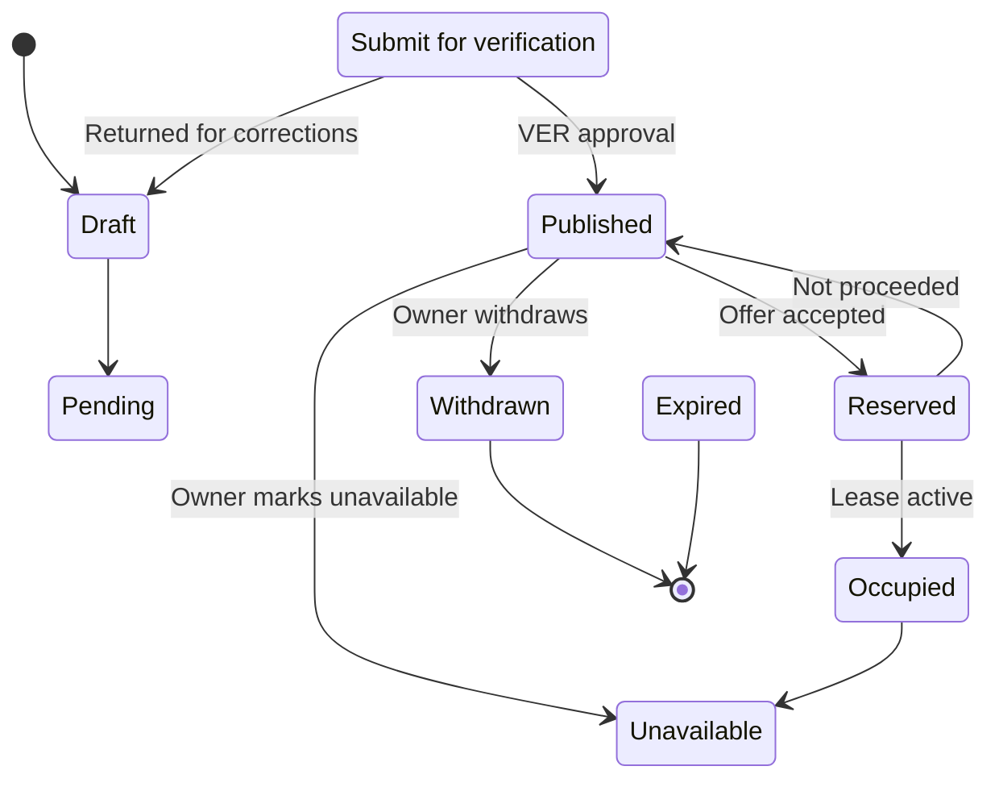
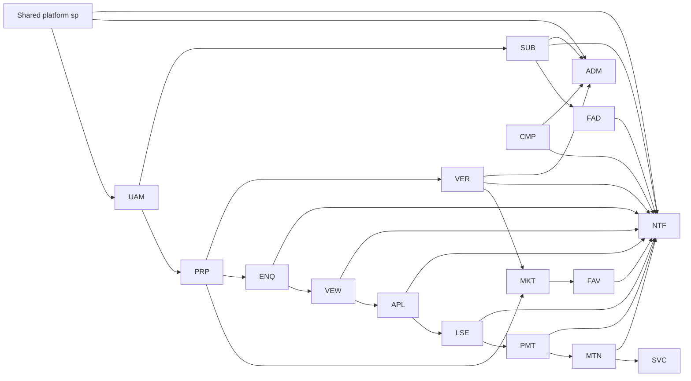

# Requirements and Modules

## Document purpose

This document is the consolidated PRMS requirements and module baseline. It merges the essential content of the Category 03 (domain and business requirements), Category 04 (product requirements) and Category 05 (user experience and design) sets into one authoritative reference for product, engineering, delivery, commercial, quality and support.

The document is organised in four parts:

| Part | Contents | Source sets |
|---|---|---|
| Part A | Domain and business foundation: research, regulatory context, business model, domain model, business rules, events, roles, permissions, use cases, notifications, reports, process maps and journeys | Category 03 |
| Part B | Product requirements: functional requirements catalogue, non-functional requirements, shared platform, MVP definition, release scope, user stories, dependencies, configuration, localisation, data import and export, and traceability | Category 04 |
| Part C | The 20 module definitions, one section per module, with purpose, scope, actors, workflows, data ownership, dependencies, interfaces, KPIs, configuration, acceptance criteria, decisions and open questions | Category 04 module packs |
| Part D | User experience and design: research basis, personas, journeys, information architecture, flows, design system, wireframes, responsive design, accessibility and the UX acceptance checklist | Category 05 |

The consolidated baseline is an approved product-level reference for the PRMS programme. Where a source document holds more detail than summarised here, that source document remains the owning reference; this document records the same requirements, decisions and boundaries at a consolidated level.

## How this document is constructed

- Every section states facts, decisions or requirements that trace to an approved source document, identified by its document reference in plain text.
- Identifiers follow the PRMS conventions: functional requirements use `PRMS-REQ-{MODULE}-{NNN}`; configuration entries use `CFG-{DOMAIN}-{NNN}`; localisation requirements use `LOC-{AREA}-{NNN}`; import and export requirements use `IMP-` and `EXP-` prefixes; dependency rules use `FDM-RUL-`; user stories use `US-{MODULE}-{NNN}`; UX screens, flows, wireframes and acceptance gates use `SCR-`, `FLW-`, `WF-` and `UXAC-` prefixes as defined in Part D.
- Domain tables are named `{module_code}_{entity}` in snake case. Shared-platform tables carry the `sp_` prefix.
- Undecided or not-yet-approved items are phrased as open questions and are listed per module and per catalogue; no placeholder terms are used.
- The document ends with the approval history for this consolidated baseline.

## Roles and audience

| Audience | How they use this document |
|---|---|
| Product Owner | Final requirement and module-scope decisions; release and gate readiness |
| Module owners | Module scope, boundaries, dependencies and acceptance criteria |
| Engineering and architecture | Domain model, shared platform, data ownership, events and interfaces |
| Delivery and quality | Release scope, acceptance criteria, UX gates and import/export readiness |
| Commercial | Business model, subscription plans, paid services and revenue surfaces |
| Support, compliance and security | Policy, consent, audit, retention and regulatory alignment |

## Conventions

| Term | Meaning |
|---|---|
| Module code | Two/three-letter identifier for a module, for example `UAM`, `PRP`, `MKT` |
| Shared platform | The mandatory `sp` foundation: identity, entitlements, parties, files, audit, jobs, configuration and messaging |
| PRMS-MVP-1 | The first release: ten modules (UAM, PRP, MKT, FAV, ENQ, VEW, APL, VER, SUB, ADM) |
| MVP outcome chain | List, verify, enquire, view, apply, lease, collect, maintain |
| Status | Approved (baseline) or open question (needs a decision at a named gate) |
| Effective dated | A value or rule that applies from a stated date until superseded |

---

# Part A — Domain and business foundation

## A1 Domain overview

PRMS is a direct property rental marketplace with an integrated property-management ERP. It removes the traditional agent as the middleman: property owners list and manage directly, tenants search and apply directly, and the platform earns affordable owner subscriptions rather than agent commissions.

### A1.1 The three user groups

| Group | Position | Monetisation |
|---|---|---|
| Property owner or landlord | Lists properties, manages portfolios, responds to enquiries and applications, signs leases, collects rent, maintains properties | Pays an affordable subscription; optional paid services |
| Tenant | Searches, enquires, views, applies, occupies, pays rent, reports maintenance | Free user of the marketplace |
| Platform administrator | Verifies owners and properties, moderates, governs reference data, resolves disputes, oversees revenue | Internal operator; never a payable face to tenants |

Removing the agent does not remove the services: discovery, advertising, enquiries, viewings, applications, leases, rent collection and maintenance requests are all provided by the platform. The proposition is "everything you need to rent and manage property, without the traditional agent commission."

### A1.2 Market and phase plan

| Phase | Scope | Reference locations |
|---|---|---|
| Phase 1 | Residential rentals in Harare and its suburbs | Harare, Borrowdale and approved suburbs |
| Phase 2 | Additional cities | Bulawayo, Mutare, Gweru |
| Phase 3 | Commercial properties and land | Offices, shops, warehouses, land, with the same module set |

The product is Zimbabwe-first. The display and calculation currency is USD, the default timezone is Africa/Harare, and the authoritative language is English with Zimbabwean or British spelling. Future phases extend approved references and configuration; they do not re-architecture the product.

### A1.3 Property categories and attributes

| Reference | Approved values |
|---|---|
| Property categories | House, flat or apartment, townhouse, cottage, room, commercial, land |
| Furnishing states | Furnished, unfurnished, partially furnished |
| Amenities | Configurable list per property category |
| Price presentation | USD, for example $250 per month and a stated deposit |

### A1.4 Trust model

Direct marketplaces fail on trust, so verification is central:

- Verified Owner badge: the account passed identity, contact and location proof.
- Verified Property badge: the property passed ownership or permission evidence plus a photo set.
- Publication gate: a property is published only when verification evidence meets the threshold.
- Revocation: a badge is withdrawn immediately on a fraud finding and is visible to tenants.

The verified badge is never a claim of legal good title; it means the evidence submitted met the platform verification checklist.

## A2 Zimbabwe regulatory context

The Regulatory Requirements Register is an internal compliance-research baseline for the PRMS programme. It is research evidence for product decisions; it is not legal, tax or accounting advice, and all commercial and operating rules remain subject to qualified adviser review before GO.

Each register entry carries a status:

| Status | Meaning |
|---|---|
| Verified source | The source reference was obtained and its content confirmed |
| Applicability review | The source is relevant but its applicability to the platform's operations needs confirmation |
| Evidence missing | The register records that evidence is still required before a decision |

The register tracks, among other areas:

- Consumer-protection expectations for rental transactions and platform advertising.
- Data protection and privacy expectations for personal data, consent and retention.
- Tenancy and landlord law relevant to leases, deposits, rent and eviction practice.
- The regulatory environment for estate agency, relevant because the platform replaces the agent's role.
- Electronic-communications consent and identification requirements for outbound channels.

Direction from the register: consent must be explicit and revocable before outbound communications, deposits and rent must be handled with clear evidence, tenant data must be minimised and purpose-bound, and all retention periods must be confirmed with legal review before GO. Entries marked "Applicability review" or "Evidence missing" identify the research still to be completed.

## A3 Business model

| Element | Model |
|---|---|
| Owner subscriptions | Free (1 listing), Basic (5 listings), Professional (20 listings), Business (unlimited or many) |
| Tenant access | Free: search, enquire, view, apply |
| Platform revenue | Owner subscriptions plus optional paid services |
| Optional paid services | Featured or promoted listings, verification packages and badges, SMS notifications, digital lease generation, online rent collection (phase 2) |
| Prohibition | No external advertising and no tenant-data monetisation; promotions are owner-paid placements only |
| Product invariant | A tenant account is never charged a subscription fee |

Promotion products are Featured Property, Top of Search, Premium Listing and Homepage Promotion, each with an explicit campaign duration and placement evidence.

## A4 Core domain model

All domain records are owned by the module that creates them; shared-platform records are owned by `sp`. Ownership boundaries are explicit so that the marketplace, the subscription layer and the customer records remain consistent.

### A4.1 Property lifecycle

A property cannot move to Published without the verification gate. Reserved, occupied, withdrawn and expired states are recorded in status history and drive marketplace visibility.

### A4.2 Domain aggregates and entities

| Module | Owned records |
|---|---|
| UAM | `uam_accounts`, `uam_profiles`, `uam_account_status_history`, `uam_verification_documents` |
| PRP | `prp_properties`, `prp_categories`, `prp_amenities`, `prp_property_amenities`, `prp_media`, `prp_locations`, `prp_status_history`, `prp_documents`, `prp_portfolios` |
| MKT | `mkt_listings`, `mkt_search_index`, `mkt_impressions`, `mkt_listing_views` |
| FAV | `fav_favourites`, `fav_saved_searches`, `fav_search_alerts` |
| ENQ | `enq_enquiries`, `enq_threads`, `enq_messages`, `enq_communication_history` |
| VEW | `vew_viewings`, `vew_slots`, `vew_status_history`, `vew_reminders` |
| APL | `apl_applications`, `apl_application_documents`, `apl_status_history`, `apl_shortlist_entries` |
| LSE | `lse_leases`, `lse_templates`, `lse_clauses`, `lse_renewals`, `lse_terminations`, `lse_history` |
| PMT | `pmt_rent_schedules`, `pmt_invoices`, `pmt_payments`, `pmt_receipts`, `pmt_deposits`, `pmt_balances`, `pmt_ledger` |
| MTN | `mtn_maintenance_requests`, `mtn_jobs`, `mtn_cost_approvals`, `mtn_status_history`, `mtn_reports` |
| SVC | `svc_contractors`, `svc_services`, `svc_ratings`, `svc_job_assignments`, `svc_performance` |
| SUB | `sub_plans`, `sub_subscriptions`, `sub_bills`, `sub_payments`, `sub_entitlements`, `sub_history` |
| FAD | `fad_promotions`, `fad_campaigns`, `fad_placements`, `fad_charges` |
| VER | `ver_verifications`, `ver_property_cases`, `ver_owner_cases`, `ver_documents`, `ver_reviews`, `ver_decisions` |
| NTF | `ntf_notifications`, `ntf_templates`, `ntf_preferences`, `ntf_delivery_log` |
| LND | `lnd_dashboard_widgets`, `lnd_snapshots` |
| RBA | `rba_reports`, `rba_metric_definitions`, `rba_dashboards`, `rba_snapshots` |
| ADM | `adm_locations`, `adm_property_categories`, `adm_amenities`, `adm_config`, `adm_moderation_cases`, `adm_audit_log` |
| CMP | `cmp_reports`, `cmp_cases`, `cmp_evidence`, `cmp_resolutions` |
| DOC | `doc_documents`, `doc_buckets`, `doc_versions`, `doc_retention_rules` |

### A4.3 Shared platform records and responsibilities

| Table | Responsibility |
|---|---|
| `sp_users` | Platform identity for all users |
| `sp_roles`, `sp_permissions`, `sp_user_roles` | Shared entitlement model; no module bypasses it |
| `sp_parties`, `sp_organisations`, `sp_addresses` | Multi-party master data and organisational structures |
| `sp_files` | Object storage for media, documents and evidence blobs |
| `sp_audit_events` | Tamper-evident audit of identity, state and configuration changes |
| `sp_config` | Effective-dated configuration foundations |
| `sp_jobs` | Managed, restartable jobs (import, export, scheduled work) |
| `sp_message_queue` | Durable messaging for notifications and channel delivery |

Entitlement enforcement is server-side across all execution paths and fails closed; it never silently grants. Production data never appears in development or test environments.

### A4.4 Module dependency overview

## A5 Business rules

The following rules are the consolidated product-level rules from the Business Rules Catalogue and the module packs. Module packs may hold additional detail; where a rule is described there as a decision, it is recorded here.

### A5.1 Platform and commercial rules

| Rule | Statement |
|---|---|
| BR-INV-001 | Tenant access is free; an owner subscription is the paying model; no tenant is ever charged a subscription fee |
| BR-INV-002 | No external advertising and no tenant-data monetisation; promotions are owner-paid placements over subscriptions |
| BR-INV-003 | Listing capacity follows the subscribed plan: Free 1, Basic 5, Professional 20, Business unlimited or many |
| BR-INV-004 | Rent and deposit are stated in USD; a price without a currency is never presented as if it had a default |
| BR-INV-005 | Deposit display is required as part of the listing record |
| BR-INV-006 | Consent is mandatory and revocable before any outbound communication |
| BR-INV-007 | WhatsApp is a communications or delivery channel only; there are no automated conversational flows on it |

### A5.2 Marketplace and discovery rules

| Rule | Statement |
|---|---|
| BR-MKT-001 | Only Published listings are searchable; Reserved and Occupied listings are hidden from open results |
| BR-MKT-002 | Verified badges come from VER decisions; MKT never displays a badge from its own judgement |
| BR-MKT-003 | Impression and view counts are aggregated and never expose individual tenant behaviour |
| BR-PRP-001 | A property cannot move to Published without the verification gate |
| BR-PRP-002 | Media, location and amenity changes during Pending Verification re-open the verification case |
| BR-PRP-003 | Only the owning account or its authorised sub-users may edit a property record |

### A5.3 Communication, viewing and application rules

| Rule | Statement |
|---|---|
| BR-ENQ-001 | Enquiries are visible only to the parties on the thread plus authorised administrators |
| BR-ENQ-002 | Messages are immutable once sent; clarifications are recorded as new messages |
| BR-VEW-001 | A viewing cannot be confirmed against an unavailable property status |
| BR-VEW-002 | Timestamps and appointed parties are immutable once confirmed; changes create history rows |
| BR-APL-001 | One active application per tenant per property is enforced |
| BR-APL-002 | Approval produces a lease invitation in LSE, not an automatic lease |
| BR-APL-003 | Application status changes are timestamped and reason-tagged |

### A5.4 Lease, money and upkeep rules

| Rule | Statement |
|---|---|
| BR-LSE-001 | An Active lease moves the property to Occupied and makes it unavailable to new applications |
| BR-LSE-002 | Signatures require authenticated parties; signed snapshots are immutable and versioned |
| BR-PMT-001 | Every monetary movement updates `pmt_ledger`; the ledger is append-only and corrections are reversing entries |
| BR-PMT-002 | Deposits are tracked separately and released only on lease end or an agreed refund |
| BR-MTN-001 | Cost approval is mandatory above the configured threshold; there is no silent owner bypass |
| BR-MTN-002 | Rejection or cancellation of a maintenance request records a reason visible to the tenant |
| BR-SVC-001 | Ratings are per-job and owner-scoped; a contractor never rates itself |
| BR-SVC-002 | Licence and insurance details are recorded as asserted facts, not verified claims |

### A5.5 Trust, notification and governance rules

| Rule | Statement |
|---|---|
| BR-VER-001 | A badge is issued only from a recorded, attributable decision |
| BR-VER-002 | Revocation on fraud findings is immediate and visible to tenants |
| BR-NTF-001 | Every outbound message requires an applicable consent record or a platform-critical exception |
| BR-NTF-002 | Delivery logs are immutable once a terminal state is reached; message bodies are not logged |
| BR-LND-001 | LND never stores source data; every figure is a read aggregate from its owning module |
| BR-RBA-001 | Every report figure declares its source module, measure and as-of time |
| BR-ADM-001 | ADM administers and never re-owns domain state; domain modules remain authoritative |
| BR-CMP-001 | Remediation actions are executed by the owning module; CMP records intent and outcome |
| BR-DOC-001 | Documents are immutable; edits create versions, never overwrites |
| BR-DOC-002 | Retention and legal holds override routine deletion during open disputes |

## A6 Domain events

Events are versioned and published through the integration and event catalogue. Each module declares the events it publishes; the notification module and reporting lineage consume them.

| Module | Principal events |
|---|---|
| UAM | `UserRegistered`, `AccountVerified`, `AccountSuspended`, `AccountReinstated`, `AccountClosed`, `ProfileUpdated`, `ConsentChanged` |
| PRP | `PropertyCreated`, `PropertyUpdated`, `PropertySubmittedForVerification`, `PropertyPublished`, `PropertyReserved`, `PropertyOccupied`, `PropertyUnavailable`, `PropertyWithdrawn` |
| MKT | `ListingViewed`, `ListingSearched`, `ListingClosed` |
| FAV | `FavouriteSaved`, `FavouriteRemoved`, `SavedSearchCreated`, `AlertPaused`, `AlertResumed`, `AlertDisabled` |
| ENQ | `EnquiryOpened`, `MessageSent`, `EnquiryResolved`, `EnquiryReopened`, `ViewingRequestHandedOff` |
| VEW | `ViewingRequested`, `ViewingAccepted`, `ViewingRejected`, `ViewingScheduled`, `ViewingConfirmed`, `ViewingRescheduled`, `ViewingCompleted`, `ViewingNoShow`, `ViewingCancelled` |
| APL | `ApplicationSubmitted`, `ApplicationUnderReview`, `ApplicationShortlisted`, `ApplicationApproved`, `ApplicationRejected`, `ApplicationWithdrawn`, `ApplicationExpired` |
| LSE | `LeaseDrafted`, `LeaseIssued`, `LeaseSigned`, `LeaseActive`, `LeaseExpiring`, `LeaseRenewed`, `LeaseExpired`, `LeaseTerminated` |
| PMT | `InvoiceIssued`, `PaymentReceived`, `PaymentAllocated`, `BalanceUpdated`, `InvoiceOverdue`, `PaymentWaived`, `DepositReleased` |
| MTN | `MaintenanceReported`, `MaintenanceTriaged`, `MaintenanceAssigned`, `MaintenanceInProgress`, `MaintenanceCompleted`, `MaintenanceClosed`, `MaintenanceRejected`, `MaintenanceCancelled`, `CostApproved` |
| SVC | `ContractorCreated`, `ContractorApproved`, `ContractorAssignedJob`, `ContractorJobCompleted`, `ContractorRated`, `ContractorSuspended`, `ContractorArchived` |
| SUB | `SubscriptionStarted`, `SubscriptionRenewed`, `SubscriptionUpgraded`, `SubscriptionDowngraded`, `SubscriptionPastDue`, `SubscriptionSuspended`, `SubscriptionCancelled`, `EntitlementsChanged` |
| FAD | `PromotionPurchased`, `CampaignQueued`, `CampaignLive`, `CampaignExpired`, `CampaignPaused`, `CampaignResumed`, `CampaignCancelled`, `PlacementVerified` |
| VER | `VerificationCaseOpened`, `EvidenceRequested`, `VerificationApproved`, `VerificationRejected`, `BadgeIssued`, `BadgeRevoked`, `ReVerificationStarted` |
| NTF | `NotificationQueued`, `NotificationDispatched`, `NotificationDelivered`, `NotificationFailed`, `NotificationSuppressed` |
| LND | `DashboardSnapshotGenerated`, `WidgetConfigChanged` |
| RBA | `ReportRequested`, `ReportGenerated`, `ReportFailed`, `ReportArchived`, `MetricDefinitionChanged` |
| ADM | `LocationChanged`, `CategoryChanged`, `AmenityChanged`, `ModerationCaseOpened`, `ModerationCaseResolved`, `ConfigurationChanged` |
| CMP | `ReportSubmitted`, `CaseAssigned`, `CaseResolved`, `CaseDismissed`, `CaseEscalated`, `RemediationRequested`, `RemediationApplied` |
| DOC | `DocumentCreated`, `DocumentVersioned`, `DocumentSuperseded`, `DocumentArchived`, `DocumentDeleted`, `RetentionRuleChanged` |

## A7 Roles and permissions

### A7.1 Roles

| Role | Definition |
|---|---|
| Tenant | Searches and applies free of fees; occupies a property under a lease |
| Property owner or landlord | Lists and manages properties through an affordable subscription |
| Platform administrator | Verifies, moderates and governs the platform |
| Visitor | Browsable marketplace user; limited detail before registration |
| Owner sub-user | Acts under the owner's authority within `sp` entitlements |
| Verification reviewer | Records verification reviews and decisions under administrator policy |
| Service provider or contractor | Maintains a profile and works assigned maintenance jobs |
| Support or audit user | Reads authorised account, audit and case state |
| Finance oversight | Revenue, payment and financial reporting access |
| Delegated product owner | Configuration oversight and escalation decisions |

### A7.2 Permission principles

- Permissions are granted through `sp_roles` and `sp_permissions`; no role bypasses the shared entitlement model, including administrator roles for tenant-facing surfaces.
- A tenant can read published property data only through MKT and can never edit PRP records.
- Verification access is role-limited to the verification team and authorised administrators.
- LND renders for the signed-in owner's portfolio scope only; sub-users see the widgets and properties granted to them.
- Administration access is role-scoped, dual-controlled for sensitive actions, and heavily logged.
- Report and export access is scoped to the requester's authorised data boundary.

### A7.3 Permissions matrix highlights

| Action | Tenant | Owner | Owner sub-user | Administrator | Look-up only |
|---|---|---|---|---|---|
| Register and activate account | Yes | Yes | No | No | No |
| Create and manage own properties | No | Yes | Yes (within scope) | Corrective only | No |
| Publish a property | No | Yes | Yes (within scope) | No | No |
| Verify owners and properties | No | No | No | Yes | No |
| Search and open listings | Yes | Yes | No | Yes | Visitor yes |
| Enquire, view, apply | Yes | Respond | Respond | Intervene | No |
| Manage own subscription | No | Yes | View | Reconcile | No |
| Moderate and suspend | No | No | No | Yes | No |
| Render owner dashboard | No | Yes | Yes (within scope) | Support only | No |
| Manage documents | Own scope | Own portfolio | Within scope | Administer | Metadata only |

## A8 Use cases

The Use Case Catalogue defines the use cases per module with actors, preconditions, flows and postconditions. The principal use cases per module family are:

| Family | Principal use cases |
|---|---|
| Marketplace and discovery | Register, activate, create organisation, create property, submit for verification, search, filter, open listing, save favourite, save search, enquire, reply, request viewing, accept or reject viewing, submit application, review shortlist |
| Agreements, money and upkeep | Create lease, issue and sign, record payment, issue receipt, report maintenance, approve cost, assign contractor, record rating |
| Monetisation and trust | Choose plan, upgrade and downgrade, purchase promotion, submit verification evidence, review case, issue badge, revoke badge |
| Engagement, intelligence and governance | Set notification preferences, render dashboard, generate report, moderate listing, open complaint, resolve dispute, archive document |

Each use case is linked to its owning module pack and, where applicable, to the PRMS-REQ entries and user stories bundled for the module approval gate.

## A9 Notification catalogue

| Aspect | Approved position |
|---|---|
| Channels | In-app, email, SMS, WhatsApp |
| Consent | Explicit per channel and per event type |
| MVP default | In-app plus email and SMS |
| WhatsApp position | Communications or delivery channel only; no automated conversational flows |
| SMS | Paid owner service per the business model |
| Logging | Attempts and outcomes recorded without message content |
| Instructive triggers | New enquiry, new application, viewing request and confirmation, application outcomes, rent due, payment received, lease expiring, maintenance, subscription expiry, matching property |
| Suppression | Preference-controlled per tenant; per-account rate limits prevent notification overload |

## A10 Reports and analytics catalogue

| Report family | Contents | Audience |
|---|---|---|
| Landlord reports | Rental income, occupancy rate, vacancies, property performance, applications, tenant statistics, maintenance spend, outstanding rent, monthly income | Owner |
| Platform reports | Registered owners and tenants, properties, active listings, occupancy, subscription revenue, featured-listing revenue, new registrations, search demand | Platform administrator and finance |
| Verification and trust | Verification funnel, reviewer workload, badge inventory, revocation register | Administrator |
| Moderation and disputes | Dispute register, category trends, resolution outcomes, remediation effectiveness | Administrator |
| Subscription and promotion revenue | Revenue summary, plan distribution, churn, promotion uplift | Finance |

Reports declare lineage: source module, measure and as-of time. Snapshots are immutable once generated; corrections create new versions.

## A11 Process maps

### A11.1 Current state

The current-state process maps are approved as a bounded desk-research baseline only. No participant research has been run and no live artefacts were observed. Findings carry markers where they are verified from a cited source, and research scaffolds are marked where further evidence is required. The current-state baseline therefore describes the research-informed starting point of the rental market, not observed operational evidence.

### A11.2 Future state

The future-state process maps use a shared notation: `[SP]` marks shared-platform capabilities and `[OWN]` marks owner responsibilities. They cover shared-platform entry plus seven critical MVP and end-to-end processes, spanning listing, verification, enquiry, viewing, application, lease and maintenance. Lease automation and payment automation are phase-2 candidates; the MVP reaches lease, collect and maintain through bounded references and manual evidence.

## A12 User journey maps

The domain-level journeys describe the end-to-end intent for each role. Detail belongs to Part D and the UX journey maps.

| Role | Journey |
|---|---|
| Tenant | Discover → confirm trust (verified badges) → enquire → view → apply → lease → occupy → pay → maintain |
| Owner | Register → organise portfolio → create listing → verify → publish → respond → shortlist → lease → collect → maintain → renew or exit |
| Administrator | Verify owners and properties → moderate listings → resolve disputes → govern reference data → report |

---

# Part B — Product requirements

## B1 Product vision and positioning

PRMS is built as a direct property marketplace and rental-management ERP, Zimbabwe-first. The marketplace acquires tenants; the ERP retains landlords. The trust moat is verification; the revenue model is owner subscriptions plus optional paid services; the invariant is that tenants are free and no external advertising monetises tenant data.

Technology direction: Laravel with React and TypeScript rendered through Inertia.js, PostgreSQL for records, Redis for queues and caching, and S3-compatible object storage for files. This direction is recorded for product decisions; detailed architecture is owned by the design documents.

## B2 Functional requirements catalogue

The Functional Requirements Catalogue is the authoritative single list of `PRMS-REQ-*` functional requirements covering all 20 modules. Priorities are Must, Should or May. The catalogue is the source of truth for requirement text; the Traceability Matrix below links each requirement to its module pack.

| Module | Requirement range | Count |
|---|---|---|
| UAM | PRMS-REQ-UAM-001 to PRMS-REQ-UAM-010 | 10 |
| PRP | PRMS-REQ-PRP-011 to PRMS-REQ-PRP-022 | 12 |
| MKT | PRMS-REQ-MKT-023 to PRMS-REQ-MKT-034 | 12 |
| FAV | PRMS-REQ-FAV-035 to PRMS-REQ-FAV-041 | 7 |
| ENQ | PRMS-REQ-ENQ-042 to PRMS-REQ-ENQ-050 | 9 |
| VEW | PRMS-REQ-VEW-051 to PRMS-REQ-VEW-059 | 9 |
| APL | PRMS-REQ-APL-060 to PRMS-REQ-APL-069 | 10 |
| LSE | PRMS-REQ-LSE-070 to PRMS-REQ-LSE-080 | 11 |
| PMT | PRMS-REQ-PMT-081 to PRMS-REQ-PMT-092 | 12 |
| MTN | PRMS-REQ-MTN-093 to PRMS-REQ-MTN-102 | 10 |
| SVC | PRMS-REQ-SVC-103 to PRMS-REQ-SVC-110 | 8 |
| SUB | PRMS-REQ-SUB-111 to PRMS-REQ-SUB-121 | 11 |
| FAD | PRMS-REQ-FAD-122 to PRMS-REQ-FAD-128 | 7 |
| VER | PRMS-REQ-VER-129 to PRMS-REQ-VER-139 | 11 |
| NTF | PRMS-REQ-NTF-140 to PRMS-REQ-NTF-148 | 9 |
| LND | PRMS-REQ-LND-149 to PRMS-REQ-LND-154 | 6 |
| RBA | PRMS-REQ-RBA-155 to PRMS-REQ-RBA-162 | 8 |
| ADM | PRMS-REQ-ADM-163 to PRMS-REQ-ADM-173 | 11 |
| CMP | PRMS-REQ-CMP-174 to PRMS-REQ-CMP-181 | 8 |
| DOC | PRMS-REQ-DOC-182 to PRMS-REQ-DOC-190 | 9 |
| Total | | 190 |

## B3 Non-functional requirements

### B3.1 Performance budgets

| Surface | Budget |
|---|---|
| Search result pages | Within 800 ms at the 95th percentile for phase-1 catalogue sizes |
| Authentication API | Within 500 ms at the 95th percentile under phase-1 load |
| Portfolio lists | Within 1 second for portfolios of up to 100 properties |
| Favourite and alert reads | Within 500 ms |
| In-app messaging | Delivery within 500 ms; conversation lists within 1 second |
| Slot availability queries | Within 500 ms |
| Application submission | Within 30 seconds click-to-complete for typical documents |
| Lease generation from template | Within 5 seconds for standard agreements |
| Dashboard render | Within 1.5 seconds on first load |
| Administration surfaces | Within 1 second |
| Entitlement checks | Within 200 ms within module request paths |
| Notification enqueue | Within 100 ms of the business event |
| Standard report generation | Within 10 seconds for phase-1 data volumes |

### B3.2 Resilience and integrity

| Area | Requirement |
|---|---|
| Marketplace availability | 99.9% for the public surface; graceful stale-index fallback |
| Registration self-service | 99.9%; documented degraded mode |
| Messaging | Queue-backed delivery; channel gateway failures never lose messages |
| Payments | Idempotent billing; queue and reconcile on gateway failure; no double charging |
| Ledger | Append-only; corrections as reversing entries |
| Documents | Immutable versions; recoverable from backup with version integrity |
| Search | Degrade gracefully on index failure; detail pages reachable by reference |
| Notifications | At-least-once semantics with idempotency keys |

### B3.3 Accessibility and usability

| Area | Requirement |
|---|---|
| Baseline conformance | WCAG 2.1 AA |
| Draft pack target | Draft module packs reference WCAG 2.2 AA; the module approval gate confirms the target level |
| Marketplace | Keyboard filter controls, alt text, responsive rendering on mobile |
| Owner ERP | Desktop-first, accessible forms and galleries |
| Notification centre | Accessible in-app centre |

Open question: whether the accessibility target should be raised to WCAG 2.2 AA for all release candidates. The UX acceptance checklist will gate conformance evidence.

## B4 Shared platform requirements

The shared platform (`sp`) is mandatory and is never sold as a sellable module. Its responsibilities:

| Capability | Requirement |
|---|---|
| Identity and accounts | `sp_users`, roles, permissions, user-role assignments; no module bypasses entitlements |
| Parties and organisations | `sp_parties`, `sp_organisations`, `sp_addresses` as the multi-party master structure |
| Files | `sp_files` object storage with integrity and retention; PRP, VER and DOC depend on it |
| Audit | `sp_audit_events` receives identity, state, configuration and administrative actions; tamper-evident |
| Configuration | `sp_config` provides effective-dated, scoped values with visible source |
| Jobs | `sp_jobs` manages import, export and scheduled work as observable, restartable units |
| Messaging | `sp_message_queue` backs notification and channel delivery |
| Entitlements | Server-side enforcement across all execution paths; fail closed; never silently grants |
| Exit | Customer-requested handover and deletion with a reconciled exit receipt |
| Environments | Production data never in development or test |

## B5 Minimum viable product definition

PRMS-MVP-1 comprises ten modules: UAM, PRP, MKT, FAV, ENQ, VEW, APL, VER, SUB, ADM. The minimum viable rental outcome is list, verify, enquire, view, apply, lease, collect, maintain; in the MVP the lease, collect and maintain outcomes are achieved via bounded references and manual evidence because LSE, PMT and MTN are phase-2 candidate modules.

| Module | MVP role |
|---|---|
| UAM | Foundation: identity and accounts |
| PRP | Owner property record and portfolios |
| MKT | Tenant-facing search and listing surfaces |
| FAV | Favourites and saved searches |
| ENQ | Tenant-owner communication without an agent |
| VEW | Viewing scheduling and outcomes |
| APL | Structured applications and decisions |
| VER | Publication gate and trust badges |
| SUB | Owner subscriptions and entitlement enforcement |
| ADM | Administration, reference data and moderation |

Platform foundation (mandatory): `sp` plus UAM, ADM and NTF. NTF delivers the MVP in-app plus email and SMS alerting even though the module itself is catalogued as a cross-suite enabler.

## B6 Release scope documents

The release-scope documents set the scope lists for release candidates and are the input to the GO gate. Notable scope items:

- RSCD-CFG records the configuration values that must be finalised before GO; the configuration catalogue below lists each such value and its status.
- PRMS-MVP-1 must import and export the records it creates: organisations, portfolios, users, properties, verification evidence, enquiries, viewings, applications, subscriptions and configuration.
- Deferred modules (LSE, PMT, MTN, SVC, DOC, LND, RBA, CMP, NTF, FAD) export according to the record set they own when they are released.

## B7 User stories and acceptance criteria

Stories are written in the roles the platform serves and bundle to the functional requirements and module packs. Acceptance criteria are the observable conditions a story must meet to be done.

| Story group | Focus | Requirement references |
|---|---|---|
| Marketplace and discovery | Register, activate, create and publish verified listings, search and filter, favourites, enquiries, viewings, applications | PRMS-REQ-UAM-001 to PRMS-REQ-APL-069 |
| Agreements, money and upkeep | Lease creation and signing, rent and receipts, maintenance reporting and cost approval, contractor pool | PRMS-REQ-LSE-070 to PRMS-REQ-SVC-110 |
| Monetisation and trust | Plan selection, upgrade and downgrade, promotion purchase, verification evidence and badges | PRMS-REQ-SUB-111 to PRMS-REQ-VER-139 |
| Engagement, intelligence and governance | Notification preferences, owner dashboard, reports, moderation, complaints, documents | PRMS-REQ-NTF-140 to PRMS-REQ-DOC-190 |

## B8 Feature dependency matrix

### B8.1 Dependency types

| Type | Meaning |
|---|---|
| Hard | Cannot operate the named function without the depended-on module or capability |
| Soft | Prefers the dependency; absence triggers configured degradation |
| Influenced | Ordering or timing coordination applies at most and the requirement text is unchanged |
| Add-on | Optional add-on over a base module |
| Cross-suite | Never sold alone; operates across the suite |

### B8.2 Module dependencies

| Module | Hard dependencies | Soft or influenced | Standalone? |
|---|---|---|---|
| UAM | sp | None | Yes, foundation |
| PRP | UAM, sp | VER (publication gate) | No |
| MKT | PRP, sp | FAD (promotion placement) | No |
| FAV | MKT, sp | NTF (match notifications) | No, add-on |
| ENQ | UAM, MKT, sp | NTF (channel delivery) | No |
| VEW | ENQ, UAM, sp | NTF (reminders) | No |
| APL | VEW, UAM, sp | NTF (outcomes) | No |
| LSE | APL, UAM, sp | PMT (deposit and rent terms) | No |
| PMT | LSE, UAM, sp | MTN (cost records) | No |
| MTN | PMT, UAM, sp | SVC (provider assignment) | No |
| SVC | MTN, sp | None | No, add-on |
| SUB | UAM, sp | ADM (billing evidence) | Yes, monetisation foundation |
| FAD | SUB, MKT, sp | None | No, add-on |
| VER | SUB, PRP, sp | ADM (workflow) | No |
| NTF | sp | All modules (delivery) | No, cross-suite |
| LND | All in-scope modules, sp | NTF | No, cross-suite |
| RBA | All in-scope modules, sp | None | No, cross-suite |
| ADM | sp | SUB, VER, CMP | No, cross-suite |
| CMP | UAM, PRP, sp | VER, ADM, NTF | No |
| DOC | sp | LSE, PMT, VER, PRP, MTN | No, cross-suite |

### B8.3 Shared-platform edges and failure behaviour

| Consumer | sp capability | Failure behaviour |
|---|---|---|
| All modules | identity, access, entitlements, audit, config, files | Fail closed for unauthorised access; degraded per impact tier |
| PRP, VER, DOC | file identity, integrity, retention | Files fail safe; uploads and reads report state honestly |
| SUB, FAD, ADM | entitlements | Fail closed; never silently grants |
| ENQ, NTF, VEW | notification infrastructure, jobs | Queued delivery with explicit queued, manual or alternate behaviour |
| RBA, ADM | reports, export, audit | Export and reports record requester, filters, scope and source freshness |

### B8.4 Consistency rules

| Rule | Statement |
|---|---|
| FDM-RUL-001 | Every pack dependency must appear in the matrix before the module approval gate |
| FDM-RUL-002 | A matrix edge without pack support must be resolved before gate approval |
| FDM-RUL-003 | Module-code references match the codes in the catalogue and matrix |
| FDM-RUL-004 | Cross-suite and add-on classifications are recorded in the corresponding packs |
| FDM-RUL-005 | The matrix is reviewed on any module-boundary change |

## B9 Configuration catalogue

Values are effective-dated and scoped. The catalogue is the approved product-level configuration baseline; `sp` owns the configuration foundations and the owning modules consume the values. Items marked as an open question are to be approved at the named gate and must not be treated as live.

### B9.1 Subscription configuration (CFG-SUB)

| ID | Setting | Approved value | Owner |
|---|---|---|---|
| CFG-SUB-001 | Free plan listing capacity | 1 listing | SUB |
| CFG-SUB-002 | Basic plan listing capacity | 5 listings | SUB |
| CFG-SUB-003 | Professional plan listing capacity | 20 listings | SUB |
| CFG-SUB-004 | Business plan listing capacity | Unlimited or many (per commercial terms) | SUB |
| CFG-SUB-005 | Tenant access | Free: search, enquire, view, apply | MKT |
| CFG-SUB-006 | Subscription currency | USD | SUB |
| CFG-SUB-007 | Plan prices and proration rules | Open question: to be approved at the pricing review before GO | SUB |
| CFG-SUB-008 | Overage, warning, block and grace behaviour | Open question: listed for the pricing review; detail in the pack | SUB |
| CFG-SUB-009 | Suspension export and read window | Open question: to be confirmed per `sp` exit policy | SUB |

### B9.2 Verification configuration (CFG-VER)

| ID | Setting | Approved value | Owner |
|---|---|---|---|
| CFG-VER-001 | Verified owner required evidence | Identity documents plus contact and location proof | VER |
| CFG-VER-002 | Verified property required evidence | Ownership or permission document plus property photo set | VER |
| CFG-VER-003 | Publication gate | Property published only when verification evidence meets the threshold | PRP, VER |
| CFG-VER-004 | Verification review turnaround | Open question: proposed target measure to be set | ADM |
| CFG-VER-005 | Badge validity and re-check window | Open question: revocation withdraws the badge immediately at all times | VER |
| CFG-VER-006 | Document types for each verification | Configurable list per policy | VER |

### B9.3 Notification configuration (CFG-NTF)

| ID | Setting | Approved value | Owner |
|---|---|---|---|
| CFG-NTF-001 | Channels | In-app, email, SMS, WhatsApp (WhatsApp as a communications channel only) | NTF |
| CFG-NTF-002 | Consent default | Explicit per channel and event type | NTF, sp |
| CFG-NTF-003 | MVP delivery default | In-app plus email and SMS | NTF |
| CFG-NTF-004 | Reminder lead time | Open question: viewing and lease-expiry lead times to be set per event | NTF |
| CFG-NTF-005 | Delivery outcome logging | Attempts and outcomes recorded without message content | NTF, sp |

### B9.4 Deposit and payment evidence configuration (CFG-PMT)

| ID | Setting | Approved value | Owner |
|---|---|---|---|
| CFG-PMT-001 | Deposit currency | USD | PMT |
| CFG-PMT-002 | Deposit display on listings | Required as part of the listing record | PRP, MKT |
| CFG-PMT-003 | Payment evidence minimum | Receipt issued for every recorded payment | PMT |
| CFG-PMT-004 | Money-movement providers in MVP | None; payment processing deferred with PMT | PMT |
| CFG-PMT-005 | Payment and receipt retention | Open question: to be confirmed at privacy and tax review | DOC, PMT |

### B9.5 Currency, timezone and language configuration (CFG-LOC)

| ID | Setting | Approved value | Owner |
|---|---|---|---|
| CFG-LOC-001 | Display and calculation currency | USD | sp, RBA |
| CFG-LOC-002 | Additional currencies | Future additions require configuration and effective dates | sp |
| CFG-LOC-003 | Default timezone | Africa/Harare | sp |
| CFG-LOC-004 | Default language | English with Zimbabwean or British spelling | sp |
| CFG-LOC-005 | Date and number formats | Consistent with USD and English baseline | sp |

### B9.6 Reference configuration (CFG-REF)

| ID | Setting | Approved value | Owner |
|---|---|---|---|
| CFG-REF-001 | Phase 1 locations | Harare and its suburbs, for example Borrowdale | ADM |
| CFG-REF-002 | Phase 2 locations | Bulawayo, Mutare, Gweru (later phase) | ADM |
| CFG-REF-003 | Property categories | House, flat or apartment, townhouse, cottage, room, commercial, land | ADM |
| CFG-REF-004 | Amenity reference | Configurable list of amenities per property category | ADM |
| CFG-REF-005 | Furnishing states | Furnished, unfurnished, partially furnished | PRP |

### B9.7 Platform configuration (CFG-PLT)

| ID | Setting | Approved value | Owner |
|---|---|---|---|
| CFG-PLT-001 | Entitlement enforcement | Server-side across all execution paths | sp |
| CFG-PLT-002 | Audit retention | Open question: to be confirmed at privacy and legal review | sp |
| CFG-PLT-003 | Language and locale inheritance | Effective-dated with visible source | sp |
| CFG-PLT-004 | Environment boundaries | Production data never in development or test | sp |

### B9.8 Configuration rules

| Rule | Statement |
|---|---|
| CFG-RUL-001 | Every configuration value is effective-dated and scoped |
| CFG-RUL-002 | Material configuration changes are validated, approved and audited |
| CFG-RUL-003 | A value marked as an open question is not treated as live |
| CFG-RUL-004 | Owning modules and `sp` agree on noise-free inheritance and visibility |
| CFG-RUL-005 | Values that must be finalised at GO are recorded for the configuration scope list |

## B10 Localisation requirements

| ID | Requirement |
|---|---|
| LOC-LAN-001 | English with Zimbabwean or British spelling is the authoritative language baseline |
| LOC-LAN-002 | Terms such as flat, apartment, townhouse, cottage and plot are used with consistent, user-tested meaning |
| LOC-CUR-001 | USD is the display and calculation currency of the first release |
| LOC-CUR-003 | Currency display, calculation, conversion, rounding and reporting are effective-dated and domain-owned |
| LOC-CUR-004 | Future currencies are addable by configuration without re-architecture |
| LOC-TZ-001 | The default timezone is Africa/Harare |
| LOC-TZ-004 | Notifications and scheduling display in the user's approved locale |
| LOC-LOC-001 | Phase 1 covers Harare and its suburbs, including Borrowdale |
| LOC-LOC-003 | Phase 2 extends to Bulawayo, Mutare and Gweru through configuration |
| LOC-LOC-004 | Phase 3 extends to commercial properties and land |
| LOC-LOC-005 | A property is never listed with a location outside the approved reference set |
| LOC-NAM-001 | Property categories are named house, flat or apartment, townhouse, cottage, room, commercial, land |
| LOC-NAM-004 | Role names are tenant, property owner (landlord) and platform administrator |
| LOC-NAM-005 | Trust signals are named verified property and verified owner; promotion is named featured or promoted |

## B11 Data import and export requirements

### B11.1 Import requirements

- Imports support preview, validation, error reporting and a staged apply before committing business records.
- Imported records are scoped to the authorised organisation, portfolio, property or location.
- Imports distinguish received, parsed, validated, accepted, rejected, partially processed, quarantined and completed states.
- A transport success is never reported as business acceptance; imports are authorised, attributed and audited.
- Imported verification and listing data is never treated as verified; verification evidence requirements still apply.
- Bulk imports are bounded, cancellable where safe, resumable or restartable as designed, and protected from cross-scope leakage.
- Personal data in imports is minimised, purpose-bound and retained per policy.

### B11.2 Import profiles

| Profile | Record set | Owner | Behaviour |
|---|---|---|---|
| IMP-PROF-UAM | Users, roles and organisation or portfolio relationships | UAM | Validated, scoped, duplicate-aware, audit-recorded |
| IMP-PROF-PRP | Properties, locations, categories, amenities and listing evidence | PRP | Draft-import only; the publication gate still applies |
| IMP-PROF-VER | Verification evidence references | VER | Verdicts are never imported as facts |
| IMP-PROF-SUB | Entitlement and subscription evidence | SUB | Entitlement state derives from `sp` |
| IMP-PROF-ADM | Reference data (locations, categories, amenities, configuration) | ADM | Effective-dated, approved and audited |

### B11.3 Export requirements and profiles

- Exports record requester, purpose, generation time, filters, scope, source freshness, classification and applicable warnings.
- Exports are scoped to the authorised record set and follow file retention, minimisation and legal-hold rules.
- The exported file is not evidence of verification; export is authorised, attributed and audited.
- Report and evidence exports preserve the currency, locale and timezone applicable at the time.
- Export output never exposes secrets, credentials or unnecessary personal data.

| Profile | Record set | Owner |
|---|---|---|
| EXP-PROF-UAM | Users, roles and scope relationships | UAM |
| EXP-PROF-PRP | Properties, listing detail, photos and history | PRP |
| EXP-PROF-MKT | Search and impression metrics | MKT, RBA |
| EXP-PROF-ENQ | Enquiry threads and statuses | ENQ |
| EXP-PROF-VEW | Viewing requests and outcomes | VEW |
| EXP-PROF-APL | Applications and decisions | APL |
| EXP-PROF-VER | Verification evidence and verdicts | VER |
| EXP-PROF-SUB | Subscriptions and billing evidence | SUB |
| EXP-PROF-ADM | Audit, configuration and operator records | ADM, sp |

### B11.4 Exit and handover

- Exit produces a reconciled record of exported data, open processes, providers, credentials, retention, legal holds, backups, deletion and residual obligations.
- Exit exports cover all record sets the customer created.
- Providers, queued work, callbacks, mappings and provider-side copies are reconciled at exit.
- Post-exit deletion follows retention and legal-hold policy and is evidenced.
- A customer receives an exit receipt summarising what was exported, what was deleted and what remains retained by law.

## B12 Requirements traceability

The Requirements Traceability Matrix holds 190 `PRMS-REQ-*` identifiers, each with one-to-one ownership to its module pack. The matrix is the full trace: requirement to module pack to user story to release scope. This document records the range table (section B2) as the consolidated summary; the matrix document remains the owning reference for the complete mapping.

---

# Part C — Module definitions

## C1 User and Account Management (UAM)

### C1.1 Purpose and value

UAM registers and authenticates every actor: property owners, tenants, applicants, platform administrators and support or audit users. It owns profiles, roles, permissions, account status and the evidence records that underpin verification. A trusted identity layer is the precondition for the owner-subscribes, tenant-free model.

### C1.2 Scope and exclusions

In scope: self-service registration and authentication; profile management; roles and permissions through `sp`; account status with history; security controls (password policy, multi-factor authentication, sessions, lockout); consent capture; verification evidence intake for VER. Excluded: verification decisions and badges (VER), subscription billing (SUB), property records (PRP), notification dispatch (NTF), and organisation master data (sp).

### C1.3 Actors

| Actor | Authorised actions |
|---|---|
| Visitor | Register, verify contact details, enquire without an account where enabled |
| Property owner or landlord | Maintain profile, invite sub-users, manage security, view status |
| Tenant | Maintain profile, preferences, consent and login security |
| Applicant | Tenant identity ratified at application submission |
| Platform administrator | Approve staff or support accounts, suspend or reinstate, reset credentials by controlled workflow |
| Support or audit users | Read account state and audit events within their boundary |

### C1.4 Workflows and states

Account status: Pending → Active (email verified); Active → Suspended (admin action or policy breach); Suspended → Active (reinstated); Active or Suspended → Closed (owner request, data removal, or unresolved); Closed is terminal. One active account per verified email; suspension prevents login but preserves records; multi-factor authentication is mandatory for administrators.

### C1.5 Data ownership

`uam_accounts`, `uam_profiles`, `uam_account_status_history`, `uam_verification_documents`. Consumed from `sp`: `sp_users`, `sp_roles`, `sp_permissions`, `sp_user_roles`, `sp_parties`, `sp_organisations`, `sp_audit_events`, `sp_config`. Evidence records live in UAM; decisions and badges live in VER.

### C1.6 Dependencies

Required for standalone: `sp` identity and entitlement, audit, and files storage. Optional: VER (badge absent until licensed), SUB (gating inactive), NTF (prompts suppressed). On `sp` identity failure: read-only mode, no new registrations or credential changes.

### C1.7 Interfaces, KPIs and configuration

Events: `UserRegistered`, `AccountVerified`, `AccountSuspended`, `AccountReinstated`, `AccountClosed`, `ProfileUpdated`, `ConsentChanged`. KPIs: registered owners and tenants, profile completion, verification-evidence hand-off readiness, suspension and reinstatement rates, authentication failures. Configuration: password policy, session lifetime, multi-factor options, lockout thresholds, consent toggles, sub-user self-service.

### C1.8 Acceptance criteria highlights

A visitor can register and activate without assistance; a suspended account cannot log in and the action is recorded with a reason; administrator accounts require multi-factor authentication; no role bypasses `sp` entitlements; on `sp` identity failure, new registrations fail gracefully and existing sessions continue; closed accounts are excluded from listing and reporting queries.

### C1.9 Decisions and open questions

Owner subscription is the paying model and tenant accounts remain free. Assumption: one verified email per active account for phase 1. Risk: account sharing undercutting tier limits, mitigated by sub-user management and ADM review. Open question: passwordless or third-party sign-in readiness for the Zimbabwe market.

## C2 Property Management (PRP)

### C2.1 Purpose and value

PRP is the owner's core property record: categories, detailed attributes, amenities, photos and videos, location, rent, deposit, availability and the full status lifecycle across a portfolio. The property record is the asset at the centre of the marketplace; portfolios create retention.

### C2.2 Scope and exclusions

In scope: property records, details, media, location, rent and deposit, lifecycle and status history, documents, portfolios. Excluded: publication and search presentation (MKT), verification decisions (VER), viewings, applications, leases, payments and maintenance (VEW, APL, LSE, PMT, MTN), advertising (FAD).

### C2.3 Actors

Owner and sub-users create and manage; administrators correct and moderate in abuse cases; the verification team reads evidence; tenants read published data only through MKT.

### C2.4 Workflows and states

Property lifecycle (section A4.1). Key journeys: create property; submit for verification (evidence package to VER); publish on VER approval; manage reserve, occupied and unavailable states; group properties into portfolios. Rent and deposit are stated in USD; media, location and amenity changes during verification re-open the case.

### C2.5 Data ownership

`prp_properties`, `prp_categories`, `prp_amenities`, `prp_property_amenities`, `prp_media`, `prp_locations`, `prp_status_history`, `prp_documents`, `prp_portfolios`. Category, amenity and location master values are administered by ADM; media blobs live in `sp_files`.

### C2.6 Dependencies

Required for standalone: `sp` files, audit, and ADM reference data. Optional: VER (publication skipped as recorded-not-verified), MKT (no public surface). On file-storage failure, media uploads fail gracefully while text fields remain editable.

### C2.7 Interfaces, KPIs and configuration

Events: `PropertyCreated`, `PropertyUpdated`, `PropertySubmittedForVerification`, `PropertyPublished`, `PropertyReserved`, `PropertyOccupied`, `PropertyUnavailable`, `PropertyWithdrawn`. KPIs: properties per owner and category, draft-to-published time, status composition, media completeness. Configuration: mandatory fields, media limits, managed categories and amenities, category availability by edition.

### C2.8 Acceptance criteria highlights

An owner creates a fully described property and submits it; publication requires the verification gate; transitions update status history and feed LND; tier limits block creation at capacity; a withdrawn property is immediately hidden with history retained.

### C2.9 Decisions and open questions

Verification gates publication (owner of gate: VER). Assumption: USD is the documented listing currency. Risk: duplicate or fictitious listings, mitigated by the VER gate and CMP. Open question: whether land and commercial categories block in phase 1 or phase 3.

## C3 Property Marketplace and Search (MKT)

### C3.1 Purpose and value

MKT is the tenant-facing discovery surface and the acquisition engine: free search maximises demand, and demand volume is what makes owner subscriptions and promotion worth buying. Search, filters, sort and a rich listing detail page with gallery, map and trust badges are the core surfaces.

### C3.2 Scope and exclusions

In scope: full-text and filtered search; filters for location, price, type, bedrooms, bathrooms, amenities, furnished status and availability; sorting; listing detail; impression and view tracking. Excluded: property record ownership (PRP), favourites (FAV), contact and apply workflows (ENQ, VEW, APL), promotion ranking rationale (FAD), verification decisions (VER).

### C3.3 Actors

Visitors browse limited detail; tenants get full search, filters, gallery and badges; owners read their published presentation and buy promotion via FAD; administrators moderate and unpublish; RBA consumes aggregates.

### C3.4 Workflows and states

Only Published listings are searchable; Reserved and Occupied listings are hidden or shown as unavailable per configuration. Listing lifecycle: Derived from the PRP aggregate into `mkt_listings`; the listing closes or withdraws and leaves search immediately. Badges displayed come from VER only. Price display is USD and sorting uses the numeric stored value.

### C3.5 Data ownership

`mkt_listings`, `mkt_search_index`, `mkt_impressions`, `mkt_listing_views`. The listing is a derived projection; PRP remains the record owner; MKT owns the search projection and metrics.

### C3.6 Dependencies

Required for standalone: PRP records and `sp` search infrastructure. Optional: VER (badges), FAV (alerts), FAD (placements). On `sp` search failure, list search degrades while detail pages remain reachable by reference.

### C3.7 Interfaces, KPIs and configuration

Events consumed from PRP: publication and status events. Published: `ListingViewed`, `ListingSearched`, `ListingClosed`. KPIs: search volume, impressions and views per property, filter usage, listing-to-application conversion, time to first interaction. Configuration: filter dimensions, amenity set, sort options, index freshness window, badge display rules, phase-1 price bands.

### C3.8 Acceptance criteria highlights

A published property appears in search within the freshness window and is absent when withdrawn; filter and sort combinations match stored data; views accrue without exposing tenant identity; the detail page renders VER-sourced badges only; a tenant completes search to detail within MKT without an account.

### C3.9 Decisions and open questions

Tenants use the marketplace free of charge. Assumption: Harare is the phase-1 search market. Risk: empty-result frustration, mitigated by saved searches and alerts. Open question: whether reserved listings remain visible as sold references.

## C4 Favourites and Saved Searches (FAV)

### C4.1 Purpose and value

FAV lets tenants save properties, remove favourites, save searches, configure alerts on matching properties and compare shortlisted properties. It increases return frequency, shortens the path from search to application, and keeps demand alive through alerts.

### C4.2 Scope and exclusions

In scope: favourites, saved searches, search alerts, alert history and opt-out, shortlist comparison. Excluded: search execution (MKT), rendering and dispatch (NTF), recommendations (MKT/RBA), property records (PRP).

### C4.3 Actors

Tenants own their favourites, searches and alerts; visitors are offered favourites post-registration only; administrators review abusive alert volume. Favourites and alerts are never shared publicly.

### C4.4 Workflows and states

Favourite lifecycle: Saved → Removed → Saved or terminal. Saved search and alert lifecycle: Active → Paused → Active, or Active/Paused → Disabled (limit or deletion). Alerts respect per-account rate limits; comparison renders presentable attributes only.

### C4.5 Data ownership

`fav_favourites`, `fav_saved_searches`, `fav_search_alerts`. Favourites reference property and listing identity without copying content; deletion of an account cascades under the retention policy.

### C4.6 Dependencies

Add-on over MKT and PRP; no standalone edition. If MKT is unavailable, stored lists remain readable but new saves and alerts pause; if NTF is unavailable, alerts queue and deliver on recovery.

### C4.7 Interfaces, KPIs and configuration

Events: `FavouriteSaved`, `FavouriteRemoved`, `SavedSearchCreated`, `AlertPaused`, `AlertResumed`, `AlertDisabled`. KPIs: favourites per tenant and per listing, active alerts, alert-triggered return sessions, favourite-to-application conversion. Configuration: maximum saved searches and favourites, alert rate limits, comparison list size, pause defaults.

### C4.8 Acceptance criteria highlights

A tenant saves and removes favourites, saves a search and toggles an alert without assistance; alert firing respects rate limits and pause state; a withdrawn listing is flagged but does not break the record; comparisons render configured attributes only; alerts queue without duplication on recovery.

### C4.9 Decisions and open questions

No advertising monetisation of favourites data; tenant opt-in consent is required for every alert. Risk: alert fatigue, mitigated by rate limits and pause controls. Open question: whether unauthenticated remind-me-later saving is worthwhile in phase 1.

## C5 Enquiries and Communication (ENQ)

### C5.1 Purpose and value

ENQ replaces the agent as the communication bridge: a tenant sends an enquiry and the owner replies directly, with threading, history, tracking and email, SMS and WhatsApp integration where configured. Recorded communication protects both parties in disputes and feeds response-time reporting.

### C5.2 Scope and exclusions

In scope: property enquiries, threaded messaging with history, viewing hand-off, listed channels, enquiry tracking and status, notification hooks. Excluded: viewing scheduling (VEW), applications (APL), verification conversations (VER), platform broadcast (ADM/sp).

### C5.3 Actors

Tenants and visitors start and reply on their threads; owners reply on their properties' threads and mark resolved; sub-users handle threads under owner authority; administrators intervene on reported threads; support reads metadata only and never messages as an owner.

### C5.4 Workflows and states

Enquiry lifecycle: Opened → In Progress → Resolved (owner marks) → Closed; Resolved → Opened (reopened by a party or authorised administrator). Enquiries are private to the parties; messages are immutable once sent; WhatsApp is a configured channel, never an automated decision surface.

### C5.5 Data ownership

`enq_enquiries`, `enq_threads`, `enq_messages`, `enq_communication_history`. Consumed from `sp`: users, message queue, files, audit. Retained per the communication retention policy and exportable as dispute evidence.

### C5.6 Dependencies

Required for standalone: MKT entry points, PRP property identity, channel gateway, `sp` audit. On gateway failure, messages queue in `sp_message_queue` and deliver on recovery while in-app messaging continues.

### C5.7 Interfaces, KPIs and configuration

Events: `EnquiryOpened`, `MessageSent`, `EnquiryResolved`, `EnquiryReopened`, `ViewingRequestHandedOff`. KPIs: enquiries per property and owner, response time, closure and re-open rates, enquiry-to-viewing and enquiry-to-application conversion. Configuration: enabled channels, attachment limits, stale-thread auto-close, retention window. SMS is an optional paid service.

### C5.8 Acceptance criteria highlights

A tenant exchanges messages with the owner without an agent; every message is recorded and visible in history; a resolved enquiry reopens only by a party or administrator; hand-off supplies VEW with thread context; gateway failure never loses messages; thread data is exportable for CMP.

### C5.9 Decisions and open questions

WhatsApp is a communication channel only. Assumption: in-app messaging is the default and lowest-cost channel. Risk: abuse inside private chats, mitigated by CMP, moderation and admin intervention. Open question: whether owner-to-tenant promotional messages within threads are permitted.

## C6 Viewing Management (VEW)

### C6.1 Purpose and value

VEW manages viewings end to end: requests, owner accept, reject and reschedule, slot scheduling and confirmation, reminders, and outcome recording. Viewings are the highest-intent moment in the rental journey and convert demand into applications and leases.

### C6.2 Scope and exclusions

In scope: viewing requests, owner-published slots, accept and reject and reschedule workflows, scheduling and reminders, history, no-show and outcome recording. Excluded: enquiry history (ENQ), applications (APL), lease creation (LSE), owner diary synchronisation (sp/ADM).

### C6.3 Actors

Tenants request, accept or decline slots and reschedule within limits; owners publish slots and record outcomes; sub-users manage under authority; administrators intervene on disputed viewings.

### C6.4 Workflows and states

Viewing lifecycle: Requested → Accepted → Scheduled → Confirmed → Completed, No Show or Cancelled; with terminate branches for rejection and cancellation, and reschedule transitions between Scheduled and Confirmed. Confirmation is blocked against unavailable property status; no-shows are recorded factually and inform owner trust signals.

### C6.5 Data ownership

`vew_viewings`, `vew_slots`, `vew_status_history`, `vew_reminders`. Consumed from `sp`: users, configuration. Records are retained for the communication and dispute-evidence windows and are never destroyed during an open dispute.

### C6.6 Dependencies

Required: PRP property status and `sp` audit. Optional: MKT (entry point), NTF (reminders replay after recovery). On slot-selection failure, ad-hoc scheduling works with manual slots.

### C6.7 Interfaces, KPIs and configuration

Events: `ViewingRequested`, `ViewingAccepted`, `ViewingRejected`, `ViewingScheduled`, `ViewingConfirmed`, `ViewingRescheduled`, `ViewingCompleted`, `ViewingNoShow`, `ViewingCancelled`. KPIs: requests per property and owner, request-to-confirmation time, confirmation and no-show rates, viewing-to-application conversion. Configuration: slot durations, rescheduling notice, reminder lead times, maximum open requests, no-show thresholds.

### C6.8 Acceptance criteria highlights

A tenant can request, accept and confirm a viewing with one shared timeline; every owner decision is recorded in status history; confirmation is blocked while the property is unavailable; no-shows are recorded only by authorised parties with timestamps; reminders replay without duplication.

### C6.9 Decisions and open questions

Viewing outcomes feed application intent, not an automated lease. Assumption: owner-published slot availability scales for phase 1. Risk: no-shows discouraging owners, mitigated by reminders, caps and analytics. Open question: whether remote picture or video viewing counts as completed.

## C7 Rental Applications (APL)

### C7.1 Purpose and value

APL converts tenant interest into structured applications: submission, owner review and shortlist, accept, reject or request-more-information, and tenant status tracking. Applications are the qualifying step before revenue and enable fee-based tenant screening as a later premium.

### C7.2 Scope and exclusions

In scope: submission with details and documents, status tracking, owner decisioning, application documents, shortlist entries, expiry handling. Excluded: enquiry and viewing context (ENQ, VEW, incoming only), lease creation (LSE), applicant screening as a premium future service.

### C7.3 Actors

Tenants submit, upload, withdraw, track and respond; owners review, shortlist, accept, reject and invite to lease; sub-users review under authority; administrators correct erroneous states.

### C7.4 Workflows and states

Application lifecycle: Submitted → Under Review → Shortlisted → Approved, with Rejected, Withdrawn and Expired branches. Approval produces an LSE invitation, not a lease. One active application per tenant per property; documents are virus-scanned and size-limited; status changes are reason-tagged.

### C7.5 Data ownership

`apl_applications`, `apl_application_documents`, `apl_status_history`, `apl_shortlist_entries`. Application documents are sensitive personal data, retained for the dispute and screening windows and deleted per the retention policy after the decision lifecycle closes.

### C7.6 Dependencies

Required: UAM identity, PRP subject property, `sp` files. Optional: LSE (invitation), NTF (status alerts). On file-storage failure, applications submit without documents and later upload is permitted.

### C7.7 Interfaces, KPIs and configuration

Events: `ApplicationSubmitted`, `ApplicationUnderReview`, `ApplicationShortlisted`, `ApplicationApproved`, `ApplicationRejected`, `ApplicationWithdrawn`, `ApplicationExpired`. KPIs: applications per listing and owner, time to decision, shortlist and approval rates, application-to-lease conversion. Configuration: mandatory fields, document requirements, automatic expiry, freeze period between reject and re-apply.

### C7.8 Acceptance criteria highlights

A tenant submits, tracks and withdraws an application; one active application per tenant per property is enforced; approval generates an LSE invitation rather than a lease; transitions are reason-tagged and auditable; documents are redacted from RBA and LND.

### C7.9 Decisions and open questions

Approval creates a lease invitation; LSE holds the lease record. Assumption: application documents are required at submission for phase-1 rentals. Risk: fabricated applicant details, mitigated by UAM identity assertion and future screening. Open question: whether a refundable application-holding fee is appropriate.

## C8 Lease and Agreement Management (LSE)

### C8.1 Purpose and value

LSE creates and manages the rental agreement: templates, clauses, deposit and rent terms, dates, digital documents, renewal, termination and full history. The lease is the legal and commercial backbone of the rental relationship and removes a cost owners would otherwise pay agents or lawyers.

### C8.2 Scope and exclusions

In scope: lease creation from an approved application, templates and clause libraries, terms, digital documents with versioning, renewal and termination, agreement history. Excluded: legal advice and jurisdiction-specific drafting, rent collection (PMT), document storage internals (DOC/sp), application decisioning (APL).

### C8.3 Actors

Owners create, issue, renew and terminate; tenants view, accept and sign; sub-users prepare under authority with signature retained by the owner; administrators correct state; DOC stores versions.

### C8.4 Workflows and states

Lease lifecycle: Draft → Pending Signature → Active → Expiring → Expired, with Renewed and Terminated branches. An Active lease moves the property to Occupied; signatures require authenticated parties; rent and deposit default from the property record and are editable at draft time.

### C8.5 Data ownership

`lse_leases`, `lse_templates`, `lse_clauses`, `lse_renewals`, `lse_terminations`, `lse_history`. Consumed from `doc`: `doc_documents`, `doc_versions`. Signed leases are immutable and versioned on every change.

### C8.6 Dependencies

Required for standalone: DOC document storage, PRP property record, `sp` signing identity. Optional: APL (direct creation used when absent), PMT (rent schedule when licensed). If DOC is unavailable, snapshots fail and signing is blocked with no data loss.

### C8.7 Interfaces, KPIs and configuration

Events: `LeaseDrafted`, `LeaseIssued`, `LeaseSigned`, `LeaseActive`, `LeaseExpiring`, `LeaseRenewed`, `LeaseExpired`, `LeaseTerminated`. KPIs: active leases, issue-to-signed time, renewal rate and average duration, terminations. Configuration: clause library, renewal notice window, expiry definitions, signature requirements. Digital lease generation is an optional paid service.

### C8.8 Acceptance criteria highlights

An approved applicant produces a draft lease invitation; a lease becomes Active only after both parties sign and moves the property to Occupied; every signed snapshot is versioned and immutable; on Expiring, renewal or expiry executes with history recorded.

### C8.9 Decisions and open questions

The platform provides lease templates but not legal advice. Assumption: Zimbabwean residential leases are the phase-1 template baseline. Risk: template gaps causing disputes, mitigated by clause-library governance and versioning. Open question: integrate with an e-signature provider or maintain in-platform signature capture.

## C9 Rent and Payment Management (PMT)

### C9.1 Purpose and value

PMT manages rent end to end: schedules, invoices, payment tracking, outstanding rent, deposits, late payments, receipts, balances and monthly income. Reliable rent collection is the most valuable operational outcome for a landlord; online rent collection is an optional paid service.

### C9.2 Scope and exclusions

In scope: rent schedules from the Active lease, invoice generation, payment recording and allocation, receipts, outstanding and overdue tracking, deposits, balances, income and arrears inputs. Excluded: full general-ledger accounting, gateway contracts and settlement, subscription billing (SUB), tax computation and statutory filings.

### C9.3 Actors

Tenants pay, view balances and receipts; owners generate invoices, record manual payments, waive and approve refunds; sub-users record receipts under authority; finance oversight monitors ledger integrity.

### C9.4 Workflows and states

Rent lifecycle: Due → Pending → Paid, with Overdue, Partially Paid and Waived branches. Every monetary movement updates `pmt_ledger`; the ledger is append-only with reversing-entry corrections; deposits are tracked separately and released on lease end or agreed refund; waived items carry an owner reason and are excluded from arrears.

### C9.5 Data ownership

`pmt_rent_schedules`, `pmt_invoices`, `pmt_payments`, `pmt_receipts`, `pmt_deposits`, `pmt_balances`, `pmt_ledger`. The ledger is the audit source of record for PMT; financial records are retained for the statutory period.

### C9.6 Dependencies

Required for standalone: LSE active lease (or manual schedules), payment gateway, `sp` audit. Optional: NTF (reminders), DOC (receipt archive falls back to `sp_files`). On gateway failure, payments queue and reconcile without double charging.

### C9.7 Interfaces, KPIs and configuration

Events: `InvoiceIssued`, `PaymentReceived`, `PaymentAllocated`, `BalanceUpdated`, `InvoiceOverdue`, `PaymentWaived`, `DepositReleased`. KPIs: rent collected per period, arrears ageing, on-time payment rate, deposit liability, income trend. Configuration: gateway providers, invoice numbering, terms, grace periods, escalation schedule, deposit rules.

### C9.8 Acceptance criteria highlights

An Active lease produces a matching rent schedule in USD; a payment updates invoice, balance, receipt and ledger atomically; overdue transitions trigger configured escalation; waivers are recorded with reason; transactions reconcile without double charging; records satisfy the finance oversight role.

### C9.9 Decisions and open questions

No full general ledger; PMT covers rent and deposits only. Assumption: USD-denominated rents with a single primary currency per listing. Risk: reconciliation complexity across mobile-money and card channels. Open question: build-versus-integrate for payment gateway orchestration, requiring specialist accounting review.

## C10 Maintenance Management (MTN)

### C10.1 Purpose and value

MTN digitises the maintenance lifecycle: tenant reports, owner triage, technician assignment, cost approval, progress tracking and closure, with history and reporting. Maintenance is where the ERP earns its keep and drives tenant satisfaction.

### C10.2 Scope and exclusions

In scope: tenant-reported issues, triage and rejection paths, assignment and job tracking, cost approval, progress and closure, history and evidence. Excluded: contractor master profiles (SVC), rent credits (PMT), equipment registers, occupancy-level decisioning (LSE).

### C10.3 Actors

Tenants report, attach photos, track and confirm closure; owners triage, approve cost, assign, reject or cancel and close; contractors update progress via SVC; sub-users triage under authority; administrators oversee escalations.

### C10.4 Workflows and states

Request lifecycle: Reported → Triaged → Assigned → In Progress → Completed → Closed, with Rejected and Cancelled branches. Cost approval is mandatory above the threshold; urgent categories may bypass ordering but still pass the approval gate; rejection records a reason visible to the tenant.

### C10.5 Data ownership

`mtn_maintenance_requests`, `mtn_jobs`, `mtn_cost_approvals`, `mtn_status_history`, `mtn_reports`. Consumed from `svc`: `svc_job_assignments` (or local notes). History is retained for asset-history and dispute windows and is excluded from tenant deletion until retention passes.

### C10.6 Dependencies

Required: PRP property identity, `sp` files. Optional: SVC (assignments as free-text notes if absent), NTF (alerts), PMT (cost ledger). On file-storage failure, reports are lodged without photos and photos added later.

### C10.7 Interfaces, KPIs and configuration

Events: `MaintenanceReported`, `MaintenanceTriaged`, `MaintenanceAssigned`, `MaintenanceInProgress`, `MaintenanceCompleted`, `MaintenanceClosed`, `MaintenanceRejected`, `MaintenanceCancelled`, `CostApproved`. KPIs: open requests, time to resolution, cost per request, rejection rates, technician completion time. Configuration: cost-approval threshold, urgent categories, closure confirmation, SLAs, photo requirements, retention.

### C10.8 Acceptance criteria highlights

A tenant reports an issue with photos and tracks status; cost approval gates assignment above the threshold; rejections and cancellations record reasons; SVC-structured assignments are used when licensed and text notes otherwise; history is admissible as CMP evidence.

### C10.9 Decisions and open questions

Cost approval is mandatory above threshold. Assumption: tenants are the primary reporters, with owners able to log requests too. Risk: coverage disputes on responsibility, mitigated by lease terms and CMP evidence. Open question: whether photos are mandatory for cost above a higher threshold.

## C11 Service Provider and Contractor Management (SVC)

### C11.1 Purpose and value

SVC manages the contractor side of maintenance: profiles, trades, services, contact details, job history, costs, ratings and performance. It turns maintenance into a managed service and creates a future contractor-directory revenue stream.

### C11.2 Scope and exclusions

In scope: contractor profiles and services, job assignment history, costing and performance, ratings, compliance flags (licence, insurance) recorded as facts. Excluded: job scheduling (MTN), contractor payments (PMT/ADM), accreditation decisions, public directory (future).

### C11.3 Actors

Contractors maintain profiles and view assigned jobs; owners create profiles, assign jobs and rate; sub-users assign and record costs under authority; administrators approve onboarding and moderate misconduct.

### C11.4 Workflows and states

Profile lifecycle: Proposed → Approved → Active → Suspended → Archived, with restore and retire branches. Ratings are per-job and owner-scoped; licence and insurance details are asserted facts, not verified claims; assignment records are immutable once complete; suspended profiles receive no new assignments.

### C11.5 Data ownership

`svc_contractors`, `svc_services`, `svc_ratings`, `svc_job_assignments`, `svc_performance`. Consumed from `mtn` (jobs, cost approvals) and `sp` (parties, files). Contractor records are retained for the performance-history window and are never exposed publicly in phase 1.

### C11.6 Dependencies

Add-on over MTN. Required for standalone: MTN assignments, `sp` party records. Optional: PMT (costs held locally until licensed), NTF. Without MTN, jobs are created manually by the owner.

### C11.7 Interfaces, KPIs and configuration

Events: `ContractorCreated`, `ContractorApproved`, `ContractorAssignedJob`, `ContractorJobCompleted`, `ContractorRated`, `ContractorSuspended`, `ContractorArchived`. KPIs: active contractors per trade, jobs and completion time, cost per contractor, ratings, repeat-assignment rate. Configuration: trade categories, profile fields, rating scale, suspension thresholds, licence-evidence capture.

### C11.8 Acceptance criteria highlights

An owner creates a contractor, assigns a job through MTN and rates on completion; ratings are immutable and attributable; suspended contractors receive no assignments; licence evidence is stored with restricted access; performance aggregates feed RBA within the owner's scope.

### C11.9 Decisions and open questions

Ratings are job-anchored and owner-scoped. Assumption: contractor accounts remain external profiles in phase 1. Risk: fabricated performance claims, mitigated by job-anchored data and admin review. Open question: timing of a public contractor directory as a revenue surface.

## C12 Subscription Management (SUB)

### C12.1 Purpose and value

SUB is the platform revenue core: plans (Free, Basic, Professional, Business), billing, payments, expiry, renewals, upgrades and downgrades, history and entitlement enforcement. Tenants stay free; owners pay affordable subscriptions instead of agent commissions.

### C12.2 Scope and exclusions

In scope: plan catalogue, subscription lifecycle and billing, payment and renewal handling, upgrades and downgrades, entitlement computation and enforcement, history. Excluded: tenant billing (invariant: none), rent collection (PMT), promotion charging (FAD), gateway contracts (ADM), marketing attribution.

### C12.3 Actors

Owners choose, upgrade, downgrade, cancel and renew; sub-users view status with restricted payment authority; administrators manage the catalogue and correct billing; finance oversight reconciles revenue.

### C12.4 Workflows and states

Subscription lifecycle: Trial → Active → Past Due → Suspended → Cancelled, with renewals back to Active and cancellation from any state. Plan moves are recorded in `sub_history` with a billing-effective date; suspended subscriptions freeze paid capabilities without deleting owner data.

### C12.5 Data ownership

`sub_plans`, `sub_subscriptions`, `sub_bills`, `sub_payments`, `sub_entitlements`, `sub_history`. Subscription financial records are the platform revenue source of record for RBA and are retained for the statutory period.

### C12.6 Dependencies

Required: UAM account identity, billing gateway, `sp` audit. Optional: PMT (payments recorded inside SUB until licensed), NTF. On gateway failure, renewals fail gracefully, subscriptions move to Past Due on schedule, and entitlements follow the grace period.

### C12.7 Interfaces, KPIs and configuration

Events: `SubscriptionStarted`, `SubscriptionRenewed`, `SubscriptionUpgraded`, `SubscriptionDowngraded`, `SubscriptionPastDue`, `SubscriptionSuspended`, `SubscriptionCancelled`, `EntitlementsChanged`. KPIs: active subscriptions by plan, monthly recurring revenue and churn, upgrade and downgrade rates, renewal and past-due ratios, trial-to-paid conversion. Configuration: plan catalogue, price bands, feature mapping, trial defaults, grace periods, refund windows.

### C12.8 Acceptance criteria highlights

An owner starts a trial, upgrades, downgrades and cancels with correct entitlement changes; no tenant account is ever charged; a suspended subscription freezes paid capabilities while preserving data; billing runs are idempotent under retries; revenue reconciles to billing and payment records.

### C12.9 Decisions and open questions

Owner-pays, tenant-free is a non-negotiable product invariant. Assumption: USD pricing with a single primary plan currency. Risk: churn from price-sensitive owners, mitigated by affordable tiering and value evidence via LND and RBA. Open question: whether trials apply to all plans or only the entry paid tier.

## C13 Featured and Advertising Management (FAD)

### C13.1 Purpose and value

FAD lets owners pay a small additional amount to promote properties: Featured Property, Top of Search, Premium Listing and Homepage Promotion, each with a defined duration and placement evidence. Promotion is a high-margin revenue stream beside subscriptions.

### C13.2 Scope and exclusions

In scope: promotion products, campaign creation and duration, placement evidence and impressions, charging and reconciliation, eligibility gating. Excluded: organic ranking (MKT), external advertising and data monetisation (prohibited), broadcast marketing (ADM), tenant-side paid features (none).

### C13.3 Actors

Owners purchase and monitor promotions for their own listings; sub-users view status with purchase authority constrained; administrators configure products and reconcile; revenue oversight reports on placements.

### C13.4 Workflows and states

Campaign lifecycle: Created → Queued → Live → Expired, with Paused/Resumed and Cancelled branches (early cancellation credited). Promotion is available only for Published listings on an eligible subscription; charging is one-off per campaign with an explicit duration; placements never override verification or moderation; competing placements follow a deterministic, disclosed ordering rule.

### C13.5 Data ownership

`fad_promotions`, `fad_campaigns`, `fad_placements`, `fad_charges`. Consumed from `mkt` (listings, impressions) and `sub` (subscriptions). Promotion evidence is retained for charge-reconciliation and dispute windows.

### C13.6 Dependencies

Add-on over MKT and SUB. Required for standalone: SUB eligibility, payment gateway; MKT placement is shared, not required for standalone (campaign stays Queued and no charge accrues until live). Optional: NTF alerts.

### C13.7 Interfaces, KPIs and configuration

Events: `PromotionPurchased`, `CampaignQueued`, `CampaignLive`, `CampaignExpired`, `CampaignPaused`, `CampaignResumed`, `CampaignCancelled`, `PlacementVerified`. KPIs: promotion revenue and share, uplift versus organic, placements by product and location, campaign utilisation, credit ratio. Configuration: product catalogue, USD prices, durations, ordering rule, crediting, simultaneous-campaign caps.

### C13.8 Acceptance criteria highlights

An owner purchases a promotion only for a Published listing on an eligible subscription; placements respect a disclosed ordering rule; impressions support charge reconciliation; early cancellation credits consistently; tenant data is never used for placement decisions.

### C13.9 Decisions and open questions

No external advertising or data monetisation. Assumption: duration-based campaigns are clearer than auction-based buying in phase 1. Risk: perceived unfairness in ordering, mitigated by a disclosed deterministic rule. Open question: whether top-of-search placements are capped per owner per location.

## C14 Property and Owner Verification (VER)

### C14.1 Purpose and value

VER verifies owners, properties and listings with documents and contact checks, and owns the Verified Property and Verified Owner badges. Verification is the platform's trust moat and the reason tenants choose PRMS over unvetted social-media listings.

### C14.2 Scope and exclusions

In scope: owner, property and listing verification cases, decisions, reviews and evidence, badge issuance, revocation and re-review. Excluded: evidence storage mechanics (UAM/PRP/DOC and sp supply evidence), the publication gate (PRP consumes the decision), complaint intake (CMP), fraud investigation (ADM).

### C14.3 Actors

Owners submit documents and respond to requests; the verification team reviews and decides; reviewers record reviews under policy; administrators oversee re-verification; support reads case state within authorisation.

### C14.4 Workflows and states

Case lifecycle: Pending → Under Review → Verified or Rejected, with Request-More-Evidence back to Pending, and Revoked → Under Review (re-verification). Badge issuance requires a recorded, attributable decision; the badge never claims legal title; revocation on fraud findings is immediate and visible; verification decisions are the authoritative input to the PRP Published gate.

### C14.5 Data ownership

`ver_verifications`, `ver_property_cases`, `ver_owner_cases`, `ver_documents`, `ver_reviews`, `ver_decisions`. Consumed from `uam` (evidence documents) and `prp` (documents, media). Verification evidence is highly classified and retained for the trust-history and dispute windows.

### C14.6 Dependencies

Required: `sp` files and audit. Optional: PRP (property evidence), MKT (badge display). On file-storage failure, document submission is blocked and existing cases remain readable pending resolution.

### C14.7 Interfaces, KPIs and configuration

Events: `VerificationCaseOpened`, `EvidenceRequested`, `VerificationApproved`, `VerificationRejected`, `BadgeIssued`, `BadgeRevoked`, `ReVerificationStarted`. KPIs: application and completion volumes, median review time, decision split, badge issuance and revocation rates. Configuration: verification checklist per entity, evidence requirements, re-review windows, badge display rules, revocation thresholds. Verification packages and badges are paid services.

### C14.8 Acceptance criteria highlights

An owner submits evidence and tracks a case to a decision; a badge issues only from a recorded decision; the badge never asserts legal title; revocation on fraud takes effect immediately in MKT; evidence is the authoritative input to the PRP Published gate.

### C14.9 Decisions and open questions

Verification gates publication and is the trust moat. Assumption: checklist-based verification suffices before physical visits. Risk: reviewer backlog delaying publication, mitigated by SLAs and workload analytics. Open question: whether a paid verification pack includes physical inspection.

## C15 Notification Management (NTF)

### C15.1 Purpose and value

NTF is the central notification service: enquiries, applications, viewings, rent, lease expiry, maintenance, subscription and matching properties, delivered in-app, by email, by SMS and by WhatsApp where configured. Timely notifications keep transactions moving without staff effort.

### C15.2 Scope and exclusions

In scope: notification events across modules, template management and channel selection, preferences and suppression, delivery orchestration with retries, delivery logging, consent handling. Excluded: messaging content (ENQ), marketing broadcast (ADM), matching logic (FAV/MKT), channel provider contracts (ADM).

### C15.3 Actors

Users set preferences and view history; owners receive operational alerts; tenants receive operational and matching alerts within preferences; administrators configure and monitor; auditors read delivery logs.

### C15.4 Workflows and states

Delivery lifecycle: Queued → Dispatched → Delivered or Failed (retried back to Queued), and Queued → Suppressed by preference or consent. Every outbound message requires consent or a platform-critical exception; delivery logs are immutable once terminal; SMS usage respects owner entitlement and spend caps.

### C15.5 Data ownership

`ntf_notifications`, `ntf_templates`, `ntf_preferences`, `ntf_delivery_log`. Consumed from `sp`: users, message queue, configuration. Delivery logs are the compliance source for channel use and never expose message bodies beyond the mandated retention scope.

### C15.6 Dependencies

Cross-suite. Required: `sp` message queue, channel gateways, preference store. Optional: business modules (without them NTF is idle). On channel-gateway failure, notifications queue in `sp_message_queue` and retry with configured back-off; failures never block the originating transaction.

### C15.7 Interfaces, KPIs and configuration

Events: `NotificationQueued`, `NotificationDispatched`, `NotificationDelivered`, `NotificationFailed`, `NotificationSuppressed`. KPIs: delivered by channel and type, success and failure rates, suppression rates, SMS spend, delivery-time distribution. Configuration: template library, channel priority, retry and back-off, suppression defaults, rate limits, SMS spend caps. In-app and email are included; SMS is a paid owner service.

### C15.8 Acceptance criteria highlights

Every business event produces the configured notification without blocking its transaction; suppressed channels never send and the suppression is logged; failed deliveries retry without duplication; templates embed no prohibited advertising or tenant-targeting content.

### C15.9 Decisions and open questions

WhatsApp is a delivery channel only. Assumption: in-app and email are default, SMS is paid. Risk: notification fatigue, mitigated by preferences, rate limits and analytics. Open question: whether WhatsApp Business API is the phase-1 channel provider.

## C16 Landlord Dashboard (LND)

### C16.1 Purpose and value

LND is the owner's command centre: properties, availability, occupancy, applications, enquiries, rent due, income, performance and upcoming lease expiries at a glance. It is the retention surface that makes PRMS feel like a serious SaaS product.

### C16.2 Scope and exclusions

In scope: KPI widgets across modules, status summaries, pipelines, rent and income, expiries and maintenance cases, widget configuration and refresh. Excluded: report construction (RBA), source data (LND is presentation-only), tenant analytics (never shown), platform-wide analytics (RBA/ADM).

### C16.3 Actors

Owners configure and view their dashboards; sub-users view within granted scope; administrators support with recorded reason only; auditors read snapshot history.

### C16.4 Workflows and states

Widget lifecycle: Active → Hidden → Active, with Disabled by configuration; snapshot lifecycle: Scheduled → Generated → Archived. LND never stores source data; figures are fresh per the refresh window and labelled; tenant-identifying detail is never rendered.

### C16.5 Data ownership

`lnd_dashboard_widgets`, `lnd_snapshots`. LND owns no domain data; snapshots store rendered figures and timestamps for evidence and trend continuity.

### C16.6 Dependencies

Cross-suite. Required for standalone: source modules and `sp` configuration. Optional: RBA metric definitions (default widgets until licensed). On source-module failure, the affected widget degrades with the last snapshot timestamp and other widgets continue.

### C16.7 Interfaces, KPIs and configuration

Events: `DashboardSnapshotGenerated`, `WidgetConfigChanged`. KPIs (displayed only; RBA authority): properties by status, pending enquiries and applications, rent due, income, occupancy, expiries, maintenance and promotions. Configuration: widget catalogue, default layout per tier, refresh windows, snapshot cadence, sub-user visibility. Dashboard depth is tiered across Free, Basic, Professional and Business.

### C16.8 Acceptance criteria highlights

The dashboard renders correct aggregates for the signed-in owner; a widget always labels its freshness window; source-module failure degrades only the affected widget; sub-user scope limits rendering; snapshots support evidence needs; no tenant-identifying data appears.

### C16.9 Decisions and open questions

LND is presentation-only; source modules own all data. Assumption: aggregate queries at dashboard scale are acceptable on a modular-monolith read path. Risk: stale or misleading figures, mitigated by freshness labels and snapshot evidence. Open question: whether a finance-focused dashboard variant belongs in PMT.

## C17 Reports and Analytics (RBA)

### C17.1 Purpose and value

RBA delivers landlord and platform reports: income, occupancy, vacancies, property performance, applications, tenant statistics, maintenance spend, outstanding rent, monthly income, and platform revenue and demand intelligence. Analytics make subscriptions worth renewing and support platform decisioning.

### C17.2 Scope and exclusions

In scope: metric definitions, landlord and platform reports, report generation, snapshots and scheduling, export. Excluded: widget presentation (LND), raw event capture (MKT/ADM), financial statements beyond rent and subscription scope (PMT/SUB/ADM), machine-learning predictions (future).

### C17.3 Actors

Owners generate and export portfolio reports; sub-users report within scope; administrators generate platform reports and configure metrics; finance oversight reviews revenue; auditors read snapshots and lineage.

### C17.4 Workflows and states

Report lifecycle: Requested → Generating → Ready → Archived, with Failed → Requested retry. Every figure declares its source module, measure and as-of time; access is scoped to the requester's boundary; snapshots are immutable once generated; tenant-identifying detail is excluded by default.

### C17.5 Data ownership

`rba_reports`, `rba_metric_definitions`, `rba_dashboards`, `rba_snapshots`. RBA owns definitions and snapshots, never source data, which stays in the owning modules.

### C17.6 Dependencies

Cross-suite. Required: source modules and `sp` metric registry and snapshot storage. On source-module failure, that report fails with a precise lineage message and other reports continue.

### C17.7 Interfaces, KPIs and configuration

Events: `ReportRequested`, `ReportGenerated`, `ReportFailed`, `ReportArchived`, `MetricDefinitionChanged`. Reports: income summary, occupancy and vacancy, property performance, application funnels, maintenance spend, arrears ageing, subscription and promotion revenue, registration and search demand. Configuration: metric catalogue, report templates, schedule cadence, snapshot retention, export formats. Analytics depth is tiered, with advanced analytics on Professional and Business.

### C17.8 Acceptance criteria highlights

An owner generates a portfolio report reconciling to source modules with declared lineage; platform revenue reconciles to SUB and FAD; source failure produces a precise lineage error; snapshots are immutable; tenant details are de-identified; metric changes are versioned and audited.

### C17.9 Decisions and open questions

RBA owns definitions and snapshots; modules own source data. Assumption: phase-1 volumes remain within monolithic read-query capability. Risk: misinterpretation of statistics, mitigated by lineage and glossaries. Open question: whether owner-facing anomaly alerts follow after phase 1.

## C18 Admin and System Management (ADM)

### C18.1 Purpose and value

ADM is the platform administration centre: user and property administration, verification workflow monitoring, subscriptions and payments visibility, moderation, complaints, reference data, configuration and audit. It keeps the marketplace trustworthy and governable as it scales.

### C18.2 Scope and exclusions

In scope: user and property administration, verification monitoring, subscription and payment oversight, moderation, dispute administration, locations and categories and amenities, configuration and audit access. Excluded: decision state machines owned by other modules, gateway settlement, tenant-facing surfaces, infrastructure operations.

### C18.3 Actors

Platform administrators, the verification team, moderation operators, finance oversight, support and audit users, and the delegated product owner.

### C18.4 Workflows and states

Moderation case lifecycle: Open → In Review → Resolved or Escalated → Closed. ADM administers; domain modules remain authoritative for their state; every administrative action records a reason and approver; reference-data changes are versioned; configuration changes are audited and reversible where policy permits.

### C18.5 Data ownership

`adm_locations`, `adm_property_categories`, `adm_amenities`, `adm_config`, `adm_moderation_cases`, `adm_audit_log`. ADM never re-owns domain records.

### C18.6 Dependencies

Required: `sp` audit and configuration. Optional: domain modules (pending actions recorded and applied on recovery), DOC (retention defaults until licensed). On domain-module failure, the action is recorded and applied on recovery with the case remaining open.

### C18.7 Interfaces, KPIs and configuration

Events: `LocationChanged`, `CategoryChanged`, `AmenityChanged`, `ModerationCaseOpened`, `ModerationCaseResolved`, `ConfigurationChanged`. KPIs: moderation cases by status, reference-data change volume, verification queue age, administrative latency. Configuration: location, category and amenity catalogues, verification checklists, moderation thresholds, notification digests, retention defaults, branding, system parameters. ADM is internal and never sold as a module.

### C18.8 Acceptance criteria highlights

A reported listing opens a case that escalates, resolves and closes with evidence; reference-data changes are versioned and reversible; domain state is never edited directly from ADM; every action records a reason, approver and audit event; audit access is read-only and tamper-evident.

### C18.9 Decisions and open questions

ADM administers, never re-owns, domain state. Assumption: a centralised admin centre suits phase-1 team size. Risk: privilege misuse, mitigated by dual control, scopes and audit. Open question: whether delegated city-level administrators are needed for phase 2.

## C19 Complaints, Reports and Disputes (CMP)

### C19.1 Purpose and value

CMP handles reports and disputes: fake property, fake owner, incorrect information, scam, misleading price, inappropriate listing or misconduct. Because the platform removes agents, accountability must be first-class, and a visible fair dispute path builds the trust that sustains the marketplace.

### C19.2 Scope and exclusions

In scope: report categories, dispute cases, assignment and investigation, evidence capture, resolutions, dismissals and history. Excluded: verification decisioning (VER, informed by CMP), moderation bookkeeping (ADM), financial settlement (PMT/SUB evidence referenced), legal adjudication.

### C19.3 Actors

All registered users submit reports and track their cases; owners respond on their listings; administrators investigate, assign, escalate, resolve and dismiss; moderation operators prepare evidence; auditors read closed cases.

### C19.4 Workflows and states

Case lifecycle: Submitted → Under Review → Resolved or Dismissed. Every report is eligible for a decision with a recorded reason; evidence is captured immutably at submission; resolutions requiring domain action are executed by the owning module while CMP records intent and outcome; repeated reports against a party aggregate; vexatious reports may be dismissed and counted.

### C19.5 Data ownership

`cmp_reports`, `cmp_cases`, `cmp_evidence`, `cmp_resolutions`. Consumed from `enq`, `vew`, `apl`, `pmt`, `sub`, `ver` and `lse` as read-only referenced evidence. Records are retained for the dispute and statutory windows and never deleted during appeals, with evidence hashes preserved.

### C19.6 Dependencies

Required: UAM identity, `sp` files. Optional: VER, PRP, UAM remediation (action applied by owner module), NTF. On remediation-target failure, the case records intent and applies on recovery.

### C19.7 Interfaces, KPIs and configuration

Events: `ReportSubmitted`, `CaseAssigned`, `CaseResolved`, `CaseDismissed`, `CaseEscalated`, `RemediationRequested`, `RemediationApplied`. KPIs: reports by category, resolution and dismissal rates, median resolution time, remediation effectiveness, vexatious ratio. Configuration: report categories, evidence requirements, escalation thresholds, resolution templates, SLAs per severity.

### C19.8 Acceptance criteria highlights

A user submits a report with evidence and receives a case reference and status; every case reaches Resolved or Dismissed with a recorded reason; domain actions are executed by the owning module and confirmed back; evidence is immutable and tamper-evident; statistics feed RBA without exposing case parties.

### C19.9 Decisions and open questions

Remediation is executed by owning modules; CMP records intent and outcome. Assumption: a bounded set of report categories suffices for phase 1. Risk: abuse of the report channel, mitigated by vexatious handling and analytics. Open question: whether public case summaries demonstrate accountability.

## C20 Document Management (DOC)

### C20.1 Purpose and value

DOC is the central document repository: lease agreements, property documents, receipts, payment documents, verification evidence, maintenance documents and other supporting records, with versioning and retention. Documents are the durable evidence of the entire rental relationship.

### C20.2 Scope and exclusions

In scope: central capture and organisation by bucket, versioned records, retention and disposition, metadata and controlled access, receipt and agreement archiving. Excluded: document generation (LSE, PMT, VER), domain-specific decisioning (VER, CMP), physical records, scanning beyond the retention policy.

### C20.3 Actors

Registered users upload and access within scope; owners manage portfolio documents; tenants access their own agreement and payment documents; administrators administer buckets, retention and exceptions; support and audit users read metadata.

### C20.4 Workflows and states

Document lifecycle: Created → Available → Superseded or Archived → Deleted by retention rule. Documents are immutable; edits create versions; access follows the owning module's entitlement; retention and legal holds override deletion during disputes; every disposition is recorded.

### C20.5 Data ownership

`doc_documents`, `doc_buckets`, `doc_versions`, `doc_retention_rules`. Binary content lives in `sp` object storage; DOC owns records, versions, metadata and retention state.

### C20.6 Dependencies

Cross-suite enabler. Required: `sp` object storage and audit. Optional: owning modules (direct upload remains available). On storage failure, uploads fail gracefully and metadata search continues; no versioning decisions are lost.

### C20.7 Interfaces, KPIs and configuration

Events: `DocumentCreated`, `DocumentVersioned`, `DocumentSuperseded`, `DocumentArchived`, `DocumentDeleted`, `RetentionRuleChanged`. KPIs: documents by bucket and module source, version churn, retention compliance, storage volume. Configuration: bucket definitions, retention per category, version thresholds, search metadata, disposition approvals. DOC is bundled with LSE and property-management tiers.

### C20.8 Acceptance criteria highlights

A module-originated document is stored, indexed and retrievable under its bucket; edits create versions and never destroy the prior version; retention rules dispose on schedule with records; access enforcement blocks cross-scope retrieval; open disputes hold documents from disposition.

### C20.9 Decisions and open questions

Binary content lives in `sp` object storage; DOC owns records and retention. Assumption: module-supplied metadata is sufficient to index without a search-service upgrade. Risk: retention non-compliance, mitigated by scheduled disposition jobs and RBA monitoring. Open question: whether a public-facing tenant document portal requires separate packaging.

---

# Part D — User experience and design

## D1 Research basis

The UX set defines the experience for the marketplace (public side) and the owner ERP (application side). The personas, journeys, information architecture and flows are design hypotheses that implement the approved requirements; no participant research has been run to date.

The high-fidelity click-through prototype demonstrates the intended MVP experience in a browser; it is a design artefact, not the implemented product. Design hypotheses are validated through the UX acceptance checklist and, as approved, future research gates.

## D2 Personas

| Persona | Profile | Primary goals | Key concerns |
|---|---|---|---|
| First-time renter | Young adult renting for the first time, cost-conscious | Find an affordable, safe place quickly and understand the process | Avoiding scams; understanding deposits and leases |
| Employed professional renter | Working professional, stable income | Find a quality property near work with clear documentation | Verification of listings; responsive landlords |
| Single-property owner | One property, rents to supplement income | Advertise and manage without agent commissions | Screening applicants; protecting the property |
| Portfolio landlord | Several properties, serious rental business | Operate at portfolio scale with dashboards and reports | Cash flow, occupancy, maintenance control |
| Relocating family | Moving between cities, needs certainty | Lease a suitable home before or on arrival | Timing, legal clarity, verified owners |
| Flat-hunting student | Studying away from home, shared housing | Find an affordable room or flat share | Budget, safety, short notice |
| Dual-role owner or renter | Both owns and rents in different cities | Manage own property while renting elsewhere | Consistently good experience in both roles |

## D3 User journeys

| Role | Journey summary |
|---|---|
| Tenant | Discover listings; filter and compare; save favourites; enquire without an agent; request and confirm a viewing; submit an application; track the decision; sign the lease; pay rent; report maintenance |
| Owner | Register and organise a portfolio; create a property; submit verification; publish; respond to enquiries; accept viewings; review and shortlist applications; issue a lease; collect rent; manage maintenance; review reports |
| Administrator | Verify owners and properties; moderate listings; resolve complaints; maintain reference data; monitor subscriptions and revenue; report |

## D4 Information architecture

The product presents two surfaces with a shared foundation:

| Surface | Design emphasis |
|---|---|
| Public marketplace | Phone-first: search, filters, listing cards, detail pages, trust badges, save and contact actions |
| Owner ERP | Desktop-first: dashboard, portfolio management, applications pipeline, lease and payment views, administration centre |

Screens are catalogued in screen families: `SCR-AUT` (registration and login), `SCR-MKT` (marketplace and listing), `SCR-ACT` (account and actions), `SCR-LND` (landlord dashboard), `SCR-MGT` (management and administration), `SCR-ADM` (admin surfaces). Each screen carries a stable `SCR-{FAMILY}-{NNNN}` identifier.

## D5 Interaction and flow design

Flows specify start, branches and terminal states:

| Flow family | Format | Scope |
|---|---|---|
| Module flows | `FLW-{MODULE}-{NNN}` | Journey within one module, for example FLW-PRP-001 create and submit a property |
| End-to-end flows | `FLW-E2E-{NNN}` | Cross-module journeys, for example search to application |
| Shared-platform flows | `FLW-SP-*` | Registration, entitlement, notification and audit paths |

The screen inventory and flow specifications are written to be testable: acceptance gate UXAC-001 requires that screens trace to the use cases and journeys they serve, and gate UXAC-002 requires that every flow has a defined start, branches and terminal states.

## D6 Design system

The design system provides consistent tokens and components across both surfaces:

| Area | Contents |
|---|---|
| Typography | Type scale, hierarchy and reading styles for marketplace and ERP |
| Colour | Palette for brand, status, feedback and trust signals (including verified badges) |
| Space and layout | Spacing scale, grid and responsive rules |
| Components | Buttons, forms, cards, tables, navigation, filters, galleries, badges, dialogs, notifications |
| States | Loading, empty, error, degraded-data and success states |
| Tone | Plain, consistent language free of technical jargon, per the localisation rules |

## D7 Wireframes

Wireframes (`WF-NN`) sketch the key screens at low fidelity to agree layout, hierarchy and interaction before visual design. They cover the marketplace search and listing surfaces, the seller account flows, and the owner ERP surfaces. Wireframes are design hypotheses and are validated with the click-through prototype and the UX acceptance checklist.

## D8 Responsive design

| Surface | Requirement |
|---|---|
| Marketplace | Phone-first; listing cards, filters and galleries render on mobile; the public journey works from search through contact |
| Owner ERP | Desktop-first; dashboards, pipelines and administration screens assume a large viewport and degrade to mobile where usable |
| Native application | Out of scope; responsive web is the target |

## D9 Accessibility

Accessibility requirements are numbered `UXA-001` and above and target WCAG 2.1 AA (the approved product baseline; draft module packs state WCAG 2.2 AA, which the module approval gate will confirm). Coverage includes:

- Keyboard-operable filters and controls on marketplace surfaces.
- Alt text and descriptive labels on galleries, images and forms.
- Sufficient colour contrast and visible focus states.
- Screen-reader-friendly structure for listings, tables and notification centre.
- Accessible flows for registration, application, payment and report surfaces where those flows exist outside the MVP.

## D10 UX acceptance checklist

The UX acceptance checklist (`UXAC-001` and above) is the quality gate for the UX set. Gates include:

| Gate | Check |
|---|---|
| UXAC-001 | Every screen in the screen inventory traces to the use cases and user journeys it serves |
| UXAC-002 | Every flow has a defined start, branches and terminal states |
| UXAC-003 | Accessibility requirements are evidenced against the WCAG baseline |
| UXAC-004 | Responsive behaviour is demonstrated on the approved breakpoints |
| UXAC-005 | The prototype remains consistent with the approved information architecture and design system |

The checklist is applied at the quality gates for the MVP release scope and any later release candidate.

---

## Approval history

| Version | Date | Approver | Decision |
|---|---|---|---|
| 1.0.0 | 2026-09-08 | Delegated Product Owner | Consolidated from the Category 03, 04 and 05 sets into a single PRMS requirements and module baseline. |