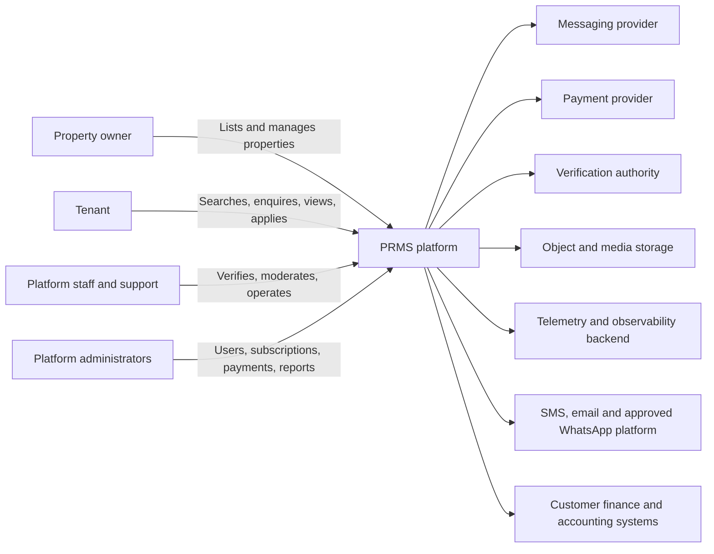
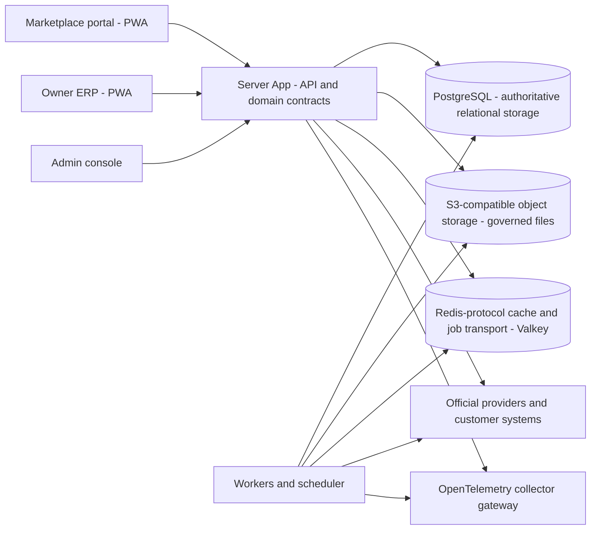
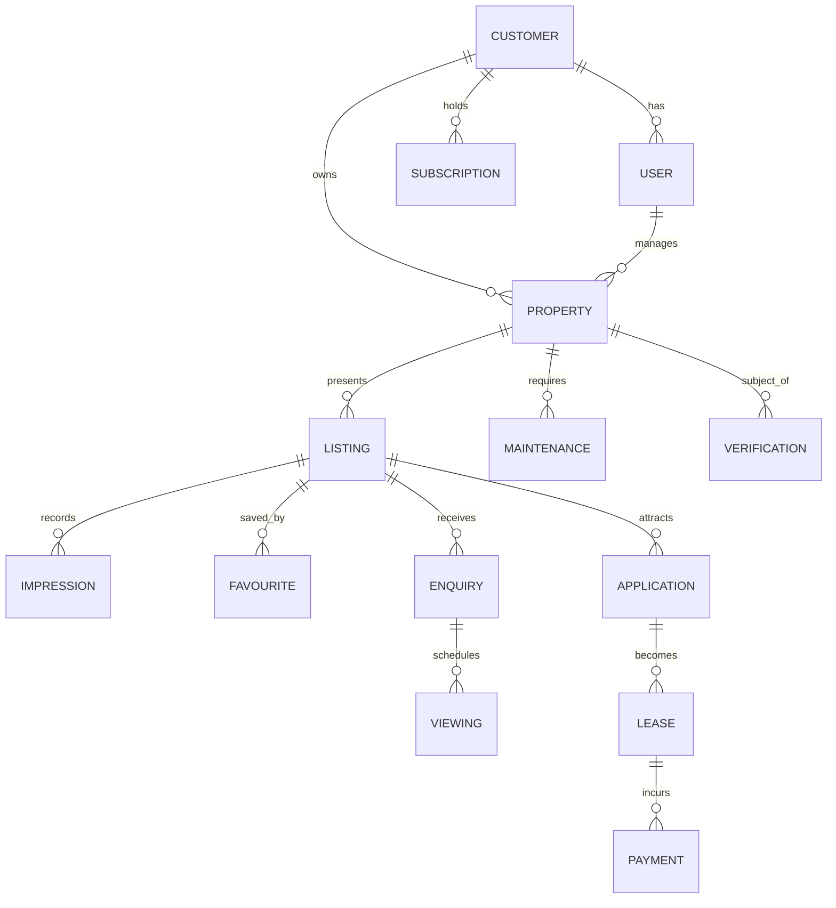

# Architecture and Data

## Executive summary

PRMS is a property-rental marketplace and property-management ERP that removes the traditional agent from the landlord-to-tenant journey. Property owners list their own properties directly, tenants search and apply without agent commissions, and the platform earns revenue through affordable owner subscriptions and optional premium services. The system is built as one controlled product: a modular monolith server, a single client, and one authoritative relational database, with a Shared Platform control plane that all twenty business modules share.

The preferred starting direction is a modular monolith with an API-oriented server, a React/TypeScript client-first surface, PostgreSQL with conditional spatial capability, a Redis-protocol cache and job transport, S3-compatible object storage, and containerised Linux deployment. This direction is approved as the architecture baseline (ADR-0001) with implementation conditions still required before Gate 4 authorises build scope.

This document is the single consolidated architecture and data baseline for the product. It merges the Category 06 technical-architecture set (architecture vision, system context, container and component diagrams, modular architecture specification, bounded context map, shared platform architecture, multi-tenancy strategy, integration architecture, API design standards, API specifications family standard, event catalogue, error-handling strategy, configuration management design, scalability and capacity plan, performance requirements and budgets, technology evaluation matrix, deployment architecture, observability architecture, technical debt register, and the two approved Architecture Decision Records) with the Category 07 data set (conceptual, logical and physical data models, data dictionary, data ownership matrix, master data strategy, data classification policy, data retention and disposal policy, data migration strategy, data quality rules, backup and restore strategy, and reporting data specification).

The architecture is intentionally evidence-based. No production implementation, provider contract, workload benchmark, customer base, operating team, numerical capacity budget, performance threshold, retry value, alert threshold, or recovery target exists yet. All such values are explicitly deferred to measurement gates (Gate 4 provisional, Gate 5 representative) and remain open questions until they are proven. Documents and code in this baseline never claim operational readiness.

## Purpose and audience

The purpose of this document is to provide one authoritative, navigable baseline that consolidates the approved architecture and data decisions for PRMS, so that product, engineering, data, security, privacy, quality, operations, support, commercial and implementation-partner audiences can reference a single architecture and data contract without navigating multiple source category folders.

The audience includes:

- the Delegated Product Owner and Product Sponsor;
- architecture, engineering, integration, API, event, data and reliability owners;
- module owners and module teams for all twenty business modules and the Shared Platform;
- security, privacy, compliance and audit owners;
- quality assurance and delivery/CI/CD owners;
- operations, support and incident-management teams;
- commercial stakeholders and pricing/licence owners; and
- authorised external implementation partners and integrators.

## Scope and exclusions

### Included

- The PRMS system context: people, external organisations, systems and trust boundaries.
- The approved container and component model (client, server, workers, relational storage, object storage, cache and job transport).
- The 21 logical bounded contexts: the Shared Platform and the 20 business modules, including ownership and orchestration boundaries.
- The modular monolith decision (ADR-0001) and the application/persistence architecture (ADR-0002), including implementation conditions, boundary rules, prohibited patterns and extraction criteria.
- The Shared Platform control plane and multi-tenancy strategy.
- The integration architecture: styles, ownership, credentials, idempotency, retries, callbacks, mapping, reconciliation, channel patterns and provider lifecycle.
- The API design standards, the API specifications family standard, the error-handling strategy and the configuration management design.
- The event catalogue: taxonomy, envelope, outbox/inbox publication, delivery, idempotency, compatibility, quarantine, replay, tenancy and observability.
- The observability architecture: purpose separation, signal model, topology, service and signal catalogue, health model, alerting and privacy.
- Scalability and capacity, performance requirements and budgets, technology evaluation outcome, deployment architecture and the technical debt register.
- The conceptual, logical and physical data models, data dictionary and naming conventions.
- Data ownership, master data, classification, retention and disposal, migration, quality, backup and restore, and reporting data responsibilities.

### Excluded

- Exact patch versions, libraries, repository layout, hosting provider, object-store provider, identity product, communications/payment/media/verification providers, monitoring backend, CI/CD product, physical production topology, instance sizes, workload budgets and infrastructure cost. These require controlled specifications or later ADRs.
- Concrete domain API endpoints and schemas; the API register deliberately contains no instances until Gate 4 selects the first audience and use case.
- Numerical timeout, retry, circuit-breaker, alert, SLO, sampling, retention, capacity, RPO and RTO values without measured evidence.
- Detailed Incident Response, Business Continuity and Disaster Recovery procedures (owned by other category baselines).
- Selected providers, provider credentials, connection URLs, exact SDKs, contractual rates and implemented runbooks.
- Event schema files and AsyncAPI documents before the first implementation contract.
- Any claim that the product is implemented, deployed, monitored or operating.

## Architecture principles

The following principles are approved across the architecture and are treated as binding design constraints.

1. **One product, many commercial packages.** Commercial modules are licensed separately, but module count never implies a per-module service, database or application. Modules are logical ownership boundaries inside one modular monolith release train.
2. **Owner decides truth.** Only the owning bounded context accepts a business outcome. Transport, provider, callback, job or queue acknowledgement can never silently become payment success, message delivery, verification, rent, maintenance, accounting or compliance success.
3. **Server-authoritative authority.** Every protected request, job, event consumer, report, import and API resolves customer, organisation, actor or workload identity, entitlement, permission and owner-domain rules on the server. Client state, payload fields and hidden UI controls cannot grant or switch authority.
4. **Customer isolation is a data-safety requirement.** `customer_id` is the top-level isolation boundary in the pooled hosted edition, enforced by application policy and defended in depth by PostgreSQL row-level security with forced default-deny on applicable tables.
5. **Typed, versioned, auditable contracts.** APIs, events, configuration, problems and data all use approved typed contracts that are versioned, immutable once published and tested for compatibility.
6. **Truthful failure.** Accepted, pending, succeeded, rejected, partial, failed, cancelled, compensated, quarantined and unknown remain distinct. Consequential timeouts are unknown until reconciled; they are never assumed successful or failed.
7. **Idempotent recovery.** Retry, replay and redelivery can never repeat a material or external-provider effect.
8. **Minimum data.** Payloads, logs, telemetry, events and provider storage contain only approved minimum fields with approved retention. No secrets, tokens, documents, messages, payment instruments or broad snapshots by default.
9. **Purpose separation.** Business records, domain events, audit evidence, operational telemetry and product analytics stay separate in purpose, authority and retention. IDs correlate them; none substitutes for another.
10. **Evidence before numbers.** Numerical budgets, thresholds and recovery targets are selected from provider contracts, capacity/performance evidence and operational tests, not guessed.
11. **Composable degradation.** Optional module or provider failure is bounded to the affected capability and customer and never corrupts unrelated owners, customers or core records.
12. **Exit is designed.** Mappings, source identifiers, evidence, exports and replacement paths are retained so that providers, technologies and deployments can be replaced without changing domain meaning.

### Vision objectives, boundaries and evaluation constraints

The approved Architecture Vision sets objectives, boundaries, principles and evaluation constraints. It does not select framework versions, providers, cloud, deployment mode, tenancy mode, topology or numbers; those remain governed by the ADRs, matrices, strategies and plans consolidated in this document.

**Objectives.**

- Remove the agent from the rented-property journey so owners and tenants transact directly.
- Let property owners self-serve listings, media, enquiries, viewings, applications, leases, rent and maintenance without agent commissions.
- Let tenants search available properties, apply and transact directly with owners through one platform.
- Monetise through affordable owner subscriptions and optional premium services, not agent commissions.
- Operate three surfaces on one product: the public marketplace, the owner ERP and the administration console.
- Keep all business truth owner-governed, verifiable, isolated per customer and auditable.
- Stay evidence-based: capacity, performance, retry, recovery, availability and cost numbers are proven before they are claimed.

**Boundaries (approved constraints).**

- PRMS is a marketplace and property-management ERP, not a brokerage, bank, payment network, regulator, registrar, mapping source, identity provider or customer accounting system.
- Module and package counts never determine service topology; one product, one modular monolith and one authoritative database are the baseline.
- Providers and infrastructure sit behind governed contracts; replacement is expected to be possible.
- All work is customer/purpose scoped, idempotent, replay-defended, rate/cost aware, observable and reconcilable.
- No implementation, provider, capacity, performance, recovery or operational claim is made until the applicable evidence gates pass.

**Evaluation constraints.**

- Initial market is Zimbabwe, operating in USD, with Harare as the first rollout region for residential rentals; later phases add other cities and commercial property types.
- The first market channel is an accessible, responsive PWA for workplace, telephone and low-bandwidth use.
- The initial operating model must be supportable by a small product team.
- The MVP (`PRMS-MVP-1`) covers the property-marketplace vertical: Shared Platform plus UAM, PRP, MKT, FAV, ENQ, VEW, APL, VER and SUB.

## System context

PRMS removes the traditional agent from the rental journey. The platform connects property owners, tenants and platform staff directly, while providing the services agents used to own: discovery, advertising, enquiries, viewings, applications, lease and document management, rent collection and maintenance coordination.



### People

- **Property owners and landlords** register, subscribe, list properties, manage media, respond to enquiries, accept or decline viewings and applications, issue leases and receive rent, and manage maintenance and documents from one dashboard.
- **Tenants** register, search and filter available properties, save favourites and searches, enquire and message owners, request viewings, submit applications, sign leases, pay rent and raise maintenance requests.
- **Platform staff and support** operate verification, moderation, disputes, support and internal administration surfaces.
- **Platform administrators** manage users, listings, subscriptions, payments, locations, content, configuration and reporting.

### External systems and organisations

- **Messaging, SMS, email and approved WhatsApp platform**: official provider interfaces only. NTF owns dispatch and delivery evidence; ENQ owns conversation and Flow state.
- **Payment providers**: PMT owns payment business states. A provider acceptance, browser redirect or webhook is never by itself a confirmed payment.
- **Verification authorities**: VER owns verification provenance for owners and properties. Identity or document verification is used only when an official authorised interface exists, with a provenance-based manual workflow as the fallback.
- **Object and media storage**: S3-compatible contract for property media and governed file content, with integrity and inspection controls owned by PRP media boundaries and the Shared Platform file controls.
- **Telemetry and observability backend**: purpose-separated operational signals, never a system of record.
- **Customer finance and accounting systems**: controlled domain contracts only; direct writes to either production database are prohibited.

### Trust and data-flow purpose

- Every data flow between PRMS and an external system has a named owning module, a customer and business purpose, a current official interface, and approved security, privacy, commercial and evidence arrangements.
- Providers remain unselected. Every future connection requires official-interface, security/privacy, commercial, sandbox proof, failure/reconciliation, observable cost/limits and exit-plan evidence before activation.
- Scraping, unofficial WhatsApp automation, shared customer credentials and direct production-database integration are prohibited.

### Trust directions and data-flow purpose

| Flow | Direction | Owning module | Trust control |
|---|---|---|---|
| Messaging dispatch and delivery evidence | Outbound to messaging provider | NTF | Official interface only; provider acceptance is not delivery. |
| WhatsApp conversation and Flows | Bidirectional | ENQ (conversation), NTF (delivery) | Flow completion is never the accepted domain outcome. |
| Payment initiation, callbacks and settlement evidence | Outbound/inbound | PMT | Browser redirect or provider acceptance never confirms payment. |
| Verification authority queries and evidence | Outbound/inbound | VER | Provenance recorded; manual workflow when no official interface exists. |
| Property media transfer and inspection | Outbound/inbound | PRP media connector | Last-known is not current; transfer success is not domain acceptance. |
| Object storage of governed files | Outbound | SP file controls and DOC | Integrity, inspection, retention and disposal controls. |
| Telemetry export | Outbound | Observability | Never a system of record; customer-scoped and redacted. |
| Customer finance/accounting export | Outbound | Owning source module | Controlled domain contracts; no direct production-database writes. |

### System-of-record boundaries

PRMS is the system of record for its own product data: customers, accounts, property listings, marketplace activity, enquiries, viewings, applications, leases, rent ledgers, maintenance and verification provenance.

PRMS is **not** and must never become:

- a property brokerage or letting agent;
- a bank, money transmitter or payment network;
- a regulator, registrar or public land authority;
- a source of authoritative mapping/geocoding (it consumes spatial data);
- an identity provider for the public;
- a customer accounting system (it exports governed accounting contracts); or
- a broker of ungoverned third-party services.

## Container and component diagrams

PRMS is delivered as one modular product containerised and deployed as a single OCI-compatible image used in four roles: API, background workers, scheduler, and migration. The same licensed behaviour is composed into three product surfaces.

### Product surfaces

| Surface | Primary audience | Purpose |
|---|---|---|
| Marketplace portal (`www`) | Tenants and the public | Property search, filters, listings, favourites, enquiries, viewing requests, applications and account management. |
| Owner ERP (`app`) | Property owners and landlords | Dashboard, property portfolio and media, applications, viewings, leases, rent, maintenance, documents, reports, subscription and settings. |
| Administration console | Platform staff and administrators | Verification, moderation, users, locations, subscriptions, payments, disputes, content, configuration, analytics and support. |

Each surface composes the same entitled module capabilities; the server remains the single authority regardless of which surface renders a workflow.



### Logical containers

| Container | Responsibility | Authority |
|---|---|---|
| Client application | React/TypeScript PWA client rendering entitled module capabilities; tenant-facing, owner-facing and staff-facing surfaces. | Never authoritative; displays and composes only what the server authorises. |
| Server application | Laravel 13 modular monolith; APIs, application services, aggregate repositories, query handlers, read ports, domain rules, outbox/inbox and reconciliation. | Single authority for business decisions, entitlement and customer scope. |
| Workers and scheduler | Durable jobs, event consumers, imports/exports, reports, provider attempts and scheduled workflows. | Same authority as the API; never bypasses owner rules, audit or isolation. |
| Relational storage | PostgreSQL 18 with conditional PostGIS spatial capability. | Authoritative source state. |
| Object storage | S3-compatible contract for property media, documents, evidence and export files. | Governed file content; a successful transfer is not domain acceptance. |
| Cache and job transport | Redis-protocol capability, Valkey 9.1 default self-hosted candidate. | Non-authoritative; a queue or cache is never the definitive event or state record. |
| Telemetry gateway | OpenTelemetry-compatible ingress for metrics, traces and logs. | Never a system of record; purpose-separated from audit and business data. |

C4 semantics are expressed through ordinary flowcharts. The diagrams define logical roles only; no production nodes, replicas, zones, providers or instance sizes are implied.

## Bounded contexts, modules and ownership

The product consists of one Shared Platform (SP) and twenty business modules: twenty-one logical bounded contexts in total. Each module owns a coherent domain vocabulary, rules, commands, source data, events and evidence. A module is never merely a route, folder or set of tables.

### Module register

| Code | Module | Core responsibilities |
|---|---|---|
| SP | Shared Platform | Customer/organisation context, accounts and workload identities, authentication/session primitives, authorisation and entitlement, common configuration, bounded reference data, audit correlation, file controls, job/import/export control and product operations. Mandatory in every package. |
| UAM | User and Account Management | Tenant, owner and staff accounts, profiles, roles and permissions, account status, verification of identity evidence for platform use, and account lifecycle. |
| PRP | Property Management | Property portfolio, categories, details, features, amenities, media (photos/videos), location, pricing and deposit, lease terms, availability, property documents, verification workflow and property history. |
| MKT | Property Marketplace | Public listing presentation, search, filters, sorting, impressions, listing views, listing status and discovery analytics in support of tenant search. |
| FAV | Favourites and Saved Searches | Tenant saved properties and saved searches, matching-property notifications and shortlists. |
| ENQ | Enquiries and Communication | Property enquiries, owner/tenant messaging, conversation and WhatsApp Flow/menu state, viewing-request intake and human hand-off. |
| VEW | Property Viewing Management | Viewing requests, available slots, scheduling, rescheduling, confirmation, reminders, history and outcomes. |
| APL | Rental Applications | Application submission, applicant information, review, shortlisting, accept/reject, additional information requests and application history. |
| VER | Verification | Owner and property verification cases, provenance of verification evidence, supporting documents, decision and re-verification. |
| SUB | Subscription Management | Plans, subscriptions, entitlements, billing, payments for subscriptions, expiry, renewal, upgrade/downgrade and subscription history. |
| ADM | Administration | Platform administration of users, listings, locations, categories, content, moderation, reported listings, disputes, configuration and audit. |
| LSE | Lease and Agreement Management | Rental agreements, lease templates and clauses, lease start/end, rent and deposit terms, payment terms, renewal, termination, digital signatures and agreement history. |
| PMT | Rent and Payment Management | Payment intents, rent schedules and invoices, payment evidence, allocation, receipts, receivable, refund cases, tenant balances, deposit handling and reconciliation. |
| MTN | Maintenance Management | Maintenance requests, assignment to technicians, cost approval, progress tracking, closure and history. |
| SVC | Service Provider and Contractor Management | Contractor profiles, services, contact details, assigned jobs, job history, costs, ratings and performance. |
| FAD | Featured and Advertising Management | Featured listings, promotion placements, top-listing and homepage promotion purchases, visibility schedules and promotion revenue. |
| NTF | Notification Management | Message templates and channel policy, preferences and consent, dispatch, provider attempt, delivery evidence, suppression, retry and communication cost. |
| LND | Landlord Dashboard | Owner home/ERP orchestration surface: portfolio overview, occupancy, applications, enquiries, rent due, income, expiring leases and navigation. Does not own business truth. |
| RBA | Reports and Analytics | Measure contracts, dashboards and reports for owners and platform; consumes governed data and events. |
| CMP | Complaints, Reports and Disputes | Reported listings, fake/incorrect information, scam attempts, user misconduct, dispute cases and resolution records. |
| DOC | Document Management | Central governed document repository, retention rules execution, lifecycle, evidential disposal and document access. |

### Module operating notes

| Context | Source of truth | Main consumers | Orchestration/position |
|---|---|---|---|
| SP | Customer, identity, entitlement, configuration, audit, files, jobs | All modules | Mandatory control plane; deliberately narrow. |
| UAM | Users, profiles, roles, account status | SP, APL, VEW, PMT, LSE | People foundation. |
| PRP | Properties, media, features, property documents | MKT, VEW, APL, LSE, MTN, VER, FAD | Property foundation of the rental journey. |
| MKT | Listings, impressions, listing views | RBA, tenants | Presents PRP data; does not own the property master. |
| FAV | Saved properties, saved searches | NTF, tenants | Personal shortlists. |
| ENQ | Conversations, Flow/menu state, hand-off | NTF, APL, VEW | Orchestrates channel completion but never the domain outcome. |
| VEW | Viewing requests, slots, outcomes | APL, LSE, NTF | Booking stage of the journey. |
| APL | Applications and decisions | VEW, LSE, PMT, NTF | Application stage of the journey. |
| VER | Verification cases and provenance | UAM, PRP, MKT | Trust signal for owners and properties. |
| SUB | Plans, subscriptions, entitlements | SP, PMT, FAD | Commercial gate for module entitlement. |
| ADM | Platform administration, moderation | All modules | Operator of last resort; follows owner rules. |
| LSE | Leases and agreements | PMT, DOC, VEW, APL | Legal/commercial binding record. |
| PMT | Payment intents, ledger, receipts, refunds | LSE, SUB, RBA | Money-movement truth; channel states remain separate. |
| MTN | Maintenance requests and progress | PRP, SVC, PMT | Property operation. |
| SVC | Contractors and jobs | MTN, PRP | Service fulfilment. |
| FAD | Promotion placements | MKT | Visibility revenue. |
| NTF | Templates, dispatch, delivery evidence | All modules | Communication-effect evidence; not the business reason. |
| LND | Dashboard projections only | Owners | Orchestration surface; consumes, never owns. |
| RBA | Measure contracts and snapshots | LND, ADM, executives | Consumes governed data and events; writes no owned state. |
| CMP | Complaints, reports, disputes, resolutions | ADM, security/legal | Post-fact accountability. |
| DOC | Documents, retention-rules execution | All modules | Governed evidence repository and disposal execution. |

### Package and edition note

A customer may licence one package, a bounded edition or the suite. Each sellable module declares a manifest of dependencies, capabilities, defaults, permissions, entitlements and standalone behaviour so a standalone deployment works without invisible suite settings, and adding a suite module preserves existing local configuration after a conflict/ownership preview. An absent module is disabled or omitted with explicit non-failing behaviour; an unlicensed module's data and capabilities are unavailable even if the client UI were modified.

### Ownership rules

1. Only the owning module changes authoritative state for its domain. Other modules use an authorised command, query, event or approved projection.
2. Shared Platform owns cross-product foundations and deliberately does not absorb module business truth. It never owns a listing, lease, payment, viewing or verification conclusion.
3. A module that merely consumes data (for example RBA) is not the source of that data. RBA consumes snapshots/events and never writes owned state to other modules.
4. Orchestration contexts LND and ENQ coordinate journeys; the Shared Platform connector foundations coordinate reusable connections, mappings and synchronisation jobs. Orchestration correlates outcomes but never fabricates or acquires domain truth.
5. NTF owns dispatch and delivery evidence; it does not own the business reason that generated the message. ENQ owns conversation, Flow/menu and human hand-off state; it does not own enquiry/application content or outcome.
6. Cross-module imports and table access are auto-checked; circular dependencies and shared mutable business models are prohibited.
7. `PRMS-MVP-1` is a vertical property-marketplace outcome using Shared Platform plus UAM, PRP, MKT, FAV, ENQ, VEW, APL, VER and SUB. Other modules activate under their own packages and consumers.

### Module collaboration pattern

Modules collaborate through owner-controlled application commands, queries and domain events:

- **Commands** are requests for another owner to consider a change. They are not accepted as fact until the owner succeeds.
- **Queries** are purpose-specific read contracts returning bounded typed results.
- **Domain events** communicate accepted outcomes without transferring source ownership.

A module may also provide an approved projection for read optimisation. A projection is never authoritative for a command when its freshness or completeness is weaker than the source-owned state.

## Architecture decision records

Two Architecture Decision Records are approved. ADR numbers are never reused. A superseding ADR links to the decision it replaces; the earlier ADR remains in the repository with its history intact.

### ADR register

| ADR | Decision | Status | Review trigger |
|---|---|---|---|
| ADR-0001 | Adopt a Modular Monolith and the Initial Core Technology Stack | Approved at Gate 3 with implementation conditions | Gate 4, failed technology validation, unsupported release, material scale/isolation change, annual review. |
| ADR-0002 | Adopt Application Services, Aggregate Repositories and Dedicated Read Queries | Approved as mandatory application/persistence architecture, subject to Gate 4 proof | Gate 4 vertical slice, failed fitness/persistence proof, material performance defect, domain-boundary change. |

### ADR-0001 — Modular monolith and core stack

**Status: Accepted at Gate 3 with implementation conditions.** The architecture and core technology baseline is formally selected for Stage 4 delivery readiness. It does not authorise feature development, procurement, deployment or production operation; Gate 4 remains the build-readiness authority.

The decision prevents the module catalogue from being interpreted as one service, database or application per sellable module, and prevents framework defaults from becoming unreviewed product decisions.

**Options considered.** A modular monolith with one primary relational database (selected); microservices per sellable module (rejected as the default, available for measured extraction); independently deployable modular applications sharing a platform API (rejected as default); and an unstructured framework-only monolith (rejected).

**The core stack.**

| Layer | Decision |
|---|---|
| Server application | Laravel 13 modular monolith on PHP 8.5. |
| Client | Client-rendered React 19.2 and TypeScript 6.x SPA/PWA. |
| Build runtime | Node.js 24 LTS for frontend tooling only. |
| Relational state | PostgreSQL 18, current approved minor. |
| Spatial capability | PostGIS 3.6 only for approved spatial workloads. |
| Cache and jobs | Redis-protocol capability with Valkey 9.1 as the default self-hosted candidate; database-backed fallback where appropriate. |
| Files | S3-compatible object-storage contract; provider deferred. |
| APIs | HTTPS REST/JSON with a tooling-compatible approved OpenAPI specification. |
| Async collaboration | Durable jobs and semantic domain events, using transactional publication where reliability requires it. |
| Deployment packaging | OCI-compatible images on supported Linux. |
| Observability | OpenTelemetry-compatible instrumentation; backend deferred. |
| Native client | None in `PRMS-MVP-1`; Flutter remains evidence-gated. |

**Boundary rules.**

1. A module owns a coherent domain vocabulary, rules, commands, source data, events and evidence, not merely a route or folder.
2. Only the owning module changes authoritative state. Other modules use an authorised command, query, event or approved projection.
3. Shared Platform owns cross-product foundations and must not absorb module business truth.
4. UI composition and hidden controls do not enforce entitlement; the server, jobs, events, reports, imports and APIs enforce it independently.
5. Cross-module imports, table access and dependency direction are checked automatically. Circular dependencies and shared mutable business models are prohibited.
6. Jobs and events preserve customer, actor or workload identity, purpose, entitlement, correlation, idempotency and version context.
7. PostgreSQL is authoritative; Valkey, client state, search, telemetry and analytical projections cannot override source truth.
8. Infrastructure and provider products sit behind governed contracts where replacement is a credible requirement.

**Version and product rules.**

- Use the current approved patch within the selected release line after compatibility, security and rollback checks.
- Refresh support and licensing evidence before implementation and annually.
- Lock resolved dependencies and generate an SBOM before release.
- Separate a Redis-protocol requirement from a Redis product or licence decision.
- Do not introduce React Server Components, a Node domain server, Flutter, Kubernetes, Kafka, dedicated search, a warehouse, a workflow engine or an external IAM product without a separate ADR.
- Do not claim portability, performance, recovery or compatibility until the applicable proof has passed.

**Implementation conditions (Gate 4 build baseline).**

- The Modular Architecture Specification defines package, dependency, contract, data and entitlement enforcement.
- Representative architecture tests prove that prohibited cross-module imports and writes fail.
- The Shared Platform Architecture and Bounded Context Map reconcile ownership.
- The Multi-Tenancy Strategy proves customer scope across data, files, jobs, cache and telemetry.
- PostgreSQL concurrency, migration and restore proofs pass.
- Valkey passes Laravel cache, lock, rate-limit and queue compatibility and failure tests.
- React proves entitlement composition, accessibility, error and degraded-connectivity behaviour.
- Object-storage security, lifecycle, recovery and exit tests pass for the selected provider.
- The resolved stack passes vulnerability, licence and SBOM controls.
- Named maintainers and operating ownership are approved.
- Gate 4 explicitly authorises implementation scope.

**Extraction criteria.** A module or platform capability may become an independently deployed service only when an ADR demonstrates a material driver (independent team and release ownership, different availability or isolation, measured scaling constraint, separately deployable customer requirement, specialist runtime need or unacceptable blast radius) and defines data migration, contracts, compatibility, identity, observability, deployment, recovery, cost, rollback and support ownership. No extraction is approved for architectural fashion, module count, hypothetical scale or commercial packaging.

### ADR-0002 — Application services, aggregate repositories and dedicated read queries

**Status: Accepted as the mandatory PRMS application and persistence architecture, subject to Gate 4 implementation proof.**

This decision makes the application and persistence boundary mandatory at business aggregates and use cases, while giving reads a separate controlled optimisation path. A generic service/repository pair per table is rejected as mechanical ceremony; direct framework access is rejected because it erodes boundaries; full CQRS with separate operational stores is rejected as the initial default.

**Command and write path.** Transport adapters authenticate and contextualise. An application service represents one consequential command/use case: server-side authority checks, domain rule coordination, the coherent transaction and concurrency boundary, repository-port invocation, and required audit/event intent. Domain objects and policies contain business invariants and have no Laravel, Eloquent, HTTP, queue or provider dependency. Aggregate repository ports are owned by the application/domain boundary, use domain language, and never expose Eloquent models, query builders or generic table CRUD. Infrastructure adapters implement the port and remain private to the owning module. External provider work stays outside long database transactions; follow-up uses an outbox, job or event plus reconciliation. Direct Eloquent or SQL mutation from controllers, commands, jobs, listeners, policies or application services is prohibited.

**Query and read path.** Non-trivial reads use a named query handler and purpose-specific read port. Read adapters may use Eloquent projections, Laravel Query Builder or reviewed parameterised SQL when that is the clearest safe implementation. Reads return immutable typed DTOs/projections, never live Eloquent models or query builders across boundaries. Every query has explicit customer, entitlement, permission, purpose, filtering, sort, page/limit and freshness semantics. Critical queries require representative PostgreSQL plan, index, row, buffer/IO, lock and timing evidence.

**Prohibited patterns.**

- controllers, transport jobs or React-facing resources querying or saving Eloquent directly;
- application services executing command-side Eloquent or raw SQL instead of using the aggregate repository port;
- a generic base repository exposing table-shaped all/find/create/update/delete or arbitrary filter operations across domains;
- one repository interface per model generated without aggregate or query evidence;
- repositories returning Eloquent models, relations or builders to callers outside the infrastructure adapter;
- read workflows forced through write aggregates when a bounded projection is safer and measurably more efficient;
- model events/observers as the sole source of material business transitions or enterprise audit evidence; and
- fakes or mocks presented as proof of PostgreSQL isolation, constraints, transactions, locks or query performance.

**Audit integration.** Protected application services and query handlers create audit intent at the authoritative decision, change or sensitive-access boundary, including approved actor, authority, customer, purpose, target, outcome, correlation and reason context, redacted before persistence. A protected business change and its required audit/event record commit atomically or use a transactional outbox plus monitored reconciliation. Model observers may provide defence-in-depth technical detection only.

**Gate 4 proof.** A representative vertical slice must prove compliant command/read flows, failing architecture checks for violations, aggregate repository contract tests and real PostgreSQL integration tests covering constraints, transactions, RLS/customer isolation, concurrency and rollback; a representative query handler with authorisation, bounded result shape, N+1 avoidance and captured plan evidence; expected redacted audit evidence; approved dependency injection/module composition; and actionable final-revision evidence in CI.

## Shared Platform architecture

The Shared Platform (SP) is the mandatory control plane present in every package. It is deliberately narrow: it owns foundations, not business outcomes.

### What SP owns

| Component | Responsibility |
|---|---|
| Customer and organisation context | The customer as the contractual data boundary; operating scope such as branch or legal entity references used for authorised routing. |
| Accounts and workload identities | Human accounts (tenants, owners, staff) and machine/workload identities with scopes and lifecycle. |
| Authentication/session primitives | Login, sessions or tokens, MFA policy hooks and reauthentication controls. |
| Authorisation (authZ) | Roles, permissions, policies and resource-scope resolution. |
| Module entitlement | Which modules/capabilities a customer's subscription legitimately activates; entitlement never exists as a client-side flag. |
| Common configuration | Registry-defined typed, scoped, versioned configuration; safe defaults; publication and snapshots. |
| Bounded reference data | Governed reference families (e.g. locations, property categories) under product control. |
| Audit correlation | Protected accountability records and correlation for supported actions. |
| File controls | Governed upload/intent, integrity, inspection, retention and access for shared file operations. |
| Job/import/export control | Reusable execution, checkpointing and reconciliation primitives where justified. |
| Product operations | Feature-release controls, platform policy and operator capabilities. |

### Enforcement model

Every protected request and every background action resolves customer, organisation, actor or workload, entitlement and permission on the server. The React application shell composes entitled capabilities, but hidden UI state is never authority. A user of an unlicensed module cannot reach its data even if the UI were modified.

SP connector foundations provide reusable connector, endpoint, mapping, synchronisation-job and transport-reconciliation operations for multiple approved connections. They are not a mandatory enterprise service bus and never absorb specialised domain or channel policy. A domain-owned adapter is used when the protocol and lifecycle are specific to that domain.

## Multi-tenancy strategy

The initial hosted edition is a pooled product on pooled PostgreSQL. Customer is the contractual data boundary, not branch, legal entity, property group or user.

| Aspect | Approved approach |
|---|---|
| Product mode | Pooled hosted product; customers share the deployment and database. |
| Isolation boundary | `customer_id` is the top-level isolation key across relational data, files, jobs, queue entries, cache keys, event routing and telemetry attribution. |
| Defence in depth | Application policy is the primary control; PostgreSQL row-level security (RLS) is enabled and forced with default-deny on applicable tables. Runtime database users are not superusers and do not carry `BYPASSRLS`. |
| Derived entities | Branches, legal entities, property groups and routine users are not automatically tenants. They are scoped business references within a customer. |
| Purpose-driven routing | Operating-scope references (branch, location) appear only when the workflow legitimately needs them, never as isolation. |
| Dedicated hosted | Self-hosted/dedicated deployments are an approved future edition option, not the current baseline. If offered, the packaged edition defines its own isolation contract. |
| Not a licence to leak | Any direct-database or cross-customer shortcut is prohibited; RLS is defense in depth, not a replacement for correct application ownership. |

Customer scope always originates from trusted owner context: authenticated identity plus approved relationships. A payload, query, header or event field named with a customer identifier can never grant or switch authority.

## Integration architecture

PRMS integrates with external providers and customer systems through owner-defined ports and purpose-specific adapters. The owning business module validates intent and determines the business outcome; the integration boundary owns authentication, transport, mapping, attempts, callbacks, rate limits, provider evidence and reconciliation.

### Integration principles

1. **Domain owner decides truth:** transport cannot accept a business outcome on the owner's behalf.
2. **Official interfaces only:** provider access follows authorised APIs, webhooks, files or devices and applicable terms.
3. **Purpose-specific adapters:** one provider SDK/client does not become a universal business abstraction.
4. **Customer and credential isolation:** every connection, request, callback and cost is attributable to a customer and purpose.
5. **Durable uncertainty:** timeout and partial failure become unknown/pending until reconciled, never assumed success/failure.
6. **Idempotent boundaries:** repeated requests, callbacks and jobs do not duplicate accepted business state.
7. **Minimum data:** payloads, logs and provider storage contain only approved fields and retention.
8. **Observable limits:** quotas, cost, latency, rejection, backlog, gaps and credential health are visible.
9. **Manual fallback is legitimate:** safe import/export or human action is better than unofficial automation.
10. **Exit is designed:** mappings, source identifiers, evidence, exports and replacement paths are retained.

### Responsibility boundaries

| Boundary | Owns | Does not own |
|---|---|---|
| Source business module | Intent validation, business state, acceptable outcomes, correction, user presentation, domain reconciliation. | Provider credentials, generic HTTP retry or transport mapping unless it owns the specialised adapter. |
| Purpose-specific adapter | Provider protocol, authentication, mapping, attempt, callback verification, quotas, provider evidence. | Source-domain eligibility, payment allocation, delivery reason, verification conclusion, accounting acceptance. |
| NTF | Template/channel policy, preference, dispatch, provider attempt, delivery evidence, suppression, retry, communication cost. | Message-requesting domain outcome or ENQ conversation/Flow state. |
| ENQ | Official WhatsApp conversation, Flow/menu state, automation policy, hand-off. | NTF delivery, APL outcome, VEW booking, PMT payment or any other domain transaction. |
| Media connector | Provider mapping, transfer/integrity/inspection observations and gaps. | PRP property/media master, suitability, occupancy or safety conclusion. |
| SP connector foundations | Reusable connector, endpoint, mapping version, synchronisation job, conflict and transport reconciliation. | Business facts transported or specialised channel/provider policy owned elsewhere. |
| Shared Platform | Customer/workload identity, entitlement, secret-reference/file/job/audit foundations. | A generic integration domain, provider outcome or connection-specific business rule. |

### Approved integration styles

| Style | Use when | Required safeguards | Avoid when |
|---|---|---|---|
| Synchronous REST/JSON | Immediate validation/query or bounded command needs a timely authoritative response. | TLS, scoped identity, timeout, idempotency where changing, safe errors, correlation, no blind retry. | Long-running, fan-out, provider-uncertain or high-volume work. |
| Durable asynchronous request | Work can complete later or provider outcome is delayed. | Outbox/job, stable context, idempotency, attempts, retry budget, status/reconciliation, operator recovery. | User requires immediate final authoritative answer and the dependency can guarantee it. |
| Webhook/callback | Provider pushes a later outcome. | Credential/signature verification, replay defence, durable receipt, dedupe, correlation, schema/version, owner revalidation. | Provider cannot authenticate or has no reliable retry; use polling/manual reconciliation. |
| Polling | Provider exposes status but no reliable callback, or gaps must be reconciled. | Bounded cadence, cursor/checkpoint, rate/cost limits, overlap/dedupe, stale/gap visibility. | It would create excessive load/cost or violate terms. |
| Batch file/import/export | No official live API, bulk migration/reconciliation or customer-controlled exchange. | Protected transfer, schema/version, checksum, preview, item outcomes, provenance, retention, rerun safety. | An ungoverned spreadsheet would bypass validation or become source truth. |
| Telemetry ingestion | Approved device/provider observations arrive at volume. | Device/customer binding, time/sequence, accuracy/quality, gaps, dedupe, retention, bounded access. | Purpose/privacy/device evidence is absent. |
| Manual task (Separate Ways) | Automation is unavailable, unsafe or uneconomic. | Owner workflow, evidence, dual control where needed, expiry, reconciliation. | Manual work would fabricate an authority/provider result. |

GraphQL, direct database access, screen scraping, shared folders without transfer controls and an initial enterprise message broker are not approved default integration styles.

### Connection configuration and credentials

Each connection records customer, owning module and named business purpose; provider/system and product/API/environment; connection/sender/device/account identifiers; secret/key/certificate reference; granted scopes, audiences, endpoints and callbacks; API/schema/provider version and compatibility window; enabled operations and data classifications; region/residency/subprocessor and retention facts; quotas, rate limits, cost model and alert budgets; callback verification and replay controls; timeout/retry/circuit/polling/reconciliation policy; sandbox/production status; owner, support contact and lifecycle dates; and a replacement/export/decommission plan.

Credentials use the strongest provider-supported workload method appropriate to risk: mutual TLS, private-key/signed client assertion, OAuth client credentials or authorisation code with current security practice, scoped API key or verified signature. Basic/shared passwords are last-resort exceptions. OAuth implicit and resource-owner-password patterns are not introduced. Tokens are audience/scope/customer/purpose restricted, stored only in the protected secret boundary, redacted from logs, and rotated with overlap/revocation. One customer never reuses another customer's merchant, sender, media or verification credential.

### Outbound request lifecycle

The generic lifecycle: requests are validated by the owner; prepared and mapped; submitted to the provider; and then become provider-accepted, failed or unknown. Provider-accepted later resolves to confirmed or failed; unknown resolves by callback or authoritative reconciliation; definitive business rejection requires corrected intent, never silent replay. NTF distinguishes queued/submitted/accepted/delivered/failed/suppressed/unknown; PMT distinguishes payment initiation/provider acceptance/confirmation/settlement/reversal/reconciliation.

### Callback and webhook lifecycle

Inbound callbacks: accept only the configured endpoint/method over protected transport; capture bounded metadata; authenticate the exact provider connection; validate timestamp/nonce/replay window and body digest; resolve customer from authenticated connection plus correlated identifiers; schema/version validate and reject oversized content; durably record receipt/deduplication before acknowledging when provider retry semantics require it; translate through the adapter/ACL; invoke the owner idempotently; record provider, transport and domain outcomes separately; and quarantine/unmatch/alert unknown events. A `2xx` acknowledgement means PRMS accepted the receipt for processing, not that the domain accepted it.

### Retry, rate, cost and reconciliation

Outcomes are classified: validation/authentication/business rejection is not blindly retried; rate limits honour retry guidance with jitter/backoff; timeouts become unknown and reconcile before a non-idempotent repeat; confirmed transient failures retry only within attempt/time/cost budget; unsupported versions quarantine and alert; provider outage degrades or offers manual fallback; expired business intent is cancelled. Retry budgets are bounded and jittered to avoid storms. Limits are tracked per provider, customer, account, operation and window; PRMS applies fair-use throttling before provider rejection and prevents one customer consuming a shared master-account quota. Provider cost is attributed to customer/module/request without logging protected content. Reconciliation compares PRMS source state, recorded attempts/callbacks and authoritative provider statements; exceptions have customer, owner, consequence, age, evidence, assigned operator, permitted actions and resolution audit.

### Channel and domain patterns

- **SMS/email:** source modules request a purpose and message data from NTF; NTF selects approved template/channel/sender, applies preference/consent/suppression, submits through an adapter and owns delivery evidence/cost. Provider acceptance is not delivery. Replies, bounces, complaints and unsubscribes update NTF policy without changing the requesting transaction.
- **WhatsApp and Flows:** only the official WhatsApp Business Platform/provider path is allowed. NTF owns sender, templates, dispatch, delivery evidence, preferences and cost. ENQ owns conversation session, menu/Flow version, expiry and human hand-off. Domain owners validate each business operation. Flow completion is never the accepted domain outcome.
- **Payments:** PMT owns payable intent, payment evidence, allocation, receipt, receivable and refund case. The adapter owns provider initiation, identifiers, callbacks and settlement evidence. Initiated, authorised, captured/confirmed, settled, failed, expired, reversed and unknown remain distinct. Webhook absence triggers reconciliation; browser redirect alone never confirms payment.
- **Property media:** PRP authorises the listing/media relationship; the media connector records timestamp, sequence, integrity, inspection results and gaps. Last-known is not current. Provider data cannot mark occupancy, property suitability or safety.
- **Authorities and verification:** VER owns the verification case and provenance. Official authority integration only when authorised and current; otherwise a provenance-based manual workflow. No scraping or fabricated verification state.
- **Customer finance/HR/other systems:** source modules export or accept controlled domain contracts; SP connector foundations may manage reusable connections/mappings/jobs. Direct writes to either production database are prohibited.

### Provider lifecycle and test strategy

Provider selection evaluates official status, supported countries/features, security/authentication, privacy/subprocessors/residency, availability communication, sandbox quality, limits, cost, support, contract/liability, version/deprecation, export and replacement. Onboarding proves sandbox and controlled production cases, credential rotation, failure/retry, reconciliation, cost and support escalation. Decommission stops new work, resolves pending attempts, exports evidence/configuration, revokes credentials/callbacks, disposes provider data and verifies replacement/fallback.

Integration test families cover contracts, authentication, idempotency, ambiguity, ordering/gaps, rate/circuit, mapping, tenancy, privacy, reconciliation, exit and channel/domain state separation. Sandboxes are necessary but not sufficient; initial live verification uses bounded approved accounts and cannot become launch evidence before Gate 5.

### Integration requirements

| ID | Requirement | Priority |
|---|---|---|
| INA-001 | Every integration shall have one owning business module and named purpose. | Must |
| INA-002 | Integration transport shall not own or fabricate domain business outcomes. | Must |
| INA-003 | Official authorised interfaces and terms shall be required. | Must |
| INA-004 | Scraping, unofficial WhatsApp automation and direct production-database integration shall be prohibited. | Must |
| INA-005 | Purpose-specific ports/adapters shall isolate provider vocabulary and lifecycle. | Must |
| INA-006 | Shared Platform connector foundations shall be used only for reusable connector/mapping operations and shall not absorb domain rules. | Must |
| INA-007 | Every connection shall be customer, module, provider, environment and purpose scoped. | Must |
| INA-008 | Connection configuration shall record version, credentials reference, scopes, data, limits, cost, retry, reconciliation and exit. | Must |
| INA-009 | Production connection activation shall require sandbox and controlled production evidence. | Must |
| INA-010 | Credentials/tokens shall be minimum-scope, protected, redacted, rotated and revocable. | Must |
| INA-011 | OAuth integrations shall follow current security best practice and shall not use implicit/password grants. | Must |
| INA-012 | Customer-controlled values shall not select arbitrary outbound endpoints. | Must |
| INA-013 | Outbound mutations shall have stable customer/provider/operation idempotency. | Must |
| INA-014 | Provider attempts and domain outcomes shall be persisted separately. | Must |
| INA-015 | Timeout/connection loss after submission shall produce unknown pending state until reconciliation. | Must |
| INA-016 | Definitive business/authentication failures shall not be blindly retried. | Must |
| INA-017 | Transient retries shall be bounded, jittered, rate-aware, idempotent and cost-aware. | Must |
| INA-018 | Expired business intent shall not be submitted after delayed recovery. | Must |
| INA-019 | Callbacks shall authenticate the exact provider connection and defend against replay. | Must |
| INA-020 | Callback customer scope shall derive from authenticated connection plus correlated ownership. | Must |
| INA-021 | Callback receipts shall be durably deduplicated before success acknowledgement where retry semantics require it. | Must |
| INA-022 | Callback acknowledgement shall not mean domain acceptance. | Must |
| INA-023 | Unsupported/unmatched callbacks shall be quarantined, observable and reconcilable. | Must |
| INA-024 | Consumers shall handle duplicate, late, out-of-order and missing provider events. | Must |
| INA-025 | Polling shall use bounded cadence, checkpoint, overlap/dedupe, quotas and gap visibility. | Must |
| INA-026 | Batch transfers shall use protected transport, schema/version, checksum, preview, item outcomes and rerun safety. | Must |
| INA-027 | Mapping shall preserve source/provider identifiers and mapping version. | Must |
| INA-028 | Unknown enums, precision, time-zone and lossy conversions shall not be silently coerced. | Must |
| INA-029 | Provider payloads/logs shall contain only approved minimum data and retention. | Must |
| INA-030 | Provider limits, cost, latency, rejection, backlog, gaps and credential health shall be observable. | Must |
| INA-031 | Shared provider quotas shall have customer-attributed fairness and exhaustion controls. | Must |
| INA-032 | Reconciliation shall compare PRMS source, attempts/callbacks and authoritative provider evidence. | Must |
| INA-033 | Operators shall resolve exceptions through owner-controlled actions, not edit success state directly. | Must |
| INA-034 | NTF shall own SMS/email/WhatsApp dispatch and delivery evidence. | Must |
| INA-035 | ENQ shall own WhatsApp conversation/Flow/hand-off while NTF owns delivery. | Must |
| INA-036 | Domain modules shall own enquiry/application content, validation and outcomes; ENQ shall not fabricate them. | Must |
| INA-037 | PMT shall own payment business state; browser redirects and provider acceptance shall not confirm payment. | Must |
| INA-038 | The media connector shall own transfer/integrity/inspection gaps while PRP owns property/media master and suitability. | Must |
| INA-039 | VER shall preserve verification provenance and shall support safe manual workflow when no interface exists. | Must |
| INA-040 | Provider credentials, attempts, costs and callbacks shall preserve customer isolation. | Must |
| INA-041 | Integration events/jobs shall preserve customer, owner, purpose, correlation and trace context. | Must |
| INA-042 | Provider outage shall expose truthful degradation/manual fallback according to workflow criticality. | Must |
| INA-043 | Provider/API version and terms changes shall trigger compatibility/security/privacy/commercial review. | Must |
| INA-044 | Provider decommission shall reconcile pending work, export evidence/data and revoke credentials/callbacks. | Must |
| INA-045 | Provider replacement shall not require changing source-domain business meaning. | Must |
| INA-046 | Contract, authentication, failure, idempotency, mapping, tenancy, privacy, reconciliation and exit tests shall be automated where possible. | Must |
| INA-047 | Provider-specific SDKs shall be dependency/licence/vulnerability controlled and isolated behind adapters. | Must |
| INA-048 | Numerical timeouts, retry/rate/circuit budgets shall remain provider/workflow-specific and evidence-based. | Must |
| INA-049 | API/event detailed schemas shall remain governed by API Specifications and Event Catalogue. | Must |
| INA-050 | This architecture shall not claim provider availability or authorise production before Gate 5. | Must |

## API design standards

PRMS APIs are owner-controlled HTTPS REST/JSON contracts. Resource and command semantics are consistent; JSON uses lower camel case; identifiers are opaque strings; timestamps are RFC 3339-compatible with explicit offsets; money always carries currency; and list endpoints use stable cursor pagination by default. Every protected operation resolves server-authoritative customer, actor/workload, entitlement, permission and owner-domain rules. Contracts are described with a validated OpenAPI release; OpenAPI 3.2 is current on the evidence date, but each API adopts only the version fully supported by the selected toolchain, declared per API and never silently upgraded.

### API classes

| Class | Consumer | Default posture |
|---|---|---|
| First-party application API | PRMS React/PWA and approved future client. | PRMS origin/private application boundary; full server authority required. |
| Customer integration API | Approved customer workload/system. | Explicit registered client and scopes; disabled until entitlement, contract, credentials, quotas and support are approved. |
| Provider callback API | Official provider/authority. | Purpose-specific endpoint; authenticated, replay-protected, durable receipt, owner revalidation. |
| Product/operator API | Deployment/support automation. | Separate management/control boundary; JIT least privilege and evidence. |
| Public discovery endpoint | Deliberately unauthenticated low-risk information, if approved. | Minimum data, abuse controls, cache/privacy review. |

An endpoint belongs to one audience. Reusing an operator/provider endpoint for browser convenience is prohibited.

### Contract-first lifecycle

Identify the owning context, audience, outcome and authorised consumers; trace requirements and classification; model resources, commands, states, errors, idempotency and concurrency; write/approve the OpenAPI contract before implementation; run structural/lint/security/compatibility checks; generate or validate types only from the approved contract; implement owner behaviour and contract tests; verify authZ/tenancy/abuse/failure/observability; and publish version, support and change/deprecation ownership. Generated documentation is not the source of truth; bidirectional conformance detects drift.

### Base URL, methods and status

Protected product APIs use HTTPS and a major-version path such as `/api/v1`. Path segments are lowercase plural nouns (`/properties`, `/viewings`, `/invoices`); IDs are path parameters. Domain transitions use explicit auditable command subresources (for example `POST /api/v1/viewings/{viewingId}/cancellations`). RPC-style action verbs, database table names and UI route names are prohibited. A breaking change requires a new major version or a coordinated consumer migration.

| Method | PRMS use | Safety/idempotency expectations |
|---|---|---|
| GET | Retrieve one resource, collection, operation state or report metadata. | Safe; no domain state change, dispatch, audit approval or hidden job creation. |
| HEAD | Metadata/existence where specifically useful and non-leaking. | Same authorisation as GET; no body. |
| POST | Create, command/action, complex search, or start async work. | Not inherently idempotent; PRMS idempotency required where retry can duplicate effect. |
| PUT | Full replacement at a known URI, rarely used. | Idempotent; complete replacement semantics. |
| PATCH | Partial update using one explicitly declared patch media/schema. | Concurrency control when lost update matters; omitted differs from null. |
| DELETE | Request deletion/termination where domain/retention permits. | Does not imply physical erasure; repeated calls return stable outcome. |
| OPTIONS | Protocol/CORS discovery where approved. | Does not disclose protected capabilities beyond policy. |

Status codes retain standard semantics: `200` success with representation; `201` created with Location; `202` durable asynchronous acceptance with an operation resource; `204` done with no representation; `304` conditional retrieval; `400` malformed; `401` authentication; `403` known-but-forbidden; `404` not found or concealed; `409` conflicting domain/idempotency state; `410` deliberately gone; `412` stale precondition; `413` too large; `415` unsupported media; `422` field/domain validation; `429` throttling; `500` unexpected; `502` invalid upstream response; `503` temporarily unavailable; `504` gateway deadline with possibly unknown business effect. Ordinary API failures never return HTTP 200 with a failure envelope.

### JSON representation conventions

- `application/json` UTF-8; lower camel case property names.
- Opaque case-sensitive identifier strings; clients never parse meaning from them.
- Amounts may use decimal strings plus currency where precision/range could otherwise be lost.
- RFC 3339-compatible instants with `Z` or explicit offset; local dates `YYYY-MM-DD`; wall times carry zone/context separately.
- Money: amount, ISO 4217 currency and scale/rounding semantics.
- Booleans are true/false. Absent means not supplied; `null` only with documented domain meaning.
- Enumerations are stable machine values, not display labels.
- Representations expose authorised contract fields, never a full persistence model.

### Identity, authority and authorisation

Customer scope is resolved from the authenticated account/workload and approved context; a payload/query/header customer ID cannot grant or switch authority. Every list, count, search, relationship and subresource applies customer and organisational scope before retrieval; field-level restrictions apply before serialization. A cross-customer resource is returned as forbidden/not-found according to non-disclosure policy, never as a redacted object proving existence. If OAuth is used, it follows current security BCP with PKCE/authorisation code where applicable, minimum audience/scope, token rotation/revocation and no implicit/password grant.

### Idempotency and concurrency

Duplicate-risk POST operations accept an `Idempotency-Key` (or documented equivalent) scoped by customer, client/actor, operation and major version, with a stored canonical fingerprint and original safe result; reuse with a different request is rejected; concurrent duplicate keys serialise so only one transition occurs; returning the stored result never re-runs provider calls, notifications or jobs. Resources vulnerable to lost updates return a strong version/ETag and require `If-Match`; a stale precondition is `412`, a current conflicting state is `409`. Wildcard update and last-write-wins are prohibited for financial, viewing, rent, compliance, entitlement and other consequential state.

### Pagination, sorting, filtering and search

Cursor pagination is the default for mutable/large collections. Cursors are opaque, integrity-protected, customer/query-specific and expire/version safely. Sorting is deterministic with a unique tie-breaker. Each endpoint allow-lists filters and sortable fields; unknown filters/sorts are rejected rather than ignored. Query complexity, page size and export thresholds are bounded. Offset pagination is allowed for small stable administrative lists only with documented drift/cost. Filtering and aggregation occur after authorisation/customer scope.

### Asynchronous operations

Long-running import, export, report, provider, batch or reconciliation work returns `202` after durable acceptance plus `Location` to an operation resource with state queued/running/succeeded/partiallySucceeded/failed/cancelled/expired as applicable, item summary and safe problem references. `202` is not completion. Cancellation is best-effort with an explicit final outcome; optional callbacks do not remove the operation resource.

### Errors, files, caching, rate limits, CORS and webhooks

Errors use `application/problem+json` (RFC 9457) with stable PRMS problem types under a controlled documentation namespace, safe `title`/`detail`, `instance`/correlation and bounded field `errors` with JSON Pointer locations. File upload is a controlled workflow: create upload intent/metadata, transfer, complete integrity/inspection, then associate through the owner module; a successful upload is not an accepted business document. Downloads reauthorise current access. Protected responses are private/no-store or vary on safe identity; shared intermediaries cannot cache authenticated representations by accident. Rate/abuse controls are customer, client, actor, endpoint and consequence attributed, with `429` and truthful retry guidance; high-consequence commands may have lower limits. CORS is deny-by-default with exact origin allow-lists; wildcard-with-credentials is prohibited. Outbound customer webhooks (if offered) are entitlement/purpose/event scoped, HTTPS, signed raw-body/timestamp/key-ID, replay-defended, bounded-retry, with secret shown once and protected; payloads carry minimum event references, and consumers fetch current state from the API; `2xx` acknowledges receipt, not downstream processing.

### Versioning, compatibility and deprecation

Compatible changes may add optional fields/resources/problem types or broaden documented enums only when consumers already tolerate unknowns. Removing/renaming fields, changing requiredness/type/meaning, narrowing values, changing authorisation/customer scope, altering default sort/filter or making synchronous work asynchronous are breaking unless a versioned migration preserves consumers. Deprecation uses current `Deprecation` guidance, documented replacement, consumer telemetry, notice/support window and `Sunset` on approval. Compatibility checks compare approved OpenAPI revisions automatically; runtime, server, client and OpenAPI conformance are contract-tested.

### OpenAPI requirements

Every API specification declares: OpenAPI version and API title/version/audience/owner; server variables without secrets; operations with stable operation IDs; authentication/security schemes and scopes; parameters/schemas/formats/limits; success/error/problem/async/rate/conditional responses; synthetic examples; idempotency/concurrency/pagination/filtering semantics; deprecation/replacement; webhooks/callbacks where supported; and external documentation plus requirement trace. Generated code is reviewed. Numerical page/rate/timeout/size limits are set per workflow from evidence. No API is production-ready before security, privacy, support and Gate 5 evidence.

### API requirements

| ID | Requirement | Priority |
|---|---|---|
| ADS-001 | Every API operation shall have one owning context, audience, purpose and accountable owner. | Must |
| ADS-002 | APIs shall use HTTPS REST/JSON and approved HTTP semantics. | Must |
| ADS-003 | Protected product APIs shall use one major path version such as `/api/v1`. | Must |
| ADS-004 | Paths shall use lowercase plural resource nouns and opaque identifiers. | Must |
| ADS-005 | Domain transitions that do not map to CRUD shall use explicit auditable command resources/actions. | Must |
| ADS-006 | GET/HEAD shall not create protected domain side effects. | Must |
| ADS-007 | HTTP methods and status codes shall retain standard semantics. | Must |
| ADS-008 | Ordinary API failures shall not return HTTP 200 with a failure envelope. | Must |
| ADS-009 | JSON properties shall use lower camel case and approved explicit formats. | Must |
| ADS-010 | IDs shall be opaque strings and shall not confer type or authority. | Must |
| ADS-011 | Timestamps, local dates/times, durations and time zones shall be semantically distinct. | Must |
| ADS-012 | Money shall include exact amount, currency and rounding/scale semantics. | Must |
| ADS-013 | Null, omission, boolean and enum semantics shall be documented and consistent. | Must |
| ADS-014 | Representations shall expose authorised contract fields rather than persistence models. | Must |
| ADS-015 | Customer context shall derive from trusted authentication/relationship and shall not be granted by payload/header alone. | Must |
| ADS-016 | Entitlement, permission, resource ownership and domain rules shall be enforced server-side. | Must |
| ADS-017 | Collection scope/filter/aggregation shall apply before retrieval. | Must |
| ADS-018 | External credentials/tokens shall use minimum audience/scope and current security practice. | Must |
| ADS-019 | Duplicate-risk POST operations shall support scoped idempotency. | Must |
| ADS-020 | Idempotency reuse with a different request shall be rejected. | Must |
| ADS-021 | Stored idempotent results shall not repeat domain/provider side effects. | Must |
| ADS-022 | Lost-update-sensitive mutations shall require optimistic concurrency. | Must |
| ADS-023 | Stale preconditions and domain-state conflicts shall remain distinct. | Must |
| ADS-024 | Cursor pagination shall be default for mutable/large collections. | Must |
| ADS-025 | Cursors shall be opaque, integrity-protected, query/customer-specific and use deterministic sorting. | Must |
| ADS-026 | Filters/sorts/search fields shall be allow-listed and unknown parameters rejected. | Must |
| ADS-027 | Expensive totals, searches, exports and query complexity shall be bounded. | Must |
| ADS-028 | Long work shall return 202 only after durable acceptance plus an operation resource. | Must |
| ADS-029 | Operation state shall expose partial/failure/cancellation and shall not treat 202 as completion. | Must |
| ADS-030 | Errors shall use RFC 9457-aligned `application/problem+json`. | Must |
| ADS-031 | Problem types/codes shall be stable, documented and safe for consumers. | Must |
| ADS-032 | Error detail shall exclude stacks, SQL, secrets, protected payloads and cross-customer existence. | Must |
| ADS-033 | File upload/download shall pass SP file control, current authorisation, integrity and inspection. | Must |
| ADS-034 | Successful binary transfer shall not mean owner-domain document acceptance. | Must |
| ADS-035 | Protected responses shall have explicit safe cache policy and representation validators. | Must |
| ADS-036 | Rate/abuse controls shall be customer/client/operation attributed and fair. | Must |
| ADS-037 | Retry guidance shall be provided only when truthful and safe. | Must |
| ADS-038 | CORS shall deny by default and allow-list exact approved origins. | Must |
| ADS-039 | Browser sessions shall use CSRF/origin and secure-cookie controls as applicable. | Must |
| ADS-040 | URLs and logs shall exclude secrets/tokens and sensitive free text. | Must |
| ADS-041 | Outbound webhooks shall be signed, replay-defended, customer/event scoped and SSRF protected. | Conditional |
| ADS-042 | API compatibility shall be automatically compared against the previous approved contract. | Must |
| ADS-043 | Breaking changes shall use a new major version or coordinated versioned migration. | Must |
| ADS-044 | Deprecation shall include current header guidance, replacement, consumer telemetry, notice and approved sunset. | Must |
| ADS-045 | Every API shall have an approved OpenAPI specification before implementation. | Must |
| ADS-046 | OpenAPI version shall be the latest approved end-to-end tooling-compatible release. | Must |
| ADS-047 | OpenAPI examples shall use synthetic data and validate against schemas. | Must |
| ADS-048 | Runtime, server, client and OpenAPI conformance shall be contract-tested. | Must |
| ADS-049 | Numerical page/rate/timeout/size limits shall be set per workflow from evidence. | Must |
| ADS-050 | API exposure shall not be considered production-ready before security, privacy, support and Gate 5 evidence. | Must |

## API specifications family standard

Every approved PRMS API boundary is governed by one contract package per major version. Each package binds owner, audience, purpose, authority, resources/commands, schemas, state/error/idempotency/concurrency semantics, privacy/security, limits, observability, compatibility, deprecation, examples and tests to a validated OpenAPI artefact.

The register currently contains no instances: no concrete API audience/use case, endpoint, schema, OpenAPI toolchain proof or implementation exists. Approval of this standard does not expose an API, create a route, select credentials/gateway/tooling or authorise implementation. Statuses available to future instances include Proposed, Modelling, Contract draft, Security/privacy review, Approved for implementation, Implemented/conformance pending, Supported, Deprecated, Retired and Archived.

Contract packages follow a life cycle: stable identity and ownership; business/user outcome and scope; module/entitlement/deployment dependencies; base URL/media/authentication/authorisation; resource/command catalogue and state transitions; request/response/problem schemas with examples; idempotency, concurrency, retries, limits and deterministic failure/reconciliation; webhook/callback signing and replay handling; observability/audit/support; compatibility/change/deprecation; and a validated OpenAPI artefact with checksum and tool versions plus approval history.

Every protected operation derives customer, actor/workload, entitlement, permission and owner-domain authority server-side; request fields cannot override trusted context. Schemas minimise classified data; absent/null/redacted/unknown remain distinct; internal database models are never exposed by default; and provider/operator APIs remain separate from browser/customer APIs. First-party implementation cannot drift ahead of the contract, and runtime conformance blocks releases that return undocumented problems or statuses.

### API specification requirements

| ID | Requirement |
|---|---|
| APS-001 | Every API package shall have stable ID/name, owner, major/version, status and review date. |
| APS-002 | Exact audience/consumers/exposure and business/user outcome shall be approved. |
| APS-003 | Owning bounded context and module/Shared Platform dependency shall be explicit. |
| APS-004 | Applicable modules, entitlements and deployment modes shall be stated. |
| APS-005 | Scope/exclusions and deliberately unsupported operations shall be explicit. |
| APS-006 | OpenAPI version and authoring/validation tool versions shall be pinned per package. |
| APS-007 | Machine-readable contract shall be authoritative and checksum/version controlled. |
| APS-008 | Base URL, major version, media types and operation IDs shall follow API Design Standards. |
| APS-009 | Authentication and credential lifecycle shall be defined without embedding secrets. |
| APS-010 | Customer/actor/workload/entitlement/permission/owner authority shall be server-derived. |
| APS-011 | Operations shall define method/path/parameters/request/response/status/problem contracts. |
| APS-012 | Resource/command lifecycle and valid state transitions shall be explicit. |
| APS-013 | Schemas shall trace approved data definitions and ownership. |
| APS-014 | Classified data shall be minimised and field-level exposure justified. |
| APS-015 | Absent, null, empty, redacted and unknown semantics shall be distinct. |
| APS-016 | Examples shall be valid, synthetic and free of secrets/personal/customer data. |
| APS-017 | Validation/problem types and field pointers shall be stable and safe. |
| APS-018 | Idempotency shall be specified where retry can duplicate business effects. |
| APS-019 | Optimistic concurrency/preconditions shall be specified where lost update matters. |
| APS-020 | Pagination/filter/sort/search semantics and stable ordering shall be defined. |
| APS-021 | Async operations shall expose durable operation state and truthful outcome. |
| APS-022 | Accepted/queued/sent/delivered/processed/reconciled states shall remain distinct. |
| APS-023 | Retry, timeout, partial failure, duplicate and reconciliation behaviour shall be specified. |
| APS-024 | File upload/download shall define type/content/size/scan/storage/authorisation rules. |
| APS-025 | Cache/conditional request rules shall not leak or serve cross-tenant/stale authority data. |
| APS-026 | Rate/quota/abuse controls and safe retry semantics shall be specified or evidence-gated. |
| APS-027 | Webhooks/callbacks shall define authentication, replay, ordering, duplicates and acknowledgements. |
| APS-028 | Standalone API behaviour shall not require unlicensed modules. |
| APS-029 | Required and optional provider/module dependencies shall remain distinct. |
| APS-030 | Audit/telemetry/correlation shall be defined without sensitive payload logging. |
| APS-031 | Availability/performance/numerical limits shall require approved measured budgets; unapproved values remain evidence-gated and absent from Approved instances. |
| APS-032 | Backward-compatible versus breaking change rules shall be explicit. |
| APS-033 | Deprecation/retirement shall identify replacement, dates, consumers and migration support. |
| APS-034 | Structural, lint, example, compatibility, contract, authorisation and security tests shall be defined. |
| APS-035 | Implemented runtime shall pass bidirectional conformance against the exact contract. |
| APS-036 | Consumer/provider assumptions shall be verified before support/public exposure. |
| APS-037 | Security, privacy, data, quality, operations/support and owner reviews shall be risk-based and recorded. |
| APS-038 | External/public exposure shall require separate contract, entitlement, support and publication authority. |
| APS-039 | Register shall list every proposed, approved, supported, deprecated, retired and archived API package. |
| APS-040 | Family-standard approval shall not create an API instance, endpoint, exposure or implementation authority. |

## Error-handling strategy

PRMS represents failure as an explicit, durable and supportable outcome. A transport acknowledgement is not a business success; an exception is not always a system fault; an unknown outcome is never silently converted to failed or successful.

### Failure taxonomy

| Class | Meaning | Retry default |
|---|---|---|
| Malformed request | Syntax/media/shape cannot be parsed. | No; correct the request. |
| Validation failure | Parsed input violates declared constraints. | No; correct the fields. |
| Authentication failure | Identity/session/client proof absent, invalid or expired. | Reauthenticate only. |
| Authority/entitlement denial | Known identity, operation not allowed. | No unless authority changes. |
| Resource absence/concealment | Resource absent or deliberately undisclosed. | No unless the reference changes. |
| Domain rejection | Valid authorised request conflicts with rule/state. | Usually no; documented remediation. |
| Concurrency/precondition conflict | Client acted on stale version. | Refresh/reconcile then deliberate retry. |
| Duplicate/idempotency conflict | Request repeats or reuses a key differently. | Return original safe result or reject mismatch. |
| Throttling/capacity | Caller/customer/provider exceeds a safe rate. | Conditional and delayed. |
| Dependency unavailable | Required database, store, provider or service is unavailable. | Conditional, bounded, idempotent. |
| Dependency rejection | Transport success but business request rejected. | No blind retry; map/reconcile. |
| Internal defect | Unexpected invariant/code/configuration failure. | Usually not immediate blind retry. |
| Security event | Attack, tampering, isolation breach, credential misuse. | Fail closed; preserve evidence. |
| Unknown outcome | Effect possibly occurred but evidence is ambiguous. | Query/reconcile before any retry. |

The same low-level exception can map differently by operation. Mapping occurs at the owning boundary, never in one global catch-all based only on exception class.

### Outcome model

Long-running or multi-step work uses semantic states: `accepted`, `inProgress`, `pendingExternal`, `succeeded`, `partiallySucceeded`, `rejected`, `failed`, `unknown`, `retryPending`, `quarantined`, `cancelled` and `compensated`. `failed` is not used to mean validation rejection, cancellation, timeout, skipped optional step or unknown provider state. State history is append-only/auditable. Compensation is a new controlled business action (refund, reversal, release, cancellation, correction), never deletion or history rewrite; if compensation fails, the workflow stays partially succeeded/unknown/quarantined with accountable work.

### Problem contract

HTTP failures follow RFC 9457 and the API standards, with stable `type` URI, stable `title`, HTTP `status`, safe `detail`, opaque `instance`, stable PRMS `code`, `correlationId`, optional bounded field `errors` with JSON Pointer locations, and optional `remediation` identifiers. Problem type/code meanings are immutable once released; clients branch on code/type/status, never on `detail` or provider strings.

### Transactions, retry, logging and audit

Local owner transactions commit state plus outbox/audit obligations atomically; external network calls are never held inside a database transaction. Multi-owner workflows use explicit orchestration and compensating actions, not distributed transactions. Retry is permitted only when the failure class is transient/throttled, the operation is idempotent or duplicate effect is prevented, the current outcome is known or reconciliation precedes retry, fairness and deadlines hold, bounds are evidence-based, and exhausted work becomes visible and owned. Validation, authority, domain, incompatible-schema, signature and fingerprint-conflict failures are not automatically retried. `Retry-After` is emitted only when truthful.

Logs capture safe structured fields and exclude secrets, tokens, raw payment data, unrestricted content, stacks and uncontrolled high-cardinality labels. Audit evidence is purpose-separated, not sampled, and required-audit failure fails closed for protected actions. Users receive plain, actionable, accessible recovery guidance with safe input preservation; sensitive fields are never redisplayed.

### Error-handling requirements

| ID | Requirement | Priority |
|---|---|---|
| EHS-001 | PRMS shall distinguish accepted, pending, succeeded, partial, rejected, failed, unknown, quarantined, cancelled and compensated outcomes. | Must |
| EHS-002 | Transport, processing and business outcomes shall not be conflated. | Must |
| EHS-003 | Every failure/rejection shall have one accountable owner and stable class. | Must |
| EHS-004 | Owner modules shall define domain rejection semantics and remediation. | Must |
| EHS-005 | Low-level exceptions/provider strings shall not cross API/module boundaries. | Must |
| EHS-006 | Unknown exceptions shall become safe generic internal failures and operational signals. | Must |
| EHS-007 | HTTP errors shall use RFC 9110 status semantics and RFC 9457-aligned Problem Details. | Must |
| EHS-008 | Ordinary failures shall not return HTTP 200 with a failure envelope. | Must |
| EHS-009 | 202 shall mean durable acceptance and include an operation resource. | Must |
| EHS-010 | Problem types/codes shall be stable and clients shall not parse human detail. | Must |
| EHS-011 | Error responses shall exclude secrets, stacks, SQL, provider internals and cross-customer existence. | Must |
| EHS-012 | Validation responses shall return safe actionable field/path detail where disclosure permits. | Must |
| EHS-013 | Authentication, authority, entitlement, absence and concealment shall remain semantically controlled. | Must |
| EHS-014 | Concurrency conflict, domain conflict and idempotency mismatch shall remain distinct. | Must |
| EHS-015 | A local owner state change and required outbox/audit obligation shall commit atomically. | Must |
| EHS-016 | External calls shall not be held inside owner database transactions. | Must |
| EHS-017 | Multi-owner workflows shall use explicit orchestration, state and compensation. | Must |
| EHS-018 | Compensation shall create auditable outcomes and shall not erase history. | Must |
| EHS-019 | Failed compensation shall remain partial/unknown/quarantined and owned. | Must |
| EHS-020 | Async operation state/history shall be durable, monotonic under rules and queryable. | Must |
| EHS-021 | Jobs shall declare customer, purpose, idempotency, checkpoint, retry and terminal policy. | Must |
| EHS-022 | A job shall acknowledge only after durable outcome/checkpoint commit. | Must |
| EHS-023 | Retry shall occur only for classified eligible and idempotent/reconciled work. | Must |
| EHS-024 | Retry attempts, backoff and jitter shall be bounded and evidence based. | Must |
| EHS-025 | Validation, authority, domain, incompatible and signature failures shall not retry blindly. | Must |
| EHS-026 | Unknown consequential outcomes shall reconcile before retry. | Must |
| EHS-027 | Exhausted/terminal async work shall be quarantined, visible and assigned. | Must |
| EHS-028 | Redrive shall be authorised, customer scoped, effect safe and reconciled. | Must |
| EHS-029 | Event delivery, processing and business reaction failures shall remain distinct. | Must |
| EHS-030 | Provider-specific errors shall map through versioned tested adapters. | Must |
| EHS-031 | Unmapped/ambiguous provider responses shall become unknown/quarantined, never assumed success. | Must |
| EHS-032 | Provider receipt or HTTP success shall not imply owner business success. | Must |
| EHS-033 | Optional provider/module failure shall be bounded from unrelated owners/customers. | Must |
| EHS-034 | Circuit breaking/backpressure shall not discard durable accepted work. | Must |
| EHS-035 | `Retry-After` shall be used only when truthful and safe. | Must |
| EHS-036 | Users shall receive plain, actionable, accessible and non-blaming recovery guidance. | Must |
| EHS-037 | Safe form/progress state shall be preserved; sensitive fields shall not be redisplayed. | Must |
| EHS-038 | Clients shall verify operation/idempotency state before resubmitting ambiguous changing work. | Must |
| EHS-039 | Channel failures shall not fabricate owning-domain outcomes. | Must |
| EHS-040 | Logs shall be structured, correlated, classified, redacted and injection resistant. | Must |
| EHS-041 | Audit evidence shall remain separate from sampled operational logs. | Must |
| EHS-042 | Required audit failure shall fail closed for protected actions. | Must |
| EHS-043 | Customer scope shall apply to error details, logs, jobs, quarantine, support and reconciliation. | Must |
| EHS-044 | Expected rejection shall be measured separately from system defects/incidents. | Must |
| EHS-045 | Critical integrity, isolation, credential and consequential unknown outcomes shall escalate by incident criteria. | Must |
| EHS-046 | Every problem type and failure path shall have contract/unit/integration acceptance coverage. | Must |
| EHS-047 | Consequential workflows shall test duplicate, ambiguous, partial, retry, compensation and recovery paths. | Must |
| EHS-048 | Error/recovery UI shall pass accessibility acceptance. | Must |
| EHS-049 | Numerical timeout/retry/alert/recovery values shall be approved from evidence before launch. | Must |
| EHS-050 | No workflow shall be operationally ready without fault-injection, reconciliation and runbook exercise evidence. | Must |

## Event catalogue

Events communicate accepted outcomes without transferring source ownership. The 96 conceptual events of Category 03 remain the semantic source for technical event candidates. They do not all become messages automatically: a producer publishes only an approved event contract for an identified consumer and purpose.

### Event taxonomy

| Kind | Meaning | Technical treatment |
|---|---|---|
| Domain event | Immutable statement that an owner accepted a material occurrence. | Published only after contract and consumer-purpose approval. |
| Command | Request for an owner to consider a change. | Not past tense; not fact until owner succeeds. |
| Integration event | Minimum stable representation across a system boundary. | May translate domain/provider events; never fabricates owner truth. |
| Provider message | Claim or transport callback from an external provider. | Validated, deduplicated and mapped before owner acceptance. |
| Notification request | Purpose-specific request for NTF to communicate approved meaning. | Separate from source domain event and delivery event. |
| Audit event | Protected accountability record of action and outcome. | Append-protected audit store. |
| Analytics event | Approved product-use or measurement observation. | Analytics/event platform under Category 13 rules. |
| Operational signal | Metric, log, trace, health or alert observation. | Observability platform; separate retention. |

A single user action may produce several purpose-separated records; they are not interchangeable.

### Publication eligibility

A conceptual event becomes a technical event only when the producing context owns and durably accepts the outcome; at least one consumer and legitimate purpose are named; direct query is not safer and simpler; publication is atomic with source state or provably reconciled; minimum payload/classification/retention are approved; duplicate/late/reordered/missing/incompatible behaviour is defined; consumer absence does not corrupt the owner; schema/compatibility tests exist; and operational ownership, replay authority and support evidence are established. UI convenience, hidden table changes, cache invalidation and speculative consumers are not sufficient reasons to publish.

### Naming, identity and envelope

The canonical technical type uses lower-case dot-separated segments:

```text
prms.{owner-code}.{subject}.{past-tense-outcome}
```

Examples: `prms.prp.listing.published`, `prms.vew.viewing.confirmed`, `prms.pmt.payment.reconciled`, `prms.mtn.request.completed`. The semantic schema version is a separate positive integer. Generic types such as table names or transport names are prohibited. `eventId` identifies one accepted occurrence and is globally unique across redeliveries; `correlationId` groups a workflow; `causationId` names the direct cause. None of these IDs grants access.

The standard envelope carries `eventId`, `eventType`, `eventVersion`, `source`, `producer`, `occurredAt`, `recordedAt`, `customerId` (trusted partition key), conditional `operatingScope`, `subjectType`/`subjectId`, `correlationId`, conditional `causationId`, conditional `actorRef`, `purpose`, `dataClassification`, `schemaRef`, optional `traceparent` and `data`. Payloads describe the accepted change, not the producer's whole row or aggregate. Excluded from payloads: secrets/keys/tokens, payment credentials, document binaries, unrestricted message content, unnecessary applicant/tenant/location detail, permission snapshots treated as current authority, and internal exception/provider/infrastructure detail.

### Publication and delivery

An owner writes its state change and outbox entry in one PostgreSQL transaction. The dispatcher leases committed outbox entries, validates the registered contract, delivers, records each attempt and marks dispatch state without changing the business fact. Publication from uncommitted ORM hooks, table polling, cache keyspace notifications or database change capture is not accepted. Valkey queues may schedule dispatch and consumer work, but the PostgreSQL outbox/inbox records remain the durable control and reconciliation source; a dedicated broker is introduced only by ADR when measured need justifies it.

Internal delivery is at least once; exactly-once business effect is achieved through owner invariants, an inbox/deduplication record and an atomic consumer transaction. The deduplication key is at least `(customerId, consumerId, eventId)`. No global ordering is promised; contracts that need order name the ordering key and sequence/version rule. Consumers tolerate duplicate, late and out-of-order events and never infer that silence means zero activity. Every active subscription is registered in a consumer register before deployment with event type/version range, purpose and lawful basis, customer/operating scope, fields used, reaction, idempotency boundary, ordering/freshness, failure policy, replay policy, retention/classification and SLO/capacity. An absent or unlicensed consumer causes no producer rollback and no silent data loss.

### Contracts, compatibility and lifecycle

Each published event has one immutable JSON Schema or equivalent, an AsyncAPI document or approved equivalent, validated synthetic examples, requirement and conceptual-event trace, classification/retention/consumer-register entries, a compatibility report, and producer/consumer/failure/replay contract tests. CloudEvents 1.0.2 and AsyncAPI 3.0.0 are preferred standards candidates, conditional on exact-version toolchain proof in the first implemented contract; W3C Trace Context links technical traces without replacing event/correlation/audit identity.

Additive optional fields may be compatible when consumers ignore unknowns and meaning/authority/routing/classification do not change. Breaking meaning receives a new event type; breaking representation of the same meaning receives a new integer `eventVersion` with a time-bounded parallel migration. Historical schemas are never overwritten; consumers declare supported versions and fail closed by quarantining unknown incompatible versions. Deprecation requires consumer inventory, replacement, migration evidence, notice, replay/history treatment and approved retirement.

### Retry, quarantine, replay, tenancy and observability

Transient/throttled failures use bounded exponential backoff with jitter. Invalid, incompatible and unauthorised messages quarantine rather than retry forever. A dead-letter entry is unresolved work, not completion. Authorised operators redrive bounded sets; domain data is corrected through owner commands/events, never by editing a payload. Reconciliation distinguishes accepted, delivered, processed, business-rejected, duplicate, pending, quarantined and unknown.

Replay is a privileged change operation with a declared plan: customer, event types/versions, range, consumer, purpose, volume estimate, effect suppression, dry run, checkpoint, rollback/compensation and reconciliation; cross-customer replay is denied by default. Rebuildable projections may reset under controlled recovery; communication, payment, rent-charge, viewing, maintenance and provider effects require original-effect deduplication and usually replay suppression/manual approval. Restoring a database does not prove event or consumer recovery.

Customer scope originates from trusted owner context and persists in outbox, routing, inbox, consumer state, logs and replay controls; route/topic names alone are not isolation. External subscriptions require explicit customer approval/entitlement, verified endpoint identity, signed/replay-defended delivery, field minimisation, purpose, retention, revocation and support ownership. Required observability includes outbox age/depth, attempts, consumer lag, inbox duplicates, quarantine depth/age, schema incompatibility, entitlement skips, replay progress and reconciliation gaps with bounded labels.

### Event requirements

| ID | Requirement | Priority |
|---|---|---|
| EVC-001 | Every technical event shall trace to an approved conceptual event or an explicitly approved integration-event meaning. | Must |
| EVC-002 | Every event shall have exactly one authoritative producing context and accountable owner. | Must |
| EVC-003 | A conceptual event shall not be published without an identified consumer and approved purpose. | Must |
| EVC-004 | Commands, jobs, audit, analytics, notification and operational signals shall remain distinct from domain events. | Must |
| EVC-005 | Event names shall use the canonical owner/subject/past-outcome form and preserve approved meaning. | Must |
| EVC-006 | Event type and schema version shall be separate. | Must |
| EVC-007 | Every occurrence shall have a globally unique immutable event ID stable across retries. | Must |
| EVC-008 | Customer, subject, correlation, time, purpose, classification and schema metadata shall be present as specified. | Must |
| EVC-009 | Customer context shall derive from trusted owner authority, not untrusted event input. | Must |
| EVC-010 | Payloads shall contain the minimum approved event fact rather than persistence snapshots. | Must |
| EVC-011 | Secrets, full documents, payment credentials and unnecessary protected content shall be excluded. | Must |
| EVC-012 | Event construction shall validate against the exact approved schema before publication. | Must |
| EVC-013 | Owner state and required outbox entry shall commit atomically in one transaction. | Must |
| EVC-014 | Uncommitted hooks, cache events and hidden table change capture shall not publish owner facts. | Must |
| EVC-015 | Durable outbox records shall remain authoritative over queue/cache delivery state. | Must |
| EVC-016 | Internal delivery shall assume at-least-once semantics. | Must |
| EVC-017 | Every material consumer effect shall be idempotent using customer, consumer and event identity. | Must |
| EVC-018 | Duplicate delivery shall not repeat business or external-provider effects. | Must |
| EVC-019 | No global order shall be assumed; required subject ordering shall be declared explicitly. | Must |
| EVC-020 | Consumers shall tolerate documented duplicate, late, reordered, missing and replayed events. | Must |
| EVC-021 | Consumer absence, outage or lack of entitlement shall not roll back producer truth. | Must |
| EVC-022 | Every consumer shall be entered in the governed consumer register before deployment. | Must |
| EVC-023 | Consumers shall use only registered fields for the approved purpose. | Must |
| EVC-024 | An event shall not grant current entitlement, permission or resource authority. | Must |
| EVC-025 | Consumers shall revalidate current owner state when their reaction requires current truth. | Must |
| EVC-026 | External provider messages shall become business events only after owner validation and acceptance. | Must |
| EVC-027 | WhatsApp Flow completion shall remain distinct from the owning domain module's outcome acceptance. | Must |
| EVC-028 | Raw high-volume media/provider observations shall use bounded ingestion/aggregation rather than one domain event per observation. | Must |
| EVC-029 | Every published contract shall have a validated schema, synthetic examples and consumer/producer tests. | Must |
| EVC-030 | AsyncAPI/CloudEvents versions shall be selected only after end-to-end tooling proof and recorded exactly. | Must |
| EVC-031 | Compatible and breaking event changes shall follow the approved compatibility rules. | Must |
| EVC-032 | Unknown incompatible versions shall be quarantined and shall not be guessed or silently dropped. | Must |
| EVC-033 | Event contracts and historical schemas shall be immutable once used. | Must |
| EVC-034 | Deprecation/removal shall include consumer inventory, migration, evidence, notice and reapproval. | Must |
| EVC-035 | Retry shall be bounded, classified and use backoff/jitter for transient faults. | Must |
| EVC-036 | Invalid, incompatible and unauthorised events shall not retry indefinitely. | Must |
| EVC-037 | Quarantine/dead-letter state shall be observable unresolved work with protected diagnostics. | Must |
| EVC-038 | Redrive shall be authorised, customer bounded, auditable and reconciled. | Must |
| EVC-039 | Corrections shall use owner commands and new linked events, never payload mutation. | Must |
| EVC-040 | Reconciliation shall distinguish transport, consumer and business outcomes. | Must |
| EVC-041 | Replay shall use an approved bounded plan, dry run, checkpoints and outcome reconciliation. | Must |
| EVC-042 | Replay shall suppress or deduplicate irreversible/external effects. | Must |
| EVC-043 | Outbox, routing, inbox, consumer state, support and replay shall enforce customer isolation. | Must |
| EVC-044 | Runtime producer/consumer identities shall have least privilege and explicit subscriptions. | Must |
| EVC-045 | External event delivery shall be entitled, authenticated/signed, replay-defended and privacy reviewed. | Conditional |
| EVC-046 | Event storage, transport, logs and diagnostic access shall follow classification and retention. | Must |
| EVC-047 | Event operations shall expose safe lag, failure, duplicate, quarantine and reconciliation signals. | Must |
| EVC-048 | Trace context shall not replace event, correlation or audit identity. | Must |
| EVC-049 | Numerical capacity, retention, latency, retry and recovery values shall be evidence based before launch. | Must |
| EVC-050 | No event integration shall be production-ready without contract, isolation, failure, replay and recovery tests. | Must |

## Observability architecture

PRMS observability must explain whether users and business workflows receive correct outcomes, where time or failure is occurring, which customer/module/dependency is affected, and what accountable action follows.

### Purpose separation

| Evidence class | Purpose | Completeness/authority |
|---|---|---|
| Business record | Authoritative domain state and history. | Owner-controlled and transactionally governed. |
| Domain/integration event | Communicate accepted fact/exchange under contract. | Durable where published; at-least-once and reconciled. |
| Audit evidence | Accountability for protected action. | Append-protected, access-controlled, never sampled. |
| Operational telemetry | Diagnose health, latency, failure, capacity, dependencies. | May be sampled/aggregated/delayed under policy. |
| Product analytics | Measure approved product use/outcomes. | Separate plan and privacy controls. |

IDs correlate; one class never substitutes for another.

### Principles and signal model

Start with user/business outcomes and accountable ownership; instrument every boundary where ownership, queueing, provider or state meaning changes; prefer stable semantic attributes and bounded cardinality; correlate without copying payloads or creating a shadow customer database; measure success, rejection, failure, partial, unknown and reconciliation separately; distinguish process health from business-capability readiness; alert on actionable impact, not every error; treat telemetry input as untrusted; degrade observability visibly without corrupting business truth; and prove detection through controlled failure exercises.

| Signal | Primary use | PRMS control |
|---|---|---|
| Metrics | Rates, distributions, gauges, saturation, trend. | Bounded attribute sets; no raw high-cardinality/customer/content labels. |
| Traces | Causal path and time across browser/API/module/database/job/provider. | Approved sampling; safe names/attributes; external context validated. |
| Operational logs | Discrete diagnostic/operational state. | Stable event/code/schema; injection-safe; no arbitrary payload dump. |
| Profiles | Code-resource diagnosis if later approved. | Not initially selected. |
| Synthetic journeys | Known critical path probing. | Synthetic accounts/data, explicit frequency and cleanup. |
| Health checks | Process startup/liveness/readiness/dependency status. | Minimal safe response; not a substitute for outcome/SLO. |

### Topology and catalogue

Applications emit signals through OpenTelemetry-compatible instrumentation/export. A private Collector gateway receives, authenticates, bounds, batches, redacts/transforms and exports to selected backends. Applications never embed vendor backend credentials or send arbitrary payloads directly to many vendors. Only required Collector receivers/processors/exporters are enabled.

Every instrumented component registers in a service and signal catalogue: stable service/component ID, owner and boundary; release/environment; user/business outcomes; dependencies; signal names/types/units; allowed attributes/cardinality/classification; correlation; SLI/budget; dashboard/alert; sampling/retention; data/privacy; and tests. Instrumentation not in the catalogue cannot silently become production telemetry; unreviewed third-party auto-instrumentation is never enabled.

### Metrics, traces and logging

Metrics use correct type/unit and stable bounded dimensions; histograms capture latency/size; counters are monotonic; ratios retain numerator and denominator. Required families cover request/operation rates and latency; queue/outbox/inbox age/depth and completion/retry/quarantine; database pool/query/lock/IO/WAL/vacuum/storage; Valkey latency/memory/eviction/queue transport; object count/bytes/transfer/inspection; provider calls/callbacks/mapped outcome/unknown/reconciliation age; configuration adoption lag; import/export/report/file stage progress; capacity utilisation and noisy-neighbour protection; backup/archive/restore evidence age; and Collector health. Money, identifiers and message content never become metric values without an approved analytics purpose.

Traces cover critical end-to-end paths with stable operation names, not dynamic URLs or record IDs. Sampling preserves distributions and prioritises rare failures/unknown/slow paths where safe; external callers cannot force sampling or exhaust telemetry. Logs use a versioned schema with timestamp/clock confidence, severity, stable codes, service/release/environment, safe outcome, correlation and redacted diagnostics. Stacks/exception detail are restricted; secrets, tokens, cookies, headers, bodies, SQL values, provider payloads, content and unrestricted personal data are excluded. Debug logging is off by default in production.

### Health, tenancy, dashboards, alerts and pipeline

Startup, liveness, readiness, dependency, synthetic journey and recovery-control checks have distinct meanings and never over-claim availability. Health endpoints expose minimum state with no secrets. Telemetry pipelines enforce environment/customer boundaries and least privilege; a support query for one customer cannot reveal another customer's identifiers, volume, errors or topology; cross-customer dashboards use approved aggregation. Dashboards declare source, unit, aggregation, scope, freshness and missing-data behaviour; "no data" is not zero or healthy. Alerts have stable ID, affected outcome/service, threshold/window with evidence rationale, severity, owner/on-call route, runbook, dedup/group/suppression, escalation and close criteria; expected business rejection is not an incident without pattern evidence. Instrumentation is non-blocking and bounded; telemetry failure cannot take down business processing, but blind spots alert through an independent path and required audit is never routed only through a lossy telemetry queue. Sampling/retention are purpose/risk based, versioned and observable; raw telemetry is shorter-lived than governed aggregates where possible.

### Observability requirements

| ID | Requirement | Priority |
|---|---|---|
| OBA-001 | Operational telemetry, audit, analytics, events and business records shall remain purpose separated. | Must |
| OBA-002 | Every instrumented component shall have one owner and service/signal catalogue entry. | Must |
| OBA-003 | Signals shall trace to user/business outcomes and approved requirements. | Must |
| OBA-004 | Metrics, traces and logs shall use stable versioned semantic names/schemas. | Must |
| OBA-005 | Unreviewed third-party auto-instrumentation shall not be enabled in production. | Must |
| OBA-006 | PRMS shall prefer OpenTelemetry-compatible vendor-neutral instrumentation/OTLP. | Must |
| OBA-007 | Exact SDK/Collector/backend components shall require maturity, compatibility, security and cost proof. | Must |
| OBA-008 | Applications shall not embed telemetry-backend credentials or arbitrary vendor coupling. | Must |
| OBA-009 | Collector ingress/export shall be authenticated, encrypted, least-privileged and bounded. | Must |
| OBA-010 | Collector pipelines shall filter/redact before external backend export. | Must |
| OBA-011 | Correlation shall link request, operation, job, event and provider outcome without granting authority. | Must |
| OBA-012 | Inbound trace/baggage context shall be validated and treated as untrusted. | Must |
| OBA-013 | Metrics shall use bounded-cardinality attributes and correct type/unit. | Must |
| OBA-014 | Dynamic URLs, IDs, exception strings and user input shall not become metric/span names. | Must |
| OBA-015 | Latency shall use distributions/histograms rather than averages alone. | Must |
| OBA-016 | Outcomes shall distinguish success, rejection, failure, partial, unknown and reconciliation. | Must |
| OBA-017 | Traces shall cover approved synchronous/asynchronous causality with safe attributes. | Must |
| OBA-018 | Sampling shall be versioned, measurable and resistant to caller manipulation. | Must |
| OBA-019 | Sampled traces/logs shall not substitute for complete audit/business evidence. | Must |
| OBA-020 | Operational logs shall be structured, injection-safe, redacted and machine classifiable. | Must |
| OBA-021 | Secrets/tokens/cookies/headers/bodies/SQL values/content shall be excluded from telemetry. | Must |
| OBA-022 | Debug/verbose production telemetry shall be disabled by default and time/scope bounded. | Must |
| OBA-023 | Startup, liveness, readiness, dependency and synthetic checks shall retain distinct meanings. | Must |
| OBA-024 | Health endpoints shall expose minimum safe information. | Must |
| OBA-025 | Optional provider failure shall not mark unrelated product capabilities unavailable. | Must |
| OBA-026 | API/module signals shall include rates, outcomes, latency and owner/dependency state. | Must |
| OBA-027 | Database signals shall include pool, query, lock, IO/WAL/vacuum and storage health. | Must |
| OBA-028 | Valkey/cache/queue signals shall include latency, memory/eviction, depth/age and failures. | Must |
| OBA-029 | Job/event signals shall cover acceptance, age, retry, duplicate, quarantine, replay and reconciliation. | Must |
| OBA-030 | Provider signals shall separate transport, mapped business, unknown and reconciliation outcomes. | Must |
| OBA-031 | File/import/export/report signals shall cover each lifecycle stage and freshness. | Must |
| OBA-032 | Deployment/configuration/recovery evidence health shall be observable. | Must |
| OBA-033 | Customer-level diagnostics shall be authorised, tenant isolated and redacted. | Must |
| OBA-034 | Global dashboards shall use approved aggregation and avoid cross-customer disclosure. | Must |
| OBA-035 | Telemetry access/configuration/export shall use least privilege and accountability. | Must |
| OBA-036 | Dashboards shall declare source, unit, aggregation, scope, freshness and no-data meaning. | Must |
| OBA-037 | Deploy/config/schema/provider changes shall annotate relevant views. | Must |
| OBA-038 | Every alert shall be actionable, owned, routed, deduplicated, documented and reviewable. | Must |
| OBA-039 | Alert thresholds shall derive from approved outcome/budget/control evidence. | Must |
| OBA-040 | Expected business rejection shall not be treated as system incident without pattern evidence. | Must |
| OBA-041 | Telemetry pipeline failure/drop/backlog and blind spots shall be observable. | Must |
| OBA-042 | Telemetry failure shall be bounded from business processing; required audit remains separate. | Must |
| OBA-043 | Sampling/retention/access/disposal shall be purpose, classification and cost governed. | Must |
| OBA-044 | Telemetry cardinality, ingest, query and storage cost shall have capacity controls. | Must |
| OBA-045 | Clocks shall be synchronised/monitored and event versus receive time distinguished. | Must |
| OBA-046 | Missing/late/dropped/out-of-order/schema-invalid signal data shall not silently appear healthy. | Must |
| OBA-047 | Instrumentation/redaction/isolation/cardinality/pipeline/alert tests shall be automated where feasible. | Must |
| OBA-048 | Controlled fault exercises shall prove detection through diagnosis and accountable action. | Must |
| OBA-049 | Numerical SLO/alert/sampling/retention targets shall remain evidence-required in this version. | Must |
| OBA-050 | Operational readiness shall not be claimed before deployed coverage and exercised alert/runbook evidence. | Must |

## Configuration management design

PRMS configuration is typed, owned, scoped, versioned and auditable. It is not an uncontrolled collection of environment variables or database key/value rows.

### Configuration classes

| Class | Examples | Authority/source |
|---|---|---|
| Code invariant/default | Module manifest, supported enum, safe fallback. | Reviewed source and release; immutable for a release. |
| Deployment configuration | Database endpoint, object-store bucket, public base URL, queue/cache driver, telemetry endpoint. | Deployment environment/control plane; validated at release/startup. |
| Secret | Database credential, provider token, signing/encryption key. | Approved secret manager/key boundary; resolved by workload identity. |
| Product/operator policy | Supported locale, platform maximum, global safety/security control. | PRMS operator with protected approval. |
| Customer/organisation configuration | Trading name, time zone, enabled business policy, defaults. | Authorised customer administrator within entitlement. |
| Module/business configuration | Price, rule, template, rent/application/payment setting. | Owning module and authorised approver. |
| Branch/location override | Permitted local schedule, contact, operational threshold. | Scoped authorised administrator. |
| Feature-release control | Canary exposure, kill switch. | Product/release owner; temporary and expiry-owned. |
| User preference | Language, density, notification presentation. | Current authorised user; presentation-only. |

Customer-modifiable configuration cannot select arbitrary classes, database tables, URLs, executable code, SQL, template code or infrastructure drivers. Provider endpoints use allow-listed adapter profiles.

### Registry, resolution and publication

Every key is registered before any code or UI consumes it, with a configuration ID (for example `VEW.viewing.minimumLeadTime`), one owner, purpose/requirement trace, value schema, allowed scopes, safe default/fallback, inheritance/precedence, restriction rules, entitlement/dependency, sensitivity, change class, effective timing, historical binding, validation, cache/distribution, audit, standalone behaviour and deprecation. Names are domain based and stable; units are explicit; money and statutory/business rules are never stored as untyped strings.

Resolution runs under trusted authority context: release invariants and mandatory product controls, then deployment capabilities, product/operator policy, customer or legal-entity configuration, permitted branch/location override, module-owned configuration, and permitted user preference. Mandatory security/privacy/compliance and entitlement limits cannot be loosened by lower scopes; the most restrictive applicable bound wins. The resolver receives customer, operating scope, module, subject/action, effective time and release, and returns an immutable snapshot with source versions and a digest. A caller cannot supply a different customer/branch to obtain another configuration.

Publication follows: read current version; create a draft with reason and effective time; validate schema/scope/authority/entitlement/references/cross-key invariants; preview redacted before/after and impacted scope; obtain consequence-based approval with segregation where required; recheck optimistic version; atomically create the published version with audit and outbox event; invalidate/warm affected snapshots; and reconcile adoption. Draft/in-review/invalid configuration never affects runtime. Business-rule configuration is immutable, effective-dated and historically traceable; changing a rule affects only work defined by its transition policy and never silently recalculates closed rent periods, completed applications, issued receipts, posted journals or prior communications.

### Deployment configuration, secrets and feature flags

The OCI image contains source-controlled Laravel configuration code and non-secret safe defaults; per-deployment values are injected externally. A `.env.example` may document required names with synthetic placeholders; unencrypted `.env` files and credentials are never committed. Release preflight checks required keys, types, hosts, reachability, driver consistency, production safety (`APP_DEBUG=false`) and compatibility; failure prevents traffic migration and worker start. Production runs configuration caching after validation; application code uses typed `config()` and `env()` is confined to Laravel config files. Long-lived processes adopt one known deployment version through restart/release.

Secrets have a separate lifecycle: no secret values in source, image, client bundle, logs, telemetry, config tables, exports or screenshots; workload identity receives only minimum required secrets; configuration stores opaque secret references and metadata only; creation/update is write-only; rotation supports overlap then proves old-key retirement; use and administrative change are audited without logging values; compromise triggers revocation/rotation/impact/incident response; and a general application encryption key is never reused as every provider credential or webhook signing key.

Feature flags are temporary release-risk controls with ID, owner, purpose, scope, default, creation/expiry, removal criteria, telemetry and safe fallback. They can expose/hide a feature but can never activate an unlicensed module, grant a role/permission, bypass owner rules, substitute for tenant isolation or consent, silently change pricing/rent/compliance meaning, or use sensitive traits for targeting without privacy approval. Protected capability evaluation is server authoritative; flag-service failure uses the registered safe default.

### Connectors, caching, change and emergency

Provider configuration is owned by the applicable module or an SP connector foundation and includes contract version, enabled customer/scope, allow-listed endpoint profile, credential reference, sender/account IDs, callback identity, capabilities, quotas, mappings, timeout/retry references, health/test result and effective version. Saving validates schema but does not prove the provider works; activation requires authenticated connectivity/capability tests, and a failed replacement preserves the known-good active connector. PostgreSQL published configuration is authoritative over Valkey snapshots; mandatory authority/safety configuration fails closed on unknown stale state. Rollback publishes a new version and preserves prior history/effects; bad-configuration consequences are corrected through owner correction/compensation and reconciliation. Emergency change is least-scope, time-bounded, audited and retrospectively reviewed; break-glass cannot reveal all secrets or disable audit.

### Configuration requirements

| ID | Requirement | Priority |
|---|---|---|
| CMD-001 | Every configurable key shall have one registered owner, purpose and stable ID. | Must |
| CMD-002 | Every key shall define typed schema, scope, default/absence, constraints, sensitivity and effect timing. | Must |
| CMD-003 | Code, deployment, secret, business, flag, preference and runtime-state classes shall remain distinct. | Must |
| CMD-004 | Configuration shall not execute customer-supplied code, SQL or arbitrary classes. | Must |
| CMD-005 | Resolution shall use trusted customer/operating/module context. | Must |
| CMD-006 | Each key shall declare allowed inheritance/override/merge semantics. | Must |
| CMD-007 | Security/compliance/product/entitlement limits shall not be weakened by lower scopes. | Must |
| CMD-008 | Null, empty, false, zero and unset shall have distinct declared meanings. | Must |
| CMD-009 | Runtime shall consume immutable effective snapshots with version/digest. | Must |
| CMD-010 | Draft/in-review/invalid configuration shall never affect runtime. | Must |
| CMD-011 | Publication shall validate schema, scope, authority, entitlement, references and cross-key invariants. | Must |
| CMD-012 | Publication shall show redacted before/after and impact preview. | Must |
| CMD-013 | Publication shall use optimistic concurrency and atomic version/audit/outbox commit. | Must |
| CMD-014 | Scheduled activation shall use explicit effective time and time zone. | Must |
| CMD-015 | Business-rule configuration shall be immutable, effective-dated and historically traceable. | Must |
| CMD-016 | Rule changes shall not silently alter completed/closed historical outcomes. | Must |
| CMD-017 | Rollback shall publish a new version and preserve prior history/effects. | Must |
| CMD-018 | Consequential effects of bad configuration shall use owner correction/compensation and reconciliation. | Must |
| CMD-019 | OCI releases shall inject per-deployment values outside the image/source. | Must |
| CMD-020 | Unencrypted environment files and credentials shall not be committed. | Must |
| CMD-021 | Deployment preflight shall fail before traffic/worker start on missing/unsafe/incompatible configuration. | Must |
| CMD-022 | Laravel production configuration shall be cached only after injection/validation. | Must |
| CMD-023 | Application runtime shall use typed `config()`; `env()` shall be confined to Laravel config files. | Must |
| CMD-024 | Long-lived processes shall adopt one known deployment configuration version through restart/release. | Must |
| CMD-025 | Secret values shall remain outside ordinary configuration, source, image, client, logs and exports. | Must |
| CMD-026 | Workload identities shall receive only minimum required secret access. | Must |
| CMD-027 | Configuration shall store only secret references and safe lifecycle/test metadata. | Must |
| CMD-028 | Secret creation, use, rotation, revocation, recovery and break-glass shall be auditable and tested. | Must |
| CMD-029 | Customer/provider secrets shall remain tenant/purpose scoped. | Must |
| CMD-030 | Feature flags shall not grant entitlement, permission, tenancy, consent or domain authority. | Must |
| CMD-031 | Every feature flag shall have owner, safe default, telemetry, expiry and removal criteria. | Must |
| CMD-032 | Protected feature evaluation shall be server authoritative. | Must |
| CMD-033 | Every module shall ship a namespaced registry, safe defaults, schema and standalone behaviour. | Must |
| CMD-034 | Missing optional modules shall have explicit non-failing configuration behaviour. | Must |
| CMD-035 | Suite linking shall preview/resolve configuration ownership and conflicts without overwriting local values. | Must |
| CMD-036 | Configuration export shall be versioned, scoped, integrity-protected and secret free. | Must |
| CMD-037 | Import shall stage/validate and shall not auto-publish or overwrite newer active state. | Must |
| CMD-038 | Connector activation shall require provider contract/capability and safe connectivity proof. | Must |
| CMD-039 | Failed connector replacement shall preserve the known-good active version. | Must |
| CMD-040 | PostgreSQL published versions shall be authoritative over cache copies. | Must |
| CMD-041 | Configuration caches shall be customer/scope/module/version isolated and secret free. | Must |
| CMD-042 | Publication shall invalidate/warm and reconcile consumer adoption. | Must |
| CMD-043 | Mandatory authority/safety configuration shall fail closed on unknown stale state. | Must |
| CMD-044 | High-consequence configuration shall require protected approval/segregation. | Must |
| CMD-045 | Emergency change shall be least-scope, time-bounded, audited and retrospectively reviewed. | Must |
| CMD-046 | Effective configuration diagnostics shall be redacted, authorised and version-aware. | Must |
| CMD-047 | Drift, stale/deprecated use, propagation, rollback and secret-reference health shall be observable. | Must |
| CMD-048 | Configuration contracts shall have schema, boundary, cache, lifecycle and historical tests. | Must |
| CMD-049 | Numerical cache/propagation/rotation/expiry targets shall be evidence based before launch. | Must |
| CMD-050 | Configuration shall not be operationally ready without deployment, rollback, rotation and recovery exercise evidence. | Must |

## Scalability and capacity

Scalability and capacity decisions are evidence-based by design. There is no production customer, traffic, provider, cost or workload baseline, so no instance sizes, database pool sizes, worker concurrency, queue depths, cache capacities, object-store volumes, rate ceilings or capacity thresholds are approved in this baseline.

The initial architecture assumption is that a single modular monolith with one PostgreSQL instance, Valkey for cache/jobs/outbox transport and S3-compatible object storage can support the anticipated Zimbabwe-first market entry under approved capacity budgets, but that assumption must be proven. Required evidence categories before launch include: workload model and expected volumes per module/operation; capacity registers identifying per-operation resource envelopes; database connection, query, lock, WAL and vacuum behaviour under representative load; job/outbox volume and latency; object-storage growth and retention impact; customer-attributed fairness; and measured degradation/backpressure behaviour.

Gate 4 requires provisional capacity budgets from representative modelling; Gate 5 requires deployed representative results before production operation is claimed. Values remain open questions until measured, and the shared PostgreSQL, shared vault/cache/job transport and single-active-location topology are managed as watch items rather than proven capacities.

## Performance requirements and budgets

Performance is defined by percentile end-to-end clocks for user and business workflows under stated conditions. No numerical budgets, thresholds or availability percentages are approved in this baseline; they are conditional on uniform conditions (production-like data, warm caches, debounced measurements, defined percentiles and windowing).

Required performance obligations that are approved now include:

- percentile latency measurement for critical user journeys (search, listing detail, enquiry, viewing booking, application, lease creation, payment initiation, maintenance request);
- component-level evidence (database queries, jobs/events, provider calls) that traces to end-to-end budgets;
- regression controls: every performance change is compared under the same protocol/conditions and no regression is accepted silently;
- freshness semantics: caches/projections declare how current their data is relative to source state;
- backpressure and degradation controls so one heavy customer cannot harm unrelated customers; and
- separate measurement of start-up/liveness/readiness from business-workflow latency.

Gate 4 records provisional budgets for the MVP scope; Gate 5 requires representative results from the deployed product before any public performance claim. Any future publication of a latency, capacity, availability or SLO figure requires this evidence path.

## Technology evaluation matrix

The approved evaluation compared candidate families and selected supported release lines while preserving implementation validation and lifecycle gates. The outcome is recorded in ADR-0001; the matrix retains the detailed comparison, licence and lifecycle evidence.

### Selected families

| Capability | Selected direction | Notes |
|---|---|---|
| Server application | Laravel 13 modular monolith on PHP 8.5 | Current supported release line; boundary enforcement engineered, not inherited. |
| Client | React 19.2 and TypeScript 6.x SPA/PWA | Client-rendered; accessibility and degraded-connectivity requirements apply. |
| Build tooling | Node.js 24 LTS | Frontend tooling only; not a production runtime. |
| Relational database | PostgreSQL 18 | Authoritative state; JSON, transactional, reporting and conditional spatial needs. |
| Spatial | PostGIS 3.6 | Only for approved spatial workloads. |
| Cache/jobs | Redis protocol with Valkey 9.1 default | Permissively licensed default; protocol boundary keeps managed alternatives. |
| Object storage | S3-compatible contract | Provider deferred. |
| APIs | HTTPS REST/JSON with OpenAPI | Toolchain-compatible approved version. |
| Async | Durable jobs and transactional outbox | Broker deferred by ADR. |
| Deployment | OCI-compatible containers on supported Linux | Single image, multiple roles. |
| Observability | OpenTelemetry-compatible | Backend deferred. |
| Native client | None for MVP | Flutter remains evidence-gated. |

### Excluded or deferred pending ADR

Flutter (native client), Kubernetes (orchestration), Kafka or a dedicated streaming platform, a dedicated search engine, a data warehouse, a workflow engine, and an external IAM product are not approved for introduction without a separate ADR and measured evidence. Microservices per module are rejected as the default. React Server Components and a Node domain server are not introduced silently.

## Deployment architecture

Deployment is based on one OCI-compatible container image containing the Laravel modular monolith, used in four roles with shared code and configuration: web/API, background workers, scheduler, and migration. Environments are separated; releases are immutable and staged; affected workers restart on deployment-level configuration change; migrations run before traffic promotion; and rollback restores the previous release rather than layering hotfixes onto production.

The initial operating model uses a single active hosted deployment location. No production provider, cloud, region, instance sizes, cost, availability topology, DNS/TLS vendor or load-balancing architecture is selected. Material choices about hosting provider, active/standby strategy, replication distance and geographic redundancy remain open questions to be approved before Gate 5 and the first-deployment evidence gate, informed by business-impact analysis and recovery requirements.

Deployment obligations approved now include:

- immutable releases with validated image identity and SBOM;
- migration and rollback discipline that leaves data coherent;
- separation of sandbox, staging and production configuration and credentials;
- ingress/TLS and protected transport on all external boundaries;
- deployment observability (image/schema/config version, rollout health, adoption lag, drift);
- a release/rollback path that does not require editing history or bypassing owners;
- preflight validation that prevents unsafe starts; and
- recovery evidence (backups, archive, restore, replay/reconciliation) demonstrated before operational claims.

## Technical debt register

The register currently contains zero accepted technical-debt items. Architecture decisions are recorded as approved with their implementation conditions rather than as deferred debt.

The following watch items are managed and reviewed at each gate; none is silently accepted:

| Watch item | Risk | Review obligation |
|---|---|---|
| Modular monolith boundary enforcement | Boundaries erode into an unstructured monolith. | Automated fitness tests, ownership review, contract tests at Gate 4. |
| Shared PostgreSQL instance | Contention, lock, migration or capacity bottlenecks. | Capacity plan, ownership discipline, representative load and recovery proof. |
| Pooled hosted tenancy | Isolation defects across customers. | RLS/default-deny proofs, negative isolation tests, tenancy review. |
| Valkey jobs/outbox transport | Non-authoritative cache/queue used as if authoritative. | Outbox/inbox durability tests, broker-budget review. |
| Single active hosted location | Availability/recovery concentrated; provider/geographic risk. | BIA, recovery exercises and first-deployment evidence before any availability claim. |
| Standards candidates | CloudEvents, AsyncAPI, OpenAPI 3.2 adoption without toolchain proof. | First-contract spike and exact-version recording. |

## Data architecture overview

Data is owned by the same twenty-plus-one bounded contexts and enforced by the source-ownership rules. PostgreSQL is the authoritative relational store; all other stores (cache, jobs, object storage, telemetry, reporting projections) are non-authoritative for source truth.



The diagram is an overview of the core rental journey; the full physical model is governed by the module-owned schemas and data dictionary in this document.

### Conceptual data model

The conceptual model identifies the principal business subjects for the platform: customers (the contractual party), people and accounts, organisations, locations, properties and their media and features, listings and marketplace activity, favourites and saved searches, enquiries and conversations, viewings, applications, verification cases, subscriptions and entitlements, leases and agreements, rent and payments, maintenance and contractors, promotions, notifications, complaints/disputes, documents and retention rules, and reporting/analytic measures.

Each subject has a single authoritative owner module. Data that appears in several modules is governed by sources of truth and explicit projections; the same fact type never has multiple owners. The model uses a Region overview and per-module local views rather than duplicating every fact everywhere.

### Logical data model

The logical model defines entity definitions, relationships and attribute contracts independent of physical storage. Entities are grouped by owning module, and a small set of bridging relationships expresses legal/commercial facts that cross modules without transferring ownership (for example a lease links a customer, a property and a tenant while LSE owns the lease; a payment links a lease while PMT owns the payment state).

Entity definitions are recorded in the data dictionary with purpose, synonyms, key attributes, relationships, derivation rules and classification. Relationships state multiplicity and deletion/retention consequences (restrict, cascade-with-conditions, or snapshot/preserve). Logical keys are defined per aggregate: surrogate identifiers are opaque, and business/natural keys (for example a national ID or property reference) are governed as references, not as the primary key of a public record.

### Physical data model

The physical model applies the logical model to PostgreSQL 18 with the following conventions:

| Aspect | Convention |
|---|---|
| Module schema | One schema per owning module code (`uam`, `prp`, `mkt`, `fav`, `enq`, `vew`, `apl`, `ver`, `sub`, `adm`, `lse`, `pmt`, `mtn`, `svc`, `fad`, `ntf`, `lnd`, `rba`, `cmp`, `doc`) plus `sp` for the Shared Platform; the `public` schema is reserved and not used for product data. |
| Table naming | `{module_code}_{entity}`; Shared Platform tables use `sp_{entity}`. |
| Primary key | `{entity}_id`, a stable opaque identifier column. |
| Foreign keys | Reference the owner table's `{entity}_id`; cross-module references use the owning module's schema. |
| Immutable history | Business history tables are append-only; corrections create new linked facts rather than overwrites. |
| Enumerations | Stable machine codes with explicit unknown behaviour; never stored as display text. |
| Money | Numeric with currency and scale; never untyped floats. |
| Time | Timestamps with offsets/instants, local dates and local wall times distinguished. |
| Row-level security | Forced RLS/default-deny on applicable tables using the customer context. |

## Data dictionary (core entities)

The data dictionary defines every governed entity, attribute, purpose, type, format, classification and ownership. The register below lists the principal cross-module entities; each module's detailed dictionary is maintained under the same conventions.

| Table | Owning module | Purpose |
|---|---|---|
| `sp_customers` | SP | The contractual customer boundary; top-level isolation key. |
| `sp_organisations` | SP | Organisations (owners, agencies without agent roles, tenant organisations) bound to a customer. |
| `sp_accounts` | SP | Human and workload accounts, status and lifecycle. |
| `sp_roles` / `sp_permissions` | SP | Authorisation primitives. |
| `sp_entitlements` | SP | Module/capability entitlement per customer and package. |
| `sp_config_versions` | SP | Published immutable configuration versions. |
| `sp_secret_refs` | SP | Protected secret references and lifecycle metadata (no values). |
| `sp_audit_entries` | SP | Protected accountability records. |
| `sp_files` | SP | Governed file records and controls. |
| `sp_jobs` | SP | Governed job control records for shared import/export and operations. |
| `uam_users` | UAM | Tenant, owner and staff users and profiles. |
| `uam_user_verifications` | UAM | Identity evidence for platform use. |
| `prp_properties` | PRP | Property master: category, details, features, price, deposit, terms, status, history. |
| `prp_property_media` | PRP | Property photos/videos and inspection/integrity state. |
| `prp_property_documents` | PRP | Property-level documents. |
| `mkt_listings` | MKT | Published listing presentation and availability. |
| `mkt_impressions` | MKT | Listing impression observations. |
| `mkt_listing_views` | MKT | Listing-view observations. |
| `fav_saved_properties` | FAV | Tenant saved properties. |
| `fav_saved_searches` | FAV | Tenant saved searches and matching conditions. |
| `enq_conversations` | ENQ | Enquiry/message conversations and WhatsApp state. |
| `enq_messages` | ENQ | Message records within a conversation. |
| `vew_viewings` | VEW | Viewing requests, slots, schedules, reminders and outcomes. |
| `apl_applications` | APL | Tenant applications, reviews and decisions. |
| `ver_verification_cases` | VER | Owner/property verification cases. |
| `ver_verification_events` | VER | Provenance trail of verification evidence and decisions. |
| `sub_plans` | SUB | Subscription plan definitions. |
| `sub_subscriptions` | SUB | Customer subscription instances, entitlements and lifecycle. |
| `sub_invoices` | SUB | Subscription billing records. |
| `lse_leases` | LSE | Rental agreements and terms. |
| `lse_lease_clauses` | LSE | Lease template/clause versions applied. |
| `pmt_payment_intents` | PMT | Payment intents and idempotency records. |
| `pmt_ledger` | PMT | Rent ledger of charges, payments, allocations and balances. |
| `pmt_receipts` | PMT | Payment receipts. |
| `pmt_refund_cases` | PMT | Refund and reversal cases. |
| `mtn_maintenance_requests` | MTN | Maintenance requests, assignment and progress. |
| `svc_contractors` | SVC | Contractor/service-provider profiles. |
| `svc_jobs` | SVC | Assigned contractor jobs and outcomes. |
| `fad_promotion_placements` | FAD | Promotion purchases and placement schedules. |
| `ntf_templates` | NTF | Approved communication templates. |
| `ntf_dispatch_records` | NTF | Dispatch/delivery evidence per message purpose. |
| `lnd_dashboards` / `lnd_snapshots` | LND | Owner dashboard projections and snapshots. |
| `rba_metric_definitions` | RBA | Approved measure contracts. |
| `rba_snapshots` | RBA | Reported analytic snapshots (consumed, not source). |
| `cmp_cases` | CMP | Complaint/report/dispute cases. |
| `doc_documents` | DOC | Governed document records and lifecycle. |
| `doc_retention_rules` | DOC | Retention schedules that trigger scheduled disposal. |

### Core entity attributes

The attribute contracts below summarise the principal governing tables. Each row states purpose, type/format and classification level; the owning module defines the authoritative entity and its full register.

#### `sp_customers` (Shared Platform)

| Attribute | Purpose | Type/format | Classification |
|---|---|---|---|
| `customer_id` | Opaque customer partition key; isolation boundary | Opaque ID | Internal |
| `customer_type` | Individual owner, tenant organisation, or other contract type | Enum | Internal |
| `status` | Lifecycle: draft, active, suspended, closed | Enum | Internal |
| `operating_country` | Governing jurisdiction (ZIM) | ISO code | Internal |
| `currency` | Operating currency (USD) | ISO 4217 | Confidential |
| `created_at` / `updated_at` | Lifecycle timestamps | RFC 3339 | Internal |

#### `sp_entitlements` (Shared Platform)

| Attribute | Purpose | Type/format | Classification |
|---|---|---|---|
| `entitlement_id` | Opaque entitlement key | Opaque ID | Internal |
| `customer_id` | Customer scoping | Ref | Internal |
| `module_code` | Granted module/capability | Enum | Internal |
| `package_ref` | Source subscription/plan reference | Ref | Internal |
| `status` | Active, suspended, expired, revoked | Enum | Internal |
| `effective_from` / `effective_to` | Entitlement window | Date | Internal |

#### `uam_users` (User and Account Management)

| Attribute | Purpose | Type/format | Classification |
|---|---|---|---|
| `user_id` | Opaque user key | Opaque ID | Internal |
| `customer_id` | Customer scoping | Ref | Internal |
| `account_type` | Tenant, owner, staff, workload | Enum | Internal |
| `display_name` | Presentation name | String | Confidential |
| `contact_email` | Contact channel | Email | Confidential |
| `contact_phone` | Restricted contact channel | E.164 | Restricted |
| `status` | Pending, active, suspended, closed | Enum | Confidential |
| `verification_state` | Identity-evidence state for platform use | Enum | Restricted |

#### `prp_properties` (Property Management)

| Attribute | Purpose | Type/format | Classification |
|---|---|---|---|
| `property_id` | Opaque property key | Opaque ID | Internal |
| `customer_id` | Owning customer | Ref | Internal |
| `owner_user_id` | Managing owner account | Ref | Confidential |
| `property_type_id` | Category reference (house, flat, townhouse, room, commercial, land) | Ref | Internal |
| `name` | Listable name | String | Internal |
| `location_ref` | Governed suburb/location reference | Ref | Internal |
| `bedrooms` / `bathrooms` | Feature counts | Integer | Internal |
| `furnished_state` | Furnished/semi/unfurnished | Enum | Internal |
| `monthly_rent_amount` | Rent with currency | Money | Internal |
| `deposit_amount` | Deposit requirement | Money | Internal |
| `status` | Draft, pending verification, published, reserved, occupied, unavailable | Enum | Internal |
| `available_from` | Availability date | Date | Internal |

#### `prp_property_media` (Property Management)

| Attribute | Purpose | Type/format | Classification |
|---|---|---|---|
| `media_id` | Opaque media key | Opaque ID | Internal |
| `property_id` | Owning property | Ref | Internal |
| `media_type` | Photo, video, floor plan, virtual tour | Enum | Internal |
| `file_ref` | Governed file reference | Ref | Confidential |
| `sequence` | Display order | Integer | Internal |
| `integrity_state` | Transfer/integrity status | Enum | Internal |
| `inspection_state` | Inspection/scan result | Enum | Confidential |

#### `mkt_listings` (Property Marketplace)

| Attribute | Purpose | Type/format | Classification |
|---|---|---|---|
| `listing_id` | Opaque listing key | Opaque ID | Internal |
| `property_id` | Presented property | Ref | Internal |
| `customer_id` | Listing customer scope | Ref | Internal |
| `status` | Draft, published, reserved, occupied, deactivated | Enum | Internal |
| `promotion_state` | Featured/placement state | Ref | Internal |
| `published_at` | Publication instant | RFC 3339 | Internal |

#### `mkt_impressions` and `mkt_listing_views` (Property Marketplace)

| Attribute | Purpose | Type/format | Classification |
|---|---|---|---|
| `observation_id` | Opaque observation key | Opaque ID | Internal |
| `listing_id` | Observed listing | Ref | Internal |
| `occurred_at` | Observation time | RFC 3339 | Internal |
| `source_channel` | Marketplace surface or approved ingestion | Enum | Internal |
| `is_attributed` | Whether a customer scope is attributed | Boolean | Internal |

#### `enq_conversations` (Enquiries and Communication)

| Attribute | Purpose | Type/format | Classification |
|---|---|---|---|
| `conversation_id` | Opaque conversation key | Opaque ID | Confidential |
| `thread_id` | Enquiry thread reference | Ref | Confidential |
| `customer_id` | Customer scoping | Ref | Internal |
| `channel` | Web, email, SMS, approved WhatsApp | Enum | Confidential |
| `flow_state` | Menu/Flow version and progress | Ref | Confidential |
| `handoff_state` | Automation or authorised human hand-off | Enum | Confidential |

#### `vew_viewings` (Property Viewing Management)

| Attribute | Purpose | Type/format | Classification |
|---|---|---|---|
| `viewing_id` | Opaque viewing key | Opaque ID | Internal |
| `listing_id` | Property for viewing | Ref | Internal |
| `applicant_user_id` | Requesting tenant | Ref | Confidential |
| `slot_ref` | Proposed slot | Ref | Confidential |
| `status` | Requested, scheduled, confirmed, rescheduled, cancelled, completed, no-show | Enum | Internal |
| `outcome` | Owner/tenant outcome | Enum | Internal |

#### `apl_applications` (Rental Applications)

| Attribute | Purpose | Type/format | Classification |
|---|---|---|---|
| `application_id` | Opaque application key | Opaque ID | Confidential |
| `listing_id` | Property applied for | Ref | Internal |
| `applicant_user_id` | Applicant | Ref | Restricted |
| `status` | Submitted, under review, shortlisted, approved, rejected, withdrawn | Enum | Confidential |
| `decision_ref` | Owner decision evidence | Ref | Confidential |
| `submitted_at` | Submission instant | RFC 3339 | Confidential |

#### `ver_verification_cases` (Verification)

| Attribute | Purpose | Type/format | Classification |
|---|---|---|---|
| `case_id` | Opaque verification case key | Opaque ID | Restricted |
| `subject_type` | Owner or property | Enum | Restricted |
| `subject_ref` | Target reference | Ref | Restricted |
| `status` | Submitted, in review, approved, rejected, expired, re-verification required | Enum | Restricted |
| `decision_at` | Decision instant | RFC 3339 | Restricted |
| `provenance_ref` | Evidence/provenance store reference | Ref | Restricted |

#### `lse_leases` (Lease and Agreement Management)

| Attribute | Purpose | Type/format | Classification |
|---|---|---|---|
| `lease_id` | Opaque lease key | Opaque ID | Restricted |
| `property_id` | Leased property | Ref | Internal |
| `tenant_user_id` | Primary tenant | Ref | Restricted |
| `rent_amount` | Monthly rent with currency | Money | Confidential |
| `deposit_paid` | Deposit settlement state | Money/Enum | Confidential |
| `start_date` / `end_date` | Lease term | Date | Confidential |
| `status` | Draft, active, expiring, renewed, terminated, ended | Enum | Confidential |
| `applied_clause_versions` | Applied template/clause versions | Ref set | Confidential |

#### `pmt_payment_intents` (Rent and Payment Management)

| Attribute | Purpose | Type/format | Classification |
|---|---|---|---|
| `intent_id` | Opaque payment intent key | Opaque ID | Restricted |
| `lease_id` | Charged lease | Ref | Confidential |
| `amount` | Exact amount with currency | Money | Restricted |
| `channel` | Approved payment channel | Enum | Restricted |
| `idempotency_key` | Customer/purpose-scoped dedupe key | String | Restricted |
| `status` | Initiated, authorised, captured, settled, failed, expired, reversed, unknown | Enum | Restricted |

#### `pmt_ledger` (Rent and Payment Management)

| Attribute | Purpose | Type/format | Classification |
|---|---|---|---|
| `entry_id` | Opaque ledger entry key | Opaque ID | Restricted |
| `lease_id` | Leased account | Ref | Confidential |
| `entry_type` | Charge, payment, allocation, adjustment, reversal | Enum | Restricted |
| `amount` | Exact amount with currency | Money | Restricted |
| `period_ref` | Charge period | Ref | Confidential |
| `posted_at` | Posting instant | RFC 3339 | Restricted |

#### `mtn_maintenance_requests` (Maintenance Management)

| Attribute | Purpose | Type/format | Classification |
|---|---|---|---|
| `request_id` | Opaque maintenance key | Opaque ID | Confidential |
| `property_id` | Affected property | Ref | Internal |
| `reported_by` | Reporting tenant | Ref | Confidential |
| `status` | Reported, assigned, in progress, completed, closed | Enum | Confidential |
| `approved_cost` | Approved cost with currency | Money | Confidential |
| `contractor_ref` | Assigned contractor | Ref | Confidential |

#### `ntf_dispatch_records` (Notification Management)

| Attribute | Purpose | Type/format | Classification |
|---|---|---|---|
| `dispatch_id` | Opaque dispatch key | Opaque ID | Confidential |
| `request_id` | Purpose-specific NTF request | Ref | Confidential |
| `channel` | SMS, email, approved WhatsApp | Enum | Confidential |
| `template_ref` | Approved template/version | Ref | Confidential |
| `provider_state` | Queued, submitted, accepted, delivered, failed, suppressed, unknown | Enum | Confidential |
| `attempts` | Bounded attempt counter | Integer | Internal |

#### `doc_retention_rules` (Document Management)

| Attribute | Purpose | Type/format | Classification |
|---|---|---|---|
| `rule_id` | Opaque retention-rule key | Opaque ID | Internal |
| `data_family` | Governed data family | Enum | Internal |
| `class_level` | Classification bound | Enum | Internal |
| `retention_period` | Period/conditions | Duration | Internal |
| `holder_eligible` | Whether a hold may suspend disposal | Boolean | Internal |
| `owner_module` | Owning context | Ref | Internal |

### Attribute conventions

- Surrogate IDs are opaque and never parsed for meaning or used as authority.
- Enumerations: stable codes; unknown values are explicit.
- Amounts: decimal with ISO 4217 currency; rounding semantics documented.
- Timestamps: RFC 3339-compatible instants; local dates and wall times distinct.
- Personal identifiers (national IDs, contact numbers, identity documents) are classified and handled under the data classification and retention policies; they are never primary keys of public records.
- Audit/created/updated metadata is present where the module defines it and is never user-supplied.

## Data ownership matrix

Every governed data element has exactly one accountable owner: the bounded context that is the source of truth. The matrix assigns ownership as follows.

| Data area | Owner | Others |
|---|---|---|
| Customer/organisation, accounts, roles, entitlements, configuration, audit correlation, file controls | SP | Modules consume within entitlement. |
| Users and profiles | UAM | APL/VEW/PMT consume applicant/tenant identity references only. |
| Properties, media, property documents | PRP | MKT presents listings; VEW/APL/LSE consume property references and state. |
| Listings, impressions, listing views | MKT | RBA consumes for reporting contracts. |
| Favourites and saved searches | FAV | NTF reads matching conditions with consent. |
| Conversations and WhatsApp state | ENQ | NTF delivers; APL/VEW never fabricate conversation state. |
| Viewings | VEW | ENQ intakes requests; LSE consumes confirmed outcomes. |
| Applications | APL | VEW/LSE consume decisions; NTF requests messages. |
| Verification cases/provenance | VER | PRP/UAM consume verification status. |
| Subscriptions/entitlements | SUB | SP applies entitlements; PMT settles subscription payments. |
| Leases/agreements | LSE | PMT schedules rent; DOC stores executed documents. |
| Rent/payments/refunds | PMT | LSE reads rent schedule; RBA consumes ledger contracts. |
| Maintenance | MTN | SVC assigns contractors; PRP reflects property condition. |
| Contractors/jobs | SVC | MTN references assignments. |
| Promotions | FAD | MKT applies placement schedules. |
| Notification dispatch/delivery evidence | NTF | Domain modules request purposes; RBA consumes delivery metrics. |
| Dashboard projections | LND | RBA supplies measures; LND never owns source business truth. |
| Reports/analytics measures | RBA | Consumes source snapshots/events; never writes owned state elsewhere. |
| Complaints/disputes/resolutions | CMP | ADM moderates; security/legal consume evidence under policy. |
| Documents/retention execution | DOC | All modules reference governed records; DOC executes disposal. |

A downstream module may hold a controlled copy (reference, projection or cache) only with an approved purpose, retention and reconciliation rule. Copies never become a second source of truth and never block the owner's corrections.

## Master data strategy

Master data is shared reference data whose consistency is product-critical. PRMS treats master data families as owned and governed either by the Shared Platform or by the owning module with SP hosting the shared primitives.

### Master data families

| Family | Owner | Governance |
|---|---|---|
| Locations (country, province, city, suburb; Harare-first Zimbabwe) | SP (bounded references) | Product-controlled hierarchy; tenants/owners select from governed values. |
| Property categories and types | PRP | Approved category hierarchy with mapping compatibility. |
| Property features and amenities | PRP | Governed attributed codes with unknown/other handling. |
| Subscription plans | SUB | Product/commercial controlled; versioned and effective-dated. |
| Payment channels and settlement references | PMT | Approved channel registry. |
| Retention rules | DOC | Versioned schedules binding all modules. |
| Roles and permissions | SP | Product-controlled role catalogue. |
| Notification templates and purposes | NTF | Template policy with approval. |
| Lease templates and clauses | LSE | Versioned template library. |
| Promotion placements and placements types | FAD | Product-controlled placement catalogue. |
| Measure contracts | RBA | Approved metric definitions with formula, scope and freshness. |

### Master data rules

- Master data is versioned and effective-dated where price, compliance or legal meaning is involved; historical records retain the applied version.
- Master data changes require impact review (for example a location rename must not break historical searches or reports).
- Unknown/unmapped values have explicit behaviour rather than silent coercion.
- Customer-controlled extension of governed master data is limited to customer-scoped custom values where the owning module permits it, and never rewrites the global reference.
- The initial market is Zimbabwe with Harare-first priority and the functional/display currency USD; multi-market readiness is designed through the location and currency conventions without assuming a second go-live.

## Data classification policy

Data is classified by sensitivity before it is collected, stored, transmitted or shared.

### Classification levels

| Level | Definition | Example controls |
|---|---|---|
| Public | No reasonable expectation of non-disclosure. | Approved public listing display data; cacheable under abuse controls. |
| Internal | Not public but not private to an individual. | Operational configuration metadata, internal reference data. |
| Confidential | Private to the customer/individual; unauthorised disclosure causes harm. | Enquiry content, application details, correspondence, customer configuration. |
| Restricted | Highest sensitivity; unauthorised disclosure causes serious harm. | Identity evidence, verification provenance, financial instruments, audit of protected actions. |

### Overlays

- **Personal data:** any data relating to an identified or identifiable person; subject to lawful basis, purpose limitation, consent/contract handling and retention.
- **Financial data:** payment instruments, bank/account references, ledger movements; restricted storage, authorisation and audit.
- **Identity-evidence data:** national IDs, identity documents, verification evidence; restricted handling with provenance.
- **Children-adjacent data:** any recording concerning minors in a property context; highest caution, minimal collection and strict retention.

### Classification rules

- Classification attaches at field level and is inherited by containers (payloads, events, files, logs, cache) at the highest classification present.
- Minimum classification governs email/SMS/WhatsApp content, diagnostics, exports and telemetry; restricted data is never placed in telemetry or ordinary logs.
- Classification drives access control, encryption at rest and in transit, retention, disposal, export controls and breach-response materiality.
- Classification is reviewed when purpose, content or exposure changes.

## Data retention and disposal policy

Retention is set per data family and classification, driven by legal, financial, product and dispute-resolution needs, and executed by DOC via `doc_retention_rules`.

### Retention families

| Family | Relative retention | Rationale |
|---|---|---|
| Lease and financial records (leases, rent ledgers, invoices, receipts, refund cases, subscription billing) | Longest | Legal, tax and dispute evidence; payment/lifecycle completeness. |
| Verification and identity evidence | Intermediate | Trust/provenance and dispute defence; not held longer than lawful. |
| Marketplace interaction records (impressions, listing views, enquiries, application drafts, conversations) | Shortest | Product and search analytics within approved purposes; not personal archives. |
| Complaints, moderation and audit records | Governed by case/investigation and accountability policy | Investigation completeness and protected accountability; append-only. |
| Documents and file content | Per declared document purpose under DOC rules | Explicit retention schedule on a per-document-class basis. |

### Disposal rules

- Disposal is scheduled, provable and erasure-proof: the process records what was disposed, when, under which rule, and by which authorised job, and can demonstrate deletion.
- Records are disposed from primary storage, copies, caches, exports, telemetry views and provider-held stores to the extent contractually/practically enforceable.
- Backups and archives never defeat retention: restore/archive windows are bounded and disposal is planned immediately after any restoration.
- Retention holds (litigation holds, regulatory holds, dispute holds) suspend disposal for the required scope and are themselves governed, time-bounded and documented.
- Individual data-subject deletion/export requests follow the same evidence path; legal minimums still apply.
- Numerical retention periods remain regulatory/legal evidence decisions and are set in the detailed retention register before launch, not fabricated in this baseline.

## Data migration strategy

Migration converts legacy information — agent-managed papers, spreadsheets, manual registers and prior databases — into governed PRMS data without losing owner authority or integrity.

### Migration principles

- Every migration has an owning module, purpose, source of truth, mapping specification, staging model, reconciliation plan, acceptance criteria and rollback/redrive path.
- Migration uses controlled staging tables and governed import/export flows, never direct production-database manipulation or silent column copying.
- Mapping is explicit: source identifiers are retained, enumerations map with unknown behaviour, amounts keep currency/precision, dates keep zones, and privacy/classification is applied before staging.
- Reconciliation compares source counts, totals and samples with staged results; acceptance gates require documented sign-off per record family.
- A migration that fabricates verification, payment or lease status is prohibited. Outcome states (for example an occupied property, an existing lease) are only claimed when evidence and owner validation support them.
- Personal data in legacy files is minimised, classified and subject to the same retention/disposal policy as product data.
- Sensitive bulk handling uses protected transfer, checksums, preview, item outcomes, provenance and rerun safety; errors never partially publish silent results.

## Data quality rules

Data quality is defined per satisfaction of purpose, not abstract perfection. Quality rules are owned by the data-owning module and validated at the authoritative boundary (application services and query handlers) plus database constraints where appropriate.

### Quality dimensions

| Dimension | Contract |
|---|---|
| Completeness | Required attributes present per approved schema; absence and null have declared meanings. |
| Accuracy | Values reflect the accepted source fact and provable owner outcome. |
| Validity | Values conform to type, format, range, enum and cross-field rules. |
| Uniqueness | One authoritative occurrence per governed identity; duplicates prevented or reconciled. |
| Consistency | Cross-module copies and projections agree with source within declared freshness. |
| Timeliness | Data reflects the accepted state under the freshness contract of each use. |
| Traceability | Every governed fact links to owner, occasion, evidence, version and correction history. |

### Quality controls

- Application services validate at command boundaries; the database enforces invariants, constraints and RLS.
- Corrections create linked controlled facts (with audit), never silent overwrites of accepted history.
- Reports and projections declare freshness and sample methodology; dashboards never show "no data" as healthy.
- Quality exceptions are observable, attributable and reconciled; recurring exceptions surface as defects or domain-rule reviews rather than being accepted.
- Test data and synthetic data never pollute governed production records; synthetic records are clearly marked and bounded.

## Backup and restore strategy

Backup and restore protect the authoritative relational store, governed object storage, published configuration and controlled exports. The strategy is layered and tested; backup does not defeat retention or disposal.

### Approach

- PostgreSQL 18 uses layered physical backups: base backups plus WAL archiving to a protected, geographically separate target, plus logical exports for governed portability/migration tests.
- Object storage uses provider-native versioning and lifecycle rules where available, with integrity and checksum verification.
- Published configuration and the configuration registry are backed up as part of database recovery; secret values remain outside backups except for approved, separately protected recovery material.
- Restore procedures are documented per recovery objective and are exercised on representative data, not only on empty environments.
- Backup and restore evidence (age, integrity, restore completion, replay/reconciliation) is observable and feeds the recovery-control health model.

### Open questions

Numerical RPO and RTO values, retention counts and restore SLA attainment are deliberately deferred: they are set by business-impact analysis and first-deployment evidence, not assumed here. Backup frequency, archive depth and restore targets remain open questions until those gates pass. Restoring a database alone is never treated as event/consumer recovery; outbox, inbox, job and effect reconciliation follow any restore.

## Reporting data specification

Reporting measures are governed by RBA as approved measure contracts over source records and events, consumed without writing owned state in other modules.

### Measure contracts

Each approved measure defines identity, name, formula, owner module, source data/events, classification, scope, freshness, effective period, unit and display semantics. Examples of governed measure families include listing impressions and listing views (`mkt_impressions`, `mkt_listing_views`), application funnel counts (APL), viewing completion (VEW), verification decisions (VER), rent ledger totals and outstanding balances (`pmt_ledger`), subscription and promotion revenue (SUB, FAD), maintenance cost and turnaround (MTN), notification delivery metrics (NTF), and owner-dashboard snapshots (`lnd_snapshots`) and platform analytics snapshots (`rba_snapshots`).

### Reporting rules

- Reports are generated from source-owned records/snapshots or approved event consumption; a report never modifies source state and never bypasses authority/entitlement checks.
- A measure may be recomputed only where the formula permits; financial, rent and compliance measures declare exact currency, period and inclusion rules.
- Snapshot models (`rba_snapshots`, `lnd_snapshots`) are projections with declared freshness and rebuild rules, not systems of record.
- Reporting data is subject to classification, retention, aggregation/privacy controls and cross-customer non-disclosure aggregation.
- The RBA consumer register and measure definitions enforce who may report what, from which data, for which purpose.

## Master data configuration catalogue

Candidate configuration families for the detailed Configuration Catalogue are listed here by owner and example keys. The first MVP release populates exact keys, schemas, defaults and approvers during detailed API/data design.

| Family | Owner | Example governed keys | Change class |
|---|---|---|---|
| Location references | SP | Country, province, city, suburb hierarchy; Harare-first values | Low/medium |
| Property categories | PRP | Category codes and hierarchy | Low |
| Property amenities/features | PRP | Amenity codes with display meaning | Low |
| Viewing policy | VEW | Minimum lead time, maximum slots per day/location | Medium |
| Application policy | APL | Required applicant fields, shortlist limits, decision windows | Medium |
| Lease templates and clauses | LSE | Template versions, standard and optional clauses, effective dates | High |
| Rent and deposit rules | PMT | Charge day, grace period, late policy, deposit handling | High |
| Payment channels | PMT | Approved channels and settlement references | High |
| Maintenance policy | MTN | Cost approval threshold, SLA by severity, escalation path | Medium |
| Subscription plans | SUB | Plan entitlements, prices, billing cycles, limits | High |
| Promotion placements | FAD | Placement types, prices, quota, scheduling rules | High/medium |
| Notification templates | NTF | Template versions per purpose/channel, sender policy | Medium |
| Roles and permissions | SP | Role catalogue, permission grants, delegation rules | High |
| Retention rules | DOC | Retention periods and disposal schedules per family | High |
| Reporting measures | RBA | Metric definitions, formulas, scopes, freshness | Medium |
| Security/compliance controls | SP | Global platform maxima and safety controls | High |

## Data migration stage model

| Stage | Activity | Gate/outcome |
|---|---|---|
| Inventory and authority | Identify source, owner module, purpose, data owner and lawful basis. | Signed source-of-truth statement; privacy/classification review. |
| Mapping specification | Source-to-target mapping with identifiers, enums, amounts, dates, unknown behaviour. | Approved mapping with version and retention plan. |
| Staging and transform | Controlled import into staging tables with validation and classification applied. | Staging counts and quality report approved. |
| Reconciliation | Compare source counts/totals/samples with staged results. | Reconciliation report; variances explained and accepted. |
| Acceptance and sign-off | Record-family acceptance by the data owner with evidence. | Item outcomes and totals recorded; rerun safe. |
| Activation | Move accepted records into governed production state through owner commands. | Production migration record; no silent partial publish. |
| Post-migration review | Freshness, quality, correction and support hand-over. | Open items owned; rollback/redrive path documented. |

Legacy sources include agent-managed paper registers, property spreadsheets, manual tenant lists and prior databases. Outcome states are only claimed where evidence and owner validation support them; no migration fabricates payment, lease or verification status.

## Data quality gates register

| Entity/family | Approved dimension gates | Boundary validation | Protection |
|---|---|---|---|
| Customers | Completeness, uniqueness, validity | Command validation; unique constraints | RLS and entitlement scope |
| User accounts | Validity, completeness | Account lifecycle rules | Restricted identity fields |
| Properties | Completeness, accuracy, validity | Property invariant rules | Ownership and RLS |
| Listings | Validity, timestamp bounds | Publication rules | Customer scope on observations |
| Enquiries/conversations | Completeness, traceability | Channel rules | Classification controls |
| Viewings | Completeness, consistency | Slot invariants | Optimistic concurrency |
| Applications | Completeness, uniqueness | Applicant/decision rules | Restricted evidence |
| Verification cases | Traceability, accuracy | Provenance rules | Restricted access |
| Leases | Completeness, consistency | Term/collision rules | Atomic linkage to PMT |
| Ledger entries | Validity, uniqueness, timeliness | Idempotency and posting rules | Restricted financial access |
| Maintenance | Completeness, timeliness | Assignment/closure rules | Cost approval |
| Documents | Integrity, completeness | File inspection rules | Retention execution |
| Reporting snapshots | Timeliness, consistency | Measure contracts | Aggregation/privacy controls |

Quality exceptions are observable, attributable and reconciled; recurring exceptions are treated as defects or rule reviews rather than accepted imperfection.

## Reporting measure register

| Measure family | Owner | Source data/events | Freshness/notes |
|---|---|---|---|
| Listing impressions | RBA | `mkt_impressions` | Aggregated, attribution bounded |
| Listing views | RBA | `mkt_listing_views` | Aggregated, attribution bounded |
| Application funnel | RBA | APL events | Submitted to decision stages |
| Viewing completion | RBA | VEW events | Confirmed/completed/no-show |
| Verification decisions | RBA | VER provenance | Approved/rejected/expired |
| Rent ledger position | RBA | `pmt_ledger` | Charges, payments, balances, ageing |
| Subscription revenue | RBA | SUB invoice events | Recurring and one-off |
| Promotion revenue | RBA | FAD placements | Placement sales by type |
| Maintenance cost/turnaround | RBA | MTN events | Cost approved vs actual |
| Notification delivery | RBA | NTF dispatch records | Accepted vs delivered per channel |
| Landlord dashboard snapshot | LND | `lnd_snapshots` from RBA measures | Declared freshness; not source |
| Platform analytics snapshot | RBA | `rba_snapshots` | Aggregated; cross-customer non-disclosure |

Each measure is defined by a measure contract (identity, formula, source, scope, freshness, unit, classification) and is recomputable only where the formula permits. Reports never modify source state and never bypass authority.

## Approved architecture and product decisions register

| ID | Decision | Area |
|---|---|---|
| PD-INA-001 | Owner-defined ports and purpose-specific adapters; transport never owns domain outcome. | Integration |
| PD-INA-002 | HTTPS REST/JSON, authenticated callbacks, durable jobs/outbox and governed batch exchange as initial styles; polling conditional; unofficial automation and direct database access prohibited. | Integration |
| PD-INA-003 | NTF, ENQ, PMT, VER, PRP media and SP connector foundations retain their ownership boundaries. | Integration |
| PD-INA-004 | All provider work is customer/purpose scoped, idempotent, replay-defended, rate/cost aware, observable and reconcilable. | Integration |
| PD-INA-005 | Providers remain unselected until all required evidence passes. | Integration |
| PD-ADS-001 | Owner-controlled HTTPS REST/JSON APIs with major path versioning, lower-camel JSON and opaque identifiers. | API |
| PD-ADS-002 | Server-authoritative customer/entitlement/permission/domain checks; client state cannot grant authority. | API |
| PD-ADS-003 | Idempotency for duplicate-risk writes, conditional concurrency for lost-update risk, durable operation resources for long work. | API |
| PD-ADS-004 | RFC 9457 Problem Details and standard HTTP method/status/cache/conditional semantics. | API |
| PD-ADS-005 | OpenAPI: latest version proven across the approved toolchain; 3.2 current but not automatically selected. | API |
| PD-APS-001 | Every API is an owner/audience-specific validated contract package approved before implementation. | API |
| PD-APS-002 | Family standard approved with no API instances; first concrete API remains a Gate 4 design input. | API |
| PD-EVC-001 | Category 03 conceptual events remain semantic candidates; technical publication requires consumer, purpose and contract. | Events |
| PD-EVC-002 | PostgreSQL transactional outbox/inbox with at-least-once idempotent delivery; event sourcing, exactly-once transport and a dedicated broker are not selected. | Events |
| PD-EVC-003 | Canonical owner/subject/past-outcome type, separate integer schema version, mandatory tenancy/purpose/classification envelope. | Events |
| PD-EVC-004 | CloudEvents 1.0 and AsyncAPI 3.0 preferred candidates, conditional on exact-version toolchain proof. | Events |
| PD-EVC-005 | Events never grant current authority; consumers are registered, purpose limited, tenant isolated, idempotent and reconciliation responsible. | Events |
| PD-EHS-001 | Explicit outcome model; transport/queue/provider acknowledgements never imply business success. | Errors |
| PD-EHS-002 | RFC 9457 Problem Details, stable codes and standard HTTP semantics with protected diagnostics. | Errors |
| PD-EHS-003 | Consequential timeout becomes unknown until reconciliation; retry requires idempotency and effect safety. | Errors |
| PD-EHS-004 | Durable orchestration, partial/unknown states and auditable compensation rather than hidden rollback claims. | Errors |
| PD-EHS-005 | Numerical failure/retry/alert policies unresolved until evidence supports them. | Errors |
| PD-OBA-001 | Purpose-separated metrics, traces and operational logs with OpenTelemetry/OTLP preferred, conditional on toolchain proof. | Observability |
| PD-OBA-002 | Private protected Collector gateway for receive/process/export; backend and topology unselected. | Observability |
| PD-OBA-003 | Audit, analytics, events, business records and telemetry stay distinct; sampled telemetry cannot prove accountability. | Observability |
| PD-OBA-004 | No numerical SLO/alert/sampling/retention targets and no readiness claim approved in this baseline. | Observability |
| PD-CMD-001 | Release/deployment, secret, versioned business configuration, flags, preferences and runtime state are separate classes. | Configuration |
| PD-CMD-002 | Business configuration is registry-defined, typed, scoped, immutable when published and resolved into versioned snapshots. | Configuration |
| PD-CMD-003 | Laravel deployment uses external injection, preflight and production config caching; runtime uses typed configuration. | Configuration |
| PD-CMD-004 | Secrets stay behind an approved secret boundary; configuration stores only references/metadata. | Configuration |
| PD-CMD-005 | Feature flags manage release exposure only; they cannot grant entitlement, permission, tenancy, consent or domain authority. | Configuration |

## Assumptions, risks and open questions register

| Kind | ID | Statement/issue | Owner | Resolution path |
|---|---|---|---|---|
| Assumption | ASM-INA-001 | Required providers expose official interfaces or safe batch/manual alternatives. | Product/Integration | Zimbabwe-focused provider research and proof. |
| Assumption | ASM-INA-002 | Durable jobs/outbox suffice before a dedicated broker is needed. | Architecture | Workload/failure test. |
| Assumption | ASM-INA-003 | Provider-independent domain ports remain stable across replacement. | Domain/Integration | Two-adapter/exit contract proof where material. |
| Assumption | ASM-EVC-001 | PostgreSQL outbox/inbox plus Valkey workers meet initial event volume/latency. | Architecture/Performance | Measure MVP workloads; broker only via ADR. |
| Assumption | ASM-EVC-002 | JSON schemas and current PHP/TypeScript tooling support one contract source without drift. | Event/Delivery | First-contract compatibility spike. |
| Assumption | ASM-EVC-003 | Category 03 event meanings are stable enough to prioritise MVP contracts. | Product/Domain | Review during detailed specification. |
| Assumption | ASM-ADS-001 | REST/JSON covers initial contract needs without GraphQL. | API Architecture | Validate on first MVP API specifications. |
| Assumption | ASM-ADS-002 | Lower-camel JSON is sustainable across Laravel and TypeScript tooling. | API/Frontend | Generation/conformance spike. |
| Assumption | ASM-ADS-003 | Cursor pagination suits mutable operational collections. | Module/Data | Query/index/performance proof. |
| Assumption | ASM-EHS-001 | Laravel/React and selected providers can expose typed failures without string parsing. | Architecture/Integration | First API/provider contract. |
| Assumption | ASM-EHS-002 | Durable operation and idempotency records cover all MVP consequential workflows. | Module/Data | Model in detailed APIs/logical data model. |
| Assumption | ASM-EHS-003 | Users recover more effectively from owner-specific guidance than generic retries. | UX/Product | Usability and support-feedback validation. |
| Assumption | ASM-OBA-001 | Supported PHP/TypeScript/OpenTelemetry components provide required signals without unacceptable overhead. | Observability/Performance | Maturity/overhead/security spike. |
| Assumption | ASM-OBA-002 | One vendor-neutral gateway supports initial hosted topology and later scale. | Architecture/Operations | Load/failure/cost test. |
| Assumption | ASM-CMD-001 | PostgreSQL plus Valkey meet initial business-configuration resolution and propagation. | Platform/Performance | Benchmark snapshots/invalidation. |
| Assumption | ASM-CMD-002 | Module owners can define configuration schemas without exposing implementation detail. | Module/Architecture | Registry review per module design. |
| Assumption | ASM-CMD-003 | Most deployment configuration remains immutable for a release/process lifetime. | Delivery/Operations | Rollout and worker-lifecycle validation. |
| Assumption | ASM-ADR-0001-01 | A modular monolith is supportable by the initial product team. | Architecture/Delivery | Capability and delivery-plan evidence before Gate 4. |
| Assumption | ASM-ADR-0001-02 | PWA-first satisfies the initial staff channel. | Product/UX | Representative workflow validation. |
| Assumption | ASM-ADR-0002-01 | PRMS bounded contexts can identify coherent aggregate roots for the vertical slice. | Domain/Architecture | Event-storming and vertical-slice design before Gate 4. |
| Risk | RSK-INA-001 | Ambiguous timeouts create duplicate payments/messages/actions. | Integration/Domain | Idempotency, unknown state, reconciliation. |
| Risk | RSK-INA-002 | Provider callbacks are forged, replayed or mis-mapped. | Security/Integration | Connection authentication, replay defence, ownership tests. |
| Risk | RSK-INA-003 | SP connector foundations become a central business-logic bottleneck. | Architecture | Ownership review and adapter placement. |
| Risk | RSK-INA-004 | Provider limits/costs make packages commercially unsustainable. | Product/Commercial/Operations | Usage budgets, quotations, pricing evidence. |
| Risk | RSK-INA-005 | Provider retains protected data beyond PRMS policy/control. | Privacy/Security/Commercial | DPA/terms, minimisation, retention, review. |
| Risk | RSK-EVC-001 | Events become uncontrolled data replication or a shadow database. | Data/Privacy/Event | Minimum payload, consumer register, retention reviews. |
| Risk | RSK-EVC-002 | Consumers assume order/exactly-once and duplicate financial or communication effects. | Module/Quality | Inbox atomicity, ordering contracts, replay tests. |
| Risk | RSK-EVC-003 | Outbox growth or poison messages degrade shared customers. | Operations/Event | Capacity budgets, bounded retries, quarantine. |
| Risk | RSK-EVC-004 | External subscribers retain protected data beyond PRMS control. | Security/Privacy/Commercial | Entitlement, contract, minimisation, revocation. |
| Risk | RSK-ADS-001 | API contracts mirror database models and leak fields. | Module/API | Contract review, field allow-list, architecture tests. |
| Risk | RSK-ADS-002 | Inconsistent idempotency/concurrency causes duplicate or lost updates. | API/Module | Shared primitives and endpoint tests. |
| Risk | RSK-ADS-003 | Versioning/deprecation becomes indefinite multi-version support. | Product/API | Consumer telemetry, support policy, sunset governance. |
| Risk | RSK-EHS-001 | Teams catch all exceptions and report false generic success/failure. | Engineering/Quality | Typed outcome primitives, architecture tests. |
| Risk | RSK-EHS-002 | Retry storms amplify provider/database outage. | Reliability | Backoff/jitter, fairness, circuit breaking, tests. |
| Risk | RSK-EHS-003 | Logs/problems expose protected customer/provider data. | Security/Privacy | Allow-listed fields, redaction tests, restricted access. |
| Risk | RSK-OBA-001 | Auto-instrumentation leaks content or explodes cardinality/cost. | Privacy/Security/Observability | Allow-list schemas, redaction/cardinality tests. |
| Risk | RSK-OBA-002 | Sampling or pipeline loss hides rare consequential failures. | Reliability | Purpose/risk sampling, drop/blind-spot metrics. |
| Risk | RSK-CMD-001 | Key/value sprawl creates hidden product behaviour and conflicting overrides. | Product/Configuration | Registry, owner, typed schema, deprecation gates. |
| Risk | RSK-CMD-002 | Stale cache/config causes inconsistent financial/safety decisions. | Platform/Module | Immutable snapshots, version binding, fail-closed classes. |
| Risk | RSK-CMD-003 | Secrets leak through UI/export/log/developer environments. | Security/Delivery | Secret references, redaction tests, rotation drills. |
| Risk | RSK-ADR-0001-01 | Boundaries degrade into an unstructured monolith. | Architecture | Automated fitness tests, ownership, review. |
| Risk | RSK-ADR-0002-01 | Developers create forwarding services/repositories with no boundary. | Architecture | Use-case/aggregate naming, contract review. |
| Risk | RSK-ADR-0002-02 | Read repositories bypass customer or permission scope. | Security/Data | Mandatory query context, RLS, negative isolation tests. |
| Open question | OQ-INA-001 | Which WhatsApp, SMS, email, payment, media and hosting providers pass Zimbabwe-first evaluation? | Product/Commercial/Integration | Provider evaluation matrices and ADRs. |
| Open question | OQ-INA-002 | Which verification authority interfaces, credentials and legal permissions are available? | Domain/Legal/Integration | Regulatory/domain research. |
| Open question | OQ-INA-003 | Which connectors justify SP connector foundations versus domain-owned adapters? | Architecture/Product | Approved integration backlog and reuse evidence. |
| Open question | OQ-INA-004 | Which numerical timeout/rate/retry/cost/reconciliation budgets apply per workflow? | Domain/Operations/Commercial | Provider proof and capacity/performance plans. |
| Open question | OQ-EVC-001 | Which exact P1 event schemas and consumers are required for the first release? | Product/Module/Event | Resolve in API/event specifications. |
| Open question | OQ-EVC-002 | Which CloudEvents/AsyncAPI/schema libraries pass the stack/toolchain proof? | Architecture/Delivery | Spike and dependency review. |
| Open question | OQ-EVC-003 | What measured payload/throughput/lag/retention/replay budgets apply? | Performance/Data/Operations | Capacity/performance plans and tests. |
| Open question | OQ-EVC-004 | Is a dedicated broker justified after MVP evidence? | Architecture | ADR only on measured outbox/worker limits. |
| Open question | OQ-ADS-001 | Which exact session and external client authentication patterns are selected? | Security/Architecture | IAM Design and ADR. |
| Open question | OQ-ADS-002 | Does approved tooling fully support OpenAPI 3.2 or is 3.1 the baseline? | API/Delivery | Toolchain proof before first specification. |
| Open question | OQ-ADS-003 | Which pagination/idempotency/problem libraries are approved? | API Architecture | Implementation spike and dependency review. |
| Open question | OQ-ADS-004 | Which numerical page/query/rate/timeout/file limits apply to MVP workflows? | Product/API/Operations | Performance/capacity plans. |
| Open question | OQ-EHS-001 | What exact retry/timeout/breaker/quarantine/alert values apply by workflow/provider? | Reliability/Performance/Integration | Contracts, capacity budgets, fault tests. |
| Open question | OQ-EHS-002 | Which shared PHP/TypeScript problem/result/operation-state libraries are approved? | Architecture/Delivery | Spike, dependency and developer-experience review. |
| Open question | OQ-EHS-003 | Which problem-type URI host and documentation model are selected? | API/Security/Documentation | Decide before first API specification. |
| Open question | OQ-EHS-004 | Which workflows require fail-closed audit versus deferred reconciliation? | Security/Domain/Audit | IAM/audit detailed design. |
| Open question | OQ-OBA-001 | Which SDKs, Collector distribution and backends meet stability, security, residency, cost and support? | Architecture/Security/Operations | Technology evaluation and ADR. |
| Open question | OQ-OBA-002 | What SLO/alert/sampling/retention values apply by outcome/signal? | Product/Reliability/Privacy/Data | Evidence at Gate 4/5. |
| Open question | OQ-OBA-003 | Which browser instrumentation is justified and lawful for MVP? | UX/Privacy/Observability | DPIA, tracking plan, tooling review. |
| Open question | OQ-CMD-001 | Which secret manager meets hosted and future customer-managed needs? | Security/Architecture | Technology/security/operations evaluation and ADR. |
| Open question | OQ-CMD-002 | Is a dedicated feature-flag service needed initially? | Product/Architecture | MVP rollout-volume/tooling evaluation. |
| Open question | OQ-CMD-003 | Which exact keys, schemas, defaults and approvers apply for the first MVP release? | Module/Product | Populate Configuration Catalogue during detailed design. |
| Open question | OQ-CMD-004 | What propagation/cache/rotation/expiry/drift thresholds apply? | Reliability/Security/Performance | Capacity/performance/operational evidence. |
| Open question | OQ-ADR-0001-01 | Which exact Laravel boundary-enforcement tools and repository layout are selected? | Architecture | Modular Architecture Specification. |
| Open question | OQ-ADR-0001-02 | Which tenancy and deployment modes will be offered? | Product/Architecture | Multi-tenancy and deployment architecture. |
| Open question | OQ-ADR-0001-03 | Which exact providers and topology satisfy cost and recovery requirements? | Commercial/Architecture/Operations | Provider evaluations and later ADRs. |
| Open question | OQ-ADR-0002-01 | Which architecture-testing tools best enforce the selected Laravel release? | Engineering Platform | Gate 4 tool evaluation. |
| Open question | OQ-ADR-0002-02 | Which first aggregate and critical read form the representative vertical slice? | Product/Domain/Architecture | Gate 4 scope decision. |
| Open question | OQ-API-001 | What is the maximum listing/pagination/filter cardinality the first search contract must support? | Product/API/Data | First MVP search specification. |
| Open question | OQ-API-002 | Which report and dashboard freshness contracts apply per audience? | Product/RBA | Reporting data specification evidence. |
| Open question | OQ-DATA-001 | Which exact RPO/RTO/retention periods are set by business-impact analysis? | Product/Operations/Data | BIA and first-deployment gates. |

## Evidence limitations

This consolidated baseline is an approved architecture and data contract, not proof of implementation, operation, availability or performance.

What does not exist today:

- no implemented application, route, OpenAPI file, event schema, AsyncAPI document or repository layout;
- no selected provider, verification interface, customer system, connection, credential, SDK or endpoint;
- no deployed image, production topology, hosting provider, monitoring coverage, dashboard, alert, runbook or incident history;
- no representative workload benchmark, capacity numbers, performance thresholds, retry/rate/cost budgets, SLO, RPO or RTO;
- no backup/restore exercise, replay/reconciliation run, fault-injection result or recovery proof;
- no team-capability, commercial or customer traction evidence; and
- no API instance in the API register, and no consumer register entries for event subscriptions.

All numerical and provider-specific decisions remain open questions until their specified evidence gates pass. Any claim of monitoring coverage, portability, performance, recovery or operational readiness is out of scope for this baseline and must be withheld until the applicable proofs exist.

## Related standards and sources

The following external standards and guidance are referenced by the approved architecture source set and remain authoritative where cited:

- RFC 9110 - HTTP Semantics (methods, safety/idempotency, statuses, validators, conditional requests, caching, Retry-After): https://www.rfc-editor.org/rfc/rfc9110.html
- RFC 9457 - Problem Details for HTTP APIs: https://www.rfc-editor.org/rfc/rfc9457.html
- RFC 9700 - OAuth 2.0 Security Best Current Practice: https://www.rfc-editor.org/info/rfc9700
- RFC 9745 - Deprecation HTTP Response Header: https://www.rfc-editor.org/rfc/rfc9745.html
- RFC 8594 - Sunset HTTP Header: https://www.rfc-editor.org/rfc/rfc8594.html
- OpenAPI Specification: https://spec.openapis.org/oas/latest.html
- CloudEvents: https://github.com/cloudevents/spec
- AsyncAPI Specification: https://www.asyncapi.com/docs/reference/specification/v3.0.0
- W3C Trace Context: https://www.w3.org/TR/trace-context/
- OpenTelemetry Signals: https://opentelemetry.io/docs/concepts/signals/
- OpenTelemetry Collector: https://opentelemetry.io/docs/collector/
- OpenTelemetry Handling Sensitive Data: https://opentelemetry.io/docs/security/handling-sensitive-data/
- OpenTelemetry Collector Configuration Security: https://opentelemetry.io/docs/security/config-best-practices/
- OWASP Error Handling Cheat Sheet: https://cheatsheetseries.owasp.org/cheatsheets/Error_Handling_Cheat_Sheet.html
- OWASP Logging Cheat Sheet: https://cheatsheetseries.owasp.org/cheatsheets/Logging_Cheat_Sheet.html
- OWASP Secrets Management Cheat Sheet: https://cheatsheetseries.owasp.org/cheatsheets/Secrets_Management_Cheat_Sheet.html
- The Twelve-Factor App configuration guidance: https://12factor.net/config
- Laravel configuration documentation (contact referenced release line before implementation): https://laravel.com/docs

## Approval history

| Version | Date | Approver | Decision |
|---|---|---|---|
| 1.0.0 | 2026-09-08 | Delegated Product Owner | Consolidated from the Category 06 and 07 sets into a single PRMS architecture and data baseline |