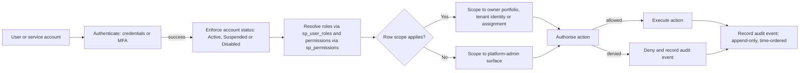
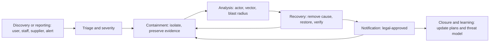

# Security and Compliance

## Executive summary

This document consolidates the PRMS (Property Rental Marketplace System) security, privacy and compliance baseline into a single controlled statement. It merges the former Category 08 set — information security policy, security requirements, threat model, identity and access management design, consent and privacy specifications, privacy impact assessment and policy drafts, audit and accountability, secure development, vulnerability management, incident response, business continuity, disaster recovery, third-party risk, software bill of materials, open-source licence policy and the compliance matrix — into one evidence-feasible baseline for the shared platform and all twenty sellable modules.

PRMS is a Zimbabwe-first, USD-priced direct rental marketplace and property-management ERP. Property owners list properties directly, tenants search and apply free of agent commission, owners pay affordable subscriptions, and the platform earns revenue from subscriptions and optional promotion, verification and premium services. Because the traditional agent is removed, the platform itself must protect marketplace trust: verification, moderation, audit and class-proportional data protection are design principles rather than release-time additions.

The baseline is deliberately non-assertive. On this document's effective date no control is claimed to be implemented, no operator or provider is selected, no plan is exercised, and no statutory compliance is asserted. Every consequential legal position is recorded as an Assumption (ASM) pending qualified Zimbabwean legal review, and every compliance and open question is labelled so that unverified states can never be presented as verified states.

## Purpose and audience

The purpose of this consolidated baseline is to provide one controlled view of security requirements, data-protection obligations, audit expectations, compliance status, resilience plans and software-supply-chain governance that strategy, design, development, administration, operations, support, quality, legal and commercial owners can trace to. It removes the need to reference a folder of separate Category 08 files while preserving their identifiers, requirement IDs, acceptance scenarios and decisions.

The audience is product, engineering, architecture, infrastructure, data, privacy, quality, legal, compliance, finance, operations, support and administration owners, plus any authorised third party processing PRMS data.

## Scope and exclusions

Included are application security, identity, access, session, input and output handling, data protection, cryptography, endpoint protection, logging and monitoring, supply-chain integrity, deployment and configuration security, consent and privacy, audit and accountability, compliance assessment, incident response, business continuity, disaster recovery, third-party risk, SBOM and open-source licence governance for the shared platform (`sp_*` tables) and every module schema (`uam`, `prp`, `mkt`, `fav`, `enq`, `vew`, `apl`, `lse`, `pmt`, `mtn`, `svc`, `sub`, `fad`, `ver`, `ntf`, `lnd`, `rba`, `adm`, `cmp`, `doc`).

Excluded are legal or tax advice, framework certification, a guarantee of conformity, evidence that any control is implemented in a released build, and any authority, regulator or customer commitment. Nothing in this document authorises handling of data under any regime or erases the internal requirement to obtain qualified legal review before consequential processing.

## Statement labels and evidence conventions

Statements in this baseline use the approved PRMS labels so that evidence, decisions and proposals can never be confused:

| Label | Meaning |
|---|---|
| **(Verified fact)** | A factual claim about PRMS or its environment that can be evidenced. |
| **(Approved product decision)** | A decision approved by the Delegated Product Owner. |
| **(Assumption, ASM)** | A testable proposition requiring qualified review or resolution. |
| **(Open question, OQ)** | An undecided item with named owners and a resolution gate. |

The baseline follows these evidence rules:

- A requirement, scan result or configuration value never proves legal compliance, operational effectiveness or certification.
- Approved product response must never be converted automatically to a Conforming conclusion.
- Unknown, missing and not-assessable states remain visible and are never coerced to a pass.
- Historical assessments preserve the source, facts, release, configuration, period and conclusion applied at the time.
- Every external source and interpretation recorded in the compliance matrix is treated as an Assumption (ASM) pending qualified Zimbabwean review unless formally resolved.

## Operating legal entity issue

PRMS will be operated by a legal entity that is not yet finalised. (Open question, OQ-ISP-001) Until the operating entity, its controller role and its Zimbabwean legal and tax identities are decided, no external engagement may depend on this baseline as a binding commitment. Product-only security decisions are unaffected; they remain the responsibility of the Delegated Product Owner within the approved market, Zimbabwe first with Harare as phase 1. (Approved product decision)

## Information asset classes and classification alignment

### PRMS data classes

PRMS holds four distinct data classes that must never be handled with the same rules. (Approved product decision, PD-ISP-001)

| Class | Example data | Handling posture |
|---|---|---|
| Public marketplace | Published listings, photos/videos, prices, amenities, promotion placements | Intended for public discovery; authenticated for update; scraping controls apply |
| Restricted personal and contact | Accounts, profiles, contact details, enquiry and communication history | Authorised per role; minimisation and consent rules apply |
| Confidential tenant financial and verification | Applications, income evidence, identification documents, leases, rent history, balances, verification case files | Least privilege; encryption at rest and in transit; strict access records; special document handling |
| Confidential platform revenue | Subscription bills, payments, settlement, promotion charges | Least privilege; separation from tenant or personal processing; finance and admin only |

Tenant identity documents and rent payment histories are among the most consequential records in the system: their compromise, misuse or loss erodes the trust that is the platform's primary product. (Verified fact)

### Alignment with data classification levels

The PRMS data classes are consistent with the data classification policy levels — Public, Internal, Confidential and Restricted. The mapping keeps classification references consistent across the baseline:

| PRMS security class | Data classification level | Notes |
|---|---|---|
| Public marketplace | Public | Published listings, photos, verified badges, reference location names |
| Restricted personal and contact | Restricted at minimum | Personal contact detail and identity evidence map to Restricted |
| Confidential tenant financial and verification | Confidential base; Restricted where identity evidence or the tenant-linked rent ledger is involved | Income evidence Restricted; verification case files Restricted |
| Confidential platform revenue | Confidential | Subscription billing and payment records; masked in support contexts |

Classification overlays are mandatory:

| Overlay | Applies when | Effect |
|---|---|---|
| Personal data | Any party-related personal detail | Raises baseline to at least Confidential; contact and identity to Restricted |
| Financial | Ledger, deposits, billing, payments | At least Confidential; tenant-linked rent ledger to Restricted |
| Identity evidence | National ID, passport, deeds, council statements | Restricted |
| Trust and safety | Reported scam content, moderation case detail | Internal at minimum; case evidence Restricted |
| Legal hold | Subject to dispute or legal retention | Locked; no downgrade or disposal |

Assignment and inheritance rules:

- Every table, column and file carries a classification code. New columns touching identity evidence, personal contact or tenant-linked financials are reviewed before merge.
- Files and documents inherit the highest classification of their owning record; notifications inherit the classification of the triggering event; report columns inherit the classification of the source field.
- Downgrades require two-party review and an audit record; Restricted-to-Public downgrades are prohibited. Legal holds lock classification at the current level.
- Non-production environments use synthesised data, never copied production identity or financial records; where production-shaped data is required it is masked to at most Internal.
- Backups, archives and message queues carry the same classification and handling as their source data.

## Security requirements overview

### Security objectives

The security requirements specification derives its controls from the PRMS threat model and is owned by the Product Security Owner. Its objectives are expressed in the Information Security Policy statements:

| ID | Policy statement |
|---|---|
| ISP-001 | Every user, component, service and operator identity is managed under the identity and access management design; authentication and authorisation apply on every surface, including marketplace reads where public or sensitive data is involved. |
| ISP-002 | Access is least privilege, role-scoped and row-scoped: owners see only their portfolio, tenants only their activity, administrators only what their admin role authorises. |
| ISP-003 | All confidential tenant financial, verification and platform revenue data is protected at rest and in transit; public marketplace data remains protected against tampering and unauthorised change. |
| ISP-004 | Changes to properties, listings, leases, payments, verification decisions, subscriptions, entitlements and admin configuration follow the audit and accountability specification; audit events are append-only and tamper-evident in design. |
| ISP-005 | Deleting or moderating listings, suspending users and reversing payments are high-risk actions requiring maker–checker or dual-administrator approval. |
| ISP-006 | Tenants and owners are never enrolled into marketing or external communications without recorded consent; unauthorised WhatsApp, SMS or email outreach is prohibited. |
| ISP-007 | Owner and tenant accounts are verified under the verification module; account premium features expose no secret or beyond-scope data. |
| ISP-008 | Software is built under the secure development standard; CI/CD includes SAST, dependency scanning, security testing and SBOM generation. |
| ISP-009 | Vulnerabilities are tracked and remediated under the vulnerability management policy within severity-driven timelines. |
| ISP-010 | Security incidents are reported and handled under the incident response plan; the plan remains unexercised until activated and tested. |
| ISP-011 | Third-party and supplier processing of PRMS data is assessed under the third-party risk register before any data is provided. |
| ISP-012 | Open-source components comply with the open-source licence policy; the software bill of materials records the verified component base of each releasable build. |
| ISP-013 | Access to audit events, verification case data and payment data is separate from marketplace development access. |
| ISP-014 | Data retention and disposal follow approved data governance rules; withdrawal, account closure and lease termination trigger deletion or archive per class and basis. |
| ISP-015 | Exports, backups, archives and message queues carry the same classification and access rules as the source data they contain. |
| ISP-016 | No revenue or compliance claim is made without evidence; a configured value, a vulnerability scan or a framework mapping never proves legal compliance or operational effectiveness. |

### Assurance and verification levels

Assurance levels follow a three-tier mapping applied to PRMS data classes. (Approved product decision, PD-SEC-001)

| Level | Applies to | Examples |
|---|---|---|
| L1 | Public marketplace and low-risk restricted data | Published listings, favourites, saved searches |
| L2 | Restricted personal and contact data | Profiles, enquiries, communication history |
| L3 | Confidential tenant financial and verification, platform revenue | Applications, identification documents, lease, rent ledger, subscription billing, verification case files |

PRMS targets OWASP ASVS L1 coverage as a mandatory baseline for all surfaces, L2 for restricted personal and contact data, and L3 for confidential tenant financial and verification records and platform revenue. The mapping states a version and scope; it is not a certification claim. (Approved product decision)

### Identity and access management

#### Single authoritative identity

Identity is centralised in the shared platform (`sp_*`) because the marketplace, every module and every financial transaction depends on a single authoritative identity record. `sp_users` holds the authoritative identity record for every human user; additional profile data lives in `uam_profiles`; account status history in `uam_account_status_history`. A user belongs to exactly one account, and an owner may manage multiple properties through a single identity. No module holds a parallel identity or permission store. (Approved product decision, PD-IAM-001)

Key identity fields: `sp_users` (uuid, contact channels, password hash or MFA reference, status), `sp_parties` (organisation or person role), `sp_organisations` (owner organisation), `sp_roles` and `sp_user_roles` (role membership), `sp_permissions` (permission grants).

#### Account status

Account status transitions form a controlled lifecycle: `Active`, `Suspended`, `Disabled`, and for owners `Unverified` and `Verified` via the verification module. Status is enforced at every authorisation decision. A suspended owner cannot publish or modify listings, but tenant-facing obligations (payment, communication) still have an owner to receive them.

#### Roles and permissions (RBAC)

Roles are assigned through `sp_user_roles`; permissions through `sp_permissions`. Every sensitive module operation maps to a permission check, never to an arbitrary "is admin" shortcut. A user may hold more than one role, but access is the intersection of granted permissions and row scope; there is no implicit superset.

| Role | Applies to | Examples |
|---|---|---|
| PropertyOwner | Owners | Manage own properties and portfolio; receive enquiries, viewings, applications; manage leases and payments for own units |
| Tenant | Tenants | Search, favourite, enquire, apply, view and sign lease, pay rent, raise maintenance, manage profile |
| Applicant | Tenants with live application | View application status; submit required documents |
| PlatformAdmin | Administrators | Verify owners and properties, moderate listings, manage users, locations, subscriptions, payments and disputes |
| Support | Internal support | Process rights requests and queries with least-privilege access |
| ServiceProvider | Contractors | Profile, services, assigned jobs; limited to own assignments |
| Auditor | Internal or qualified | Read-only audit and evidence surfaces |

#### Authentication

- Password policy: accounts use strong, adaptive-hashing password storage; tenants may use passkeys or MFA where supported.
- MFA: owners and administrators are required to enable MFA (TOTP, physical token or approved factor) before financial actions — publishing, lease, rent collection, verification decision, subscription change. Tenant MFA is optional but recommended and is required for payment or sensitive personal action where approved. (Approved product decision, PD-IAM-002)
- Sessions: authenticated sessions use secure, HTTP-only cookies over TLS with idle timeouts; high-risk actions require current authentication.
- Recovery: password reset and account recovery use single-use, expiring links with rate limiting; recovery cannot bypass row scope or grant admin powers.
- Lost-credential and account-recovery flows include rate limiting, unguessable tokens, expiry of tokens and no data-class downgrade on recovery (SEC-005).

#### Authorisation and row-level scoping

Row-level scoping is a mandatory control enforced on every restricted and confidential data query:

- Owner sees only properties and related records where the owner matches, and only the enquiries, viewings, applications, leases and payments for those properties.
- Tenant sees only their own favourites, saved searches, enquiries, applications, leases, rent balance and maintenance requests.
- PlatformAdmin sees platform-managed surfaces; read access to tenant and owner personal data is limited to approved support actions, each audited.
- ServiceProvider sees only assigned jobs.
- Auditor reads audit objects but cannot modify.

Owner switching of default read mode or export scope must never bypass row-level scoping (SEC-103). Module packs must prove row scope in acceptance tests (SEC-102).

#### Least privilege

- Every request is authorised against `sp_permissions` and `sp_user_roles`; administrators never access tenant or owner data outside their role (SEC-101).
- Service accounts used by jobs and integrations are least-privilege and never carry human credentials (SEC-105).
- Access to audit records, verification case data and payment data is separate from marketplace development access (ISP-013).

#### Segregation of duties

High-risk actions require maker–checker or dual-administrator approval: containment, moderation, deletion, payment reversal, entitlement change and verification decisions are initiated by one administrator and approved by a second, with both actions recorded in the audit event store with reason and scope (SEC-104). This is a PRMS-specific control against insider abuse. (Approved product decision, PD-IAM-003)

#### Service accounts and integration identity

Jobs and integrations use scoped service accounts with no human credentials. Outbound webhooks and provider API calls use signed, expiring client credentials held in the secrets store; keys never appear in source or logs.

#### Audit of identity events

Identity events recorded in the audit store include login success and failure, account creation, role change, MFA change, password reset, account status change, permission change and every maker–checker approval or rejection. Provisioning records are append-only and time-ordered; retention follows the audit rules.

#### IAM flow

The following flow shows how identity, authentication, authorisation and audit combine on every surface.

Interpretation: every request — owner, tenant, admin, support, service provider or auditor — passes through authentication, account-status enforcement, role and permission resolution and row scoping before execution, and every security-relevant outcome is recorded in the append-only audit store.

#### IAM requirements

| ID | Requirement | Priority |
|---|---|---|
| IAM-001 | The Platform shall maintain a single authoritative identity record per user in `sp_users` and profile in `uam_profiles`. | Must |
| IAM-002 | Every security-sensitive module operation shall enforce `sp_permissions` and `sp_user_roles`, never an ad-hoc flag. | Must |
| IAM-003 | Row-scope checks shall run on every restricted and confidential data query and be provable in module acceptance tests. | Must |
| IAM-004 | Owners and administrators must enable MFA before high-risk actions; tenants are offered MFA. | Must |
| IAM-005 | High-risk actions shall require current authentication, audit events and maker–checker where specified. | Must |
| IAM-006 | Account status transitions shall be recorded and enforced in authorisation checks. | Must |
| IAM-007 | Service accounts and integrations shall be scoped, signed, expiring and never carry human credentials. | Must |
| IAM-008 | Identity and access events shall write append-only records in the audit event store. | Must |
| IAM-009 | Recovery flows shall be rate-limited, single-use and unable to escalate scope. | Must |
| IAM-010 | Welcome, verification and entitlement flows must not weaken least privilege before an owner's first listing is verified. | Must |

#### IAM acceptance scenarios

| ID | Scenario | Expected outcome |
|---|---|---|
| IAM-ACC-001 | A tenant attempts to view another tenant's rent balance. | Denied by row scope; access recorded. |
| IAM-ACC-002 | An owner without a verified property attempts to publish. | Blocked at the property and listing verification gate; no unverified listing. |
| IAM-ACC-003 | Administrator reverses a rent payment without a second approval. | Rejected by maker–checker; event recorded. |
| IAM-ACC-004 | Administrator changes a user's role to PlatformAdmin. | Event recorded; dual approval where required; audit trail retained. |
| IAM-ACC-005 | A service-provider profile is assigned a job outside its assignment. | Denied by row scope. |
| IAM-ACC-006 | Password reset link used twice. | Second use invalid; account status unchanged. |

### Threat model summary

The threat model is a working account, not a completed risk register: threats are product-level statements that architecture and module design must address, and no mitigation is asserted to be implemented. Threat identifiers follow the THR convention and trace to the security requirements.

| ID | Threat | Assets | Likelihood | Requirement response |
|---|---|---|---|---|
| THR-TEN-001 | Fake, misleading or scam property listings (fabricated photos, inflated prices, phantom addresses, misleading availability) | Public marketplace, tenant deposits and trust | High | PRP and MKT integrity controls, verification gates before publishing, moderation, reporting, ISP-002 and ISP-014, SEC-201 |
| THR-TEN-002 | Impersonation of owners; account takeover to divert enquiries, viewings, applications or payments | Restricted personal and contact; confidential financial | High | UAM identity, MFA for owners and admins, owner verification, session and recovery controls, audit |
| THR-OWN-001 | Payment and rent fraud: phishing for deposit or rent, payment diversion, forged receipts, subscription abuse | Confidential platform revenue, tenant rent money | High | Payment and subscription ledgers, maker–checker, provider contracts, reconciliation, SEC-104 and SEC-302 |
| THR-OWN-002 | Malicious or abusive tenant behaviour (fraudulent application documents, spoofed identity claims) | Verification and application data, owner reputation | Medium | Application document checks, verification evidence states, complaint handling |
| THR-PRV-001 | Exfiltration of tenant personal, identification or financial data (compromised account, over-privileged role, upload abuse, backup leak) | Confidential tenant financial and verification | High | Least privilege row scoping, encryption at rest, upload validation, SEC-202 and SEC-302 |
| THR-PUB-001 | Scraping and bulk harvesting of marketplace listings and owner data | Public marketplace; competitive position | Medium | Rate limiting, bot and crawl controls, marketplace surface design, SEC-603 |
| THR-DEV-001 | Insider misuse of admin power (modify listings, mark verified without evidence, suspend tenants arbitrarily, alter payments) | All classes | Medium | Role separation, maker–checker, auditability, SEC-104, ISP-004 |
| THR-MIS-001 | Misconfiguration or outdated dependencies creating exposure (unpatched frameworks, weak container base, open object storage) | All classes | Medium | Secure development standard, vulnerability management, SBOM, hardening, SEC-501 and SEC-504 |
| THR-CHN-001 | Supply-chain compromise (malicious dependency, tampered build, poisoned data) | All classes | High | SBOM, dependency scanning, signature verification, approved base images |
| THR-ITS-001 | Unauthorised payment or subscription billing changes (owner downgrades, forged bills, unapproved promotion charges) | Platform revenue, owner records | Medium | Entitlement integrity, maker–checker, auditing |
| THR-CMP-001 | Abuse of reporting or dispute functions (flood moderation queues, impersonation in reports, malicious evidence) | Moderation and compliance data | Medium | Complaint triage, identity verification on evidence, rate limiting |

Trust boundaries:

1. Public marketplace boundary — public listing reads are loose by design; write, verification, moderation and personal-data operations sit behind authentication.
2. Authenticated tenant and owner boundary — enquiries, applications, leases, payments, favourites and verification records are row-scoped to the identity.
3. Administrator boundary — moderation, user management, configuration and audit have the smallest authorised set; high-risk actions require maker–checker.
4. Provider boundary — messaging, storage, payment and verification providers receive only the data and rights their contract defines.
5. Audit boundary — audit events are append-only and separated from ordinary application access.

#### STRIDE-lite control mapping per asset

| Asset or trust boundary | Spoofing | Tampering | Repudiation | Information disclosure | Denial of service | Elevation |
|---|---|---|---|---|---|---|
| Public marketplace | na | Listing and availability versioning; moderation | Audit of publish and moderation actions | Public by design; scrape controls | Rate limiting, bot and crawl controls | Authenticated write only |
| Owner portfolio | MFA and owner verification | Maker–checker on listing and lease changes | Audit of portfolio changes | Row scope on owner id; no cross-portfolio reads | Availability design | Role and permission checks |
| Tenant identity and activity | MFA on sensitive actions | Application, lease and document versioning | Audit of application and payment events | Row scope on tenant id; class-scoped document buckets | Rate limiting | Least-privilege admin roles |
| Payments and revenue | Signed, expiring service credentials | Ledger immutability; maker–checker corrections | Financial audit events | Encryption at rest and in transit; finance-only access | Provider resilience and continuity | Separation of collection and reconciliation |
| Verification evidence | Identity verification on rights requests | Case integrity; revocation recorded | Decision audit with reasons | Restricted-only case access | Moderation queue controls | Maker–checker on decisions |
| Administrators and audit | MFA required before high-risk action | Append-only audit store; tamper-evident design | Action and approval events | Audit access least-privilege and read-mostly | Audit alerting routing | No implicit superset; permission-gated |
| Provider boundary | Signed and expiring outbound credentials | Contracted data-flow boundaries | Provider receipts and outcome records | Class-scoped data minimisation | Alternate provider assessment | No service account with human credentials |

Mitigations are requirements, not implementations, until evidence exists. (Approved product decision, PD-THR-001) Verification and moderation are the primary responses to fake-listing and impersonation threats. (Approved product decision, PD-THR-002)

### Secure development standard

PRMS is a Laravel modular monolith with React via Inertia, PostgreSQL 18, Redis/Valkey and S3-compatible object storage, packaged in containers and deployed on Linux. The secure development standard sets minimum practice and makes evidence of that practice a gate condition.

Secure development principles:

- Security is a development activity, not a release-time review. Threat analysis starts at design; module packs identify their threats from the threat model.
- Evidence over claims: every releasable build carries scanner and test evidence; a merge without evidence does not ship.
- Least privilege in code too: queries carry row scope; roles grant the minimum; service accounts never hold human credentials.
- Trust boundaries are explicit: data crossing from marketplace to personal or confidential surfaces re-authenticates and re-authorises.
- Failures are visible: errors surface defensively; audit events exist for security-relevant paths; no silent catch-all.

CI/CD gates on evidence:

1. SAST on code — no new critical or high findings.
2. Dependency scan — no unresolved high-severity known vulnerability above the approved SLA.
3. Container base-image scan and provenance.
4. SBOM generation (composer and npm) for each releasable build.
5. Security test suite on security-critical paths.
6. DAST on a releasable build or representative environment.
7. Peer and, for high-risk areas, security review sign-off.

A gate blocks release; approved exceptions are rare, time-boxed, documented and owned. High-risk changes (authentication, payments, verification, moderation, exports, lease and rent integrity) additionally require product-security review sign-off. (Approved product decision, PD-SECDEV-002)

Secure coding practice follows the OWASP Top 10 and the ASVS baseline per data class. Input validation and output encoding are server-side and framework-native; SQL is parameterised through the Laravel query builder or ORM with no string-interpolated SQL; uploads (property media, verification and application documents) are validated, scanned and limited in type and size and served with class-scoped access; dependencies are pinned and vetted with no undocumented additions.

| ID | Requirement | Priority |
|---|---|---|
| SECDEV-001 | All modules and shared-platform work shall follow this standard and the Security Requirements Specification. | Must |
| SECDEV-002 | Security-critical paths shall have automated tests covering row scope, maker–checker, consent, verification gates, lease and payment integrity and document access. | Must |
| SECDEV-003 | SAST, dependency scanning, container scanning, SBOM generation and security tests shall run in CI/CD and gate releases. | Must |
| SECDEV-004 | High-risk changes shall receive security review sign-off. | Must |
| SECDEV-005 | Secrets shall be stored in a secrets store and never in source, images or logs. | Must |
| SECDEV-006 | Every releasable build shall carry build ID, gate evidence and SBOM reference. | Must |
| SECDEV-007 | Threat model, PIA and compliance matrix updates shall accompany material data-flow, provider or architecture changes. | Must |
| SECDEV-008 | Secure development evidence shall be verified before release gates and audited. | Must |

Acceptance scenarios:

| ID | Scenario | Expected outcome |
|---|---|---|
| SECDEV-ACC-001 | A change to the application flow introduces a new data flow to a new provider. | Threat-model, PIA and compliance rows updated before approval. |
| SECDEV-ACC-002 | A developer introduces a test backdoor across the login path. | SAST flags; security review; change blocked until fixed. |
| SECDEV-ACC-003 | A build fails dependency scan on a high-severity vulnerability. | Gate blocks; vulnerability tracked under vulnerability management with an SLA. |
| SECDEV-ACC-004 | A moderator action path is changed. | Security-critical test suite runs maker–checker denial and audit coverage and signs off. |
| SECDEV-ACC-005 | A release attempts to ship without an SBOM. | Release blocked; SBOM generated. |

### Vulnerability management

Vulnerability management is a continuous product duty across the marketplace, the property-management modules, the shared platform and the supply chain. Detection sources include automated scanner evidence in CI/CD (SAST, DAST, dependency scan, container scan), human reporting, provider security advisories and periodic security or penetration testing findings.

Severity and remediation targets (CVSS-informed, calibrated to PRMS exposure and data class):

| Severity | Example | Remediation target (from detection) |
|---|---|---|
| Critical | Public remote code execution; full tenant data exfiltration; compromise of payment or verification keys | Immediate action on exposure; plan approved within 24 hours; fix as an emergency process, typically 24–72 hours |
| High | Row-scope bypass; unauthorised listing publish; payment tampering; dependency with public exploit in a reachable path | Fix within a standard release cycle, not to exceed 14 days, with emergency release as needed |
| Medium | Input-validation gaps, missing MFA enforcement on low-risk flows, scan-flagged non-exploitable paths | Fix within 30 days or documented deferral with a risk owner |
| Low | Cosmetic, informational, best-practice findings | Backlog with periodic review |

Emergency-release criteria are approved by the Delegated Product Owner, and emergency fixes still record evidence (build ID, scan, SBOM, tests). A finding closes only when the fix is merged, the re-scan is clean on the affected path, tests pass and remediation evidence is recorded. Deferrals and false positives require an owner-approved rationale and a re-evaluation date. Confirmed exploitable findings affecting restricted or confidential data are treated as incidents and considered for notification under legal advice.

| ID | Requirement | Priority |
|---|---|---|
| VUL-001 | PRMS shall continuously detect, triage, record, own and remediate vulnerabilities across code, dependencies, containers, configuration and the supply chain. | Must |
| VUL-002 | Severity shall be calibrated to PRMS exposure and data class and reviewed at each gate. | Must |
| VUL-003 | Critical and high findings shall have assigned owners, due dates and verified remediation evidence before closure. | Must |
| VUL-004 | A release shall not ship with unresolved critical or high findings without an approved, time-boxed exception. | Must |
| VUL-005 | Vulnerability data shall be protected as restricted or confidential per data class and not misused. | Must |
| VUL-006 | Findings, remediation evidence, deferrals and exceptions shall be auditable and traceable to builds and SBOMs. | Must |
| VUL-007 | Material effective vulnerabilities shall be handled under incident response with legal advice on notification obligations. | Must |
| VUL-008 | An external disclosure path shall be defined before public launch. | Must |

### Secrets handling

- Keys and secrets are held in a dedicated secrets store with rotation and access logging; application code never carries secrets in source (SEC-303, SECDEV-005).
- Passwords and recovery tokens are hashed adaptively; no reversible storage of credentials (SEC-304).
- Service accounts and outbound provider credentials are signed and expiring, stored in the secrets store and never logged.
- Configuration is version-controlled and environment-scoped; gateway credential values and equivalent secrets are classified Restricted within configuration.
- Secrets and configuration are restored from the approved store during continuity and recovery; effective-dated configuration is preserved.

### Configuration and deployment security

| ID | Requirement | Level |
|---|---|---|
| SEC-601 | Non-production and production environments are separated; production data never restored into a lower environment without class-scoped approval and masking. | L3 |
| SEC-602 | Configuration is version-controlled, environment-scoped and auditable; consequential configuration values carry source and effective date. | L2 |
| SEC-603 | Marketplace, payment and verification surfaces are protected against automated abuse (rate limiting, CAPTCHA, bot controls as approved). | L1 |
| SEC-604 | Backups, archives and message queues carry the same classification and handling as their source data. | L3 |

### Input validation, output encoding and injection

| ID | Requirement | Level |
|---|---|---|
| SEC-201 | All input shall be validated on semantic, format, length and type expectations; validation is server-side and output-encoded. | L1 |
| SEC-202 | SQL access uses the Laravel query builder or ORM with parameterised statements; no string-interpolated SQL. | L1 |
| SEC-203 | File uploads (property photos, verification documents, application documents) are validated for type, size and content, malware-scanned and stored safely with class-scoped access. | L3 |
| SEC-204 | Marketplace search input, filters and free-text fields shall be validated and rendered without script execution. | L1 |

### Cryptography and key management

| ID | Requirement | Level |
|---|---|---|
| SEC-301 | Data in transit uses TLS on all surfaces; no plaintext transmission of credentials, tokens, payments or documents. | L1 |
| SEC-302 | Data at rest is encrypted at the storage layer; confidential tenant financial, verification and platform revenue data is additionally encrypted at the application layer for at-risk records (document content, ledger references). | L3 |
| SEC-303 | Keys and secrets are held in a dedicated secrets store; rotation and access logging apply; application code never carries secrets in source. | L3 |
| SEC-304 | Passwords and recovery tokens are hashed adaptively; no reversible storage of credentials. | L2 |

### Security monitoring and audit

| ID | Requirement | Level |
|---|---|---|
| SEC-401 | The audit event store captures security-relevant events (login, failed login, role change, moderator action, verification decision, payment action, entitlement change, export). | L2 |
| SEC-402 | Audit events are append-only, tamper-evident in design, time-ordered and immutable for the retention period. | L3 |
| SEC-403 | Marketplace scraping, login attack and permission-denied anomalies are detectably recorded and alarmed without collecting content data. | L2 |
| SEC-404 | Alerts for L3-class failures route to a security responder; alert routing is part of the runbook and must not weaken least-privilege access. | L3 |

### Module-specific security obligations

Each module pack reflects this baseline. Notable obligations:

- UAM: identity, account verification, roles, account status gates.
- MKT: scrapable surfaces, search abuse controls, listing integrity.
- PRP: property record ownership, media validation, availability tampering protection.
- VEW and APL: scheduling and application integrity, impersonation resistance.
- PMT and SUB: rent and subscription ledger integrity; separation of duties between collection and reconciliation.
- VER: verification case integrity, decision maker–checker, document handling.
- ENQ and NTF: communication consent, content moderation, no-unauthorised-outreach controls.
- DOC: document class, retention, versioning and delegation rules.
- CMP: reported-listing triage, evidence preservation, resolution integrity.
- ADM: admin separation of duties, moderation and configuration audit.

Requirements families apply to the shared platform and all twenty modules; module packs may strengthen, never relax, these requirements. (Approved product decision, PD-SEC-002)

### Security requirements register

| ID | Requirement | Priority |
|---|---|---|
| SEC-REQ-001 | PRMS shall control identity, authentication, authorisation, input, output, data protection, cryptography, logging, deployment and supply chain according to this baseline and the threat model. | Must |
| SEC-REQ-002 | Row-level scoping and least privilege shall be enforced, never bypassed by configuration or export. | Must |
| SEC-REQ-003 | The requirements families above shall be traced to module packs, security tests and release gates. | Must |
| SEC-REQ-004 | Verification, payments, moderation and lease actions shall require audit events and maker–checker where specified. | Must |
| SEC-REQ-005 | No security or compliance claim shall be made without evidence; framework mappings are versioned and never imply certification. | Must |
| SEC-REQ-006 | The Product Security Owner shall keep this baseline aligned with PRMS releases and the threat model. | Must |

### Security acceptance scenarios

| ID | Scenario | Expected outcome |
|---|---|---|
| SEC-ACC-001 | Property listing inserted for a property not owned by the account. | Request denied at row scope; audit event recorded. |
| SEC-ACC-002 | Moderator approves a listing for a property with no verification evidence. | Process requires the verification gate; no published listing without an approved source. |
| SEC-ACC-003 | Payment schedule tampering by an owner. | Ledger immutability; maker–checker on correction; audit event. |
| SEC-ACC-004 | Tenant requests export of application data. | Rights request workflow verifies identity and exports only that tenant's data at approved class. |
| SEC-ACC-005 | CI/CD build contains a known high-severity dependency vulnerability. | Build blocked; dependency scan evidence required; SBOM updated. |
| SEC-ACC-006 | Automated scraping of listings. | Rate limiting and bot controls trigger; scraper session blocked; audit and alert raised. |

## Data protection

### Consent management

#### Principles

Consent handling is a platform requirement, not an optional marketing feature. (Approved product decision, PD-CON-001)

- Opt-in: consent is obtained before any communication or marketing; no pre-ticked boxes; no bundled consent inside essential account creation.
- Specific: consent is captured per purpose and per channel (email, SMS, WhatsApp, in-app push).
- Informed: consent references the relevant terms and privacy statement at the time of capture.
- Revocable: withdrawal is as easy as granting, is honoured across all channels and cannot cost access to essential platform features.
- Recorded and auditable: consent grant, change and withdrawal are stored against the user identity with timestamp, channel, purpose and terms version.

#### Consent model

Consent records are stored against the user identity and preference surface (`ntf_preferences`, channel records). Each record carries the subject identity, purpose code and channel, the terms and privacy-notice version at grant, the timestamp of grant or withdrawal, and an evidence reference. The marketplace itself — search, browsing, and essential service notification such as a rent bill or a viewing confirmation — operates without consent for the essential service. Marketing, promotion and external SMS or WhatsApp outreach require consent.

No third-party marketing sharing of tenant or owner personal data is permitted. (Approved product decision, PD-CON-002)

#### Essential versus marketing communication

| Type | Requires consent | Example |
|---|---|---|
| Essential service | No | Rent due, viewing confirmed, application status, lease expiry, maintenance resolution |
| Marketing or promotion | Yes | Featured-listing offers, premium-service promotions, newsletter |
| External SMS or WhatsApp outreach | Yes | Promo SMS or WhatsApp to tenants or owners |
| Third-party sharing for marketing | Consent and agreement | Never permitted |

#### Withdrawal and suppression

Withdrawal is a one-action control in the profile or preference centre, effective immediately or at the next dispatch cycle at worst. Suppression applies across email, SMS and WhatsApp dispatch; a withdrawn user receives no marketing or promotional communication but still receives essential service messages. Withdrawal must not delete the audit record of consent; the record of withdrawal is retained as evidence while suppression stays active.

#### Consent requirements

| ID | Requirement | Priority |
|---|---|---|
| CON-001 | PRMS shall record consent with purpose, channel, terms version and timestamp and make it auditable. | Must |
| CON-002 | Consent shall be opt-in, specific, free and never bundled into essential account creation. | Must |
| CON-003 | Withdrawal shall be one-action, honoured across all channels and not reduce access to essential features. | Must |
| CON-004 | Essential service communication shall be clearly distinguishable from marketing. | Must |
| CON-005 | Suppression shall be effective at dispatch time for all external channels. | Must |
| CON-006 | No third-party marketing sharing of tenant or owner personal data is permitted. | Must |
| CON-007 | Consent and withdrawal records shall be retained per retention rules and be available for regulator requests. | Must |
| CON-008 | The consent surface shall meet accessibility requirements. | Must |
| CON-009 | Consent workflows shall be validated with representative users before launch. | Must |

#### Consent acceptance scenarios

| ID | Scenario | Expected outcome |
|---|---|---|
| CON-ACC-001 | A tenant registers a marketplace account. | No marketing consent request; essential account creation does not create consent. |
| CON-ACC-002 | A tenant opts into WhatsApp promotions. | Record with channel, purpose, timestamp, terms version; WhatsApp allowed only for promotion. |
| CON-ACC-003 | A tenant withdraws WhatsApp consent. | Withdrawal recorded; suppression effective; rent-bill and viewing messages still delivered (essential). |
| CON-ACC-004 | An owner grants consent via a pre-ticked box. | Rejected: consent must be opt-in without preselection. |
| CON-ACC-005 | A withdrawal is audited. | Grant and withdrawal events present in the audit store with identity and timestamp. |
| CON-ACC-006 | Marketing attempts to reach a user who withdrew. | Dispatch blocked at suppression check; no message sent. |

### Privacy policy essentials

The Privacy Policy is a Stage 5 internal draft prepared for external publication before the platform goes live; it is not yet published and must be reviewed by qualified legal advisers before external use. Amounts in the policy are in USD. (Approved product decision, PD-PRI-002)

Who PRMS processes data about:

- Property owners and landlords — account data (name, organisation, contact details), verification and ownership documents, subscription and payment records.
- Tenants and applicants — account data, search and preferred-property activity, enquiry and communication content, viewing requests, rental applications, supporting identification and income evidence, leases, rent and payment history, and maintenance requests.
- Other individuals — service providers matched to maintenance jobs and, where applicable, referees or guarantors named in an application.

Purposes and bases of processing include: registering accounts and verifying identity and ownership to operate the service and prevent fraud; publishing and administering listings; enabling enquiries, viewings, applications and communication; preparing and executing leases and collecting rent; processing owner subscriptions and premium services; sending service notifications with opt-in where required; detecting and responding to fraud, abuse, disputes and moderation; and improving, securing and maintaining platform functionality. Where consent is relied on it can be withdrawn without affecting use of essential marketplace features. The final statement of legal bases is reviewed by qualified legal advisers before publication.

Public and restricted data:

- Public listings data — listing text, photos, price, location, amenities, verified badges and the display name of the property owner — is published and visible to all visitors for discovery.
- Personal and contact data — full profiles, contact details, application documents, rent balances — is restricted and visible only as the flow requires.
- PRMS never sells and never rents personal data to third parties. (Approved product decision, PD-PRI-001)

Sharing and transfers are limited to the platform operating entity, service providers under contract, property owners and tenants within the flow and scope described, and authorities and advisers where legally obliged. Providers may process data outside Zimbabwe only in compliance with the applicable law and after an appropriate impact assessment.

Retention: account and profile data while the account is held and afterwards as required for legal and audit purposes; listing and verification evidence while live and thereafter per approved rules; application, lease and rent records for the lease period plus the approved retention period; audit records per the audit retention rules; data requested for deletion or expiry is deleted or archived according to class and legal basis.

Rights: depending on the applicable law, access or copy, correction, objection or restriction, deletion, withdrawal of consent and complaint to the relevant authority. Requests go through the platform data-request process with identity verified before release and responses within the legally applicable timeframes; some retention obligations may prevent immediate deletion and will be explained.

The platform is not directed at children and data will be removed promptly if child data is discovered. Minimum technical cookies and analytics are used; cookie practices are disclosed before first launch. (Open question, OQ-PRI-001) The operating entity name and postal address will be completed before external publication. (Open question, OQ-PRI-002)

| ID | Requirement | Priority |
|---|---|---|
| PRI-001 | The Privacy Policy shall be reviewed by qualified legal advisers before external publication. | Must |
| PRI-002 | The Privacy Policy shall identify the operating entity, legal bases and retention details before first launch. | Must |
| PRI-003 | The Privacy Policy shall be versioned, dated and notified when materially changed. | Must |
| PRI-004 | The Privacy Policy must never be presented as validated compliance or legal advice. | Must |
| PRI-005 | Consent and rights mechanisms referenced in the policy shall exist in the produced platform. | Must |

### Privacy impact assessment takeaways

The PIA is a preliminary assessment: it does not assert that the applicable Zimbabwean data protection law has been fully interpreted, that consent is validated by a court, or that any control is implemented. Trust and minimum-necessary data handling are platform-critical because tenants share identification and financial information, owners share proof of ownership and personal or company details, and the platform holds payment and verification evidence.

#### Personal data inventory

| Data item | Class | Flow | Purpose |
|---|---|---|---|
| Owner name, organisation, contact, address | Restricted personal and contact | UAM, PRP | Account, listing ownership, verification |
| Property owner verification documents | Confidential verification | VER, DOC | Property and owner verification |
| Tenant identity data (name, contact, profile) | Restricted personal and contact | UAM | Account, search, enquiry, application |
| Tenant application and income evidence | Confidential tenant financial and verification | APL | Application assessment |
| Lease, rent schedule and payment history | Confidential tenant financial and verification | LSE, PMT | Rent collection and obligations |
| Communication content (enquiries, messages) | Restricted personal and contact | ENQ | Direct owner and tenant communication |
| Viewing schedule data | Restricted personal and contact | VEW, NTF | Viewing coordination |
| Subscription and payment data | Confidential platform revenue | SUB | Owner billing |
| Maintenance request content | Restricted personal and contact | MTN | Property maintenance |
| Moderation and dispute evidence | Restricted personal and contact or confidential | CMP, ADM | Trust and abuse handling |

#### Minimisation and purpose limitation

PRMS is designed to process the minimum personal data required for each flow. Tenants supply identification and income evidence only when they apply; owners supply proof of ownership only when they list and verify. Data collected for one purpose must not be repurposed: application documents are not shown to other tenants, and rent history is not used for marketing. Marketing and external outreach requires opt-in consent with a recorded purpose, channel, terms version and withdrawal route, never bundled into essential account creation. (Approved product decision, PD-PIA-001)

#### Intended legal bases

The final determination of controller and processor role, consent scope and legitimate-interest scope requires qualified Zimbabwean legal review. Intended bases by activity:

| Processing activity | Intended basis | Notes |
|---|---|---|
| Account creation and authentication | Necessary for the service | Basis to be confirmed |
| Marketplace search and listing data | Necessary for the service (public discovery) | Public by design |
| Enquiry, viewing, application | Necessary to provide the service | Direct relationship |
| Application documents held by owner | Necessary to assess the application | Tenant-facing consent or terms notice |
| Lease and rent collection | Necessary for the contract or obligation | Lease terms |
| Subscription billing | Optional paid service consent or contract | Owner agreement |
| Marketing notification | Consent (opt-in) | Recorded per purpose and channel |
| Verification evidence | Legitimate interest or consent while verification conducts its check | Scope-defined |

#### Risk and control register

| ID | Risk | Likelihood | Impact | Control requirement |
|---|---|---|---|---|
| PIA-R-001 | Tenant identification and income documents exposed to unauthorised parties | Low | High | Row-scoped least privilege; encryption at rest; data minimisation; class-scoped document buckets |
| PIA-R-002 | Listing published for a property the poster does not own | Medium | High | Owner verification before publish; reporting and moderation |
| PIA-R-003 | Fake or misleading listings defraud tenants | High | High | Verification checks, dispute flow, moderation, refund and exception process |
| PIA-R-004 | Owner data disclosed in the marketplace beyond intended purpose | Medium | Medium | Marketplace displays contact only for direct dealings and gates contact to the enquiry flow |
| PIA-R-005 | Tenant receives unsolicited marketing or WhatsApp or SMS outreach | Medium | Medium | Consent before external communication; withdrawal and suppression |
| PIA-R-006 | Rent history or balances exposed between tenants in shared marketplace features | Low | High | Row-level scoping; application ownership |
| PIA-R-007 | Provider processors gain excessive access to tenant data | Medium | High | Provider contracts; data-flow impact; least privilege; supplier review |
| PIA-R-008 | Retention of verification evidence beyond purpose | Medium | Medium | Retention rules per class and purpose; deletion and lifecycle controls |
| PIA-R-009 | Rights requests mismanaged | Medium | Medium | Identity verification, request workflow, timelines, exception handling |
| PIA-R-010 | Cross-border or provider data flow without legal review | Medium | High | Impact assessment and contract before data flow |

Privacy by design is a module-level control: marketplace surfaces expose listing data purpose-appropriately; owner and tenant personal data is gated by flow; tenants control profile, preferences and consent; owners control their portfolio; retention, deletion and archiving follow data governance rules; security controls apply per the security baseline; and accessibility requirements apply to all privacy and consent surfaces. Building verification and moderation into the listing flow is the privacy and trust response; no unverified listing can be published. (Approved product decision, PD-PIA-002)

| ID | Requirement | Priority |
|---|---|---|
| PIA-RQ-001 | PRMS shall process the minimum personal data required and keep a processing inventory. | Must |
| PIA-RQ-002 | Marketing and external-channel outreach shall require opt-in consent with recorded purpose, channel and withdrawal. | Must |
| PIA-RQ-003 | Application documents and payment data shall follow class-scoped least privilege and encryption requirements. | Must |
| PIA-RQ-004 | Verification and moderation evidence shall follow stated retention, deletion and lifecycle rules. | Must |
| PIA-RQ-005 | Provider data flows shall be assessed before activation. | Must |
| PIA-RQ-006 | Rights-request handling shall be supported and identity-verified. | Must |
| PIA-RQ-007 | The PIA shall be updated on material processing or architecture change. | Must |
| PIA-RQ-008 | No processing with an unresolved statutory basis will be activated without qualified legal review. | Must |

### Audit and accountability

#### Event model

Audit events are recorded in the shared-platform audit event store and referenced by module surfaces such as the administrator action log. Each event carries an event identifier and UTC timestamp (time-ordered), an actor (user identity, service account, or system where there is no actor), an action and target (module, table, record reference), a scope (owner portfolio, tenant, listing, property, subscription, case), an outcome (success, failure, denied, approval required), mutable metadata (reason, evidence reference) and sequence integrity fields for tamper evidence.

#### Event catalogue

| Category | Events |
|---|---|
| Identity | Login success and failure, MFA change, password reset, account creation, account status change |
| Access | Role assignment, permission change, role removal, denied access |
| Property and listing | Create, edit, publish, withdraw, reserve, expire, media upload, owner change |
| Verification | Case opened, evidence submitted, decision made, error or revocation |
| Marketplace | Enquiry, viewing request, application submission and status, moderation decision |
| Lease and payment | Lease create, amend, terminate; invoice issue; payment capture, reversal, refund, deposit hold and return |
| Subscription | Plan change, upgrade, downgrade, suspension, cancellation, promotion placement charge |
| Configuration | System and module config change, feature flag, entitlement change |
| Documents | Upload, download or export of restricted or confidential documents; rights request actions |
| Admin | Moderation case action, user suspension, dispute resolution, report handling |

#### Trustworthiness of the audit record

- The audit event store is append-only by design: events are immutable once written and cannot be edited or deleted through application surfaces. (Approved product decision, PD-AUD-001)
- Sequence integrity (chain links, retention keys) makes tampering detectable.
- Time is UTC and resolvable; timestamps cannot come from client input (AUD-005).
- Audit configuration (what events are captured) is itself audited.
- At-rest and in-transit protection apply to the audit record; access is least privilege and read-mostly.

#### Corrections and amendments

Correction does not modify the audit record. A correction or reversal — for example a payment-schedule correction, a ledger adjustment or the amendment of an entitlement — is written as a new audit event that references the original action, records the reason and, where the action is high-risk, requires maker–checker approval before execution (SEC-ACC-003). The original event remains immutable; the correction chain is what an auditor reviews. The same principle applies to data subject corrections: the corrected value is stored as a new versioned state and the correction action is audited, never an in-place edit of the prior record.

#### Maker–checker and dual authorisation

High-risk actions require a second administrator approval before execution, and both actions are recorded. (Approved product decision, PD-AUD-002) The maker request and the checker decision (approve or reject) are both audited with reasons. High-risk actions include:

- moderator deletes an owner listing,
- moderator suspends a tenant or owner account,
- admin changes a subscription or entitlement,
- admin reverses or refunds a payment,
- admin revokes a verification decision,
- admin exports restricted or confidential data.

#### Access and retention

Audit data is classified Confidential or Restricted and access is restricted to authorised auditors, platform administrators with a role, and named legal or security responders. Retention follows approved rules; at minimum, audit records supporting legal, financial and trust claims are retained for the period required for dispute, law and audit purposes. Backups and archives carry the same protection as the primary record.

#### Privacy and proportionality

Audit logging captures the minimal data needed for accountability. Event records may reference documents and reasons but must not copy personal data where a reference suffices. Marketing and communication content is not bulk-logged; only the fact and channel of dispatch or withdrawal are audited, per the consent specification.

| ID | Requirement | Priority |
|---|---|---|
| AUD-001 | PRMS shall record the defined audit events with actor, action, target, scope, outcome and UTC timestamp. | Must |
| AUD-002 | PRMS shall make the audit record append-only and tamper-evident in design. | Must |
| AUD-003 | Maker–checker approval shall be required for high-risk actions and fully audited. | Must |
| AUD-004 | Audit data shall be protected at rest and in transit, with least-privilege read access. | Must |
| AUD-005 | Audit event creation must not depend on the client's clock or trust of the client. | Must |
| AUD-006 | Audit configuration changes shall themselves be audited. | Must |
| AUD-007 | Audit retention shall follow approved rules and be enforceable in design. | Must |
| AUD-008 | Audit logging shall be minimal and data-protective; personal data is referenced rather than copied where possible. | Must |
| AUD-009 | A qualified legal or security review shall confirm the audit catalogue before external release. | Must |

Audit acceptance scenarios:

| ID | Scenario | Expected outcome |
|---|---|---|
| AUD-ACC-001 | A tenant applies for a listing. | Application event recorded with actor, target, scope, outcome; time-ordered. |
| AUD-ACC-002 | A moderator deletes a listing. | Both maker and checker actions recorded with reasons; listing data and audit trail retained. |
| AUD-ACC-003 | An admin triages a failed moderation case. | Moderation decision and denial events recorded. |
| AUD-ACC-004 | A tenant's application document is downloaded by a support role. | Download event recorded with actor and confidential-document reference. |
| AUD-ACC-005 | An attacker edits an audit event. | Tamper detection in design surfaces; audit evidence remains usable. |
| AUD-ACC-006 | A payment is reversed by one admin. | Denied without a second approver; rejection event recorded. |

## Compliance matrix for the Zimbabwe context

### Non-authoritative status

This matrix connects the approved Zimbabwe-first regulatory perimeter to product controls, accountable parties and the evidence needed for later conformity assessment. No row is currently Conforming. Product requirements exist for many protective outcomes, but the legal operating entity, customer facts, technology, deployment, providers, configured rules, implemented controls, operational records and qualified opinions do not exist yet. The approved state is a traceability baseline for continued design, not legal advice, certification, regulator approval or a guarantee to customers. (Approved product decision, PD-CMP-002)

Every statutory applicability row is an Assumption (ASM) pending qualified Zimbabwean review; references to named instruments are source candidates, not findings. (Approved product decision, PD-CMP-005) This section is non-authoritative on legal matters: PRMS does not assert compliance with any specific instrument, and nothing here should be presented to owners, tenants, applicants or authorities as legal advice or regulatory approval.

### Status model

| Field | Allowed value | Meaning |
|---|---|---|
| Source | Verified, incomplete, missing, superseded review | Whether authoritative text for the proposition is controlled |
| Applicability | Confirmed, conditional, unresolved, not applicable with evidence | Whether a qualified reviewer and operating facts establish the obligation and affected party |
| Product response | Approved, draft, planned, not required | Whether a traceable product rule is approved; this is not implementation |
| Design | Approved, draft, planned, not required | Whether architecture, process or configuration implements the response in design |
| Implementation | Verified, partial, absent, unknown, not yet applicable | Whether the exact released scope has implementation evidence |
| Operating evidence | Effective, ineffective, partial, absent, unknown, not yet applicable | Whether operation and control effectiveness are evidenced for the assessed period |
| Legal review | Approved, qualified reservation, required, not required | Status of the necessary professional interpretation |
| Overall | Conforming, partially conforming, non-conforming, not applicable, not assessable | Conclusion for exact scope and period; only qualified evidence can support it |

`Not assessable` is the approved overall status for every row in this version. `Unknown` and `not assessable` are valid outcomes and must not be coerced to a pass. Compliance percentages and "fully compliant" marketing claims are prohibited when material applicability, evidence or scope is unknown. (Approved product decision, PD-CMP-004)

### Responsibility model

| Party | Candidate responsibility |
|---|---|
| PRMS product owner | Approve product boundaries, protective defaults, truthful claims, evidence requirements and residual product risk |
| PRMS operating entity | Meet its own controller, employer, supplier, tax, contract, security, support and provider duties as applicable |
| Owner organisation | Operate lawfully; maintain evidence of ownership; maintain properties; comply with lease and deposit rules; verify system outputs |
| Tenant or applicant | Provide authorised information, use assigned access, preserve credentials, comply with lease terms, make required declarations |
| Provider or supplier | Meet contracted processing, security, availability, notification, licence and cooperation obligations |
| Authority | Issue, verify, accept or decide official records and processes within its mandate; PRMS does not impersonate it |
| Qualified reviewer | Interpret legal, privacy, tax, accounting, consumer, property or specialist applicability within stated scope |

The same organisation may hold several roles for one data flow. Contracts and configuration cannot transfer a statutory duty merely by labelling another party responsible.

### Evidence hierarchy

| Level | Evidence | Permitted statement |
|---|---|---|
| E0 | Source or requirement absent | Unknown or not assessable |
| E1 | Authoritative source and controlled interpretation candidate | Source identified; applicability may remain unresolved |
| E2 | Approved, traceable product or process requirement | PRMS is designed to require an outcome; not implemented |
| E3 | Approved architecture, procedure, configuration and test design | Control design approved; not proven in a release |
| E4 | Implemented and verified in an exact release and environment | Control implemented and test result stated within scope |
| E5 | Operating-period evidence and independent or qualified review | Effectiveness or conformity conclusion for the exact scope, period and criteria |

Every current row is at E1 or E2 at most. A generated compliance report must show evidence level, source version, applicability status, assessed release, environment, customer configuration, period, exclusions, unresolved gaps and reviewer.

### Preliminary regulatory matrix

All source details and clauses are controlled in the regulatory requirements register. All statutory applicability rows are Assumptions (ASM) pending qualified legal review. Approved overall status for every row is Not assessable.

| Matrix ID | Domain and source | Candidate trigger and party | Approved product response | Current gap |
|---|---|---|---|---|
| CMP-PRV-001 | Personal-data protection | Any personal-data processing (accounts, enquiries, applications, leases, payment and verification data); controller, processor, subject and representative (ASM) | Purpose records, minimisation, classification, consent or basis separation, rights and lifecycle controls | Controller roles, lawful-basis conclusions and exact statutory text unresolved; qualified review required |
| CMP-PRV-002 | Controller, processor and security duties | Personal-data systems and incident; operator, owners and providers (ASM) | Security policy, requirements, threat model, audit, secure development, vulnerability and provider controls | No operator, provider, architecture or operation exists |
| CMP-PRV-003 | Rights, transparency and accountability | Applicable data-subject request or notice (ASM) | Identity verification, representation, access, correction, objection, restriction, evidence and safe refusal | Exact rights, exceptions and response requirements unresolved |
| CMP-PRV-004 | Controller registration and processing notification | Controller category and activity thresholds (ASM) | Registration, notification, DPO and processing or transfer evidence; block unsupported claims | Applicability and operating entity unresolved |
| CMP-PRV-005 | Automated decision treatment | Solely automated consequential decision (ASM) | Tenant screening, verification scoring and ranking remain advisory or disclosed; human review where consequence warrants | No consequential algorithm or legal analysis exists |
| CMP-PRV-006 | Communications and location data | SMS, email, WhatsApp, tracking or messaging provider use (ASM) | Separate channel, purpose, consent or authority, template, recipient, data flow, retention, suppression and delivery outcome | Providers and data flows unselected |
| CMP-LTN-001 | Landlord–tenant, lease and deposit law | Residential tenancy, lease, deposit and eviction or termination process (ASM) | Versioned lease and deposit terms; deposit tracking in payments; governed termination and notice flows | Applicable tenancy and deposit instruments and operator role unresolved |
| CMP-LTN-002 | Rent and payment handling | Rent collection, invoicing, balances and receipts (ASM) | Ledger integrity, invoices and receipts, deposit records, anti-fraud and maker–checker corrections | Providers, merchant accounts and payment rules unselected |
| CMP-PRP-001 | Property listing and ownership honesty | Publishing a listing for a property the poster does not own (ASM) | Verification gates (owner and property) before Published; moderation; reporting; evidence states for badges | Verification instruments and evidence quality unresolved |
| CMP-PRP-002 | Buildings, premises and fixed property | Fitness, safety, metering and certification of listed premises (ASM) | Record owner-provided certificates and evidence with source and validity; never assert regulatory fitness without evidence | Locality, premises and owner evidence absent |
| CMP-CON-001 | Consumer scope and fair agreements | Consumer-facing service, promotion or agreement (ASM) | Separate platform-to-owner and owner-to-tenant roles; clear price, terms, acceptance and change evidence; credible free tier | Transaction and party scope unresolved |
| CMP-CON-002 | Online offer and cancellation | Electronic offer or sale within statutory scope (ASM) | Versioned supplier, service, price, payment, delivery, security, privacy, terms and acceptance information | No digital checkout or legal terms exist |
| CMP-CON-003 | Complaints and redress | Consumer complaint or dispute (ASM) | Preserve complaint, acknowledgement, owner, evidence, resolution, refund, escalation and outcome | Support and legal process unapproved |
| CMP-COM-001 | Telecommunications, channel and provider perimeter | Message, marketing, service, support or data-provider communication (ASM) | Approved purpose, recipient, template, consent or authority, suppression, provider outcome and hand-off | Providers, sender identities and campaign purposes unselected |
| CMP-ENT-001 | Corporate and business-record obligations | Operating entity type, officers, beneficial ownership and filing duty (ASM) | Represent legal identity, organisation and source documents; keep filings and official status evidence | Entity and filing applicability unresolved |
| CMP-TAX-001 | Income tax, VAT and fiscalisation register rows | Entity, transaction, turnover, currency and tax status triggers (ASM) | Customer-configured status and effective-dated rules; distinguish calculation, invoice, fiscalisation, submission and payment | No legal entity, tax status or tax provider exists |
| CMP-OSS-001 | Third-party intellectual property and licence obligations | Any external code or material used, modified, hosted or distributed | Open-source licence policy requires exact provenance, terms, use, fulfilment, inventory and review | No components or distribution model selected |
| CMP-SEC-001 | Voluntary security and privacy references (NIST CSF, NIST SSDF, OWASP ASVS, OWASP SAMM) | Approved assurance profile or customer commitment | Use as requirements and improvement references with versioned mappings and no certification claim | No framework-conformance target or implemented control exists |

Additional matrix requirements in summary — the full register holds thirty-five requirements (CMP-001 to CMP-035) that cover source traceability, status separation, labelled obligation types, prohibition of un-evidenced claims, effective-dated compliance-sensitive configuration, customer evidence states, change triggers, historical reproducibility, reviewer mandates, no-aggregate-percentage reporting and auditable matrix access. Key obligations:

| ID | Requirement |
|---|---|
| CMP-001 | Every compliance candidate shall trace to an authoritative source, version, clause or controlled reference and access date. |
| CMP-004 | Not applicable shall require positive evidence and shall not be a default or unchecked field. |
| CMP-006 | Approved requirements or design shall not be represented as implemented, effective or conforming. |
| CMP-009 | Contract or configuration labels shall not be assumed to transfer statutory responsibility. |
| CMP-011 | Compliance-sensitive rules and configuration shall be versioned, effective-dated and historically reproducible. |
| CMP-014 | PRMS shall not guarantee customer compliance or represent internal records as authority approval. |
| CMP-015 | Customer evidence shall retain source, issuer, scope, validity, verification and uncertainty; upload alone shall not prove validity. |
| CMP-017 | Customer overrides shall record actor, authority, reason, scope, consequence, expiry and evidence according to risk. |
| CMP-020 | Qualified legal, tax, accounting, property or consumer review shall remain mandatory where professional interpretation is consequential. |
| CMP-021 | Voluntary-framework mapping shall state version, selected scope, exclusions and evidence and shall not imply certification. |
| CMP-023 | Compliance reports shall identify release, environment, customer configuration, period, source, evidence level, gaps, exclusions and reviewer. |
| CMP-024 | Compliance reporting shall not aggregate unknown or not-assessable rows into a passing percentage. |
| CMP-027 | Evidence expiry, source supersession and control failure shall downgrade affected status automatically or visibly. |
| CMP-030 | No certification, regulator approval or professional assurance claim shall be made without exact current evidence and authority. |
| CMP-032 | Material non-conformance shall enter risk, remediation, incident, customer and authority processes as applicable. |

### Configuration and customer evidence

Compliance-sensitive configuration — lease terms, deposit handling, listing rules, subscription terms, notification templates — must be versioned, effective-dated, attributable, testable and exportable. Protective defaults should exist, but a default cannot establish a customer's legal status, ownership evidence, lease validity, consent basis or licence status. If an owner or tenant overrides a control, PRMS must expose consequence, authority, scope and evidence according to risk; configurability must not enable a prohibited state silently. Customer-provided evidence is recorded with source and verification state; uploading a document does not prove it is genuine or current.

### Change and re-assessment

Reassessment is triggered by source amendment or repeal, authority guidance, court or qualified interpretation, entity or customer fact, module or feature, data purpose, provider, architecture, deployment country, configuration, contract, incident, vulnerability, evidence failure or control ineffectiveness. Historical assessments retain the source and facts applied at the time.

Compliance acceptance scenarios:

| ID | Scenario | Expected outcome |
|---|---|---|
| CMP-ACC-001 | A privacy requirement is approved but no system exists. | Product response is Approved, implementation is Absent and overall status remains Not assessable. |
| CMP-ACC-002 | A customer says it is exempt from controller registration. | The claim remains Unresolved until trigger facts, source and qualified review support a scoped Not applicable. |
| CMP-ACC-003 | PRMS stores owner ownership evidence for a listing. | Record source and validity remain evidence only; the interface cannot label the listing verified without approved verification. |
| CMP-ACC-004 | A rent or deposit rule changes mid-period. | Effective-dated source and configuration preserve old evaluations and apply the new rule only to approved scope and date. |
| CMP-ACC-005 | An owner disables an approved moderation control. | Consequence, authority, scope and evidence are shown; release or operation follows the approved exception rules. |
| CMP-ACC-006 | A voluntary framework mapping reaches full requirement coverage. | PRMS may state mapped scope and version; it cannot claim certification, effective controls or Zimbabwean legal compliance. |
| CMP-ACC-007 | An auditor's report covers only one hosted environment. | Evidence records environment, release, period and exceptions and does not extend to other environments or versions. |
| CMP-ACC-008 | A provider supplies a generic security certificate. | Its issuer, service scope, period and exceptions are recorded; PRMS-specific data flows and controls still require assessment. |
| CMP-ACC-009 | A legal source appears superseded. | Affected rows downgrade or show review due; positive conclusions and dependent releases are reassessed. |
| CMP-ACC-010 | Five rows are conforming and five are unknown. | No passing percentage is presented; the unknown population and material gaps remain explicit. |
| CMP-ACC-011 | An uploaded ownership certificate has not been verified. | PRMS shows evidence state and expiry candidate without asserting valid ownership. |
| CMP-ACC-012 | A new WhatsApp provider processes messages outside Zimbabwe. | Data flow, transfer, provider, consent or basis, contract and notification rows reopen before activation. |
| CMP-ACC-013 | A regulator or authority does not offer an integration. | PRMS does not scrape, impersonate or automate unofficially; the authority outcome remains externally sourced. |
| CMP-ACC-014 | A previous release was assessed under an older rule. | Historical evidence remains reproducible and the new rule triggers a separate impact assessment. |
| CMP-ACC-015 | Marketing wants to call PRMS fully compliant. | The claim is rejected because scope, legal conclusions, implementation and operating evidence do not support it. |

## Business continuity

### Essential services and objectives

The Business Continuity Plan is an approved, unexercised draft: no continuity organisation is staffed, no exercise has been conducted and no recovery objective has been proven. (Verified fact) Continuity planning treats the tenant and owner service obligations as the essential products. (Approved product decision, PD-BCP-001)

| Essential service | Reliance | Continuity objective |
|---|---|---|
| Marketplace search and listing discovery | mkt, prp, fav (public read) | Restore read availability promptly; listing integrity preserved |
| Owner listing and portfolio management | prp, lse, ver | Restore owner access with pending-verification states intact |
| Tenant enquiry, viewing, application | enq, vew, apl | Preserve in-flight applications and viewing schedules; no loss of submitted data |
| Rent and subscription payments | pmt, sub, lnd | Restore payment acceptance and statements; preserve ledger integrity |
| Notifications and communication | ntf, enq (email, SMS, WhatsApp) | Restore dispatch with consent and suppression honoured |
| Support and reporting | adm, rba | Inform, monitor and report; least-privilege access |

Baseline objectives are drafts to be finalised at Gate 3 architecture and DR design, with no current RPO or RTO proven. (Assumption, ASM-BCP-001)

- Recovery Point Objective (RPO): target data loss of no more than a small, defined window.
- Recovery Time Objective (RTO): essential read surfaces restored first, write surfaces soon after.

### Dependencies

- People: BC owner, incident commander, engineering on-call, support and communications, and deputy cover.
- Technology: hosting region, database, object storage, messaging providers, secrets store.
- Providers: messaging (email, SMS, WhatsApp), payment processor, verification sources, object storage.
- Data: authorised backups and archives per the Disaster Recovery Plan.

### Continuity states

| BC state | Trigger | Key actions |
|---|---|---|
| Steady state | Normal operation | Readiness: exercised plan, fresh objectives, staffed rosters, provider contacts |
| Degraded | Partial failure | Protect essential services; scale down non-essential; keep support informed |
| Contingency | Essential-service failure beyond tolerance | Invoke continuity: relocation or failover to backup, reduce surface, communicate |
| Recovery | Service restored | Rebuild full service, verify data integrity, de-brief |

Roles: BC Owner decides continuity invocation from triggers; Incident Commander, Engineering on-call, Support and Communications, Legal, and Provider or Supplier liaison support it. Each role requires a named deputy before activation.

### Resilience measures

- Marketplace public reads are served from objects or read mirrors where feasible so degradation keeps search readable.
- Message queue and notifications retry within channel resilience; consent and suppression state is never lost during an outage.
- Secrets and configuration are restored from the approved store; effective-dated configuration is preserved.
- Provider alternates are assessed and listed where feasible (hosting, messaging, storage); no unassessed alternate receives data.
- Continuity events are recorded into the audit record so the account of what happened and when is trustworthy.
- If a disruption is caused by a security incident, the Incident Response Plan leads and continuity supports restoration.

### Exercise and readiness

The plan is unexercised. (Verified fact) Before operational activation a tabletop exercise covering at least two scenarios (hosting region loss, messaging provider failure) will be run and a limited live failover drill planned. Each exercise updates the plan and its objectives; evidence of exercise and gap-closure is a pre-launch gate. Rosters and contact lists must be current and stored securely.

| ID | Requirement | Priority |
|---|---|---|
| BCP-001 | PRMS shall maintain a continuity plan with essential services, roles, objectives and triggers. | Must |
| BCP-002 | Continuity objectives (RPO, RTO, restoration order) shall be approved at Gate 3 and verified by exercise. | Must |
| BCP-003 | The plan shall be exercised before operational activation and after material change. | Must |
| BCP-004 | Continuity invocation decisions shall be documented and auditable. | Must |
| BCP-005 | Providers and alternates shall be assessed before continuity activation receives data. | Must |
| BCP-006 | Consent and suppression state shall survive continuity restoration. | Must |
| BCP-007 | Rosters and contacts shall be current, secure and tested before activation. | Must |

Continuity acceptance scenarios:

| ID | Scenario | Expected outcome |
|---|---|---|
| BCP-ACC-001 | Hosting region disruption. | Public search keeps working or read restore begins; incident and continuity recorded; support informed; objectives tested. |
| BCP-ACC-002 | Messaging provider fails. | Notifications queue or route to approved alternates; consent honoured; support informed. |
| BCP-ACC-003 | A non-essential module degrades. | Non-essential service scaled down; essential services protected. |
| BCP-ACC-004 | Tabletop assumes roles; one named person absent. | Deputy covers; roster updated and re-tested. |
| BCP-ACC-005 | Continuity fails over and the rent payment interface returns. | Service restored; ledger integrity checked; customers informed only with approved messaging. |

## Disaster recovery

### Objectives and classification in recovery

The Disaster Recovery Plan is an approved, unexercised draft: no data copy has been exercised, no recovery objective has been proven and no DR organisation is staffed. (Verified fact) Draft objectives are to be finalised at Gate 3 architecture with no RPO or RTO proven. (Assumption, ASM-DRP-001)

- RPO: bounded data loss; transaction data (payments, subscriptions, applications, leases, verification decisions) recovered with minimal loss in the target window.
- RTO: essential read surfaces first, core write surfaces soon after, full service within the target window.

Data classification in recovery:

- Public marketplace data: restored from protected copies; integrity verified before re-publication.
- Restricted personal and contact data: restored from protected copies with access control re-applied at restore.
- Confidential tenant financial and verification and platform revenue data: restored from encrypted, access-controlled copies with least privilege and integrity checks; never restored into a non-production environment without masking or approval.
- Backups are classified at the most confidential data class they contain.

### Backup strategy

| Data | Backup mechanism | Frequency target (draft) | Verification |
|---|---|---|---|
| PostgreSQL 18 (shared platform and module schemas) | Point-in-time (WAL) and full backups | Daily full; continuous or frequent WAL target | Restore test per exercise |
| Object storage (property media, documents) | Versioned, replicated object storage | Continuous versioning plus archive | Object and version retrieval test |
| Redis or Valkey (ephemeral, cache, messaging) | Master and replica; rebuildable from source | Rebuild from source on recovery | Cache rebuild test |
| Configuration and secrets | Version-controlled config plus secrets-store restore | On every change | Config restore test |
| Audit data | As database, retained per retention | As database | Append-only integrity test after restore |

All backups are encrypted at rest and in transit, access-controlled and stored separately from the primary environment. Backup restore must not bypass consent, access or retention rules.

### Restore procedures

1. Assess — confirm extent, affected data classes and target environment; align with incident response or continuity as applicable.
2. Restore a clean layer — start from an approved base image and hardening, restore application and configuration, then data.
3. Restore data by class sequence — recover audit and ledger data with integrity verification first where critical; then transaction data; then media and documents.
4. Verify — data integrity, row scoping, consent and suppression state, encrypted-at-rest application, audit append-only integrity, and a defined smoke test of essential services.
5. Cutover — enable restored service, verify read and write surfaces, and record the event.

Recovery never licenses restoring into a test environment without masking where confidential data is involved unless approved and recorded. (Approved product decision, PD-DRP-001)

### Drills, evidence and roles

The plan is unexercised. (Verified fact) Before operational activation at least one database restore exercise and one object-store restore exercise will be run; a full DR drill is planned. Each drill records the attempted objective, environment, restore result, integrity checks, gaps and plan updates; drill evidence is retained and reviewed at release gates.

| Role | Responsibility |
|---|---|
| DR Owner | Owns the DR plan, objectives, exercises and evidence |
| Engineering or DevOps | Performs backups, restore procedures and drill execution |
| Data Owner | Approves backup and restore data handling and classification |
| Security | Certifies target environments are hardened and evidence is protected |
| Incident or Continuity | Coordinates where a disaster is also an incident or continuity event |

| ID | Requirement | Priority |
|---|---|---|
| DRP-001 | PRMS shall maintain a documented DR plan with RPO and RTO and a backup strategy per data class. | Must |
| DRP-002 | Backup and restore shall protect data at the classification of the most confidential class contained. | Must |
| DRP-003 | Backups shall be encrypted, access-controlled and stored separately from primary environments. | Must |
| DRP-004 | The plan shall be exercised before operational activation and re-exercised after material change. | Must |
| DRP-005 | Restore shall verify integrity, row scoping, consent and suppression state and audit append-only behaviour. | Must |
| DRP-006 | Confidential data shall not be restored into lower environments without masking and approval. | Must |
| DRP-007 | RPO and RTO values shall be approved at Gate 3 and proven by exercise. | Must |
| DRP-008 | DR events and drill results shall be documented and retained. | Must |

DR acceptance scenarios:

| ID | Scenario | Expected outcome |
|---|---|---|
| DRP-ACC-001 | PostgreSQL fails and a restore is needed. | Restore to target environment; integrity and audit-integrity verified; outage recorded; objectives measured. |
| DRP-ACC-002 | Object storage object missing after recovery. | Retrieval and version test identifies and recovers the object; gap recorded. |
| DRP-ACC-003 | A drill restores into a lower environment with tenant documents. | Blocked unless masked and approved; evidence recorded. |
| DRP-ACC-004 | Redis cache rebuilt from source after a disaster. | No loss of authoritative state; cache rebuild verified. |
| DRP-ACC-005 | Restore completes but row scoping is broken. | Security review catches and blocks cutover; fix and re-verify. |
| DRP-ACC-006 | RPO was exceeded in a drill. | Objective reviewed; backup frequency adjusted and re-drilled. |

## Incident response

### Severity model

The Incident Response Plan is an approved, unexercised draft: no incident responder is staffed, no call tree is activated and no exercise has been conducted. (Verified fact)

| Severity | Definition | Example |
|---|---|---|
| Critical | Active exploitation or likely imminent exploitation on restricted or confidential data or platform integrity | Remote code execution; mass account takeover; payment theft; large-scale exfiltration of identification documents or rent data |
| High | Exploitation affecting availability or integrity but contained; or significant legal or compliance consequence | Row-scope breach; impersonation wave; ransomware on a single environment |
| Medium | Limited or targeted impact; no widespread compromise | Phishing attack on staff; excluded dependency breach |
| Low | Minor probe, nuisance or first-sign scanning | Port scan, low-volume brute-force |

### Roles

| Role | Responsibility |
|---|---|
| Incident Commander | Runs the response cycle; owns the timeline and decisions during the event |
| Security Responder | Contains, analyses and preserves evidence |
| Engineering on-call | Stops continued harm (isolate hosts, accounts, keys) and restores service |
| Product Owner or Incident Owner | Approves external communication and customer-facing actions |
| Legal and Privacy | Advise on notification obligations and evidence handling |
| Communications | Coordinates owner and tenant messaging after approval |
| Audit keeper | Maintains the incident timeline and evidence chain integrity |

### Response lifecycle

The following flow shows the incident response lifecycle from discovery to learning.

Interpretation: every confirmed incident passes through triage, containment and evidence preservation before analysis; recovery re-verifies integrity before surfaces are re-enabled; notification follows qualified legal advice; and lesson-learning feeds the plan, threat model, vulnerability policy and secure development standard.

### Communication and disclosure

- Internal reporting is safe and non-punitive for good-faith reporting.
- External communication is approved by the Incident Owner or Product Owner and legal; no untested claims of compliance or no-data-lost statements are made.
- Tenant and owner notification is driven by confirmed data-class impact, not by fear or default.
- If the applicable law sets notification timelines, they are met under legal advice. (Assumption, ASM-IRP-001)
- The response lifecycle is: discover, triage, contain, analyse, recover, notify, learn. (Approved product decision, PD-IRP-001)

### Drills and readiness

The plan is unexercised. (Verified fact) Before operational activation a tabletop exercise must be run for at least two scenarios (a tenant-data incident and a payment incident) and a live drill on a representative environment planned. Each exercise identifies gaps; the plan is updated and re-approved; readiness evidence (contacts, call tree, exercises) is a pre-launch gate. (Approved product decision, PD-IRP-002)

| ID | Requirement | Priority |
|---|---|---|
| IRP-001 | PRMS shall have a recorded incident reporting path for users, staff, suppliers and automated alerts with severity escalation. | Must |
| IRP-002 | The response cycle (discover, triage, contain, analyse, recover, notify, learn) shall apply to every confirmed security incident. | Must |
| IRP-003 | Containment and evidence preservation shall precede recovery; actions shall be audited. | Must |
| IRP-004 | Notification shall follow qualified legal advice and the applicable law and be approved before external communication. | Must |
| IRP-005 | The plan shall be exercised before operational activation and re-exercised after material change. | Must |
| IRP-006 | Incident records and lessons shall feed the threat model, vulnerability policy, secure development and the audit record. | Must |
| IRP-007 | Incident responders and duty rosters shall be staffed before operational activation. | Must |

Incident acceptance scenarios:

| ID | Scenario | Expected outcome |
|---|---|---|
| IRP-ACC-001 | A user reports a fake listing that triggered a scam. | Triage; listing quarantined; verification and moderation reviewed; affected parties notified by a legal-approved path. |
| IRP-ACC-002 | A tenant reports another tenant can see their rent balance. | High severity; row-scope review; containment and fix; audit and notification as applicable. |
| IRP-ACC-003 | A staff member falls for phishing and exposes admin credentials. | Account isolation; MFA forced; evidence preserved; drill updated. |
| IRP-ACC-004 | Payment provider reports a card fraud pattern. | Triage with provider; affected transactions isolated; recovery coordinated; notices approved by legal. |
| IRP-ACC-005 | A tabletop exercise reveals no single person knows the key rotation process. | Gap logged; the plan is updated and re-exercised. |

## Third-party risk register

### Supplier assessment

The register tracks third-party and supplier relationships so that no provider receives PRMS data or performs a critical function before its risks are assessed and approved. Register rows are deliberately empty until suppliers are selected. (Verified fact) No supplier receives PRMS data before an approved assessment and contract. (Approved product decision, PD-TPR-001)

Each assessed supplier records: name, role, data classes accessed and contractual location; security and privacy posture, sub-processors, certifications or attestations and incident history; data-flow, purpose and retention boundaries; contract status (terms, DPA, sub-processor notice, termination rights); and residual risk and review frequency (at least quarterly once active).

### Register rows

No suppliers are currently selected. The register contains candidate roles with no named supplier:

| Supplier | Role and data class | Status | Next review |
|---|---|---|---|
| Hosting and infrastructure provider | Hosts application and database; all classes | Not selected | On selection |
| Object storage provider | Property media, documents; restricted and confidential classes | Not selected | On selection |
| Messaging, SMS, WhatsApp, email provider | Notification and enquiry dispatch; restricted data | Not selected | On selection |
| Payment provider or gateway | Subscription and rent payments; confidential platform revenue and tenant financial | Not selected | On selection |
| Verification or identity source | Owner and property verification; confidential verification | Not selected | On selection |
| Analytics provider | Marketplace metrics; restricted or anonymised data | Not selected | On selection |
| Other contracted service suppliers | Property-services or contractor partners; minimal data | Not selected | On selection |

### Assessment criteria by data class

| Data class | Minimum assessment |
|---|---|
| Public marketplace (no personal data) | Role, purpose, data flow, availability, general security posture |
| Restricted personal and contact data | Above plus access control, retention, sub-processors, data-protection terms, incident process |
| Confidential tenant financial and verification or platform revenue | Above plus encryption at rest and in transit, least privilege, audit access, breach notification, contract termination rights, evidence of controls |

Review workflow: supplier identified, role and data class confirmed, assessment completed, risk approved; contract awarded with recorded terms; supplier provisioned within approved data-flow boundaries; reassessment on any material change (contract, sub-processor, incident, legal change) and at least quarterly once active; supplier exit completes data return or deletion and retains records. No supplier attestation is treated as proof of compliance without PRMS-specific verification. (Approved product decision, PD-TPR-002)

| ID | Requirement | Priority |
|---|---|---|
| TPR-001 | No supplier shall receive PRMS data before an approved assessment and contract. | Must |
| TPR-002 | The register shall record role, data class, terms, sub-processors, incident history and residual risk for each supplier. | Must |
| TPR-003 | Assessment depth shall follow data class. | Must |
| TPR-004 | Supplier re-review occurs on material change and at least quarterly once active. | Must |
| TPR-005 | Supplier exit shall complete data return or deletion and retain records. | Must |
| TPR-006 | Register rows and supplier data are classified confidential and access-controlled. | Must |
| TPR-007 | Provider data flows shall be reflected in the threat model and PIA where applicable. | Must |
| TPR-008 | No supplier attestation shall be treated as proof of compliance without PRMS-specific verification. | Must |

Third-party acceptance scenarios:

| ID | Scenario | Expected outcome |
|---|---|---|
| TPR-ACC-001 | Marketing requests a messaging provider for tenant WhatsApp promotions. | Assessment confirms consent and suppression capability and restricted-data terms before any tenant data is shared. |
| TPR-ACC-002 | A payment provider is proposed for rent collection. | Confidential-class assessment (encryption, least privilege, breach notification) completed before contract. |
| TPR-ACC-003 | A hosting provider's sub-processor changes. | Re-review triggered; register updated; data-flow and PIA checked. |
| TPR-ACC-004 | Supplier exits. | Data return or deletion performed; record retained; access revoked. |
| TPR-ACC-005 | A supplier holds a generic security certificate. | Recorded and verified against PRMS-specific scope and evidence; not treated as automatic approval. |

## Software bill of materials

### Content, format and gating

The SBOM governs what is recorded, in what format, at what gating point and by whom. The current SBOM is a governed, deliberately empty record because no release build exists yet. (Verified fact) Each releasable build combines a large component estate; a complete, truthful SBOM is the evidence for vulnerability management, licence compliance and supply-chain trust and must be produced per build, not once.

For every releasable build the SBOM records at least: components (name, publisher, version, licence, source or repository, checksums or hashes); build identity (build ID, commit, branch, build date, builder identity); dependency relationships (direct and transitive) as produced by the package managers; vulnerability reference data aligned to the vulnerability management policy; and provenance (how each component was obtained and verified, including container image provenance).

Output format is a machine-readable, widely recognised standard (for example SPDX or CycloneDX) produced per build. (Assumption, ASM-SBOM-001)

Production and gating:

- SBOM generation runs in CI/CD as part of the release pipeline and is recorded among the secure development gates.
- A release without a complete SBOM does not ship; an SBOM gap or licence mismatch blocks the merge or release and is escalated to the SBOM owner.
- Dependency and build-system changes (composer.lock, package-lock.json, base-image change) trigger SBOM regeneration and re-verification.

### Verification, ownership, storage and retention

The Software Supply-Chain Owner is accountable for SBOM completeness and correctness. Engineering verifies generation; product security cross-checks component supply and vulnerability data; legal reviews licence outliers under the open-source licence policy. SBOMs are stored with the release artefact, protected as confidential and retained for the period required by the product and legal rules (at least as long as the release may be evaluated or supported). Historical SBOMs remain exactly as produced; rebuild reruns create new records; backup and restore follow the DR classification for confidential data. (Approved product decision, PD-SBOM-001) The SBOM is the authoritative basis for vulnerability management and licence-compliance decisions and, with the notice pack, supports due-diligence exchange without implying certification. (Approved product decision, PD-SBOM-002)

| ID | Requirement | Priority |
|---|---|---|
| SBOM-001 | Every releasable build shall produce a complete machine-readable SBOM in an approved format. | Must |
| SBOM-002 | The SBOM shall record components, versions, licences, provenance, checksums and build identity. | Must |
| SBOM-003 | SBOM generation shall run in CI/CD and gate releases. | Must |
| SBOM-004 | Dependency or build-system change shall regenerate and re-verify the SBOM. | Must |
| SBOM-005 | SBOM data shall be stored with the release artefact, confidential-class, and retained per retention rules. | Must |
| SBOM-006 | The SBOM shall be the reference for vulnerability management and licence compliance decisions. | Must |
| SBOM-007 | SBOM owner shall verify content and escalate gaps; no build ships without a complete SBOM. | Must |
| SBOM-008 | SBOM retention shall follow approved rules; historical records remain immutable. | Must |

SBOM acceptance scenarios:

| ID | Scenario | Expected outcome |
|---|---|---|
| SBOM-ACC-001 | A release build completes. | SBOM generated with composer and npm components, versions and checksums and stored with the artefact. |
| SBOM-ACC-002 | A release attempts to ship without an SBOM. | Release blocked; SBOM owner alerted. |
| SBOM-ACC-003 | A dependency update adds a licence outlier. | Open-source licence policy review triggers before merge. |
| SBOM-ACC-004 | A vulnerability is published against a component. | SBOM lookup maps affected release and drives remediation under vulnerability management. |
| SBOM-ACC-005 | A customer requests component data for review. | SBOM and notices provided under the approved export and handling rules. |
| SBOM-ACC-006 | A base image changes. | SBOM regenerated; container provenance updated. |

## Open-source licence policy

### Selection criteria

PRMS is built on a strong open-source base (Laravel, React, PostgreSQL 18, Redis or Valkey, S3-compatible tooling). Every dependency is a licence commitment, and the SBOM ties each release to its exact components and versions. (Verified fact) A dependency is approved when it satisfies all of:

- a permissive OSI-approved licence is preferred (MIT, BSD, Apache-2.0) or, with review, a recognised weak copyleft licence (LGPL) when required by the ecosystem;
- it is maintained and actively released with a visible repository and security process;
- it has no unresolved critical or high known vulnerabilities above the vulnerability management SLA;
- its use is compatible with the PRMS product and delivery model;
- the purpose it serves is necessary and not duplicated by an existing dependency.

Strong copyleft components (GPL-family) and components with unusual or incompatible terms are rejected or require formal legal review before adoption. (Approved product decision, PD-OSS-001)

### Recordkeeping and fulfilment

- The SBOM records every component, version, licence, source and provenance for each releasable build.
- Automated scanning reports licence metadata for composer and npm; mismatches trigger review before merge.
- Fulfilment obligations (notices, licence text, source offer where applicable, attribution) are stored so that PRMS can produce required notices for any distributed build or package.
- PRMS's own code and documentation follow approved contributor licence terms; the project does not claim rights over external components beyond their licences.

Contributions and redistribution: contributing upstream is permitted when the contribution is characterised, licence-compatible, reviewed by engineering and free of confidential or proprietary PRMS material. Redistribution outside the normal SaaS model triggers an SBOM-and-notice review and legal check before delivery. Rebranding or re-licensing of PRMS is governed by the product owner; open-source changes must not compromise the licensed position without approval. (Approved product decision, PD-OSS-002)

Review cycle: new component adoption runs the selection and recordkeeping flow at introduction; dependency upgrades and SBOM generation re-run on every releasable build; a material licence change, delivery-model change or an annual review triggers re-evaluation of the estate.

| ID | Requirement | Priority |
|---|---|---|
| OSS-001 | Every open-source component shall be approved against the selection criteria before adoption. | Must |
| OSS-002 | SBOM and licence data (composer and npm) shall be produced for every releasable build. | Must |
| OSS-003 | Fulfilment materials (notices, licence text, attributions) shall be stored and producible. | Must |
| OSS-004 | Strong-copyleft or unusual-licence adoption requires formal legal review. | Must |
| OSS-005 | Contribution upstream requires characterisation, licence compatibility, review and no confidential material. | Must |
| OSS-006 | Distribution outside the standard SaaS model requires SBOM notice production and legal check. | Must |
| OSS-007 | Licence metadata shall be scanned at merge and on every build; mismatches block. | Must |
| OSS-008 | Component adoption, upgrade and licence changes shall be auditable. | Must |

OSS acceptance scenarios:

| ID | Scenario | Expected outcome |
|---|---|---|
| OSS-ACC-001 | A team adds a GPL-licensed PHP package. | Blocked; legal review triggered; alternative approved or rejected. |
| OSS-ACC-002 | A composer scan reports a package with no licence metadata. | Merge blocked until the licence is determined and recorded. |
| OSS-ACC-003 | A regulated distribution of PRMS is requested. | SBOM and notices produced; legal review completed before delivery. |
| OSS-ACC-004 | A contributor wants to upstream a fix. | Characterised, licence-compatible, reviewed; no PRMS-confidential data in the patch. |
| OSS-ACC-005 | A dependency upgrade changes its licence from MIT to a strong copyleft. | Re-reviewed; adoption decision recorded in the SBOM. |

## Consolidated assumptions, risks and open questions

The following register consolidates the material assumptions, risks and open questions carried from the Category 08 set. Identifiers preserve their source so traceability is retained.

| Type and ID | Statement | Owner | Resolution |
|---|---|---|---|
| Assumption ASM-ISP-001 | The data-protection obligations of the applicable Zimbabwean law will apply to PRMS processing; exact basis and parties need qualified review. | Privacy and Legal Owners | Qualified review before external publication and consequential processing |
| Assumption ASM-SEC-001 | Applicable Zimbabwean data protection obligations apply to PRMS processing; exact requirements need qualified review. | Privacy and Legal Owners | Qualified review before consequential processing |
| Assumption ASM-SEC-002 | The ASVS application level table is stable for this review cycle. | Security Owner | Remap on ASVS revision |
| Assumption ASM-IAM-001 | MFA via TOTP or physical token is acceptable for owners and administrators in phase 1; passkeys considered later. | Security and Product Owners | First IAM spike |
| Assumption ASM-IAM-002 | Tenants register directly without identity-provider federation in phase 1. | Product Owner | Federation requirement |
| Assumption ASM-THR-001 | Providers will be assessed under the third-party risk register before receiving PRMS data. | Third-Party Risk Owner | Supplier onboarding |
| Assumption ASM-THR-002 | Payment and messaging provider data flows are feasible in Zimbabwe with approved contracts. | Product and Legal Owners | Provider selection |
| Assumption ASM-CON-001 | Consent record content and evidence requirements are aligned with the Zimbabwean data protection framework under qualified review. | Privacy and Legal Owners | Qualified review |
| Assumption ASM-CON-002 | WhatsApp and SMS providers will support delivery receipt and suppression integration. | Product and Providers Owners | Provider selection |
| Assumption ASM-PIA-001 | The applicable Zimbabwean data protection law will govern processing; exact bases require qualified review. | Privacy and Legal Owners | Qualified review before external publication |
| Assumption ASM-PIA-002 | No biometric processing or special-category data is required for phase 1. | Privacy Owner | Revisit if introduced |
| Assumption ASM-PRI-001 | Qualified Zimbabwean legal review will occur before publication and will finalise role, basis and rights wording. | Privacy and Legal Owners | Before external publication |
| Assumption ASM-PRI-002 | No sale or rental of personal data is permitted under any future commercial arrangement. | Product Owner | Standing policy |
| Assumption ASM-AUD-001 | A time-ordering mechanism (sequence or linking) is feasible in the shared platform. | Shared Platform and Audit Owners | Gate 3 architecture |
| Assumption ASM-AUD-002 | Qualified review will confirm which events are legally required. | Legal and Audit Owners | Before external release |
| Assumption ASM-SECDEV-001 | SAST and DAST tools are affordable and compliant with PRMS data handling (no external data export without approval). | Product Security and Engineering Owners | Tool selection |
| Assumption ASM-SECDEV-002 | Laravel and React ecosystems keep pace with OWASP Top 10 and ASVS mapping. | Engineering Owner | Annual re-map |
| Assumption ASM-VUL-001 | CI/CD scans and SBOM will be running by Gate 4. | Engineering and Security Owners | Gate 4 evidence |
| Assumption ASM-VUL-002 | A payment or messaging provider will disclose security incidents reliably. | Provider Risk Owner | Provider contracts |
| Assumption ASM-CMP-001 | Initial customers are Zimbabwean property owners and tenants, while the operating legal entity remains undecided. | Product Owner | Business and launch decision |
| Assumption ASM-CMP-002 | The applicable Zimbabwean data protection law governs PRMS personal-data processing; exact text and bases need qualified review. | Privacy and Legal Owners | Qualified review before external publication |
| Assumption ASM-BCP-001 | Final RPO and RTO values will be set from architecture and provider options at Gate 3. | Product and Engineering Owners | Gate 3 architecture |
| Assumption ASM-BCP-002 | Messaging providers will offer alternates or resilience within PRMS requirements. | Provider Risk Owner | Provider selection |
| Assumption ASM-DRP-001 | Standalone DR storage is affordable and compliant with PRMS data classification in Zimbabwe phase 1. | Product and Engineering Owners | Gate 3 architecture |
| Assumption ASM-DRP-002 | Restore of audit data preserves append-only integrity. | Audit and Engineering Owners | Exercise evidence |
| Assumption ASM-IRP-001 | Legal advice will confirm notification obligations and timelines under the applicable law. | Legal Owner | Before activation |
| Assumption ASM-IRP-002 | Providers will disclose incidents affecting PRMS within their contractual SLA. | Provider Risk Owner | Provider contracts |
| Assumption ASM-TPR-001 | Affordable, compliant suppliers exist in Zimbabwe phase 1 for hosting, storage, messaging and payments. | Product and Engineering Owners | Supplier selection |
| Assumption ASM-TPR-002 | All selected suppliers will accept the required data-protection and security terms. | Third-Party Risk and Legal Owners | Contracting |
| Assumption ASM-SBOM-001 | SPDX or CycloneDX tooling is usable in the Laravel or React pipeline at Gate 4. | Engineering and SBOM Owners | Gate 4 evidence |
| Assumption ASM-SBOM-002 | Component metadata (licence, publisher) is accurate in registries. | SBOM Owner | Reconciliation |
| Assumption ASM-OSS-001 | The PRMS component estate remains within permissive-OSI licences for the Laravel and React stack. | Engineering and Legal Owners | Annual review |
| Assumption ASM-OSS-002 | No PRMS-specific distribution outside the SaaS model is planned in phase 1. | Product Owner | Delivery model |
| Risk RSK-ISP-001 | Scraping or bulk harvesting of marketplace data undermines value and competitive position. | Security and Product Owners | Scraping controls, rate limiting, authenticated feedback surfaces |
| Risk RSK-ISP-002 | Compromise of an owner account enables fraudulent or fake listings and payment diversion. | Security Owner | MFA guidance, verification, maker–checker and audit controls |
| Risk RSK-ISP-003 | Compromise of verification or payment records harms tenants and owners. | Security Owner | Least privilege, at-rest protection, audit and incident process |
| Risk RSK-ISP-004 | Over-configuration allows a prohibited state silently. | Product and Audit Owners | Approved risk basis for configuration; override evidence rules |
| Risk RSK-SEC-001 | Requirements drift from implementation between gates. | Engineering and Security Owners | Mapping and release-gate traceability |
| Risk RSK-IAM-001 | Row-scope bugs surface through reporting and export surfaces. | Security Owner | Export scoping tests |
| Risk RSK-IAM-002 | Forgotten-password and MFA-lockout flows become support load and abuse vectors. | Support and Security Owners | Rate-limited recovery, support procedure |
| Risk RSK-THR-001 | Unvalidated media uploads become a malware vector. | Security Owner | Upload scanning and storage class |
| Risk RSK-THR-002 | Row-scope bypass through export or reporting surfaces. | Security Owner | Report and export row-scoping tests |
| Risk RSK-CON-001 | Essential messages are indistinguishable from marketing. | Product and Marketing Owners | Clear labelling, template control |
| Risk RSK-CON-002 | Withdrawal is not honoured by a provider. | Notifications and Providers Owners | Provider contract, suppression verification |
| Risk RSK-PIA-001 | Purpose limitation conflicts with owner convenience features. | Product and Privacy Owners | Design decisions |
| Risk RSK-PIA-002 | Providers or owners copy personal data to their own systems. | Privacy and Third-Party Risk Owners | Contract, least privilege, audits |
| Risk RSK-PRI-001 | Published policy content drifts from implemented processing. | Privacy and Engineering Owners | Processing inventory and release alignment |
| Risk RSK-AUD-001 | Audit gaps through untracked application paths. | Engineering and Audit Owners | Event catalogue coverage tests |
| Risk RSK-AUD-002 | Audit bloat or privacy exposure from over-logging. | Audit and Privacy Owners | Minimal logging principle |
| Risk RSK-SECDEV-001 | Gate evidence is rubber-stamped and loses meaning. | Product Security Owner | Sampling and audit of gate evidence |
| Risk RSK-SECDEV-002 | Security test coverage misses indirect paths (exports, reporting). | Engineering and Quality Owners | Coverage reviews |
| Risk RSK-VUL-001 | Scan tooling produces noise and volume that hides real findings. | Security Owner | Triage and calibration |
| Risk RSK-VUL-002 | Emergency release process bypasses evidence gates. | Security and Engineering Owners | Emergency process retains evidence |
| Risk RSK-CMP-001 | Incomplete or unconsolidated public sources create false confidence. | Compliance and Legal Owners | Gazette, authority and qualified verification before consequential use |
| Risk RSK-CMP-002 | Customers interpret configurable fields and reports as legal advice. | Product and Commercial Owners | Evidence states, responsibility wording, training and contract review |
| Risk RSK-CMP-003 | Compliance evidence becomes a central sensitive repository. | Security and Privacy Owners | Classification, purpose access, minimisation and lifecycle controls |
| Risk RSK-CMP-004 | A summary score hides a critical unknown or non-conformance. | Compliance Owner | No aggregate pass score; material row and evidence reporting |
| Risk RSK-BCP-001 | Key-person dependency without deputy cover. | BC Owner | Deputy roster before activation |
| Risk RSK-BCP-002 | Provider outages cascade with no alternates approved. | Provider Risk Owner | Alternate assessment |
| Risk RSK-DRP-001 | Backup or restore process handles confidential tenant data improperly. | Data and Engineering Owners | Masking and approval gates |
| Risk RSK-DRP-002 | RPO is not achievable with the chosen provider. | Engineering Owner | Provider and frequency review |
| Risk RSK-IRP-001 | No responders are staffed or trained yet. | Incident Response Owner | Before operational activation |
| Risk RSK-IRP-002 | External communication without legal approval increases regulatory and reputational harm. | Product and Legal Owners | Approved communication path |
| Risk RSK-TPR-001 | Provider access exceeds contractual scope at runtime. | Third-Party Risk and Security Owners | Least privilege and audits |
| Risk RSK-TPR-002 | Sub-processor changes escape review. | Third-Party Risk Owner | Contractual notice requirements |
| Risk RSK-SBOM-001 | Transitive dependencies change invisibly between builds. | SBOM Owner | Lockfile discipline and regeneration |
| Risk RSK-SBOM-002 | SBOM becomes stale for supported releases. | SBOM and Operations Owners | Regeneration on change |
| Risk RSK-OSS-001 | Licence metadata is inaccurate in transitive dependencies. | SBOM Owner | Scanning and reconciliation |
| Risk RSK-OSS-002 | Licence obligations are missed under a change of distribution model. | Open-Source Compliance and Legal Owners | Delivery-model review |
| Open question OQ-ISP-001 | Which legal entity will operate PRMS and in which controller, employer, supplier and tax roles? | Product and Legal Owners | Before Gate 3 legal conclusions |
| Open question OQ-SEC-001 | Whether a verified independent review of ASVS coverage will occur before first external release. | Product and Security Owners | Before release |
| Open question OQ-IAM-001 | Whether a national identity verification source will be used for owner or tenant verification in phase 1. | Product and VER Owner | Before verification module activation |
| Open question OQ-THR-001 | Whether a fraud detection service will be used for rent and subscription payments. | Product and Payments Owners | Before payment and subscription activation |
| Open question OQ-CON-001 | Whether tenants will be able to withdraw from service marketing of owner premium features without affecting listing performance. | Product Owner | Preference centre design |
| Open question OQ-PIA-001 | Whether owner organisation details should be public to tenants by default or gated behind an enquiry. | Product Owner | Marketplace design |
| Open question OQ-PIA-002 | Whether tenant screening (income verification) will be performed by the platform. | Product and Legal Owners | Before application premium service |
| Open question OQ-PRI-001 | Whether additional cookie banners or analytics consent are required before launch. | Privacy and Legal Owners | Before launch |
| Open question OQ-PRI-002 | Operating entity name, contact and address to publish. | Product and Legal Owners | Before launch |
| Open question OQ-AUD-001 | Whether an external log service will be used for audit. | Shared Platform Owner | Gate 3 architecture |
| Open question OQ-SECDEV-001 | Whether a dedicated security DAST environment is needed for phase 1. | Security and DevOps Owners | Before first release |
| Open question OQ-VUL-001 | Whether a commercial penetration test will be performed before first external release. | Product and Security Owners | Before external release |
| Open question OQ-CMP-001 | Which legal entity will own and operate PRMS and in which controller, employer, supplier and tax roles? | Product and Qualified Legal Owners | Before Gate 3 legal and data conclusions |
| Open question OQ-CMP-002 | Which customer segment and pilot facts establish the first applicable compliance profile? | Product and Compliance Owners | Before pilot requirements freeze |
| Open question OQ-CMP-003 | Which qualified Zimbabwean legal, tax, accounting, property and consumer reviewers will approve interpretations? | Product Owner | Before consequential configuration and external terms |
| Open question OQ-CMP-004 | Which evidence is customer-visible, contractually supplied or reserved for internal and authority review? | Product, Security, Legal and Commercial Owners | Before contracting |
| Open question OQ-BCP-001 | Whether tenant payment cutover to an alternate currency or method is required in continuity. | Product and Payments Owners | Before activation |
| Open question OQ-DRP-001 | Whether a secondary region or secondary availability zone will be used for DR storage. | Product and Engineering Owners | Gate 3 |
| Open question OQ-DRP-002 | Whether object-storage versioning covers property media at launch. | Product Owner | Object-store design |
| Open question OQ-IRP-001 | Which channels owners and tenants will use to report incidents at launch. | Product and Support Owners | Before launch |
| Open question OQ-TPR-001 | Whether a Zimbabwean payment gateway or an international provider will be used at launch. | Product and Finance Owners | Before payment and subscription activation |
| Open question OQ-SBOM-001 | Whether externally hosted SBOM exchange is required during phase 1. | Product and Compliance Owners | Delivery model |
| Open question OQ-OSS-001 | Whether any of PRMS's own code will be released under an open licence. | Delegated Product Owner | Product decision |

## Evidence limitations and lifecycle status

This consolidated baseline defines requirements, governance intent, preliminary assessments, internal drafts, unexercised plans and controlled empty registers dated 2026-09-08. It does not constitute evidence that any security control is implemented, that any framework is satisfied, that the platform is certified or regulator-approved, that legal, privacy or payment compliance exists, or that incident, continuity or recovery readiness is proven.

Specific evidence limitations:

- The Privacy Policy and Terms remain internal Stage 5 drafts; qualified legal review is required before external publication.
- Third-party and SBOM registers are truthfully empty; components, providers and contracts are not selected.
- Incident, continuity and disaster-recovery plans are unstaffed and unexercised; objectives and drills are required gates before activation.
- No row in the compliance matrix is Conforming; every statutory applicability row is an Assumption pending qualified Zimbabwean review.
- Implementation-specific values, providers, components, contacts, runbooks, recovery objectives, processing conclusions, exercise results and effectiveness evidence remain mandatory lifecycle instances or revisions rather than missing document types.
- Nothing in this baseline should be presented to owners, tenants, applicants or authorities as operational assurance until implementation and evidence exist. (Verified fact)

## References and sources

The following external standards and frameworks are referenced as source candidates and voluntary references only; none implies certification or Zimbabwean statutory compliance:

- OWASP ASVS — Application Security Verification Standard (https://owasp.org/www-project-application-security-verification-standard/). Mapped as the L1, L2, L3 baseline by data class.
- OWASP Top 10 (https://owasp.org/www-project-top-ten/). Secure coding and testing reference.
- OWASP SAMM — Software Assurance Maturity Model (https://owasp.org/www-project-samm/). Voluntary improvement reference.
- NIST Cybersecurity Framework (https://www.nist.gov/cyberframework). Voluntary security reference.
- NIST SSDF — Secure Software Development Framework (https://csrc.nist.gov/projects/ssdf). Voluntary software-supply-chain reference.
- SPDX — Software Package Data Exchange (https://spdx.dev/). SBOM output format candidate.
- CycloneDX (https://cyclonedx.org/). SBOM output format candidate.
- Open Source Initiative licensed categories (https://opensource.org/licenses/). Licence classification reference for the open-source licence policy.

Statutory instruments, regulator guidance, provider terms and current fiscal or retention rules are recorded in the controlled regulatory source register and treated as Assumptions pending qualified Zimbabwean review. Repetition of those source candidates in this consolidated baseline does not replace the controlled source record.

## Approval history

| Version | Date | Approver | Decision |
|---|---|---|---|
| 1.0.0 | 2026-09-08 | Delegated Product Owner | Consolidated from the Category 08 set into a single PRMS security and compliance baseline |